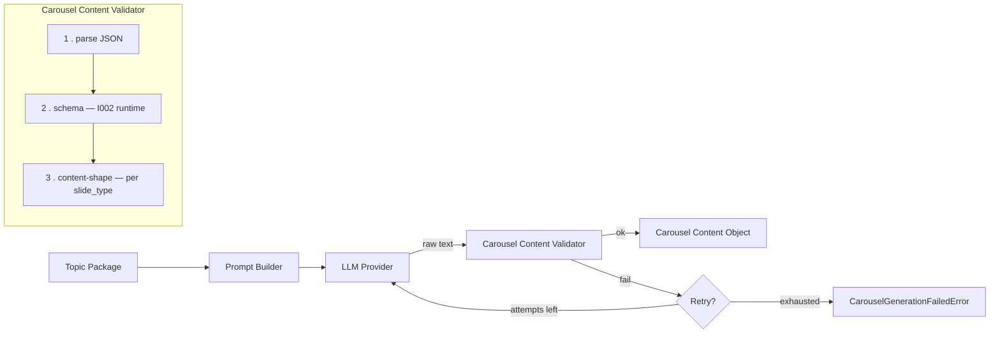
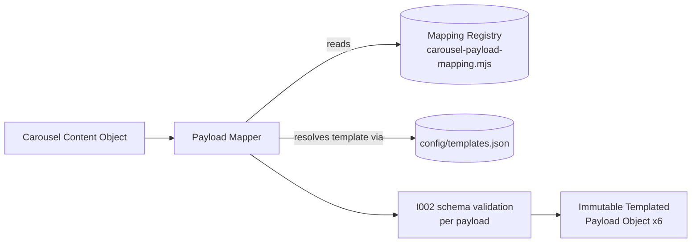
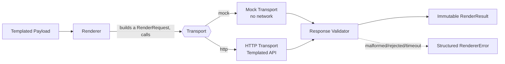
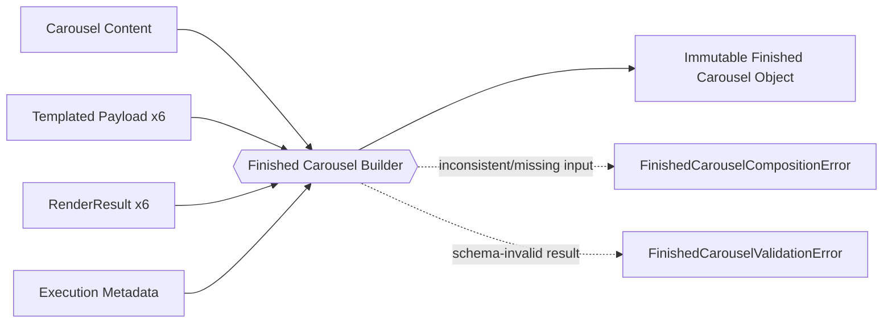
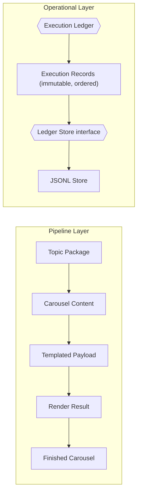

# DC-003 — Automated Content Generation

Project foundation for the AI content factory: one approved topic in, a six-slide
Templated carousel out. This directory currently contains the foundation
established by DC-003-I001 (configuration, template registry, JSON schemas),
the configuration-loading and validation runtime added in DC-003-I002, the
Topic Package Loader added in DC-003-I003, the Carousel Content Generator
added in DC-003-I004 (mock LLM provider only — I004 explicitly does not
call a real one), the Carousel Payload Mapper added in DC-003-I005, the
Templated Renderer added in DC-003-I006 (live-verified against the real
Templated API — see "Live verification procedure" below), the Finished
Carousel Builder added in DC-003-I007 — this pipeline's first stable public
contract; see "Finished Carousel Builder" below — the Execution Ledger
added in DC-003-I008, the platform's operational audit layer; see
"Operational layer" below — the Pipeline Orchestrator added in
DC-003-I009, the single execution engine coordinating every stage above;
see "Pipeline Orchestrator" below — and the External Invocation Adapter
added in DC-003-I010, the platform's first external boundary; see
"External Invocation Adapter" below. No n8n workflow logic exists yet —
DC-003-I010 is what a future n8n integration (or REST API, scheduler, or
GUI) will call, not n8n itself.

Lives at `Active Projects/DC-003 - Automated Content Generation/` inside the
`digitally-connected` repository.

## Authoritative documents

This repository implements the following approved specifications. They are
the source of truth for *why* things are shaped the way they are — this
README describes what's actually in the repo, not the reasoning behind it.

- **DC-003-T001 — AI Content Factory Architecture** (approved) — system
  components, data flow, API interaction sequence, error handling.
- **DC-003-T002 — Data & Metadata Specification** (approved) — the five core
  objects (Topic Package, Carousel Content Object, Templated Payload Object,
  Finished Carousel Object, Execution Log), versioning strategy, naming
  conventions, storage strategy.

## Repository structure

```
DC-003 - Automated Content Generation/
├── config/
│   ├── env.example              # required environment variables, no secrets
│   ├── templates.json            # template registry — IDs, names, layer definitions
│   ├── constants.json             # shared enums and fixed values
│   └── versions.json               # schema/design-system/prompt version identifiers
├── schemas/
│   ├── topic-package.schema.json
│   ├── carousel-content.schema.json
│   ├── templated-payload.schema.json
│   ├── finished-carousel.schema.json
│   └── execution-log.schema.json
├── src/                            # reusable runtime — see below
│   ├── index.mjs                    # public entry point — import from here
│   ├── config-loader.mjs             # DC-003-I002
│   ├── schema-registry.mjs           # DC-003-I002
│   ├── validator.mjs                 # DC-003-I002
│   ├── integrity-checks.mjs          # DC-003-I002
│   ├── read-json-file.mjs            # DC-003-I002 — shared "read + parse JSON" helper
│   ├── paths.mjs                     # DC-003-I002 — project-root resolution
│   ├── errors.mjs                    # DC-003-I002 — ConfigFileNotFoundError, etc.
│   ├── topic-package-loader.mjs      # DC-003-I003 — see "Topic Package Loader"
│   ├── topic-package-readiness.mjs   # DC-003-I003 — operational readiness rules
│   ├── topic-package-errors.mjs      # DC-003-I003 — Topic Package-specific errors
│   ├── immutable.mjs                 # DC-003-I004 — shared deep-clone-then-freeze helper
│   ├── carousel-slide-spec.mjs       # DC-003-I004 — per-slide-type content shape, single source of truth
│   ├── carousel-prompt-builder.mjs   # DC-003-I004 — see "Carousel Content Generator"
│   ├── carousel-mock-provider.mjs    # DC-003-I004 — deterministic mock LLM provider
│   ├── carousel-content-shape.mjs    # DC-003-I004 — per-slide-type content checks
│   ├── carousel-content-validator.mjs# DC-003-I004 — parse + schema + shape, staged
│   ├── retry.mjs                     # DC-003-I004 — generic retry primitive
│   ├── carousel-generator.mjs        # DC-003-I004 — orchestrator
│   ├── carousel-generator-errors.mjs # DC-003-I004 — PromptBuilderError, CarouselGenerationFailedError
│   ├── carousel-payload-mapping.mjs  # DC-003-I005 — Mapping Registry, single source of truth
│   ├── carousel-payload-mapper.mjs   # DC-003-I005 — see "Carousel Payload Mapper"
│   ├── carousel-payload-errors.mjs   # DC-003-I005 — mapper-specific errors
│   ├── renderer-errors.mjs           # DC-003-I006 — RendererError hierarchy
│   ├── render-result.mjs             # DC-003-I006 — immutable RenderResult domain object
│   ├── renderer-response-validator.mjs# DC-003-I006 — validates raw transport responses
│   ├── renderer-transport-mock.mjs   # DC-003-I006 — the ONLY transport tests use
│   ├── renderer-transport-http.mjs   # DC-003-I006 — real Templated transport, untested live
│   ├── renderer-config.mjs           # DC-003-I006 — env-var config (incl. the API key)
│   ├── renderer.mjs                  # DC-003-I006 — see "Templated Renderer"
│   ├── execution-metadata.mjs        # DC-003-I007 — immutable ExecutionMetadata + execution_id generation
│   ├── finished-carousel-builder.mjs # DC-003-I007 — see "Finished Carousel Builder"
│   ├── finished-carousel-errors.mjs  # DC-003-I007 — builder-specific errors
│   ├── execution-record.mjs          # DC-003-I008 — immutable ExecutionRecord + record_id generation
│   ├── execution-ledger-store.mjs    # DC-003-I008 — Ledger Store abstraction (shape + assertValidLedgerStore)
│   ├── jsonl-ledger-store.mjs        # DC-003-I008 — the one Ledger Store implementation
│   ├── execution-ledger.mjs          # DC-003-I008 — see "Operational layer"
│   ├── execution-ledger-errors.mjs   # DC-003-I008 — ledger/record/store-specific errors
│   ├── pipeline-context.mjs          # DC-003-I009 — see "Pipeline Orchestrator"
│   ├── pipeline-stages.mjs           # DC-003-I009 — the five declarative stages
│   ├── pipeline-definition.mjs       # DC-003-I009 — DEFAULT_PIPELINE, the declarative stage list
│   ├── pipeline-orchestrator.mjs     # DC-003-I009 — the sequential execution engine
│   ├── pipeline-errors.mjs           # DC-003-I009 — PipelineConfigurationError, toSafeStageError
│   ├── invocation-request.mjs        # DC-003-I010 — validates/prepares an inbound InvocationRequest
│   ├── invocation-normalizer.mjs     # DC-003-I010 — InvocationRequest -> orchestrator.run() input
│   ├── invocation-response.mjs       # DC-003-I010 — builds/validates the outbound InvocationResponse
│   ├── invocation-adapter.mjs        # DC-003-I010 — see "External Invocation Adapter"
│   └── invocation-errors.mjs         # DC-003-I010 — request/response validation errors, safe error mapper
├── tests/
│   ├── fixtures/                    # one realistic example JSON per schema (approved)
│   │   ├── invalid/                  # deliberately-broken JSON, test-only, never "approved"
│   │   ├── topic-packages/           # DC-003-I003 — readiness/failure-mode fixtures, test-only
│   │   └── carousel-content/         # DC-003-I005 — mapper failure-mode fixtures, test-only
│   ├── unit/                        # node:test suite, see "Running tests"
│   └── validation/
│       ├── validate.mjs              # thin CLI wrapper around src/validator.mjs
│       ├── check-topic-package.mjs   # DC-003-I003 — thin CLI wrapper around the loader
│       ├── generate-mock-carousel.mjs# DC-003-I004 — thin CLI wrapper around the generator
│       ├── map-payload.mjs           # DC-003-I005 — thin CLI wrapper around the mapper
│       ├── render-payload.mjs        # DC-003-I006 — thin CLI wrapper around the renderer
│       ├── build-finished-carousel.mjs# DC-003-I007 — end-to-end offline capstone CLI
│       ├── ledger.mjs                # DC-003-I008 — init/append/read/reconstruct subcommands
│       ├── pipeline.mjs              # DC-003-I009 — run the full orchestrated pipeline
│       └── invoke.mjs                # DC-003-I010 — run one external InvocationRequest through the adapter
├── package.json
├── package-lock.json
├── .gitignore
├── Project Brief.md
└── README.md
```

`prompts/` and `workflows/` are created empty (via `.gitkeep`) because the
architecture in DC-003-T001 names them as the homes for the LLM prompt and
the exported n8n workflow — both explicitly out of scope for every task so far.

## Configuration

Four files, one concern each:

| File | Concern | Contains secrets? |
|---|---|---|
| `config/env.example` | LLM and Templated credentials, runtime settings | No — copy to `.env` and fill in real values; `.env` is gitignored |
| `config/templates.json` | The template registry — see below | No |
| `config/constants.json` | Shared enums and fixed values (slide types, statuses, ID prefixes) used by both schemas and future code | No |
| `config/versions.json` | Current schema/design-system/prompt version identifiers, per DC-003-T002 §6 | No |

`config/env.example` gained three new variables in DC-003-I006, all
non-secret runtime settings for the renderer (the credential itself,
`TEMPLATED_API_KEY`, already existed from I001):

| Variable | Default | Purpose |
|---|---|---|
| `TEMPLATED_API_BASE_URL` | `https://api.templated.io/v1` | Templated's API base — configurable so a stale/incorrect default never requires a code change |
| `TEMPLATED_REQUEST_TIMEOUT_MS` | `15000` | Per-request timeout for the HTTP transport — see "Timeout behaviour" |
| `TEMPLATED_RENDER_MAX_ATTEMPTS` | `3` | Retry ceiling for the renderer — see "Retry behaviour" |

`TEMPLATED_POLL_INTERVAL_MS` / `TEMPLATED_POLL_TIMEOUT_MS` (from I001)
remain unused and reserved — DC-003-I006 explicitly does not poll; it
returns whatever status Templated's render call responds with.

### Deviation from DC-003-T001, with reason

DC-003-T001 originally proposed the six Templated template IDs as environment
variables. Implementing the template registry (DC-003-T002 deliverable 3)
made it clear they belong in version-controlled `config/templates.json`
instead: template IDs are not secrets, and keeping them in git means a
template swap is a reviewable diff rather than an untracked deployment
change — and it lets `template_version` travel with `template_id` in one
place, matching the versioning strategy in DC-003-T002 §6. `env.example`
notes this explicitly so the discrepancy with T001 isn't silently invisible.

### Open item from DC-003-T002, now resolved

DC-003-T002 §3 flagged the Infographic template's `step_1..4_icon` layers as
unconfirmed. Re-checked against the live template during this task: they are
static `shape` layers, not `image_url` layers. `config/templates.json`
reflects this — no LLM or mapper ever needs to supply icon content.

## Template registry

`config/templates.json` is the single source of truth for the six DC-002
templates: `template_id`, display `name`, slide position, background,
dimensions, render format, a manually-maintained `template_version` label,
and — per slide — every layer split into `variable` (written by a future
Payload Mapper from a Carousel Content Object) and `fixed` (brand-owned,
never touched). This is the DC-002 "template IDs + variable mappings" asset
carried forward as reviewable config, exactly as DC-003-T001 §7 intended.

## Schemas

Eight [JSON Schema](https://json-schema.org/) (2020-12) documents in
`schemas/` — the five objects defined in DC-003-T002, plus
`execution-record.schema.json` (DC-003-I008's own schema for the
Execution Ledger's operational event model) and
`invocation-request.schema.json`/`invocation-response.schema.json`
(DC-003-I010's own schema pair for the External Invocation Adapter's
public contract) — none of the three part of the original T002 five. One
of the original five, `execution-log.schema.json`, is now formally
**deprecated** — see "`execution-log.schema.json` — deprecated" under
"Operational layer" below for the DC-003-I008.1 reconciliation findings
and why it's a separate schema rather than a repurposed one. Each schema
is standards-compliant so a full validator (e.g. Ajv) can consume it
unchanged later. Two simplifications were made deliberately, to avoid the
complexity DC-003-T002's constraints explicitly warned against:

- **Carousel Content Object** — each slide's `content` field is typed as a
  generic object rather than a `slide_type`-conditional schema (`cover` needs
  different fields than `infographic`). The per-type field list is documented
  in DC-003-T002 §2 and mirrored in `config/templates.json`'s `variable`
  layer lists; enforcing it as JSON Schema `if`/`then` logic is deferred to
  when the Payload Mapper is actually built.
- **Templated Payload Object** — `layers` is typed as a generic object rather
  than enumerating every possible layer key, since the valid key set is
  per-template config, not a schema concern.

**Finished Carousel Object, extended in DC-003-I007:** the schema as
originally written in DC-003-I001 had no field for execution trace identity.
DC-003-I007's Strategy Office brief explicitly requires one ("Introduce an
immutable execution metadata object containing at least: executionId,
renderedAt, provider, renderDuration"), so `execution_metadata` (required,
`additionalProperties: false`) was added as this milestone's own schema
deliverable — see "Finished Carousel Builder" below for the rationale. No
other DC-003-T002-approved field changed. The approved fixture
(`tests/fixtures/finished-carousel.example.json`) was updated in the same
commit so it stays valid against the extended schema.

## Configuration loader (`src/config-loader.mjs`)

Loads `config/templates.json`, `config/constants.json`, and
`config/versions.json` and returns them as one structured object:

```js
import { loadConfig } from "./src/index.mjs";

const { templates, constants, versions } = loadConfig();
```

Individual loaders (`loadTemplatesConfig`, `loadConstants`, `loadVersions`)
are also exported for callers that only need one file. Behavior:

- **Path resolution** is always relative to the project root (resolved from
  `import.meta.url`, never the process's current working directory), so the
  loader works the same regardless of where it's invoked from.
- **Fails fast**: a missing file throws `ConfigFileNotFoundError`; malformed
  JSON throws `ConfigParseError` with the file path and the underlying parse
  error. Nothing is ever silently defaulted or partially loaded.
- **Never touches `config/env.example`.** That file documents which
  environment variables a deployment needs — it is not a source of runtime
  values. `config-loader.mjs` has no code path that reads it, by design (see
  "Configuration vs. credentials" below).
- Every loader accepts an optional `{ rootDir }` so tests can point it at an
  isolated temporary directory instead of real project config — this is how
  the missing-file and malformed-JSON tests work without touching production
  config files.

## Schema registry (`src/schema-registry.mjs`)

Loads the eight registered schemas and exposes them behind stable, camelCase
identifiers rather than filesystem paths:

```js
import { loadSchemaRegistry } from "./src/index.mjs";

const schemas = loadSchemaRegistry();
schemas.topicPackage;      // schemas/topic-package.schema.json, parsed
schemas.carouselContent;   // schemas/carousel-content.schema.json, parsed
schemas.templatedPayload;
schemas.finishedCarousel;
schemas.executionLog;      // deprecated/dormant — see "Operational layer"
schemas.executionRecord;   // the active operational record model
schemas.invocationRequest;  // see "External Invocation Adapter"
schemas.invocationResponse;
```

Same fail-fast behavior as the config loader (`ConfigFileNotFoundError` /
`ConfigParseError`), same `{ rootDir }` override for tests.

## Validation runtime (`src/validator.mjs`)

The single source of truth for validating any object against any registered
schema. Built on [Ajv](https://ajv.js.org/) (2020-12 dialect, via
`ajv/dist/2020.js`) plus `ajv-formats` — see "Dependencies" below for why
these two.

```js
import { createValidator } from "./src/index.mjs";

const validator = createValidator();
const result = validator.validate("topicPackage", someObject);
// { valid: true, errors: [] }
// or
// { valid: false, errors: [{ path, keyword, message, params }, ...] }
```

- **Valid data** → `{ valid: true, errors: [] }`.
- **Invalid data** → `{ valid: false, errors: [...] }`, one entry per failed
  rule, each with the JSON Pointer `path` to the offending field (`(root)` if
  the whole object), the failed `keyword` (`required`, `enum`, `type`, ...),
  and a specific, readable `message` — never a bare "validation failed".
- **Unknown schema identifier** → throws `UnknownSchemaError` immediately,
  rather than returning `{ valid: false }`. Passing a schema ID that doesn't
  exist is a caller bug, not a data problem, so it fails loudly and
  immediately instead of being reported alongside real validation errors.

## Existing validator (`tests/validation/validate.mjs`)

The DC-003-I001 validator was a small hand-rolled, dependency-free JSON
Schema subset checker. DC-003-I002 replaced its internals: it is now a thin
CLI wrapper that imports `createValidator()` from `src/validator.mjs` and
prints a PASS/FAIL line per fixture. It has no validation logic of its own —
`src/validator.mjs` is the single source of truth, per this task's
instruction to avoid maintaining two independent implementations.

```bash
npm run validate
```

## Configuration integrity checks (`src/integrity-checks.mjs`)

`runIntegrityChecks(config)` takes an already-loaded config object (from
`loadConfig()`) and checks the *relationships* JSON Schema alone can't
express — structural validity is the schema registry's job, this is
semantic. It collects every issue rather than stopping at the first one:

- all six slide types (`cover`, `content`, `statistic`, `quote`,
  `infographic`, `cta`) exist in the template registry, and are cross-checked
  against `config/constants.json`'s `slide_types` list
- every template has a unique `template_id`
- every template has a valid, non-empty internal key
- every template has all required metadata fields present
- `config/versions.json` has every version identifier DC-003-T002 §6 expects
  (`project_version`, `design_system_version`, `template_registry_version`,
  `schema_versions.*`, and the `prompt_version` key — which may be `null`
  until a prompt exists, but must be present)
- every non-nullable version value is a non-empty string
- no field whose name looks like a credential (`api_key`, `secret`,
  `password`, `token`, `credential`) has a non-empty value anywhere in
  `config/templates.json`, `config/constants.json`, or `config/versions.json`
- the Infographic template's `step_1..4_icon` layers are still listed as
  `fixed` shape layers, not `variable` — guarding against the DC-003-T002
  open item regressing

```js
import { loadConfig, runIntegrityChecks } from "./src/index.mjs";

const report = runIntegrityChecks(loadConfig());
// { ok: true, issues: [] }  or  { ok: false, issues: [{ check, message }, ...] }
```

## Configuration vs. credentials

Two categories, never mixed:

- **Configuration** — `config/templates.json`, `config/constants.json`,
  `config/versions.json`. Not secret. Version-controlled. Loaded by
  `src/config-loader.mjs`.
- **Credentials** — an LLM API key, the Templated API key. Never
  version-controlled. `config/env.example` documents *which* environment
  variables a deployment needs; it holds no real values and is not read by
  any code in this repository. Real values belong in a local `.env`
  (gitignored) or the deployment platform's secret store — neither of which
  this task creates or touches. `runIntegrityChecks` actively scans
  configuration for anything that looks like a stray credential.

## Topic Package Loader (`src/topic-package-loader.mjs`)

A **Topic Package** is one approved content topic — the object defined by
`schemas/topic-package.schema.json` and DC-003-T002 §1 (working title,
audience, primary goal, core message, supporting points, CTA, brand voice,
approval status, and version/traceability metadata). It's what a future LLM
content generator will read to produce carousel copy — the loader's job is
to make sure a Topic Package is actually safe to hand to that generator
before any of that happens.

### Schema validity vs. operational readiness

Two separate, sequential gates — a Topic Package must pass both:

1. **Schema validity** (via the I002 validator runtime — not reimplemented
   here) — is every field present and correctly typed? A `working_title` of
   `"   "` is schema-valid: `minLength: 1` counts whitespace as characters.
2. **Operational readiness** (`src/topic-package-readiness.mjs`, runs only
   after schema validity passes) — is the *content* actually usable, and is
   the package internally consistent and cleared for use? A whitespace-only
   `working_title` fails here, even though it passed schema validation.

### Approval checks

The Topic Package schema has a `status` field (`draft` / `approved` /
`in_production` / `completed` / `archived`) but — deliberately, per
DC-003-T002 §7 — no separate approval-metadata block; that metadata lives on
the *Finished Carousel Object* instead, because approval there applies to a
rendered output, not a topic draft. Confirmed with the Strategy Office
during DC-003-I003 rather than inventing new Topic Package fields. So:
**`status === "approved"` is the sole approval signal.** Anything else
(`draft`, `in_production`, `completed`, `archived`) fails the
`approval-state` readiness check.

### Version checks

The Topic Package's only version field is `schema_version` (there is no
`prompt_version` on this object — that belongs to the Carousel Content
Object and Execution Log, generated later). Readiness compares it against
`config/versions.json`'s `schema_versions.topic_package` value. A mismatch
is reported as a `schema-version-compatible` issue and the package is
rejected — **never silently upgraded or coerced.**

### Other readiness checks

- **Usable content** — `topic_id`, `working_title`, `audience`,
  `primary_goal`, `core_message`, `cta`, `brand_voice`, `owner`, and every
  entry in `supporting_points` must be non-blank after trimming.
- **Internal consistency** — `updated_date` must not be earlier than
  `created_date`; `related_topic_ids` must not list the package's own
  `topic_id` or contain duplicates.

All readiness issues are collected and reported together (not just the
first one found), each as `{ check, message }`.

### Immutability

The returned Topic Package is **deep-cloned via `structuredClone()`, then
deep-frozen via a recursive `Object.freeze()`** — never the original parsed
object. The input passed to `prepareTopicPackage()` / read from disk by
`loadTopicPackage()` is never mutated. Mutation attempts against the
returned object throw `TypeError` in strict-mode/ESM callers (which this
codebase's `.mjs` files always are) and are silent no-ops in non-strict
contexts — in both cases the value never actually changes.

### Loading a Topic Package in code

```js
import { loadTopicPackage, prepareTopicPackage } from "./src/index.mjs";

// From a file — relative paths resolve against process.cwd(), pass an
// absolute path when the caller must not depend on it.
const topic = loadTopicPackage("tests/fixtures/topic-packages/approved.valid.json");

// From an already-parsed object (e.g. future n8n/API/database ingestion) —
// same validation, same readiness checks, same immutable return, no
// file-specific errors involved.
const sameTopic = prepareTopicPackage(rawObjectFromSomewhereElse);
```

Both throw structured errors on failure — `TopicPackageNotFoundError`,
`TopicPackageUnreadableError`, `TopicPackageParseError`,
`TopicPackageValidationError` (with `.errors`, the same
`{ path, keyword, message, params }` shape the I002 validator returns), or
`TopicPackageReadinessError` (with `.issues`, `{ check, message }`).

### CLI check

```bash
npm run check:topic -- tests/fixtures/topic-packages/approved.valid.json
```

Prints safe summary metadata (topic ID, working title, status, schema
version, version, readiness) and exits `0` for a ready package; prints
structured errors to stderr and exits non-zero otherwise — no raw stack
trace for the five expected/known failure modes, only for a genuinely
unexpected error. Uses the same loader as production code; no independent
validation logic.

## Carousel Content Generator (`src/carousel-generator.mjs`)

Turns a ready Topic Package into a Carousel Content Object — the structured
copy for all six slides — without touching Templated, an LLM API, or the
filesystem. Four isolated responsibilities, one orchestrator:



Each box is its own module — `carousel-prompt-builder.mjs`,
`carousel-mock-provider.mjs` (the only provider implementation today),
`carousel-content-validator.mjs`, `retry.mjs` — and `carousel-generator.mjs`
only sequences them. None of the others know the retry loop exists; the
validator doesn't know what a "provider" is; the provider doesn't know how
validation works.

### Prompt Builder

`buildCarouselPrompt(topicPackage)` is a pure function: the same Topic
Package always produces the exact same prompt string. It never calls
anything — no LLM, no network. The prompt includes topic, audience,
objective, key message, supporting points, CTA, desired tone, fixed writing
constraints, the exact six-slide sequence (field names read from
`carousel-slide-spec.mjs` — the same source the shape checker reads from,
so what's asked for and what's accepted can never drift apart), brand
rules, and an explicit "return JSON only" instruction. Field content is
whitespace-collapsed before embedding (so a multi-line field can't break
the prompt's `## Section` structure) but otherwise passed through verbatim
— quotes, punctuation, unicode all included as-is; this is plain text handed
to an LLM, not a value being embedded in JSON we control. Throws
`PromptBuilderError` if a field the prompt needs is blank — defense in
depth, independent of whatever validated the Topic Package upstream.

### Provider abstraction

A provider is any object shaped `{ name: string, generateCarousel(prompt, context): Promise<string> }`
— it returns raw text (mimicking a real completion API), never a pre-parsed
object, so swapping in a real provider later changes nothing downstream;
the validator's `JSON.parse` step is exactly where a real LLM's occasional
malformed output would surface too. `context.topicPackage` is passed
alongside the prompt so the mock provider can generate content grounded in
the real topic — a real provider is free to ignore it, since everything it
needs is already in the prompt text.

### Mock provider (`src/carousel-mock-provider.mjs`)

The only provider implemented in DC-003-I004 — deterministic, no network,
no randomness. Every slide is populated from the Topic Package's own
fields (`working_title`, `core_message`, `audience`, `supporting_points`,
`cta`), so output is recognizably about the actual topic rather than
generic filler. The statistic and quote slides are explicitly labeled as
illustrative/mock in their own copy (`"Placeholder statistic generated by
the mock provider — not a verified figure."`) rather than presenting an
invented number or a fabricated testimonial as real. No `hashtags` field
is generated: it's not part of any of the six slide types in
`config/templates.json` / DC-003-T002 §2, and adding one would be
inventing contract surface the rest of the pipeline doesn't expect.

### Validation flow

Three gates, run in order by `validateGeneratedCarousel()`, any of which
can fail independently:

1. **Parse** — is the provider's raw text valid JSON containing a `slides`
   array at all?
2. **Schema** — does the assembled object (provider's slides + pipeline
   metadata) conform to `schemas/carousel-content.schema.json`, via the
   unmodified I002 validator runtime? Catches wrong slide count, wrong
   `slide_type` values, wrong top-level shape.
3. **Content-shape** — does each slide's `content` actually have the fields
   its `slide_type` needs, non-blank, correct array lengths, in the
   canonical slide order? (`carousel-content-shape.mjs`, reading from the
   same `carousel-slide-spec.mjs` the Prompt Builder uses.)

Every stage returns a structured `{ ok: false, stage, message, details }`
result rather than throwing — `retry.mjs` collects these per attempt.

### Retry behavior

`withRetry()` is a generic, carousel-agnostic primitive (reusable by later
rendering-stage retries per DC-003-T001 §6): configurable `maxAttempts`
(default 3), stops the instant an attempt succeeds — never wastes a call
once a good result is in hand — and never silently gives up. If every
attempt fails, `generateCarouselFromTopicPackage` throws
`CarouselGenerationFailedError` carrying the full `attempts` array (every
stage, every message, in order), never a collapsed generic message.
Building the prompt happens once, *outside* the retry loop — if the Topic
Package itself has no usable content, retrying with the same input would
never help, so that fails immediately via `PromptBuilderError` instead.

### Generating a carousel in code

```js
import { loadTopicPackage, generateCarouselFromTopicPackage } from "./src/index.mjs";

const topic = loadTopicPackage("tests/fixtures/topic-packages/approved.valid.json");
const carousel = await generateCarouselFromTopicPackage(topic);
// carousel: { carousel_content_id, topic_id, generated_at, llm_model,
//             prompt_version, schema_version, slides: [ 6 slides ] }
// — deep-cloned and deep-frozen, same immutability approach as the Topic
//   Package Loader (see "Immutability" above).

// A different provider — same call shape, same validation, same retries:
const carousel2 = await generateCarouselFromTopicPackage(topic, {
  provider: myRealLlmProvider,
  maxAttempts: 5,
});
```

### CLI check

```bash
npm run generate:mock -- tests/fixtures/topic-packages/approved.valid.json
```

Loads the Topic Package (via the I003 loader — so an unapproved or invalid
package is rejected before generation is even attempted), generates a
carousel with the mock provider, and prints a readable summary: topic,
generated title, slide count, generation version (`prompt_version` +
`schema_version`), and provider name. Exits `0` on success; on failure,
prints structured errors (no raw stack trace for expected failure modes)
and exits non-zero. Does not render slides. Does not write any file — the
carousel exists only in memory for the life of the process.

## Carousel Payload Mapper (`src/carousel-payload-mapper.mjs`)

Translation only — turns a Carousel Content Object into six Templated
Payload Objects, one per slide. Never calls Templated, never renders, never
touches the network.



### Mapping Registry (`src/carousel-payload-mapping.mjs`)

The single source of truth for how a Carousel Content field becomes a
Templated layer. No layer name is hardcoded anywhere else in the mapper —
everything reads from this table. Three transform kinds:

| Kind | Example | Behavior |
|---|---|---|
| `direct` | `headline_text` → `headline_text` | value copied as-is |
| `array-fanout` | `list_items[0..3]` → `list_item_1..4_text` | each array entry becomes one indexed layer |
| `object-array-fanout` | `steps[i].title`/`.description` → `step_{i+1}_title`/`_description` | each array-of-objects entry becomes a pair of indexed layers |

For four of the six slide types (`cover`, `statistic`, `quote`, `cta`) the
Carousel Content field names and the Templated layer names are already
identical — that's inherited from how DC-003-T002 §2's field names were
originally chosen to mirror `config/templates.json`'s layer names, not a
mapping this registry invents. The two genuinely transformative mappings
are `content`'s `list_items` and `infographic`'s `steps`, both fan-outs.

`validateMappingRegistry(templatesConfig)` cross-checks this table against
the live template registry and returns `{ ok, issues }`: every
`templateKey` must exist in `config/templates.json`, no two mapping entries
for the same slide type may target the same layer ("mappings unique" / "no
duplicate layer names"), and every layer name the registry could ever
produce must be a real `variable` layer on that template ("mapping
references only templates defined in `templates.json`"). This runs in the
test suite against the real registry on every test run — if the mapping
table and `config/templates.json` ever drift apart, a test fails
immediately rather than the drift surfacing as a runtime mapping bug.

### Template resolution

`config/templates.json` is the only source of template IDs — the mapper
never hardcodes one. For each slide, `slide_type` resolves to a
`templateKey` (via the Mapping Registry) which resolves to a `template_id`,
`template_version`, `format`, `slide_number`, and the template's `variable`
layer list (via `loadTemplatesConfig()`, the I002 config loader). All six
approved carousel templates are supported — there's no partial coverage.

### Layer validation

After a slide's layers are computed, two checks run before that slide's
payload is even assembled:

- **Every required editable layer is populated** — every non-optional
  `variable` layer on the template must appear in the computed `layers`
  object (`list_item_4_text` is the one layer marked `optional` in
  `config/templates.json`, and is correctly skipped when there's no 4th
  supporting point).
- **No unknown layer names** — every layer the mapping produces must be a
  real `variable` layer on that template; a layer name that doesn't match
  is rejected, never silently written.

Duplicate assignment is guarded at two levels: within one slide's own
mapping (a registry-authoring bug — unreachable through the real registry,
covered by `validateMappingRegistry`'s static check instead of a runtime
fixture, since a correct registry can't trigger it), and across the whole
carousel (two slides sharing the same `slide_type` — genuinely reachable
from a malformed input, see `duplicate-layer.json` below).

### Payload validation

The finished payload for each slide is validated against
`schemas/templated-payload.schema.json` via the unmodified I002 validator
runtime — not reimplemented here. This catches things layer validation
above can't: a malformed `carousel_content_id` copied through from the
input, for instance (see `invalid-payload.json` — every layer maps
correctly, but the final schema check still rejects it).

### Mapping errors

Five distinct, structured error classes — never a generic message:

| Error | When |
|---|---|
| `UnknownTemplateError` | `slide_type` doesn't resolve to any registered template |
| `MissingLayerError` | a required layer's source content field is blank, absent, or the layer itself never got assigned |
| `DuplicateLayerMappingError` | the same layer would be assigned twice — within one slide's mapping, or by two slides sharing a `slide_type` |
| `UnsupportedContentError` | an array/object-shaped field doesn't match its fan-out contract (wrong length, blank sub-field), or the mapper produces a layer name the template doesn't define |
| `TemplatedPayloadValidationError` | the assembled payload fails schema validation — carries `.errors`, the same structured shape the I002 validator returns |

### Mapping a carousel in code

```js
import { mapCarouselToTemplatedPayload } from "./src/index.mjs";

const payloads = mapCarouselToTemplatedPayload(carouselContent);
// payloads: 6 Templated Payload Objects, in slide order — deep-frozen,
// same immutability approach as every other output in this codebase.
```

### CLI check

```bash
npm run map:payload -- tests/fixtures/carousel-content/valid.json
```

Prints one block per slide — template name, template ID, editable layer
count, mapped layer count, payload validation result — and exits `0`. On
failure, prints the specific structured error (no raw stack trace for the
five expected failure modes) and exits non-zero. Does not render. Does not
write any file.

## Templated Renderer (`src/renderer.mjs`)

The first component in this repository that talks to an external service.
Converts one Templated Payload Object into a rendered carousel asset —
strictly translation-and-transport; no rendering happens locally, no
n8n, no queueing, no polling.



### Renderer contract

`renderTemplatedPayload(payload, options)` consumes only a validated
Templated Payload Object and returns only an immutable `RenderResult`. It
never exposes an HTTP response, a `fetch` object, an API key, or any other
transport-specific structure — `renderer-response-validator.mjs` is the one
place a raw transport response is inspected, and nothing from that
inspection survives past it unnormalized.

### Transport abstraction

A transport is any object shaped `{ name, send(request, { timeoutMs }) }` —
the renderer depends only on this shape, never on HTTP directly. There is
**no implicit default transport**: every call must explicitly pass
`options.transport`, so an automated test (or a careless script) can never
accidentally reach a real endpoint by omission. Two implementations exist
today:

- **`createMockTransport()`** (`renderer-transport-mock.mjs`) — the *only*
  transport automated tests use. Deterministic, no network, configurable
  via `options.mode` to simulate every failure case the renderer needs to
  handle (`timeout`, `transport-error`, `auth-error`, `malformed`,
  `rejected`), plus `options.failuresBeforeSuccess` for retry-success tests.
- **`createHttpTransport(config)`** (`renderer-transport-http.mjs`) — the
  real Templated integration, using Node's built-in `fetch` (no new
  dependency). Never exercised by automated tests. Endpoint
  (`POST https://api.templated.io/v1/render`), request body shape
  (`{ template, layers, format }`), and `Authorization: Bearer` header are
  **confirmed against Templated's official docs**
  ([authentication](https://templated.io/docs/authentication/),
  [create a render](https://templated.io/docs/renders/create/)). The
  `POST /render` endpoint's own example response omits a `status` field
  (`{ id, url, storage_url, width, height, format, templateId,
  templateName, createdAt, externalId }`), which an earlier pass read as
  "Templated never sends status" — that turned out to be incomplete, not
  correct: [the render object](https://templated.io/docs/renders/) docs
  state the field exists and is always uppercase (`PENDING` / `COMPLETED` /
  `FAILED`), and the one authorized live call's response confirmed it,
  carrying `status: "COMPLETED"`. See "Provider status contract" below for
  the corrective fix. `renderer-response-validator.mjs` still infers
  `status` from the presence of a `url` for the (currently only
  hypothetical) case where a response has neither — no observed Templated
  response has actually lacked the field.

A future transport (a different provider, a queue-backed one, anything)
plugs in by implementing the same two-property shape — no renderer code
changes.

### Retry behaviour

Retries are not renderer logic — `renderTemplatedPayload` reuses
`src/retry.mjs`'s `withRetry()` (the exact I004 primitive, unmodified) for
the retry loop itself. Configurable via `options.maxAttempts`, defaulting
to `TEMPLATED_RENDER_MAX_ATTEMPTS` (default `3`) when driven from the CLI's
config loader. Not every failure is retried:

- **Retried**: `TimeoutError`, `TransportError` — both plausibly transient.
- **Not retried, fails on the first attempt**: `AuthenticationError` (bad
  credentials won't become good credentials on attempt two),
  `ValidationError` (a response-shape mismatch is deterministic — the same
  malformed response recurs on every retry of the same request), and
  `RenderRejected` (Templated understood the request and rejected it — the
  same payload will be rejected again). These bypass `withRetry` by
  throwing directly out of the attempt callback, which `withRetry` doesn't
  catch — no changes to `retry.mjs` were needed to get this behavior.

Retry exhaustion raises `RetryLimitExceeded` carrying every attempt's
result in order — never a collapsed generic message. No infinite retries:
`maxAttempts` is always a specific, finite, configured number.

**`ValidationError` was retryable until a hardening pass** — see
"Live-verification safety rule" below for what happened and why that
changed.

### Timeout behaviour

Timeout duration always originates from configuration
(`TEMPLATED_REQUEST_TIMEOUT_MS`, default `15000`) or an explicit
`options.timeoutMs` override — never a number hardcoded somewhere
unreachable. The HTTP transport enforces it with `AbortController`; a
timeout maps to `TimeoutError`, a dedicated type distinct from a generic
`TransportError`.

### Response validation

Every response — mock or real — passes through
`validateTransportResponse()` before it can become a `RenderResult`:
structurally untrustworthy responses (not an object, missing/invalid `id`,
an invalid/undocumented explicit `status` when one is given) fail fast as
`ValidationError`, and are **not retried** (see "Retry behaviour"). `status`
is optional on the wire; when it's absent, status is inferred: present
`url` → `completed`, otherwise → `processing`. An explicit `status` (which
every observed Templated response, mock or live, has sent) is validated
against Templated's documented provider contract and normalized — see
"Provider status contract" below. A well-formed response that normalizes to
`status: "failed"` is a distinct case, `RenderRejected`, since the response
itself was trustworthy — Templated just declined the render.

Every `ValidationError` carries `.details` — an array of
`{ field, expected, received, message }`. `received` is a safe type/reason
descriptor (`"missing"`, `"empty string"`, `"number"`, ...), **never the
actual value**, for any field that could plausibly carry something
sensitive. The one exception is `status`: a short, non-sensitive, closed
enum string, safe to show verbatim. Nothing in this diagnostic path ever
includes the raw response body, the API key, or an authorization header.

### Provider status contract

**Corrective pass, after the live-verification incident:** the one
authorized live call connected and authenticated successfully but failed
`ValidationError` — Templated's response carried `status: "COMPLETED"`, and
the validator at the time only accepted lowercase (`pending` / `processing`
/ `completed` / `failed`). Before touching any code, the fix was verified
against Templated's official docs rather than assumed:
[the render object](https://templated.io/docs/renders/) states, verbatim:
*"The current status of the render: PENDING, COMPLETED or FAILED. Initially
the status is PENDING."* — confirming the live response was correct and the
validator was the bug. There is no documented `PROCESSING` value.

`renderer-response-validator.mjs` now validates the raw response's `status`
against exactly this documented uppercase contract (`PENDING` / `COMPLETED`
/ `FAILED`, via `PROVIDER_STATUS_MAP`) and normalizes it onto this
codebase's canonical lowercase vocabulary (`RENDER_STATUSES` —
`pending`/`processing`/`completed`/`failed` — unchanged since I006, and
reused by `finished-carousel.schema.json`'s `SlideRender.status`) before the
normalized `{ id, status, imageUrl }` shape goes anywhere near
`RenderResult`. This keeps the provider/wire representation and the
internal domain vocabulary decoupled at a single, well-known boundary:
every downstream consumer — `RenderResult`, the CLI, any future caller —
depends only on the lowercase internal vocabulary and never needs to know
Templated's casing. `processing` remains purely an internal inference value
(a response with neither an explicit status nor a `url`) — Templated
doesn't document it, and nothing on the wire is expected to send it. The
mock transport (`renderer-transport-mock.mjs`) was updated to send the same
documented uppercase values Templated does, so it continues to exercise
this normalization boundary faithfully instead of masking it.

Deliberately **not** broadened beyond the documented contract: an
undocumented casing (lowercase) or an undocumented value (e.g.
`PROCESSING`) is still rejected as `ValidationError`, not silently
accepted — this was a validator bug matching an incomplete contract, not a
signal to loosen validation.

### RenderResult

The provider-independent domain object every downstream consumer should
depend on — `renderId`, `status`, `imageUrl`, `templateId`, `slideType`,
`provider`, `requestedAt`, `completedAt`, `durationMs`. `status` reuses the
exact same enum as `finished-carousel.schema.json`'s `SlideRender.status`
(`pending` / `processing` / `completed` / `failed`) on purpose — a future
milestone assembling a Finished Carousel Object from `RenderResult`s won't
need to translate between two vocabularies. Since I006 doesn't poll,
`pending`/`processing` are legitimate non-error outcomes here, not every
`RenderResult` represents a finished image. Deep-cloned and deep-frozen —
same immutability approach as every other output in this codebase.

### Error hierarchy

Unlike earlier DC-003 error modules (flat classes, each extending `Error`
directly), this one is a genuine hierarchy — every renderer error extends
`RendererError`:

| Error | When | Retried? |
|---|---|---|
| `AuthenticationError` | credentials rejected | No |
| `TransportError` | network-level failure | Yes |
| `TimeoutError` | request exceeded the configured timeout | Yes |
| `ValidationError` | transport response has an untrustworthy shape | **No** (was Yes — see below) |
| `RenderRejected` | Templated returned a well-formed `status: "FAILED"` (normalized to `failed`) | No |
| `RetryLimitExceeded` | every retry attempt failed | — (terminal) |

### Rendering in code

```js
import { renderTemplatedPayload, createMockTransport } from "./src/index.mjs";

const result = await renderTemplatedPayload(payload, {
  transport: createMockTransport(),
  maxAttempts: 3,
  timeoutMs: 15000,
});
// result: { renderId, status, imageUrl, templateId, slideType, provider,
//           requestedAt, completedAt, durationMs } — immutable.
```

### CLI check

```bash
npm run render:mock -- tests/fixtures/templated-payload.example.json
npm run render:live -- tests/fixtures/templated-payload.example.json  # requires TEMPLATED_API_KEY
npm run render:live -- tests/fixtures/templated-payload.example.json --live-max-attempts=2  # explicit opt-in only
```

`render:mock` (the default) always uses the mock transport — safe to run
anytime, no credentials, no network. `render:live` uses the real HTTP
transport and performs an actual, credentialed API call; it fails fast
with a clear message if `TEMPLATED_API_KEY` isn't set, and is not run by
any automated test. **`--live` always defaults to exactly one attempt**,
regardless of `TEMPLATED_RENDER_MAX_ATTEMPTS` — see "Live-verification
safety rule" below. Prints render ID, status, image URL, template ID,
slide type, provider, and duration; exits `0` on success, non-zero with a
structured error (including safe field-level diagnostics for
`ValidationError`) otherwise. Does not write any file.

### Live-verification safety rule

**Incident (DC-003-I006):** the first authorized live-verification attempt
fired **three** real requests against Templated's production API instead
of the one that was approved. The CLI loaded `maxAttempts` from
`TEMPLATED_RENDER_MAX_ATTEMPTS` (the normal production retry default, `3`)
with no live-specific override, and `ValidationError` was retryable at the
time — so a response-shape mismatch (see "Transport abstraction" above)
was retried twice more automatically. Connectivity and auth both worked;
only the response shape was wrong, but the retry count was the real
failure. Reported transparently; the CEO/Strategy Office authorized a
code-only hardening pass (no further live calls) before another live
attempt would be considered. Two independent fixes landed as a result,
tested entirely without network access:

1. **`ValidationError` is no longer retried anywhere in the renderer** (see
   "Retry behaviour" and the error hierarchy table above) — a response-shape
   mismatch is deterministic, so retrying was always going to waste calls,
   live or mock.
2. **`--live` is decoupled from production retry config entirely.**
   `resolveLiveMaxAttempts()` (`renderer-config.mjs`) always returns `1`
   unless the CLI is given an explicit `--live-max-attempts=N` flag on that
   specific invocation — never picked up from an env var or config file, so
   it can't be silently inherited. `TEMPLATED_RENDER_MAX_ATTEMPTS` no longer
   has any effect on `--live` runs at all.

Both fixes are proven by tests that run entirely against the mock
transport: `renderer.test.mjs` asserts a malformed response calls the
transport exactly once even with `maxAttempts: 5` available;
`renderer-config.test.mjs` asserts `resolveLiveMaxAttempts()` defaults to
`1` and stays `1` even when `TEMPLATED_RENDER_MAX_ATTEMPTS` is set to `7`
in the same environment; `renderer-cli.test.mjs` asserts a bad
`--live-max-attempts` value fails before a transport is even constructed.

### Live verification procedure

No live Templated call happens until explicitly approved, and every
verification session ends with exactly one live attempt, never more. Steps,
in order:

1. **Architecture review** — confirm the renderer depends only on the
   transport abstraction (dependency-injected, no implicit default).
2. **Authorization** — explicit confirmation to perform exactly one live
   render.
3. **Verify the base URL and auth scheme** against Templated's official
   docs before risking the authorized call — this is what caught the
   response-shape mismatch described above and got it fixed pre-emptively.
4. **A locally configured `TEMPLATED_API_KEY`** — set in the shell
   environment or a local (gitignored) `.env`, never pasted into chat, and
   verified present (never displayed) before use.
5. Run `npm run render:live -- <path>` exactly once, against one sample
   payload — now safe by default per the safety rule above, since a second
   attempt requires a deliberate, visible `--live-max-attempts` override
   typed on that specific command.
6. Record the response characteristics, re-run the full mock test suite to
   confirm nothing regressed, and stop.
7. If the attempt reveals a problem, fix and re-verify **only** with fresh,
   explicit re-authorization — a hardening pass is not a standing license
   for another live call.

## Finished Carousel Builder (`src/finished-carousel-builder.mjs`)

**From DC-003-I007 onward, `FinishedCarousel` is this pipeline's public,
stable contract.** Downstream consumers — a future execution logger
(DC-003-I008) or n8n orchestration (DC-003-I009) — should depend on
`FinishedCarousel`, never on `RenderResult`, `TemplatedPayload`, or any
other intermediate object. Those objects still exist and still do their own
jobs; they're simply no longer meant to be depended on from *outside* the
pipeline.



### Why this object, why now

DC-003-I001 through DC-003-I006 each added one pipeline stage but left
every stage's output as the next stage's *input* — nothing tied a carousel's
content, its six payloads, and its six renders back together into one
object a caller could reasonably hand to something else. `FinishedCarousel`
closes that gap: it's the first object in this pipeline whose shape a
downstream system can commit to without needing to know anything about
Templated, the renderer's retry policy, or the payload mapper's layer
registry — see "Provider independence" below.

### Construction rules

A `FinishedCarousel` may only be built from already-validated objects, and
the builder **fails fast** the moment any input is missing, malformed, or
mutually inconsistent with another input — it never guesses, never drops a
slide, and never silently reorders anything. It is never built from a raw
transport/provider response — `renderer-response-validator.mjs` remains the
only place in this codebase a raw response is inspected; by the time a
`RenderResult` reaches this builder, that boundary has already been
crossed.

### Required inputs

`createFinishedCarousel({ carouselContent, slideRenders, executionMetadata }, options)`
takes exactly three things:

- **`carouselContent`** — one validated Carousel Content Object (DC-003-I004).
- **`slideRenders`** — an array of exactly 6 `{ templatedPayload, renderResult }`
  pairs, in the same slide order as `carouselContent.slides`. The DC-003-I007
  brief describes "TemplatedPayload" and "RenderResult" in the singular, but
  a Finished Carousel Object always has exactly six slides
  (`finished-carousel.schema.json`: `minItems`/`maxItems` 6) — there is no
  other way to populate six `render_id`/`image_url`/... entries than one
  validated Templated Payload Object (DC-003-I005) and one `RenderResult`
  (DC-003-I006) per slide.
- **`executionMetadata`** — one validated `ExecutionMetadata` object (below).

The builder is responsible **only for composition, not transformation**:
every value in its output came directly from one of these three inputs.
The one mechanical exception is renaming `RenderResult`'s camelCase fields
(`renderId`, `imageUrl`, `requestedAt`, `completedAt`, `durationMs`) onto
this schema's snake_case field names — the same kind of renaming
DC-003-I005's Payload Mapper already does going from a Carousel Content
Object onto a Templated Payload Object. Image `width`/`height` are the one
value not sourced from either input: neither `RenderResult` (DC-003-I006
deliberately keeps it minimal) nor Templated Payload tracks dimensions, and
every DC-002 template is a fixed 1080x1350, so the builder reads that from
`config/constants.json` rather than hardcoding it a second time or inventing
a new place to store an already-known constant.

Before assembling anything, the builder cross-checks that the three inputs
actually describe the same carousel and the same slide in the same
position — e.g. `templatedPayload.carousel_content_id` must match
`carouselContent.carousel_content_id`, and `renderResult.templateId` must
match its own `templatedPayload.template_id` — catching a shuffled or
mismatched `slideRenders` array before it can ever reach schema validation.

### Execution metadata (`src/execution-metadata.mjs`)

`createExecutionMetadata({ provider, renderDurationMs, executionId?, renderedAt? })`
builds a small, separate, immutable domain object — the DC-003-I007 brief
calls for this explicitly, as its own construct, not an inline field on the
builder. `executionId` and `renderedAt` are generated automatically when
omitted (`exec_YYYYMMDD_<12 hex chars>`, matching
`execution-log.schema.json`'s own `execution_id` pattern exactly); `provider`
and `renderDurationMs` must be supplied by the caller, since they describe
what actually happened during rendering, not something this factory can
infer.

**`execution_id` is this carousel's trace identifier**, carried forward as
`finished_carousel.execution_metadata.execution_id`. DC-003-I008 (Execution
Logging) is expected to reuse this exact ID to tie its own persisted record
back to this carousel — this is why its format is locked to
`execution-log.schema.json`'s pattern now, even though I008 doesn't exist
yet.

### Provider independence

`FinishedCarousel` never exposes a provider-specific implementation detail.
Every field in a slide entry is either a schema-level identifier
(`render_id`, `template_id`), a plain value (`image_url`, `width`, `height`,
`format`), or a timestamp/duration — nothing about *how* Templated (or any
future provider) represents a render leaks through. `renderer-response-validator.mjs`
remains the one place a raw provider response is inspected; `RenderResult`
remains the one provider-facing domain object this builder is allowed to
read from, and it does not re-expose anything from `RenderResult` that
`RenderResult` itself doesn't already normalize (`status`, `imageUrl`, etc.
— see "Provider status contract" above for how `RenderResult.status` itself
already never leaks a provider's raw casing).

### Schema extension

`finished-carousel.schema.json` (written in DC-003-I001, never consumed by
code until this milestone) gained one new required property,
`execution_metadata` (`additionalProperties: false`, matching every other
object in this schema), to carry the execution metadata the DC-003-I007
brief requires. No other DC-003-T002-approved field changed — see "Schemas"
above.

### Validation

Schema validation happens **after** every composition check, via the same
DC-003-I002 validator every other stage uses
(`validator.validate("finishedCarousel", ...)`)  — never before, and never
skipped. This exists specifically so a composition-valid-but-schema-invalid
input (e.g. an `ExecutionMetadata`-shaped object whose `renderedAt` isn't
actually a valid date-time) is still caught, rather than trusting that
passing the builder's own shape checks is equivalent to passing the full
schema. No silent coercion anywhere in this path: a malformed input always
throws, it is never quietly repaired or defaulted.

| Error | When |
|---|---|
| `FinishedCarouselCompositionError` | Any required input is missing, malformed, or mutually inconsistent with another input — thrown before schema validation is even attempted |
| `FinishedCarouselValidationError` | Every composition check passed, but the assembled object still fails schema validation — carries `.errors`, the same structured shape every other DC-003 validation error uses |

### CLI check

```bash
npm run build:carousel -- tests/fixtures/carousel-content.example.json
```

Runs the entire pipeline end-to-end, offline, from one Carousel Content
Object file: DC-003-I005's mapper produces six Templated Payloads,
DC-003-I006's renderer (mock transport only — **no live API interaction**,
by design, matching the "Mock First" constraint every demonstration CLI in
this repo follows) produces six `RenderResult`s, `createExecutionMetadata()`
builds the execution metadata, and this milestone's builder composes all of
it into one `FinishedCarousel`. Prints carousel ID, overall status, slide
completion count, total duration, execution ID, provider, and a one-line
summary per slide. Exits `0` on success, non-zero with a structured error
otherwise. Does not write any file.

### Rendering in code

```js
import {
  mapCarouselToTemplatedPayload,
  renderTemplatedPayload,
  createMockTransport,
  createExecutionMetadata,
  createFinishedCarousel,
} from "./src/index.mjs";

const templatedPayloads = mapCarouselToTemplatedPayload(carouselContent);
const transport = createMockTransport(); // or createHttpTransport(config)

const slideRenders = [];
for (const templatedPayload of templatedPayloads) {
  const renderResult = await renderTemplatedPayload(templatedPayload, { transport });
  slideRenders.push({ templatedPayload, renderResult });
}

const executionMetadata = createExecutionMetadata({
  provider: transport.name,
  renderDurationMs: slideRenders.reduce((sum, { renderResult }) => sum + renderResult.durationMs, 0),
});

const finishedCarousel = createFinishedCarousel({ carouselContent, slideRenders, executionMetadata });
// finishedCarousel: { carousel_id, topic_id, carousel_content_id, generated_at,
//                     overall_status, slides[6], metadata, execution_metadata,
//                     approval } — immutable, schema-valid.
```

## Operational layer (`src/execution-ledger.mjs`)

DC-003-I008 introduces the platform's second layer. The **pipeline layer**
(everything above `FinishedCarousel`) produces outputs. The new
**operational layer** records how execution happened — independently of
what was produced. No orchestration exists yet; that's explicitly
DC-003-I009's job. This milestone only records.



Nothing in the pipeline layer changed to add this — no renderer
modification, no `FinishedCarousel` modification, per the DC-003-I008 brief.
The two layers connect only in the sense that a future orchestrator
(DC-003-I009) is expected to call both.

### Execution Record (`src/execution-record.mjs`)

One immutable event — `createExecutionRecord(fields, { clock, idGenerator })`.
Unlike `RenderResult`/`ExecutionMetadata` (DC-003-I006/I007's own invented,
schema-less domain objects), `ExecutionRecord` has its own JSON Schema
(`execution-record.schema.json`), so its field names are snake_case,
matching the schema directly — the same convention TopicPackage/
CarouselContent/TemplatedPayload/FinishedCarousel already use, rather than
a camelCase JS convenience shape translated at some other boundary.

Required: `record_id`, `execution_id`, `sequence`, `event_type`, `status`,
`occurred_at`. `record_id`/`occurred_at` are generated automatically when
omitted; `stage`/`source`/`data`/`diagnostics` default to `null`.

**Status vocabulary is canonical and closed:** `started` / `succeeded` /
`failed` / `cancelled` — never a provider-specific string (Templated's
`PENDING`/`COMPLETED`/`FAILED`, or any future provider's own terminology,
never appears here; see "Provider status contract" above for the boundary
that already keeps this true one layer down).

**Event types**, also a closed enum: `execution.started`,
`execution.completed`, `execution.failed`, `topic.loaded`,
`content.generated`, `payload.mapped`, `render.started`,
`render.completed`, `render.failed`, `finished_carousel.created`. Adding a
new one later means extending `execution-record.schema.json`'s enum
deliberately — the same evolution pattern DC-003-I007 already established
for `finished-carousel.schema.json`.

### Identity and monotonic sequencing

Every record carries `record_id`, `execution_id`, and `sequence`. `sequence`
must increase monotonically **within one `execution_id`** — a single
record can't detect a duplicate or out-of-order sequence on its own (it has
no visibility into siblings), so that check lives in the Execution Ledger's
`appendRecord()`, the only place with access to a store's existing records:
a new record's `sequence` must be strictly greater than the highest
existing `sequence` already stored for the same `execution_id`, or
`DuplicateSequenceError` is thrown — covering exact duplicates and any
lower/out-of-order value, matching "must increase monotonically" literally,
not just "must be unique."

### Execution Ledger (`src/execution-ledger.mjs`)

`createExecutionLedger({ store })` returns
`{ appendRecord, readAll, reconstructExecution }`. **"The ledger itself is
not mutable"** is satisfied literally: the returned object carries no
mutable internal state of its own at all — every method is a pure function
of its arguments plus whatever the injected store currently holds.
Appending changes the *store* (necessarily, since persistence is external),
never this wrapper; every value handed back to a caller — one
`ExecutionRecord`, a `readAll()` snapshot, a `reconstructExecution()`
summary — is deep-frozen.

No orchestration logic lives here: the ledger records events, it does not
decide what should happen next, retry anything, or call the renderer,
generator, or mapper.

**Failure behavior:** `appendRecord()` always throws on any failure — a
malformed record, a non-monotonic sequence, or a store I/O error — for
every event type, with no silent-failure mode. The DC-003-I008 brief
distinguishes "critical" records (`execution.started`/`completed`/`failed`,
which must never silently fail) from "stage-level" records (which "may
return structured write errors"), but also explicitly defers "the exact
orchestration behaviour" to DC-003-I009. Building two different failure
modes into this milestone would mean guessing at a policy this milestone
isn't the one to set — a future orchestrator can wrap `appendRecord()` in
its own `try`/`catch` and decide, per event type, whether a given failure
is fatal to the whole execution. What DC-003-I008 guarantees is narrower
and unconditional: **nothing is ever swallowed.**

### Ledger Store abstraction (`src/execution-ledger-store.mjs`)

The domain layer knows nothing about files. A Ledger Store is any object
shaped `{ name: string, append(record): void, readAll(): object[] }` — the
same no-implicit-default, no-base-class pattern DC-003-I006's transport
abstraction already established. `assertValidLedgerStore()` is a runtime
guard `createExecutionLedger()` calls immediately, so a malformed store
fails fast with `InvalidLedgerStoreError` rather than crashing confusingly
on the first `append`/`readAll` call. A future store (SQLite, Postgres,
cloud storage, a real event store) plugs in by implementing this same
shape — no change to `execution-ledger.mjs`.

### JSONL Ledger Store (`src/jsonl-ledger-store.mjs`)

The one implementation this milestone ships: one `ExecutionRecord` per
line of a `.jsonl` file, e.g.:

```
{"record_id":"rec_001","execution_id":"exec_20260801_9f3a2e1c8b4d","sequence":1,"event_type":"execution.started", ...}
{"record_id":"rec_002","execution_id":"exec_20260801_9f3a2e1c8b4d","sequence":2,"event_type":"execution.completed", ...}
```

`append()` appends one line, creating the file if it doesn't exist yet.
`readAll()` returns `[]` for a file that doesn't exist (an empty ledger,
not an error), otherwise parses every non-blank line. A line that isn't
valid JSON throws `MalformedLedgerLineError`, naming the file and the
1-based line number — **never the line's own content**: Node's
`JSON.parse` `SyntaxError` message embeds a snippet of the offending text
itself, so this store deliberately discards that message and substitutes a
fixed, content-free reason rather than passing it through (caught by a
test that asserts the malformed text never appears in the thrown error).

### Reconstruction

`ledger.reconstructExecution(executionId)` loads every record from the
store, filters to the given `execution_id`, sorts by `sequence` ascending,
and returns a small immutable summary (`recordCount`, `firstEventAt`,
`lastEventAt`, `finalStatus`, and the ordered `records` themselves). It
explicitly does **not** trust the store's own return order — records are
always sorted here regardless of file/storage order — and it does not
interpret or judge the outcome beyond reporting the last record's own
`status`. No orchestration logic belongs here, matching the brief exactly.
Throws `ExecutionNotFoundError` for an `execution_id` with no records at
all.

### Security model

Diagnostics use an **allowlist, not a blacklist** —
`execution-record.schema.json`'s `diagnostics` object has
`additionalProperties: false` with exactly six allowed fields
(`error_category`, `error_code`, `retryable`, `attempt`, `field_path`,
`safe_message`). Anything not on that list — an API key, an `Authorization`
header, an environment variable, a raw provider response, a stack trace —
is **rejected by schema validation**, never filtered after the fact. This
is enforced at the schema level (tested directly: a `diagnostics.api_key`
or `diagnostics.raw_response` field fails validation), not merely as a
documented convention. The CLI prints whatever diagnostics a record
actually carries verbatim — no separate redaction step exists, because the
allowlist already guarantees there's nothing to redact.

### Deterministic testing

Per the brief's own example signature, `createExecutionRecord(input, { clock, idGenerator })`
— note these option names deliberately differ from the `now` convention
every earlier DC-003 factory uses (`renderer.mjs`, `finished-carousel-builder.mjs`,
etc.), since the brief specified this exact shape for I008. `clock` and
`idGenerator` propagate through `ledger.appendRecord()`'s second argument
unchanged. No test in `execution-record.test.mjs`, `execution-ledger.test.mjs`,
or `execution-ledger-cli.test.mjs` depends on the real clock or a random UUID.

### CLI (`tests/validation/ledger.mjs`, `npm run ledger`)

One CLI, four subcommands — no network, no renderer, no provider
interaction:

```bash
npm run ledger -- init <ledgerPath>
npm run ledger -- append <ledgerPath> <recordFieldsJsonPath>
npm run ledger -- read <ledgerPath> [executionId]
npm run ledger -- reconstruct <ledgerPath> <executionId>
```

`init` creates a new empty ledger file and refuses to overwrite an existing
one (`LedgerFileExistsError`) — the store itself doesn't need an explicit
"create" step (`append` creates the file lazily), `init` exists purely so
an operator can stake out an empty ledger deliberately. `append` reads
record fields from a JSON file (the same "point the CLI at a JSON file"
convention every other DC-003 CLI uses) and prints a safe summary. `read`
prints every record, optionally filtered to one `executionId`. `reconstruct`
prints the full reconstructed summary for one execution. Every subcommand
exits `0` on success, non-zero with a structured, named error otherwise.

### Rendering in code

```js
import { createJsonlLedgerStore, createExecutionLedger } from "./src/index.mjs";

const store = createJsonlLedgerStore({ filePath: "./execution.jsonl" });
const ledger = createExecutionLedger({ store });

ledger.appendRecord({
  execution_id: "exec_20260801_9f3a2e1c8b4d",
  sequence: 1,
  event_type: "execution.started",
  status: "started",
  source: "cli",
});

const execution = ledger.reconstructExecution("exec_20260801_9f3a2e1c8b4d");
// execution: { executionId, recordCount, firstEventAt, lastEventAt,
//              finalStatus, records[] } — immutable.
```

### `execution-log.schema.json` — deprecated

**There is exactly one active operational record model in this repository:
`ExecutionRecord` / the Execution Ledger, above.** `execution-log.schema.json`
is retained but formally **deprecated** (DC-003-I008.1, Schema Reconciliation)
— not part of the active architecture, not to be built against.

**Findings (DC-003-I008.1 review):**

- **Not referenced by any production code path.** Every reference to it in
  `src/` is either a schema *registration* (`schema-registry.mjs`, so it
  remains independently validatable) or a version-key presence check
  (`integrity-checks.mjs`'s `REQUIRED_SCHEMA_VERSION_KEYS`). No module
  constructs an Execution Log object, and no builder validates data against
  it. Its only other references are its own approved fixture
  (`tests/fixtures/execution-log.example.json`) and the generic "validate
  every approved fixture" test/CLI (`validator.test.mjs`, `validate.mjs`)
  that exercises it structurally, not operationally.
- **Not obviously abandoned, either.** It was written in DC-003-I001 per
  DC-003-T002 §5 as a single aggregate record per pipeline run
  (`token_usage`, `cost_estimate`, `llm_retry_count`, `n8n_execution_url`,
  etc.) — a *rolled-up summary* shape, structurally different from
  `ExecutionRecord`'s per-event design, but not necessarily in conflict
  with it: a future rolled-up projection *built from* Execution Ledger
  records is still a plausible shape for DC-003-I009 (Orchestrator) or
  DC-003-I010 (n8n Adapter) to want, once their real requirements
  (retry counting, token accounting, n8n's own execution URL format) are
  actually known — the same position `finished-carousel.schema.json` was
  in from DC-003-I001 until DC-003-I007 finally consumed it.
- **Removal risk:** none today (no consumer exists to break), but deleting
  an approved DC-003-T002 §5 object schema is a contract change, not
  housekeeping — that decision belongs to the Strategy Office explicitly
  revisiting T002, not to an unprompted deletion here.

**Decision: retain, deprecate, document — not remove.** The schema file,
its fixture, and its registry/integrity-check entries are all unchanged in
this milestone (removing any of them would be an untested behavioral
change, which DC-003-I008.1 is explicitly scoped not to make). What
changed is presentation only: this section now states plainly that it is
deprecated, so it is never mistaken for a second, competing operational
model alongside the Execution Ledger. If DC-003-I009/I010 conclude a
rolled-up execution summary is genuinely needed, that milestone should
explicitly decide whether to revive, redesign, or finally retire this
schema — DC-003-I008.1 does not pre-empt that call.

## Pipeline Orchestrator (`src/pipeline-orchestrator.mjs`)

DC-003-I009 introduces the platform's execution engine — the single
component that coordinates every existing pipeline stage. It contains no
business logic of its own: every domain decision (how to validate a Topic
Package, how to map a slide onto a template, how to render, how to
compose a Finished Carousel) still lives entirely inside the module that
already implemented it (DC-003-I003 through DC-003-I008). This milestone
only sequences those modules and records what happened.

**Fundamental Principle:** only one component may coordinate multiple
stages — the orchestrator. No stage ever calls another stage, and no stage
ever writes to the Execution Ledger directly.

```mermaid
flowchart LR
    subgraph Entry Points
    CLI2[CLI] --- FN[Future n8n] --- FA[Future API] --- FS[Future Scheduler]
    end
    Entry Points --> PO{{Pipeline Orchestrator}}
    PO --> DSP["Declarative Stage Pipeline\n(pipeline-definition.mjs)"]
    DSP --> SI["Stage Interface\nexecute(context) -> StageResult"]
    SI --> PC[(Pipeline Context)]
    PC --> EC["Existing Components\n(I003–I008, unmodified)"]
    EC --> FC3[FinishedCarousel]
    EC --> ER2[Execution Records]
    ER2 --> EL2[(Execution Ledger)]
    PO --> PR[PipelineResult]
```

All future entry points (n8n, a REST API, a scheduler) are expected to call
`createPipelineOrchestrator(...).run(...)`, never a renderer, mapper,
builder, or ledger directly — this milestone's CLI (below) is the first
of those entry points, not a special case.

### Declarative pipeline (`src/pipeline-definition.mjs`)

```js
export const DEFAULT_PIPELINE = [
  LoadTopicStage,
  GenerateCarouselStage,
  MapPayloadStage,
  RenderStage,
  BuildFinishedCarouselStage,
];
```

The orchestrator loops over this array without knowing anything about what
any individual stage does. Adding a future stage means extending this
array — `createPipelineOrchestrator({ ledger, stages })` also accepts a
custom stage list, which is exactly how this milestone's own tests exercise
stage ordering, failure handling, and context propagation without needing
a real upstream failure to happen. If a new stage needs an `event_type`
`execution-record.schema.json` doesn't already list, that's a schema
change (the same kind DC-003-I007 already made to add
`execution_metadata`), not an orchestrator change.

### Stage interface

Every stage is a plain object, duck-typed like every other abstraction in
this codebase (the transport abstraction, the Ledger Store abstraction):

```
{ name: string, execute(context, options): Promise<StageResult> }
```

`options` carries `clock`/`idGenerator` (see "Determinism" below) plus
whatever else the orchestrator's own `run()` caller passed through —
stages read only the specific options they need (e.g. `RenderStage` reads
`context.configuration.transport`; `LoadTopicStage` reads
`context.configuration.topicPackageSource`). The orchestrator never
inspects which stage produced a `StageResult`, and no stage needs to know
what any other stage does.

### StageResult

```
{ success: boolean,
  updatedContext: object | null,   // FIELDS to overlay, not a full context
  executionRecords: object[],      // partial ExecutionRecord fields
  warnings: string[],
  error: { stage, code, message, retryable } | null }
```

`updatedContext` is a set of fields to overlay onto the current
`PipelineContext`, not a full context object — a stage never needs to know
the other fields already present on the context it received.
`executionRecords` are **partial** `ExecutionRecord` field sets
(`event_type`/`status` required; `stage`/`source`/`data`/`diagnostics`
optional) — `execution_id`, `sequence`, `record_id`, and `occurred_at` are
all orchestrator/ledger-owned, never a stage's concern (see "Execution
Ledger relationship" below). `error`, when present, is always the safe
shape `toSafeStageError()` (`src/pipeline-errors.mjs`) produces — **no raw
provider error, response body, stack trace, or credential ever reaches
this field.** Every DC-003 error class already constructs a safe message
(see each module's own error file); this function only normalizes the
shape, matching the same safe-diagnostics discipline DC-003-I006's
`ValidationError.details` and DC-003-I008's diagnostics allowlist already
established.

### Pipeline Context (`src/pipeline-context.mjs`)

Fields: `executionId`, `configuration`, `topicPackage`, `carouselContent`,
`templatedPayloads`, `renderResults`, `finishedCarousel`, `metrics`,
`warnings`. **Internal only** — never persisted, never returned from
`run()` (see PipelineResult below), and never mutated in place:
`withContext(context, patch)` always returns a **new**, separately frozen
object; nothing about the context handed to a stage ever changes
underneath it. **The Execution Ledger is deliberately not one of its
fields** — the ledger is an independent operational component the
orchestrator holds separately; a stage can never reach it through the
context.

One immutability wrinkle worth documenting: `configuration` can carry a
live, non-cloneable value — a mock transport/provider object with function
properties, for a stage to use (`context.configuration.transport`,
`context.configuration.provider`). `deepFreezeClone()` (the helper every
other domain object in this codebase uses) calls `structuredClone()`
first, which throws `DataCloneError` on any function anywhere in the
value. `pipeline-context.mjs` uses the plain `deepFreeze()` helper instead
(now also exported from `immutable.mjs` for this reason) — freeze in
place, no cloning. Freezing an object with function-valued properties is
always valid in JS (the helper's own `typeof` check already skips
recursing into a function itself); every other context field
(`topicPackage`, `carouselContent`, etc.) is already independently
deep-frozen by its own factory before it ever reaches `createPipelineContext()`,
so freezing again here is idempotent, not a weaker guarantee.

### Execution Ledger relationship

Stages emit execution record *data*; **only the orchestrator ever calls
`ledger.appendRecord()`.** The orchestrator assigns `execution_id` (shared
across the whole run) and a monotonically increasing `sequence` number
that stages never need to know about, then appends each record a stage
returned — enriched with that stage's own measured `duration_ms` in
`data` ("stage timing... feeds the Execution Ledger"). This preserves the
separation the brief calls for: execution and operational recording stay
decoupled, with the orchestrator as the only bridge between them.

### PipelineResult

```
{ success: boolean,
  executionId: string,
  finishedCarousel: object | null,
  warnings: string[],
  error: { stage, code, message, retryable } | null,
  duration: number }
```

The orchestrator's **one public return value** — `PipelineContext` is
never returned. No provider-specific implementation detail appears here:
`finishedCarousel` is already provider-independent (DC-003-I007), and
`error` is always the same safe shape `StageResult.error` uses.

### Lifecycle ownership

The orchestrator — never a stage — owns the pipeline's overall lifecycle,
appending exactly the bookend events DC-003-I008 already defined:

**Success:**
```
execution.started -> [stage records...] -> execution.completed
```

**Failure:**
```
execution.started -> [stage's own records, if any] -> execution.failed
```

Only `render` has a documented `render.failed` event type in
`execution-record.schema.json` (topic/content/payload/finished-carousel
have no per-stage "failed" counterpart) — so `RenderStage` emits its own
`render.failed` in addition to the orchestrator's `execution.failed`; every
other stage's failure is captured purely by the top-level
`execution.failed` record (with `diagnostics.field_path` naming which
stage failed). This required zero schema changes — DC-003-I008's existing
event vocabulary already fit this milestone's needs exactly.

A stage that **throws** instead of returning a well-formed `StageResult`
is still caught by the orchestrator (tested directly) — "no stage may
terminate the entire pipeline directly" holds even for a misbehaving stage
implementation, not just a well-behaved one reporting its own failure.

### Lifecycle-record write failures (DC-003-I010.1)

The `execution.started` append is the one lifecycle write with nothing
earlier to catch it — every other append either happens inside the stage
loop's own guarded path, or only after the pipeline is already known to
have started successfully. **If that initial write itself fails (the
Execution Ledger's store is unavailable), `run()` still returns a
structured, failed `PipelineResult` — it never throws**, and no pipeline
stage ever executes (tested directly, with a stage that would set a flag
if it ran).

The orchestrator **deliberately does not attempt a second append**
(`execution.failed`) against a ledger that just failed to write — per the
Ledger Failure Rule, that could repeat the same failure, obscure the
original error, or recurse into more failed writes. There is no fallback
store in this milestone; the failed `PipelineResult` is returned directly,
preserving the `executionId` already allocated before the failure.

The safe error on this path is built without ever reading `error.message`:
a real store failure (e.g. `JsonlLedgerStore`'s `appendFileSync`) throws a
raw Node `fs` error whose message embeds the file path — exactly the kind
of internal storage detail the platform's safe-error discipline forbids
everywhere else (see "Error mapping" and the diagnostics allowlist).
`error.code`/`error.name` (short, safe, enum-like identifiers such as
`"ENOENT"`) are surfaced; the message itself is always the fixed string
`"Failed to record execution start in the Execution Ledger"`.

This closes the one gap the External Invocation Adapter's own defensive
`try`/`catch` around `orchestrator.run()` was already covering — the
adapter's boundary is **retained, not removed**, as a second, independent
layer of protection; layered protection doesn't get thinner just because
the layer underneath was hardened.

### Sequential execution model

Deliberately, intentionally sequential: stages run one at a time, in
declared order, always fully awaited before the next begins (tested by
proving a stage's own start/end log entries are never interleaved with
another stage's). No concurrency, no parallel rendering, no asynchronous
scheduling, no background workers — all explicitly out of scope for this
milestone.

### Determinism

`clock` and `executionIdGenerator`/`recordIdGenerator` are all injectable,
on both `createPipelineOrchestrator()`'s factory options and per-`run()`
call options — exactly the pattern DC-003-I008 already established for
`ExecutionRecord`/`ExecutionLedger`. `executionIdGenerator` defaults to
DC-003-I007/I008's own `generateExecutionId()` (reused, not duplicated) so
every `execution_id` this orchestrator produces already matches
`execution-record.schema.json`'s pattern. No test in
`pipeline-context.test.mjs`, `pipeline-stages.test.mjs`,
`pipeline-orchestrator.test.mjs`, or `pipeline-cli.test.mjs` depends on the
real clock, a random UUID, or network access.

**One clock-convention wrinkle, documented rather than papered over:** most
DC-003 modules' `now`/`clock` option returns an ISO string (`renderer.mjs`,
`finished-carousel-builder.mjs`, `carousel-generator.mjs`,
`carousel-payload-mapper.mjs`, `execution-record.mjs`'s `clock`) — this
orchestrator's own `clock` option matches that convention, and every stage
forwards it as `now: options.clock` when calling into those modules. The
one exception is DC-003-I007's `createExecutionMetadata()`, whose `now`
option expects a `Date` object; `pipeline-stages.mjs`'s
`BuildFinishedCarouselStage` adapts between the two at that one call site
(`() => new Date(clock())`) rather than this orchestrator trying to paper
over the inconsistency generically.

### CLI (`tests/validation/pipeline.mjs`, `npm run pipeline`)

```bash
npm run pipeline -- <topicPackagePath> <ledgerPath>
```

Creates a `JsonlLedgerStore` + `ExecutionLedger` at `<ledgerPath>`, builds
an orchestrator over `DEFAULT_PIPELINE`, and runs it once against the
given Topic Package file — no live provider interaction anywhere (every
stage defaults to a mock provider/transport). Prints the safe
`PipelineResult` (success, execution ID, duration, warnings, and either the
Finished Carousel's `carousel_id`/`overall_status` or the failed stage's
name/code/message), then a second block — the **execution summary** — via
`ledger.reconstructExecution(result.executionId)`: record count, first/last
event timestamps, final status, and every record in sequence order. Exits
`0` on success, non-zero (still printing both blocks) on a failed run.

### Rendering in code

```js
import { createJsonlLedgerStore, createExecutionLedger, createPipelineOrchestrator } from "./src/index.mjs";

const ledger = createExecutionLedger({ store: createJsonlLedgerStore({ filePath: "./execution.jsonl" }) });
const orchestrator = createPipelineOrchestrator({ ledger });

const result = await orchestrator.run({
  configuration: { topicPackageSource: { filePath: "./topic.json" } },
});
// result: { success, executionId, finishedCarousel, warnings, error, duration }

if (result.success) {
  const execution = ledger.reconstructExecution(result.executionId);
  // execution: { executionId, recordCount, firstEventAt, lastEventAt, finalStatus, records[] }
}
```

## External Invocation Adapter (`src/invocation-adapter.mjs`)

DC-003-I010 introduces the platform's first stable external boundary. It
translates an inbound `InvocationRequest` into a Pipeline Orchestrator
call, and the resulting `PipelineResult` back into a safe outbound
`InvocationResponse`. **It translates. It does not orchestrate, generate
content, render, or write to the Execution Ledger** — every one of those
responsibilities stays inside the Pipeline Orchestrator (DC-003-I009) and
the modules it coordinates.

```mermaid
flowchart LR
    subgraph External Consumers
    N8N[n8n] --- API2[Future REST API] --- CLI3[CLI] --- SCH[Future Scheduler]
    end
    External Consumers --> EIA{{External Invocation Adapter}}
    EIA --> IR[InvocationRequest]
    IR --> PO2{{Pipeline Orchestrator}}
    PO2 --> PR2[PipelineResult]
    PR2 --> EIA
    EIA --> IRes[InvocationResponse]
```

All future entry points — n8n, a REST API, a scheduler, batch processing,
a future GUI — are expected to call `createExternalInvocationAdapter(...).invoke(...)`,
never the orchestrator directly. This milestone's CLI (below) is the first
of those consumers, not a special case — exactly how DC-003-I009's CLI was
the first orchestrator consumer, not a bypass of it.

### InvocationRequest

Has its own JSON Schema (`invocation-request.schema.json`), so its field
names are snake_case, matching the schema directly:

```
{ request_id: string,
  topic_package_reference: { file_path: string } | { data: object },
  execution_options: object | null,
  correlation_metadata: object | null }
```

- **`request_id`** is supplied by the caller — the adapter never generates
  or overwrites it.
- **`topic_package_reference`** must supply *exactly one* of `file_path` or
  `data` (enforced by the schema's own `oneOf`, not adapter-side logic) —
  the same two source shapes the Pipeline Orchestrator's own
  `configuration.topicPackageSource` already accepts.
- **`execution_options`** is validated (must be an object or `null`) but
  deliberately minimal for DC-003-I010 — no field currently changes
  execution behavior. Reserved for future growth, the same way
  `finished-carousel.schema.json` sat with a schema-defined but unused
  `approval` block from DC-003-I001 until a future milestone needs it.
- **`correlation_metadata`** is opaque: any object, stored and echoed back
  on the response completely unchanged, never interpreted or inspected by
  the adapter.

### Request validation

`prepareInvocationRequest()` validates every inbound request against
`invocation-request.schema.json` via the same DC-003-I002 validator every
other schema-backed object uses. **Validation always completes — one way
or the other — before any pipeline work begins**: a validation failure
throws `InvocationRequestValidationError` immediately, inside `invoke()`'s
own first `try`/`catch`, and the Pipeline Orchestrator's `run()` is never
called (tested directly, with a stub orchestrator that would flag if it
were). The failure is never re-thrown to the caller — `invoke()` always
resolves to a structured, `rejected` `InvocationResponse` instead, and no
internal exception (a stack trace, an Ajv internal, a raw error object)
ever reaches it.

### Request normalization (`src/invocation-normalizer.mjs`)

A single, pure, validation-free function:
`normalizeInvocationRequest(invocationRequest)` → `{ configuration: { topicPackageSource } }`
— exactly the first argument `orchestrator.run()` expects. This is
mechanical translation only (the same kind DC-003-I005's Payload Mapper
and DC-003-I009's stages already do at their own boundaries), isolated
into its own module specifically so **no normalization logic needs to
live inside the orchestrator itself** — the orchestrator's `run()` was not
touched by this milestone.

### Adapter service

```
{ invoke(request, options): Promise<InvocationResponse> }
```

One public entry point. `createExternalInvocationAdapter({ orchestrator })`
is bound to an already-built Pipeline Orchestrator (the caller wires up
the Execution Ledger and orchestrator themselves — the adapter never
constructs either, matching "it does not write to the Execution Ledger").
`invoke()` never throws under normal operation: validation failures,
pipeline failures, and even a genuinely unexpected orchestrator-level
error (tested directly, via a stub orchestrator that throws) all resolve
to a well-formed `InvocationResponse` — the same "the orchestrator is a
safety net for a misbehaving stage" philosophy DC-003-I009 established,
applied one layer up.

### InvocationResponse

```
{ accepted: boolean,
  request_id: string | null,
  execution_id: string | null,
  status: "completed" | "failed" | "rejected",
  finished_carousel: object | null,
  warnings: string[],
  error: { code, message, retryable } | null,
  correlation_metadata: object | null }
```

`accepted` and `status` are deliberately separate fields answering
different questions: `accepted` is request-level ("was this well-formed
enough to even attempt?"), `status` is execution-level ("how did it turn
out?"). A rejected request is always `accepted: false, status: "rejected"`.
An accepted request is always `accepted: true`, with `status` resolving to
`"completed"` or `"failed"` once the (synchronous) pipeline run finishes.
This separation is deliberate groundwork for a future asynchronous
adapter — one that could return `accepted: true` immediately, before
`status` has a terminal value — not an accidental extra field;
DC-003-I010's own synchronous flow always resolves `status` before
`invoke()` returns.

`finished_carousel` is `PipelineResult.finishedCarousel`, passed through
completely unchanged — it's already this platform's public,
provider-independent contract (DC-003-I007), so no further translation
happens at this boundary. No internal implementation detail leaks through
anywhere else in this shape either.

### Correlation model

Two identifiers, always kept distinct, never substituted for one another:

- **`request_id`** — external, caller-supplied, echoed back unchanged.
- **`execution_id`** — internal, generated by the Pipeline Orchestrator
  (DC-003-I009), `null` on the response only when `accepted` is `false`
  (no execution ever started, so none was ever allocated).

If a request is so malformed that even its own `request_id` can't be
safely extracted (missing, blank, or the wrong type), the response's
`request_id` is `null` rather than fabricating or echoing back an
unusable raw value — tested directly, including the case where the caller
sent a non-string `request_id`.

### Error mapping (`src/invocation-errors.mjs`)

`toSafeInvocationError()` normalizes any error — a genuine thrown
exception, or an already-safe `{ stage, code, message, retryable }` object
like `PipelineResult.error` — into exactly `{ code, message, retryable }`.
This is a narrower allowlist than DC-003-I009's own
`toSafeStageError()`: **`stage` is deliberately dropped** — an internal
pipeline concept the external contract has no business exposing — leaving
only what the DC-003-I010 brief explicitly allows: a safe error code, a
safe message, and whether the failure is retryable. (`request_id`/
`execution_id` are already present at the top level of every
`InvocationResponse`, so they aren't duplicated inside `error` itself.)
Forbidden and never present anywhere in this path: stack traces, raw
provider responses, API keys, transport details, a raw `ValidationError`
object, or an internal module name. Every DC-003 error class already
constructs a safe message (see each module's own error file); this
function only normalizes the shape, it never needs to re-sanitize content
that's already clean.

### Synchronous execution model

Strictly synchronous — `invoke()` awaits the entire pipeline run before
resolving. No polling, no callbacks, no asynchronous processing, exactly
matching DC-003-I009's own sequential-only orchestrator underneath it. See
"InvocationResponse" above for how the `accepted`/`status` field split
already anticipates a future asynchronous adapter without this milestone
needing to build one.

### CLI (`tests/validation/invoke.mjs`, `npm run invoke`)

```bash
npm run invoke -- <invocationRequestJsonPath> <ledgerPath>
```

Builds a mock-only `JsonlLedgerStore` + `ExecutionLedger` + Pipeline
Orchestrator (identical construction to `pipeline.mjs`'s own CLI), wraps
it in an adapter, and invokes it against one raw `InvocationRequest` JSON
file — no live provider interaction anywhere. Prints whether the request
was accepted or rejected, `request_id`, `execution_id`, `status`,
warnings, and either the resulting carousel's ID/status or the safe error
code/message/retryable. Exits `0` only when `status` is `"completed"`.

### Rendering in code

```js
import {
  createJsonlLedgerStore,
  createExecutionLedger,
  createPipelineOrchestrator,
  createExternalInvocationAdapter,
} from "./src/index.mjs";

const ledger = createExecutionLedger({ store: createJsonlLedgerStore({ filePath: "./execution.jsonl" }) });
const orchestrator = createPipelineOrchestrator({ ledger });
const adapter = createExternalInvocationAdapter({ orchestrator });

const response = await adapter.invoke({
  request_id: "n8n-exec-04821",
  topic_package_reference: { file_path: "./topic.json" },
  correlation_metadata: { workflow_name: "dc-003-daily-carousel" },
});
// response: { accepted, request_id, execution_id, status, finished_carousel,
//             warnings, error, correlation_metadata } — immutable, schema-valid.
```

## Running tests

Two independent commands, both using Node's built-in `node:test` runner —
no test framework dependency was added, and none was needed in DC-003-I003
through DC-003-I006 either:

```bash
npm test       # unit tests: tests/unit/*.test.mjs
npm run validate  # CLI summary: all 6 approved fixtures against their schemas
npm run check:topic -- <path>  # CLI check of one Topic Package file
npm run generate:mock -- <path>  # CLI mock-generate a carousel from one Topic Package file
npm run map:payload -- <path>  # CLI map one Carousel Content file into six Templated Payloads
npm run render:mock -- <path>  # CLI mock-render one Templated Payload file
npm run build:carousel -- <path>  # CLI build one Finished Carousel end-to-end, offline
npm run ledger -- <subcommand> ...  # CLI: init/append/read/reconstruct an Execution Ledger
npm run pipeline -- <topicPackagePath> <ledgerPath>  # CLI: run the full orchestrated pipeline
npm run invoke -- <invocationRequestPath> <ledgerPath>  # CLI: run one request through the External Invocation Adapter
```

`npm test` covers everything from DC-003-I002 through DC-003-I005
(config/schema loading, fixture validation, integrity checks, Topic Package
loading and readiness, prompt building, mock generation, retry behavior,
Mapping Registry validation, payload mapping, all five mapper error
classes) plus, from DC-003-I006: a successful render producing a
well-formed immutable `RenderResult` that exposes only its documented
fields; timeout handling; retry exhaustion calling the transport exactly
`maxAttempts` times, no more and no fewer; retry succeeding after transient
transport failures and stopping immediately once it does; a malformed
response failing after **exactly one** transport call, never retried; a
well-formed rejected render (`RenderRejected`) and an authentication
failure both also failing on the *first* attempt; a consolidated regression
check that only `TimeoutError`/`TransportError` still retry while every
other failure mode stops at one attempt; `timeoutMs` being passed through
to the transport rather than hardcoded; `RenderResult` construction
(success, immutability, missing-field/invalid-status guards); status
inference for a response shape with no explicit status; Templated's
documented uppercase provider status contract (`PENDING`/`COMPLETED`/
`FAILED`) being validated and normalized onto the internal lowercase
vocabulary, including a regression test reproducing the exact response
shape that failed validation during the live-verification incident, and
confirming lowercase/undocumented values (e.g. a bare `PROCESSING`) are
still rejected, not silently accepted; safe diagnostic detail
(field/expected/received, never raw values) on every `ValidationError`;
`resolveLiveMaxAttempts()` defaulting to `1` and staying
decoupled from `TEMPLATED_RENDER_MAX_ATTEMPTS` even when that's set to a
higher value in the same environment; a bad `--live-max-attempts` value
failing before any transport is constructed; the mock transport's every
configurable mode; and CLI exit codes for success and every failure
mode — always via the mock transport, never live. From DC-003-I007:
`createExecutionMetadata()` (successful construction, immutability, ID/
timestamp auto-generation and uniqueness, and a `TypeError` for every
missing/malformed field, including an out-of-pattern `executionId` and a
non-date-time `renderedAt`); the Finished Carousel Builder's successful
construction against a full, real (mock-rendered) six-slide pipeline;
`FinishedCarouselCompositionError` for a missing dependency, fewer than 6
`slideRenders`, an invalid `CarouselContent`, a malformed `TemplatedPayload`
or `RenderResult`, and a mismatched/reordered `slideRenders` entry;
`FinishedCarouselValidationError` for a composition-valid-but-schema-invalid
input (proving the builder's own checks are deliberately not a full schema
re-implementation); deep immutability of the assembled object, including
nested `slides[]`/`metadata`/`execution_metadata`; that no `RenderResult`/
`TemplatedPayload` field name leaks into the output; and CLI exit codes for
success and every failure mode — always via the mock transport, `build:carousel`
has no `--live` flag at all. From DC-003-I008: `createExecutionRecord()`
(successful construction with every field explicit; auto-generated
`record_id`/`occurred_at` via injected `clock`/`idGenerator`; every
documented `event_type` and `status` accepted; a `TypeError`-style
`ExecutionRecordValidationError` for a missing/malformed field, an
unregistered `event_type`, a provider-specific (non-canonical) `status`,
and — proving the diagnostics allowlist — a rejected `api_key` or
`raw_response` field); the JSONL Ledger Store (round-trip append/readAll,
file-order preservation, lazy file creation, an empty array for a
not-yet-created file, and `MalformedLedgerLineError` for a bad line that
never leaks the line's own content); the Execution Ledger (`InvalidLedgerStoreError`
for a malformed store; monotonic-sequence enforcement rejecting both exact
duplicates and out-of-order-lower sequences, scoped per `execution_id`;
deep-frozen `readAll()`/`reconstructExecution()` results; grouping and
sequence-ordering independent of underlying storage order; `ExecutionNotFoundError`
for an unknown execution; and deterministic `clock`/`idGenerator`
propagation); and CLI exit codes for `init`/`append`/`read`/`reconstruct`
success and failure — no network, no renderer, no `TEMPLATED_API_KEY`
dependency at all. From DC-003-I009: `PipelineContext` (defaults,
immutability including a regression test that a function-bearing
`configuration` doesn't throw, and `withContext()` returning a new object
that preserves untouched fields); every stage in isolation (success and
every documented failure mode, including `RenderStage`'s
`render.started`+`render.failed` pair and `BuildFinishedCarouselStage`'s
`execution_id` wiring into the resulting `FinishedCarousel.execution_metadata`);
the orchestrator end-to-end (a full successful run's `PipelineResult`
shape, `execution.started`/`execution.completed` bookending every
success, strictly increasing sequence numbers, `duration_ms` on every
stage record, stage ordering proven strictly sequential via interleaving
detection, custom stage-list registration, context propagation between
stages, warning accumulation, a stage failure halting later stages and
appending `execution.failed` instead of a nonexistent per-stage event
type, a throwing stage still being caught safely, `PipelineConfigurationError`
for a bad ledger or empty stage list, and byte-identical output across two
separate runs given the same injected clock/ID generators); and CLI exit
codes for success and failure, including that a failed run's ledger still
records `execution.failed` correctly. From DC-003-I010: `prepareInvocationRequest()`
(every field explicit, defaults, immutability, and
`InvocationRequestValidationError` for a missing field, an unknown
top-level field, and — proving the `oneOf` constraint — a
`topic_package_reference` with both `file_path` and `data`, or neither);
`normalizeInvocationRequest()`'s exact output shape;
`createInvocationResponse()` (defaults, immutability, and
`InvocationResponseValidationError` for an invalid `status`, a malformed
`execution_id`, and an `error` object carrying a field outside its
allowlist, e.g. a smuggled `stack`); the adapter end-to-end (a valid
request producing a real `FinishedCarousel`; an invalid request rejected
*without the orchestrator ever being called*, verified with a stub
orchestrator that would flag it; `request_id` echoed as `null` rather than
a fabricated or raw-but-invalid value; `request_id`/`execution_id` staying
distinct on a successful response; `correlation_metadata` echoed unchanged
on both accepted and rejected responses; a real pipeline failure — a
missing Topic Package file — mapped to a safe error with no `stage` field
and no internal detail; an orchestrator that throws still caught safely;
warnings and a stage failure both carried through response mapping
correctly; `PipelineConfigurationError` for a missing orchestrator; and
identical `execution_id`s across two separate runs given the same
injected clock/ID generator); and CLI exit codes for acceptance,
rejection, and a real pipeline failure — no network, no live provider
interaction anywhere. Tests that need a
"broken" file, a failing provider, or a failing transport use a `node:fs`
temporary directory, an in-memory `structuredClone()`/object literal, a
small stub defined inline in the test file, the mock transport's
configurable failure modes, or one of the dedicated fixtures under
`tests/fixtures/carousel-content/` — **no test ever writes to or modifies a
file under `config/`, `schemas/`, or an existing approved fixture, and no
test ever sets `--live` or reaches the network.**

## Expected error behavior

| Situation | What happens |
|---|---|
| A config or schema file is missing | `ConfigFileNotFoundError`, naming the exact path |
| A config or schema file has malformed JSON | `ConfigParseError`, naming the path and the underlying JSON parser error |
| Data fails schema validation | `{ valid: false, errors: [...] }` — never thrown, never a bare boolean, never a generic message |
| An unregistered schema identifier is requested | `UnknownSchemaError`, thrown immediately, listing the valid identifiers |
| A configuration integrity relationship is violated | `{ ok: false, issues: [...] }` from `runIntegrityChecks` — every issue found, not just the first |
| A Topic Package file doesn't exist | `TopicPackageNotFoundError`, naming the resolved path |
| A Topic Package path is a directory, or otherwise unreadable | `TopicPackageUnreadableError`, naming the path and the underlying cause |
| A Topic Package file has malformed JSON | `TopicPackageParseError`, naming the path and the underlying JSON parser error |
| A Topic Package fails schema validation | `TopicPackageValidationError`, with `.errors` (`{ path, keyword, message, params }[]`) — every failure reported, not just the first |
| A Topic Package is schema-valid but not ready (unapproved, incompatible version, blank content, inconsistent timestamps, etc.) | `TopicPackageReadinessError`, with `.issues` (`{ check, message }[]`) — every issue reported, not just the first |
| The Topic Package has no usable content to build a prompt from | `PromptBuilderError`, thrown immediately, no provider call, no retry |
| A single generation attempt fails (parse / schema / content-shape / the provider itself throwing) | `{ ok: false, stage, message, details }` from `validateGeneratedCarousel` — never thrown directly, collected by the retry loop |
| Every retry attempt fails | `CarouselGenerationFailedError`, with `.attempts` (every stage's result, in order) and `.maxAttempts` |
| A slide's `slide_type` doesn't resolve to a registered template | `UnknownTemplateError`, naming the slide_type |
| A required layer can't be populated | `MissingLayerError`, naming the slide_type, layer, and (when known) the blank/absent source content field |
| The same layer would be assigned twice | `DuplicateLayerMappingError`, naming the slide_type and, when applicable, the layer |
| An array/object-shaped content field doesn't match its fan-out contract | `UnsupportedContentError`, naming the slide_type, field, and reason |
| The assembled Templated Payload fails schema validation | `TemplatedPayloadValidationError`, with `.errors` — every failure reported, not just the first |
| No transport was given to the renderer | `RendererError`, thrown immediately |
| Credentials are rejected | `AuthenticationError`, thrown immediately, never retried |
| A request exceeds the configured timeout | `TimeoutError`, retried |
| A network-level failure occurs | `TransportError`, retried |
| A transport response has an untrustworthy shape | `ValidationError`, with `.details`, thrown immediately, **never retried** (hardened post-incident — see "Live-verification safety rule") |
| Templated returns a well-formed `status: "FAILED"` | `RenderRejected`, thrown immediately, never retried |
| Every render retry attempt fails | `RetryLimitExceeded`, with `.attempts` (every attempt's error, in order) and `.maxAttempts` |
| A Finished Carousel input is missing, malformed, or inconsistent with another input | `FinishedCarouselCompositionError`, thrown immediately, before schema validation is attempted |
| The assembled Finished Carousel fails schema validation despite passing every composition check | `FinishedCarouselValidationError`, with `.errors` — every failure reported, not just the first |
| An Execution Record fails schema validation (missing field, unregistered `event_type`, non-canonical `status`, or a diagnostics field outside the allowlist) | `ExecutionRecordValidationError`, with `.errors` — every failure reported, not just the first |
| A record's `sequence` is not strictly greater than the highest existing sequence for the same `execution_id` | `DuplicateSequenceError`, thrown immediately by the Execution Ledger, before the store is written to |
| A Ledger Store doesn't implement `{ name, append(), readAll() }` | `InvalidLedgerStoreError`, thrown immediately by `createExecutionLedger()` |
| A line in a `.jsonl` ledger file isn't valid JSON | `MalformedLedgerLineError`, naming the file and 1-based line number — never the line's own content |
| `reconstructExecution()` is called for an `execution_id` with no records at all | `ExecutionNotFoundError` |
| The ledger CLI's `init` subcommand targets a file that already exists | `LedgerFileExistsError` — never silently overwritten |
| The orchestrator is given an invalid `ExecutionLedger` or an empty stage list | `PipelineConfigurationError`, thrown immediately at `createPipelineOrchestrator()` — a caller bug, not a failed run |
| Any stage fails (a malformed input, a thrown error, an underlying module's own error) | Never a raw error — a safe `{ stage, code, message, retryable }` on `StageResult.error`/`PipelineResult.error`, and an `execution.failed` record with matching diagnostics |
| An InvocationRequest fails schema validation (missing `request_id`, a `topic_package_reference` with both/neither of `file_path`/`data`, an unknown field) | Never invokes the orchestrator — a rejected `InvocationResponse` (`accepted: false, status: "rejected"`), never a thrown exception |
| Any failure occurs after an InvocationRequest is accepted (a pipeline failure, or a genuine adapter/orchestrator-level error) | Never a raw error — a safe `{ code, message, retryable }` on `InvocationResponse.error` (narrower than `PipelineResult.error` — `stage` is deliberately dropped) |
| The adapter is given an invalid Pipeline Orchestrator | `PipelineConfigurationError`, thrown immediately at `createExternalInvocationAdapter()` — a caller bug, not a failed invocation |

## Dependencies

Still just two, both added in DC-003-I002, both maintained and widely used —
**DC-003-I003 through DC-003-I010 all added no new dependencies:**

- **`ajv`** (2020-12 dialect) — the JSON Schema validator itself. Explicitly
  requested by this task over the I001 hand-rolled subset validator.
- **`ajv-formats`** — registers `format` keywords (`date-time`, `email`) that
  the eight schemas already declare; without it those formats are silently
  unchecked. Required for Ajv's strict mode to accept the schemas as-is.

No test framework was added — `node:test` and `node:assert/strict` (both
built into Node.js 18+) cover every test in every task so far. No CLI
(`check-topic-package.mjs`, `generate-mock-carousel.mjs`, `map-payload.mjs`,
`render-payload.mjs`) needed a CLI framework — `process.argv[2]` and a
`try`/`catch` on structured errors was enough every time. The Carousel
Content Generator needed no HTTP client or LLM SDK — I004 explicitly
forbids calling a real provider. The Carousel Payload Mapper needed no
Templated SDK — I005 explicitly forbids calling Templated;
`node:crypto`'s built-in `randomUUID()` was enough for payload IDs. The
Templated Renderer's HTTP transport needed no HTTP client library either —
Node's built-in global `fetch` (Node 18+) plus `AbortController` for
timeouts was enough. The Finished Carousel Builder needed nothing beyond
what DC-003-I005 already established — the same `node:crypto` `randomUUID()`
for `carousel_id`/`execution_id` generation. The Execution Ledger needed no
database driver or event-store client — the JSONL Ledger Store is Node's
built-in `node:fs` (`readFileSync`/`appendFileSync`/`existsSync`), the same
kind of dependency-free file I/O `topic-package-loader.mjs` (DC-003-I003)
already established. The Pipeline Orchestrator needed nothing at all
beyond what DC-003-I003 through DC-003-I008 already built — it has no
dependencies of its own, only reusing every existing module's own public
function. The External Invocation Adapter needed nothing new either — it
depends only on the DC-003-I002 validator (for its own two schemas) and
the DC-003-I009 orchestrator it's handed.

## Implementation status

| Area | Status |
|---|---|
| Repository structure | Done (DC-003-I001) |
| Configuration (env, templates, constants, versions) | Done (DC-003-I001) |
| Template registry | Done (DC-003-I001) — all six templates, verified live |
| JSON schemas | Done (DC-003-I001) — all five objects |
| Configuration loader | Done (DC-003-I002) — `src/config-loader.mjs` |
| Schema registry | Done (DC-003-I002) — `src/schema-registry.mjs` |
| Validation runtime | Done (DC-003-I002) — `src/validator.mjs`, Ajv 2020-12 |
| Configuration integrity checks | Done (DC-003-I002) — `src/integrity-checks.mjs` |
| Topic Package loader | Done (DC-003-I003) — `src/topic-package-loader.mjs`, file + in-memory entry points |
| Topic Package readiness checks | Done (DC-003-I003) — `src/topic-package-readiness.mjs` |
| Topic Package CLI check | Done (DC-003-I003) — `npm run check:topic` |
| Prompt Builder | Done (DC-003-I004) — `src/carousel-prompt-builder.mjs`, deterministic |
| Provider abstraction + mock provider | Done (DC-003-I004) — `src/carousel-mock-provider.mjs`; no real LLM wired up |
| Carousel Content validation (parse/schema/content-shape) | Done (DC-003-I004) — `src/carousel-content-validator.mjs` |
| Retry strategy | Done (DC-003-I004) — `src/retry.mjs`, generic and reusable |
| Carousel Content Generator orchestrator | Done (DC-003-I004) — `src/carousel-generator.mjs` |
| Carousel generation CLI check | Done (DC-003-I004) — `npm run generate:mock` |
| Carousel Payload Mapping Registry | Done (DC-003-I005) — `src/carousel-payload-mapping.mjs`, self-validating |
| Carousel Payload Mapper | Done (DC-003-I005) — `src/carousel-payload-mapper.mjs`, all six templates supported |
| Payload mapping CLI check | Done (DC-003-I005) — `npm run map:payload` |
| Renderer service | Done (DC-003-I006) — `src/renderer.mjs` |
| Transport abstraction + mock transport | Done (DC-003-I006) — `src/renderer-transport-mock.mjs`; the only transport tests use |
| HTTP transport | Done (DC-003-I006) — `src/renderer-transport-http.mjs`; endpoint/auth/response shape all confirmed against a successful live render (see "Live verification procedure") |
| Retry / timeout / response validation / RenderResult | Done (DC-003-I006), hardened post-incident — see "Live-verification safety rule" and "Provider status contract" |
| Render CLI check | Done (DC-003-I006) — `npm run render:mock` / `npm run render:live` (now single-attempt by default) |
| Live Templated rendering | **Done.** One authorized live render completed successfully: exactly one request, response validation succeeded, `RenderResult` returned with a real rendered image URL. (An earlier attempt failed `ValidationError` on `status` casing; root cause was diagnosed against Templated's official docs and fixed in a code-only corrective pass with no live calls — see "Provider status contract" — before this successful re-verification.) |
| Finished Carousel Builder | Done (DC-003-I007) — `src/finished-carousel-builder.mjs`; see "Finished Carousel Builder" |
| Execution Metadata | Done (DC-003-I007) — `src/execution-metadata.mjs`; immutable, generates its own `execution_id`/`rendered_at` when not supplied |
| Finished Carousel schema extension | Done (DC-003-I007) — `execution_metadata` added to `finished-carousel.schema.json`; approved fixture updated to match |
| Finished Carousel CLI check | Done (DC-003-I007) — `npm run build:carousel`, fully offline (mock transport only) |
| Execution Record domain model + schema | Done (DC-003-I008) — `src/execution-record.mjs`, `execution-record.schema.json`; snake_case, matches its own schema directly |
| Ledger Store abstraction | Done (DC-003-I008) — `src/execution-ledger-store.mjs`, `assertValidLedgerStore()` |
| JSONL Ledger Store | Done (DC-003-I008) — `src/jsonl-ledger-store.mjs` |
| Execution Ledger (append, read, reconstruct) | Done (DC-003-I008) — `src/execution-ledger.mjs`; see "Operational layer" |
| Execution Ledger CLI check | Done (DC-003-I008) — `npm run ledger`, init/append/read/reconstruct subcommands, no network |
| Pipeline Context | Done (DC-003-I009) — `src/pipeline-context.mjs`; internal only, never returned publicly |
| Stage interface + five declarative stages | Done (DC-003-I009) — `src/pipeline-stages.mjs` (Load Topic, Generate Carousel, Map Payload, Render, Build Finished Carousel) |
| Declarative pipeline | Done (DC-003-I009) — `src/pipeline-definition.mjs`, `DEFAULT_PIPELINE` |
| Pipeline Orchestrator (sequential execution engine) | Done (DC-003-I009) — `src/pipeline-orchestrator.mjs`; see "Pipeline Orchestrator" |
| Pipeline Orchestrator CLI check | Done (DC-003-I009) — `npm run pipeline`, no live provider interaction |
| InvocationRequest/InvocationResponse domain models + schemas | Done (DC-003-I010) — `src/invocation-request.mjs`, `src/invocation-response.mjs`; snake_case, match their own schemas directly |
| Request normalizer | Done (DC-003-I010) — `src/invocation-normalizer.mjs`; isolated from the orchestrator, per the brief |
| External Invocation Adapter | Done (DC-003-I010) — `src/invocation-adapter.mjs`; see "External Invocation Adapter" |
| Safe error mapper (external boundary) | Done (DC-003-I010) — `src/invocation-errors.mjs`'s `toSafeInvocationError()`, narrower than the orchestrator's own `toSafeStageError()` |
| External Invocation Adapter CLI check | Done (DC-003-I010) — `npm run invoke`, no network, no live provider interaction |
| Unit test suite | Done — 349 tests, `npm test` (20 from I002, 29 from I003, 51 from I004, 27 from I005, 61 from I006, 34 from I007, 44 from I008, 40 from I009, 43 from I010) |
| Real LLM provider (OpenAI/Anthropic/local) | Not started — mock only |
| Render polling / batch rendering / queueing | Not started — explicitly out of scope for I006 |
| Parallel/concurrent stage execution | Not started — explicitly out of scope for I009; sequential only |
| n8n workflow | Not started — DC-003-I010 established the External Invocation Adapter as the contract a future n8n integration would call; n8n itself is not built |
| REST API / scheduler / GUI entry points | Not started — DC-003-I010 established the adapter as the required entry point for all of them, once they exist |
| Authentication (on the adapter or any future entry point) | Not started — explicitly out of scope for I010 |
| Asynchronous execution | Not started — DC-003-I010 is strictly synchronous; the `accepted`/`status` field split on `InvocationResponse` anticipates this without implementing it |
| Error handling / retries (pipeline-level, beyond generation and rendering) | Not started — no retry-policy changes since DC-003-I009 |
| Approval workflow | Not started — `approval` remains an all-default stub on every Finished Carousel Object DC-003-I007 builds, per DC-003-T002 §7 |

Nothing above "Unit test suite" should require restructuring this
foundation — it should only add to it.
