# DC-003 — Automated Content Generation

Project foundation for the AI content factory: one approved topic in, a six-slide
Templated carousel out. This directory currently contains the foundation
established by DC-003-I001 (configuration, template registry, JSON schemas),
the configuration-loading and validation runtime added in DC-003-I002, the
Topic Package Loader added in DC-003-I003, the Carousel Content Generator
added in DC-003-I004 (mock LLM provider only — I004 explicitly does not
call a real one), the Carousel Payload Mapper added in DC-003-I005, the
Templated Renderer added in DC-003-I006 (live-verified against the real
Templated API — see "Live verification procedure" below), the Finished
Carousel Builder added in DC-003-I007 — this pipeline's first stable public
contract; see "Finished Carousel Builder" below — the Execution Ledger
added in DC-003-I008, the platform's operational audit layer; see
"Operational layer" below — the Pipeline Orchestrator added in
DC-003-I009, the single execution engine coordinating every stage above
(hardened against an initial-lifecycle-write failure in DC-003-I010.1) —
the External Invocation Adapter added in DC-003-I010, the platform's first
external boundary; see "External Invocation Adapter" below — and the n8n
Adapter added in DC-003-I011, a thin translation layer between an n8n
workflow and the External Invocation Adapter; see "n8n Adapter" below —
and the Production Workflow added in DC-003-I012, the first complete
end-to-end demonstration composing every layer above into one runnable
production execution; see "Production Workflow" below — the n8n
Workflow added in DC-003-I013, a real, manual-trigger, mock-only n8n
workflow that invokes DC-003-I012's CLI unmodified against a real local
n8n instance, exported to `workflows/`; see "n8n Workflow (DC-003-I013)"
below — the Carousel Approval Workflow added in DC-003-I014,
implementing the `approval` block every Finished Carousel Object has
carried as an all-default stub since DC-003-I007: pure domain logic for
approving, rejecting, and publishing a Finished Carousel, with no
persistence, no n8n integration, no API surface, no authentication, and
no changes to the Execution Ledger; see "Carousel Approval Workflow"
below — the Finished Carousel Store added in DC-003-I015, this
pipeline's first persistence layer: save/get/list/replace for validated
Finished Carousel Objects against a local JSON storage directory, behind
a storage-adapter abstraction the domain layer never bypasses — no
database, no n8n integration, no API, no authentication, and (like
DC-003-I014) no changes to the Execution Ledger; see "Finished Carousel
Store" below — and the Content Request Command added in DC-003-I016,
the platform's first user-facing command: one narrow, deterministic
request ("Create 6 designs based on article GS01") that composes the
Source Resolver, the unmodified DC-003-I012 Production Workflow, and the
unmodified DC-003-I015 Finished Carousel Store into a single reliable
"content request in, stored six-slide carousel out" operation — no
general-purpose language understanding, no new generation/orchestration/
rendering/approval/persistence logic of its own; see "Content Request
Command" below — and the n8n Content Request Workflow added in
DC-003-I017, the operational bridge between that command and a real n8n
instance: a second, independent manual-trigger workflow (alongside, not
replacing, DC-003-I013's) that invokes DC-003-I016's CLI unchanged and
persists through DC-003-I015 into a directory inside the durable
`n8n_data` volume; see "n8n Content Request Workflow (DC-003-I017)"
below — and the Content Asset Repository added in DC-003-I018,
replacing DC-003-I016's original fixture-directory resolver with a real,
repository-owned, version-controlled source of production-ready Content
Assets (`content-assets/GS01.json`) — the permanent structure future
milestones (including the planned DC-004) will populate; DC-003-I016 and
DC-003-I017 both continue working completely unchanged, verified live;
see "Content Asset Repository" below.

Lives at `Active Projects/DC-003 - Automated Content Generation/` inside the
`digitally-connected` repository.

## Authoritative documents

This repository implements the following approved specifications. They are
the source of truth for *why* things are shaped the way they are — this
README describes what's actually in the repo, not the reasoning behind it.

- **DC-003-T001 — AI Content Factory Architecture** (approved) — system
  components, data flow, API interaction sequence, error handling.
- **DC-003-T002 — Data & Metadata Specification** (approved) — the five core
  objects (Topic Package, Carousel Content Object, Templated Payload Object,
  Finished Carousel Object, Execution Log), versioning strategy, naming
  conventions, storage strategy.

## Repository structure

```
DC-003 - Automated Content Generation/
├── config/
│   ├── env.example              # required environment variables, no secrets
│   ├── templates.json            # template registry — IDs, names, layer definitions
│   ├── constants.json             # shared enums and fixed values
│   └── versions.json               # schema/design-system/prompt version identifiers
├── schemas/
│   ├── topic-package.schema.json
│   ├── carousel-content.schema.json
│   ├── templated-payload.schema.json
│   ├── finished-carousel.schema.json
│   └── execution-log.schema.json
├── src/                            # reusable runtime — see below
│   ├── index.mjs                    # public entry point — import from here
│   ├── config-loader.mjs             # DC-003-I002
│   ├── schema-registry.mjs           # DC-003-I002
│   ├── validator.mjs                 # DC-003-I002
│   ├── integrity-checks.mjs          # DC-003-I002
│   ├── read-json-file.mjs            # DC-003-I002 — shared "read + parse JSON" helper
│   ├── paths.mjs                     # DC-003-I002 — project-root resolution
│   ├── errors.mjs                    # DC-003-I002 — ConfigFileNotFoundError, etc.
│   ├── topic-package-loader.mjs      # DC-003-I003 — see "Topic Package Loader"
│   ├── topic-package-readiness.mjs   # DC-003-I003 — operational readiness rules
│   ├── topic-package-errors.mjs      # DC-003-I003 — Topic Package-specific errors
│   ├── immutable.mjs                 # DC-003-I004 — shared deep-clone-then-freeze helper
│   ├── carousel-slide-spec.mjs       # DC-003-I004 — per-slide-type content shape, single source of truth
│   ├── carousel-prompt-builder.mjs   # DC-003-I004 — see "Carousel Content Generator"
│   ├── carousel-mock-provider.mjs    # DC-003-I004 — deterministic mock LLM provider
│   ├── carousel-content-shape.mjs    # DC-003-I004 — per-slide-type content checks
│   ├── carousel-content-validator.mjs# DC-003-I004 — parse + schema + shape, staged
│   ├── retry.mjs                     # DC-003-I004 — generic retry primitive
│   ├── carousel-generator.mjs        # DC-003-I004 — orchestrator
│   ├── carousel-generator-errors.mjs # DC-003-I004 — PromptBuilderError, CarouselGenerationFailedError
│   ├── carousel-payload-mapping.mjs  # DC-003-I005 — Mapping Registry, single source of truth
│   ├── carousel-payload-mapper.mjs   # DC-003-I005 — see "Carousel Payload Mapper"
│   ├── carousel-payload-errors.mjs   # DC-003-I005 — mapper-specific errors
│   ├── renderer-errors.mjs           # DC-003-I006 — RendererError hierarchy
│   ├── render-result.mjs             # DC-003-I006 — immutable RenderResult domain object
│   ├── renderer-response-validator.mjs# DC-003-I006 — validates raw transport responses
│   ├── renderer-transport-mock.mjs   # DC-003-I006 — the ONLY transport tests use
│   ├── renderer-transport-http.mjs   # DC-003-I006 — real Templated transport, untested live
│   ├── renderer-config.mjs           # DC-003-I006 — env-var config (incl. the API key)
│   ├── renderer.mjs                  # DC-003-I006 — see "Templated Renderer"
│   ├── execution-metadata.mjs        # DC-003-I007 — immutable ExecutionMetadata + execution_id generation
│   ├── finished-carousel-builder.mjs # DC-003-I007 — see "Finished Carousel Builder"
│   ├── finished-carousel-errors.mjs  # DC-003-I007 — builder-specific errors
│   ├── execution-record.mjs          # DC-003-I008 — immutable ExecutionRecord + record_id generation
│   ├── execution-ledger-store.mjs    # DC-003-I008 — Ledger Store abstraction (shape + assertValidLedgerStore)
│   ├── jsonl-ledger-store.mjs        # DC-003-I008 — the one Ledger Store implementation
│   ├── execution-ledger.mjs          # DC-003-I008 — see "Operational layer"
│   ├── execution-ledger-errors.mjs   # DC-003-I008 — ledger/record/store-specific errors
│   ├── pipeline-context.mjs          # DC-003-I009 — see "Pipeline Orchestrator"
│   ├── pipeline-stages.mjs           # DC-003-I009 — the five declarative stages
│   ├── pipeline-definition.mjs       # DC-003-I009 — DEFAULT_PIPELINE, the declarative stage list
│   ├── pipeline-orchestrator.mjs     # DC-003-I009 — the sequential execution engine
│   ├── pipeline-errors.mjs           # DC-003-I009 — PipelineConfigurationError, toSafeStageError
│   ├── invocation-request.mjs        # DC-003-I010 — validates/prepares an inbound InvocationRequest
│   ├── invocation-normalizer.mjs     # DC-003-I010 — InvocationRequest -> orchestrator.run() input
│   ├── invocation-response.mjs       # DC-003-I010 — builds/validates the outbound InvocationResponse
│   ├── invocation-adapter.mjs        # DC-003-I010 — see "External Invocation Adapter"
│   ├── invocation-errors.mjs         # DC-003-I010 — request/response validation errors, safe error mapper
│   ├── n8n-workflow-mapper.mjs       # DC-003-I011 — workflow input -> InvocationRequest shape
│   ├── n8n-response-mapper.mjs       # DC-003-I011 — InvocationResponse -> n8n output shape
│   ├── n8n-adapter.mjs               # DC-003-I011 — see "n8n Adapter"
│   ├── production-workflow.mjs       # DC-003-I012 — see "Production Workflow"
│   ├── carousel-approval.mjs         # DC-003-I014 — see "Carousel Approval Workflow"
│   ├── carousel-approval-errors.mjs  # DC-003-I014 — InvalidApprovalTransitionError, CarouselApprovalValidationError
│   ├── finished-carousel-store-adapter.mjs # DC-003-I015 — Storage Adapter shape + assertValidCarouselStoreAdapter
│   ├── local-json-carousel-store-adapter.mjs # DC-003-I015 — the one Storage Adapter this milestone ships
│   ├── finished-carousel-store.mjs   # DC-003-I015 — see "Finished Carousel Store"
│   ├── finished-carousel-store-errors.mjs # DC-003-I015 — structured persistence errors
│   ├── content-request-parser.mjs    # DC-003-I016 — narrow command string -> structured request
│   ├── content-request.mjs           # DC-003-I016 — immutable Content Request domain object
│   ├── content-request-workflow-mapper.mjs  # DC-003-I016 — Content Request -> I012 workflow input
│   ├── content-request-service.mjs   # DC-003-I016 — see "Content Request Command"
│   ├── content-request-errors.mjs    # DC-003-I016 — structured Content Request errors
│   ├── content-asset-repository.mjs  # DC-003-I018 — see "Content Asset Repository"
│   ├── content-asset-resolver.mjs    # DC-003-I018 — bridges the repository to I016's resolution contract
│   └── content-asset-errors.mjs      # DC-003-I018 — structured Content Asset errors
├── content-assets/                    # DC-003-I018 — the repository itself (version-controlled, human-readable)
│   └── GS01.json                       # the one real asset as of I018 — see "current limitation" below
├── tests/
│   ├── fixtures/                    # one realistic example JSON per schema (approved)
│   │   ├── invalid/                  # deliberately-broken JSON, test-only, never "approved"
│   │   ├── topic-packages/           # DC-003-I003 — readiness/failure-mode fixtures, test-only
│   │   │                             #   (DC-003-I016's GS01 stand-in fixture lived here; superseded
│   │   │                             #   and removed by DC-003-I018 — see content-assets/GS01.json)
│   │   └── carousel-content/         # DC-003-I005 — mapper failure-mode fixtures, test-only
│   ├── unit/                        # node:test suite, see "Running tests"
│   └── validation/
│       ├── validate.mjs              # thin CLI wrapper around src/validator.mjs
│       ├── check-topic-package.mjs   # DC-003-I003 — thin CLI wrapper around the loader
│       ├── generate-mock-carousel.mjs# DC-003-I004 — thin CLI wrapper around the generator
│       ├── map-payload.mjs           # DC-003-I005 — thin CLI wrapper around the mapper
│       ├── render-payload.mjs        # DC-003-I006 — thin CLI wrapper around the renderer
│       ├── build-finished-carousel.mjs# DC-003-I007 — end-to-end offline capstone CLI
│       ├── ledger.mjs                # DC-003-I008 — init/append/read/reconstruct subcommands
│       ├── pipeline.mjs              # DC-003-I009 — run the full orchestrated pipeline
│       ├── invoke.mjs                # DC-003-I010 — run one external InvocationRequest through the adapter
│       ├── n8n-invoke.mjs            # DC-003-I011 — run one n8n-style workflow input through the n8n Adapter
│       ├── production-workflow.mjs   # DC-003-I012 — full end-to-end production run + output persistence
│       ├── approve-carousel.mjs      # DC-003-I014 — apply one approve/reject/publish decision
│       ├── carousel-store.mjs        # DC-003-I015 — save/get/list/replace against local JSON storage
│       ├── content-request.mjs       # DC-003-I016 — see "Content Request Command" (DC-003-I017 added --json)
│       └── content-asset.mjs         # DC-003-I018 — get/list/validate against the Content Asset Repository
├── package.json
├── package-lock.json
├── .gitignore
├── Project Brief.md
└── README.md
```

`prompts/` is still empty (via `.gitkeep`) — the architecture in
DC-003-T001 names it as the future home for the LLM prompt, out of scope
for every task so far. `workflows/` contains two independent workflow
exports: `dc003-i013-production-workflow.json` (see "n8n Workflow
(DC-003-I013)") and `dc003-i017-content-request-workflow.json` (see "n8n
Content Request Workflow (DC-003-I017)") — I017 does not replace or
modify I013's.

## Configuration

Four files, one concern each:

| File | Concern | Contains secrets? |
|---|---|---|
| `config/env.example` | LLM and Templated credentials, runtime settings | No — copy to `.env` and fill in real values; `.env` is gitignored |
| `config/templates.json` | The template registry — see below | No |
| `config/constants.json` | Shared enums and fixed values (slide types, statuses, ID prefixes) used by both schemas and future code | No |
| `config/versions.json` | Current schema/design-system/prompt version identifiers, per DC-003-T002 §6 | No |

`config/env.example` gained three new variables in DC-003-I006, all
non-secret runtime settings for the renderer (the credential itself,
`TEMPLATED_API_KEY`, already existed from I001):

| Variable | Default | Purpose |
|---|---|---|
| `TEMPLATED_API_BASE_URL` | `https://api.templated.io/v1` | Templated's API base — configurable so a stale/incorrect default never requires a code change |
| `TEMPLATED_REQUEST_TIMEOUT_MS` | `15000` | Per-request timeout for the HTTP transport — see "Timeout behaviour" |
| `TEMPLATED_RENDER_MAX_ATTEMPTS` | `3` | Retry ceiling for the renderer — see "Retry behaviour" |

`TEMPLATED_POLL_INTERVAL_MS` / `TEMPLATED_POLL_TIMEOUT_MS` (from I001)
remain unused and reserved — DC-003-I006 explicitly does not poll; it
returns whatever status Templated's render call responds with.

`config/env.example`'s LLM provider section gained four new variables in
DC-003-I019 alongside the pre-existing `LLM_API_KEY`/`LLM_MODEL` — see
"Real LLM Provider Integration (DC-003-I019)" → "Configuration" below for
the full table and how they're used.

### Deviation from DC-003-T001, with reason

DC-003-T001 originally proposed the six Templated template IDs as environment
variables. Implementing the template registry (DC-003-T002 deliverable 3)
made it clear they belong in version-controlled `config/templates.json`
instead: template IDs are not secrets, and keeping them in git means a
template swap is a reviewable diff rather than an untracked deployment
change — and it lets `template_version` travel with `template_id` in one
place, matching the versioning strategy in DC-003-T002 §6. `env.example`
notes this explicitly so the discrepancy with T001 isn't silently invisible.

### Open item from DC-003-T002, now resolved

DC-003-T002 §3 flagged the Infographic template's `step_1..4_icon` layers as
unconfirmed. Re-checked against the live template during this task: they are
static `shape` layers, not `image_url` layers. `config/templates.json`
reflects this — no LLM or mapper ever needs to supply icon content.

## Template registry

`config/templates.json` is the single source of truth for the six DC-002
templates: `template_id`, display `name`, slide position, background,
dimensions, render format, a manually-maintained `template_version` label,
and — per slide — every layer split into `variable` (written by a future
Payload Mapper from a Carousel Content Object) and `fixed` (brand-owned,
never touched). This is the DC-002 "template IDs + variable mappings" asset
carried forward as reviewable config, exactly as DC-003-T001 §7 intended.

## Schemas

Nine [JSON Schema](https://json-schema.org/) (2020-12) documents in
`schemas/` — the five objects defined in DC-003-T002, plus
`execution-record.schema.json` (DC-003-I008's own schema for the
Execution Ledger's operational event model),
`invocation-request.schema.json`/`invocation-response.schema.json`
(DC-003-I010's own schema pair for the External Invocation Adapter's
public contract), and `content-request.schema.json` (DC-003-I016's own
schema for the Content Request Command's domain object) — none of the
four part of the original T002 five. One
of the original five, `execution-log.schema.json`, is now formally
**deprecated** — see "`execution-log.schema.json` — deprecated" under
"Operational layer" below for the DC-003-I008.1 reconciliation findings
and why it's a separate schema rather than a repurposed one. Each schema
is standards-compliant so a full validator (e.g. Ajv) can consume it
unchanged later. Two simplifications were made deliberately, to avoid the
complexity DC-003-T002's constraints explicitly warned against:

- **Carousel Content Object** — each slide's `content` field is typed as a
  generic object rather than a `slide_type`-conditional schema (`cover` needs
  different fields than `infographic`). The per-type field list is documented
  in DC-003-T002 §2 and mirrored in `config/templates.json`'s `variable`
  layer lists; enforcing it as JSON Schema `if`/`then` logic is deferred to
  when the Payload Mapper is actually built.
- **Templated Payload Object** — `layers` is typed as a generic object rather
  than enumerating every possible layer key, since the valid key set is
  per-template config, not a schema concern.

**Finished Carousel Object, extended in DC-003-I007:** the schema as
originally written in DC-003-I001 had no field for execution trace identity.
DC-003-I007's Strategy Office brief explicitly requires one ("Introduce an
immutable execution metadata object containing at least: executionId,
renderedAt, provider, renderDuration"), so `execution_metadata` (required,
`additionalProperties: false`) was added as this milestone's own schema
deliverable — see "Finished Carousel Builder" below for the rationale. No
other DC-003-T002-approved field changed. The approved fixture
(`tests/fixtures/finished-carousel.example.json`) was updated in the same
commit so it stays valid against the extended schema.

## Configuration loader (`src/config-loader.mjs`)

Loads `config/templates.json`, `config/constants.json`, and
`config/versions.json` and returns them as one structured object:

```js
import { loadConfig } from "./src/index.mjs";

const { templates, constants, versions } = loadConfig();
```

Individual loaders (`loadTemplatesConfig`, `loadConstants`, `loadVersions`)
are also exported for callers that only need one file. Behavior:

- **Path resolution** is always relative to the project root (resolved from
  `import.meta.url`, never the process's current working directory), so the
  loader works the same regardless of where it's invoked from.
- **Fails fast**: a missing file throws `ConfigFileNotFoundError`; malformed
  JSON throws `ConfigParseError` with the file path and the underlying parse
  error. Nothing is ever silently defaulted or partially loaded.
- **Never touches `config/env.example`.** That file documents which
  environment variables a deployment needs — it is not a source of runtime
  values. `config-loader.mjs` has no code path that reads it, by design (see
  "Configuration vs. credentials" below).
- Every loader accepts an optional `{ rootDir }` so tests can point it at an
  isolated temporary directory instead of real project config — this is how
  the missing-file and malformed-JSON tests work without touching production
  config files.

## Schema registry (`src/schema-registry.mjs`)

Loads the eight registered schemas and exposes them behind stable, camelCase
identifiers rather than filesystem paths:

```js
import { loadSchemaRegistry } from "./src/index.mjs";

const schemas = loadSchemaRegistry();
schemas.topicPackage;      // schemas/topic-package.schema.json, parsed
schemas.carouselContent;   // schemas/carousel-content.schema.json, parsed
schemas.templatedPayload;
schemas.finishedCarousel;
schemas.executionLog;      // deprecated/dormant — see "Operational layer"
schemas.executionRecord;   // the active operational record model
schemas.invocationRequest;  // see "External Invocation Adapter"
schemas.invocationResponse;
```

Same fail-fast behavior as the config loader (`ConfigFileNotFoundError` /
`ConfigParseError`), same `{ rootDir }` override for tests.

## Validation runtime (`src/validator.mjs`)

The single source of truth for validating any object against any registered
schema. Built on [Ajv](https://ajv.js.org/) (2020-12 dialect, via
`ajv/dist/2020.js`) plus `ajv-formats` — see "Dependencies" below for why
these two.

```js
import { createValidator } from "./src/index.mjs";

const validator = createValidator();
const result = validator.validate("topicPackage", someObject);
// { valid: true, errors: [] }
// or
// { valid: false, errors: [{ path, keyword, message, params }, ...] }
```

- **Valid data** → `{ valid: true, errors: [] }`.
- **Invalid data** → `{ valid: false, errors: [...] }`, one entry per failed
  rule, each with the JSON Pointer `path` to the offending field (`(root)` if
  the whole object), the failed `keyword` (`required`, `enum`, `type`, ...),
  and a specific, readable `message` — never a bare "validation failed".
- **Unknown schema identifier** → throws `UnknownSchemaError` immediately,
  rather than returning `{ valid: false }`. Passing a schema ID that doesn't
  exist is a caller bug, not a data problem, so it fails loudly and
  immediately instead of being reported alongside real validation errors.

## Existing validator (`tests/validation/validate.mjs`)

The DC-003-I001 validator was a small hand-rolled, dependency-free JSON
Schema subset checker. DC-003-I002 replaced its internals: it is now a thin
CLI wrapper that imports `createValidator()` from `src/validator.mjs` and
prints a PASS/FAIL line per fixture. It has no validation logic of its own —
`src/validator.mjs` is the single source of truth, per this task's
instruction to avoid maintaining two independent implementations.

```bash
npm run validate
```

## Configuration integrity checks (`src/integrity-checks.mjs`)

`runIntegrityChecks(config)` takes an already-loaded config object (from
`loadConfig()`) and checks the *relationships* JSON Schema alone can't
express — structural validity is the schema registry's job, this is
semantic. It collects every issue rather than stopping at the first one:

- all six slide types (`cover`, `content`, `statistic`, `quote`,
  `infographic`, `cta`) exist in the template registry, and are cross-checked
  against `config/constants.json`'s `slide_types` list
- every template has a unique `template_id`
- every template has a valid, non-empty internal key
- every template has all required metadata fields present
- `config/versions.json` has every version identifier DC-003-T002 §6 expects
  (`project_version`, `design_system_version`, `template_registry_version`,
  `schema_versions.*`, and the `prompt_version` key — which may be `null`
  until a prompt exists, but must be present)
- every non-nullable version value is a non-empty string
- no field whose name looks like a credential (`api_key`, `secret`,
  `password`, `token`, `credential`) has a non-empty value anywhere in
  `config/templates.json`, `config/constants.json`, or `config/versions.json`
- the Infographic template's `step_1..4_icon` layers are still listed as
  `fixed` shape layers, not `variable` — guarding against the DC-003-T002
  open item regressing

```js
import { loadConfig, runIntegrityChecks } from "./src/index.mjs";

const report = runIntegrityChecks(loadConfig());
// { ok: true, issues: [] }  or  { ok: false, issues: [{ check, message }, ...] }
```

## Configuration vs. credentials

Two categories, never mixed:

- **Configuration** — `config/templates.json`, `config/constants.json`,
  `config/versions.json`. Not secret. Version-controlled. Loaded by
  `src/config-loader.mjs`.
- **Credentials** — an LLM API key, the Templated API key. Never
  version-controlled. `config/env.example` documents *which* environment
  variables a deployment needs; it holds no real values and is not read by
  any code in this repository. Real values belong in a local `.env`
  (gitignored) or the deployment platform's secret store — neither of which
  this task creates or touches. `runIntegrityChecks` actively scans
  configuration for anything that looks like a stray credential.

## Topic Package Loader (`src/topic-package-loader.mjs`)

A **Topic Package** is one approved content topic — the object defined by
`schemas/topic-package.schema.json` and DC-003-T002 §1 (working title,
audience, primary goal, core message, supporting points, CTA, brand voice,
approval status, and version/traceability metadata). It's what a future LLM
content generator will read to produce carousel copy — the loader's job is
to make sure a Topic Package is actually safe to hand to that generator
before any of that happens.

### Schema validity vs. operational readiness

Two separate, sequential gates — a Topic Package must pass both:

1. **Schema validity** (via the I002 validator runtime — not reimplemented
   here) — is every field present and correctly typed? A `working_title` of
   `"   "` is schema-valid: `minLength: 1` counts whitespace as characters.
2. **Operational readiness** (`src/topic-package-readiness.mjs`, runs only
   after schema validity passes) — is the *content* actually usable, and is
   the package internally consistent and cleared for use? A whitespace-only
   `working_title` fails here, even though it passed schema validation.

### Approval checks

The Topic Package schema has a `status` field (`draft` / `approved` /
`in_production` / `completed` / `archived`) but — deliberately, per
DC-003-T002 §7 — no separate approval-metadata block; that metadata lives on
the *Finished Carousel Object* instead, because approval there applies to a
rendered output, not a topic draft. Confirmed with the Strategy Office
during DC-003-I003 rather than inventing new Topic Package fields. So:
**`status === "approved"` is the sole approval signal.** Anything else
(`draft`, `in_production`, `completed`, `archived`) fails the
`approval-state` readiness check.

### Version checks

The Topic Package's only version field is `schema_version` (there is no
`prompt_version` on this object — that belongs to the Carousel Content
Object and Execution Log, generated later). Readiness compares it against
`config/versions.json`'s `schema_versions.topic_package` value. A mismatch
is reported as a `schema-version-compatible` issue and the package is
rejected — **never silently upgraded or coerced.**

### Other readiness checks

- **Usable content** — `topic_id`, `working_title`, `audience`,
  `primary_goal`, `core_message`, `cta`, `brand_voice`, `owner`, and every
  entry in `supporting_points` must be non-blank after trimming.
- **Internal consistency** — `updated_date` must not be earlier than
  `created_date`; `related_topic_ids` must not list the package's own
  `topic_id` or contain duplicates.

All readiness issues are collected and reported together (not just the
first one found), each as `{ check, message }`.

### Immutability

The returned Topic Package is **deep-cloned via `structuredClone()`, then
deep-frozen via a recursive `Object.freeze()`** — never the original parsed
object. The input passed to `prepareTopicPackage()` / read from disk by
`loadTopicPackage()` is never mutated. Mutation attempts against the
returned object throw `TypeError` in strict-mode/ESM callers (which this
codebase's `.mjs` files always are) and are silent no-ops in non-strict
contexts — in both cases the value never actually changes.

### Loading a Topic Package in code

```js
import { loadTopicPackage, prepareTopicPackage } from "./src/index.mjs";

// From a file — relative paths resolve against process.cwd(), pass an
// absolute path when the caller must not depend on it.
const topic = loadTopicPackage("tests/fixtures/topic-packages/approved.valid.json");

// From an already-parsed object (e.g. future n8n/API/database ingestion) —
// same validation, same readiness checks, same immutable return, no
// file-specific errors involved.
const sameTopic = prepareTopicPackage(rawObjectFromSomewhereElse);
```

Both throw structured errors on failure — `TopicPackageNotFoundError`,
`TopicPackageUnreadableError`, `TopicPackageParseError`,
`TopicPackageValidationError` (with `.errors`, the same
`{ path, keyword, message, params }` shape the I002 validator returns), or
`TopicPackageReadinessError` (with `.issues`, `{ check, message }`).

### CLI check

```bash
npm run check:topic -- tests/fixtures/topic-packages/approved.valid.json
```

Prints safe summary metadata (topic ID, working title, status, schema
version, version, readiness) and exits `0` for a ready package; prints
structured errors to stderr and exits non-zero otherwise — no raw stack
trace for the five expected/known failure modes, only for a genuinely
unexpected error. Uses the same loader as production code; no independent
validation logic.

## Carousel Content Generator (`src/carousel-generator.mjs`)

Turns a ready Topic Package into a Carousel Content Object — the structured
copy for all six slides — without touching Templated, an LLM API, or the
filesystem. Four isolated responsibilities, one orchestrator:

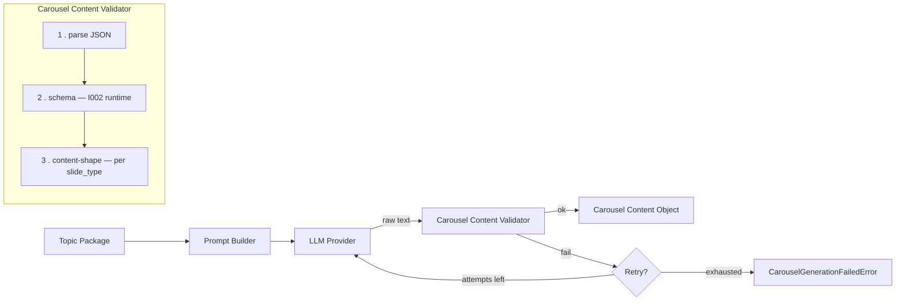

Each box is its own module — `carousel-prompt-builder.mjs`,
`carousel-mock-provider.mjs` (the only provider implementation today),
`carousel-content-validator.mjs`, `retry.mjs` — and `carousel-generator.mjs`
only sequences them. None of the others know the retry loop exists; the
validator doesn't know what a "provider" is; the provider doesn't know how
validation works.

### Prompt Builder

`buildCarouselPrompt(topicPackage)` is a pure function: the same Topic
Package always produces the exact same prompt string. It never calls
anything — no LLM, no network. The prompt includes topic, audience,
objective, key message, supporting points, CTA, desired tone, fixed writing
constraints, the exact six-slide sequence (field names read from
`carousel-slide-spec.mjs` — the same source the shape checker reads from,
so what's asked for and what's accepted can never drift apart), brand
rules, and an explicit "return JSON only" instruction. Field content is
whitespace-collapsed before embedding (so a multi-line field can't break
the prompt's `## Section` structure) but otherwise passed through verbatim
— quotes, punctuation, unicode all included as-is; this is plain text handed
to an LLM, not a value being embedded in JSON we control. Throws
`PromptBuilderError` if a field the prompt needs is blank — defense in
depth, independent of whatever validated the Topic Package upstream.

### Provider abstraction

A provider is any object shaped `{ name: string, generateCarousel(prompt, context): Promise<string> }`
— it returns raw text (mimicking a real completion API), never a pre-parsed
object, so swapping in a real provider later changes nothing downstream;
the validator's `JSON.parse` step is exactly where a real LLM's occasional
malformed output would surface too. `context.topicPackage` is passed
alongside the prompt so the mock provider can generate content grounded in
the real topic — a real provider is free to ignore it, since everything it
needs is already in the prompt text.

**"Later" arrived in DC-003-I019** — a real provider (Anthropic) now
exists behind this exact abstraction, unchanged. See "Real LLM Provider
Integration (DC-003-I019)" below.

### Mock provider (`src/carousel-mock-provider.mjs`)

The only provider implemented in DC-003-I004 — deterministic, no network,
no randomness. Every slide is populated from the Topic Package's own
fields (`working_title`, `core_message`, `audience`, `supporting_points`,
`cta`), so output is recognizably about the actual topic rather than
generic filler. The statistic and quote slides are explicitly labeled as
illustrative/mock in their own copy (`"Placeholder statistic generated by
the mock provider — not a verified figure."`) rather than presenting an
invented number or a fabricated testimonial as real. No `hashtags` field
is generated: it's not part of any of the six slide types in
`config/templates.json` / DC-003-T002 §2, and adding one would be
inventing contract surface the rest of the pipeline doesn't expect.

### Validation flow

Three gates, run in order by `validateGeneratedCarousel()`, any of which
can fail independently:

1. **Parse** — is the provider's raw text valid JSON containing a `slides`
   array at all?
2. **Schema** — does the assembled object (provider's slides + pipeline
   metadata) conform to `schemas/carousel-content.schema.json`, via the
   unmodified I002 validator runtime? Catches wrong slide count, wrong
   `slide_type` values, wrong top-level shape.
3. **Content-shape** — does each slide's `content` actually have the fields
   its `slide_type` needs, non-blank, correct array lengths, in the
   canonical slide order? (`carousel-content-shape.mjs`, reading from the
   same `carousel-slide-spec.mjs` the Prompt Builder uses.)

Every stage returns a structured `{ ok: false, stage, message, details }`
result rather than throwing — `retry.mjs` collects these per attempt.

### Retry behavior

`withRetry()` is a generic, carousel-agnostic primitive (reusable by later
rendering-stage retries per DC-003-T001 §6): configurable `maxAttempts`
(default 3), stops the instant an attempt succeeds — never wastes a call
once a good result is in hand — and never silently gives up. If every
attempt fails, `generateCarouselFromTopicPackage` throws
`CarouselGenerationFailedError` carrying the full `attempts` array (every
stage, every message, in order), never a collapsed generic message.
Building the prompt happens once, *outside* the retry loop — if the Topic
Package itself has no usable content, retrying with the same input would
never help, so that fails immediately via `PromptBuilderError` instead.

### Generating a carousel in code

```js
import { loadTopicPackage, generateCarouselFromTopicPackage } from "./src/index.mjs";

const topic = loadTopicPackage("tests/fixtures/topic-packages/approved.valid.json");
const carousel = await generateCarouselFromTopicPackage(topic);
// carousel: { carousel_content_id, topic_id, generated_at, llm_model,
//             prompt_version, schema_version, slides: [ 6 slides ] }
// — deep-cloned and deep-frozen, same immutability approach as the Topic
//   Package Loader (see "Immutability" above).

// A different provider — same call shape, same validation, same retries:
const carousel2 = await generateCarouselFromTopicPackage(topic, {
  provider: myRealLlmProvider,
  maxAttempts: 5,
});
```

### CLI check

```bash
npm run generate:mock -- tests/fixtures/topic-packages/approved.valid.json
```

Loads the Topic Package (via the I003 loader — so an unapproved or invalid
package is rejected before generation is even attempted), generates a
carousel with the mock provider, and prints a readable summary: topic,
generated title, slide count, generation version (`prompt_version` +
`schema_version`), and provider name. Exits `0` on success; on failure,
prints structured errors (no raw stack trace for expected failure modes)
and exits non-zero. Does not render slides. Does not write any file — the
carousel exists only in memory for the life of the process.

## Carousel Payload Mapper (`src/carousel-payload-mapper.mjs`)

Translation only — turns a Carousel Content Object into six Templated
Payload Objects, one per slide. Never calls Templated, never renders, never
touches the network.

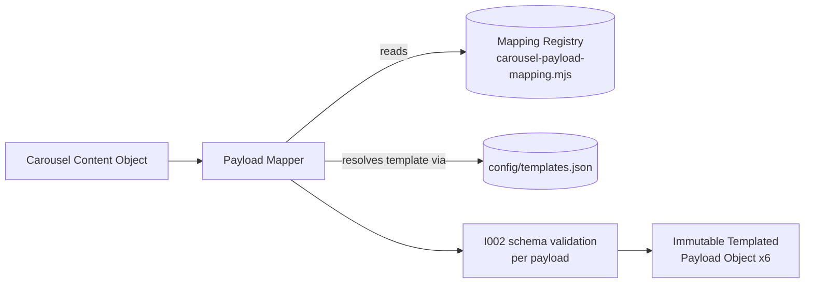

### Mapping Registry (`src/carousel-payload-mapping.mjs`)

The single source of truth for how a Carousel Content field becomes a
Templated layer. No layer name is hardcoded anywhere else in the mapper —
everything reads from this table. Three transform kinds:

| Kind | Example | Behavior |
|---|---|---|
| `direct` | `headline_text` → `headline_text` | value copied as-is |
| `array-fanout` | `list_items[0..3]` → `list_item_1..4_text` | each array entry becomes one indexed layer |
| `object-array-fanout` | `steps[i].title`/`.description` → `step_{i+1}_title`/`_description` | each array-of-objects entry becomes a pair of indexed layers |

For four of the six slide types (`cover`, `statistic`, `quote`, `cta`) the
Carousel Content field names and the Templated layer names are already
identical — that's inherited from how DC-003-T002 §2's field names were
originally chosen to mirror `config/templates.json`'s layer names, not a
mapping this registry invents. The two genuinely transformative mappings
are `content`'s `list_items` and `infographic`'s `steps`, both fan-outs.

`validateMappingRegistry(templatesConfig)` cross-checks this table against
the live template registry and returns `{ ok, issues }`: every
`templateKey` must exist in `config/templates.json`, no two mapping entries
for the same slide type may target the same layer ("mappings unique" / "no
duplicate layer names"), and every layer name the registry could ever
produce must be a real `variable` layer on that template ("mapping
references only templates defined in `templates.json`"). This runs in the
test suite against the real registry on every test run — if the mapping
table and `config/templates.json` ever drift apart, a test fails
immediately rather than the drift surfacing as a runtime mapping bug.

### Template resolution

`config/templates.json` is the only source of template IDs — the mapper
never hardcodes one. For each slide, `slide_type` resolves to a
`templateKey` (via the Mapping Registry) which resolves to a `template_id`,
`template_version`, `format`, `slide_number`, and the template's `variable`
layer list (via `loadTemplatesConfig()`, the I002 config loader). All six
approved carousel templates are supported — there's no partial coverage.

### Layer validation

After a slide's layers are computed, two checks run before that slide's
payload is even assembled:

- **Every required editable layer is populated** — every non-optional
  `variable` layer on the template must appear in the computed `layers`
  object (`list_item_4_text` is the one layer marked `optional` in
  `config/templates.json`, and is correctly skipped when there's no 4th
  supporting point).
- **No unknown layer names** — every layer the mapping produces must be a
  real `variable` layer on that template; a layer name that doesn't match
  is rejected, never silently written.

Duplicate assignment is guarded at two levels: within one slide's own
mapping (a registry-authoring bug — unreachable through the real registry,
covered by `validateMappingRegistry`'s static check instead of a runtime
fixture, since a correct registry can't trigger it), and across the whole
carousel (two slides sharing the same `slide_type` — genuinely reachable
from a malformed input, see `duplicate-layer.json` below).

### Payload validation

The finished payload for each slide is validated against
`schemas/templated-payload.schema.json` via the unmodified I002 validator
runtime — not reimplemented here. This catches things layer validation
above can't: a malformed `carousel_content_id` copied through from the
input, for instance (see `invalid-payload.json` — every layer maps
correctly, but the final schema check still rejects it).

### Mapping errors

Five distinct, structured error classes — never a generic message:

| Error | When |
|---|---|
| `UnknownTemplateError` | `slide_type` doesn't resolve to any registered template |
| `MissingLayerError` | a required layer's source content field is blank, absent, or the layer itself never got assigned |
| `DuplicateLayerMappingError` | the same layer would be assigned twice — within one slide's mapping, or by two slides sharing a `slide_type` |
| `UnsupportedContentError` | an array/object-shaped field doesn't match its fan-out contract (wrong length, blank sub-field), or the mapper produces a layer name the template doesn't define |
| `TemplatedPayloadValidationError` | the assembled payload fails schema validation — carries `.errors`, the same structured shape the I002 validator returns |

### Mapping a carousel in code

```js
import { mapCarouselToTemplatedPayload } from "./src/index.mjs";

const payloads = mapCarouselToTemplatedPayload(carouselContent);
// payloads: 6 Templated Payload Objects, in slide order — deep-frozen,
// same immutability approach as every other output in this codebase.
```

### CLI check

```bash
npm run map:payload -- tests/fixtures/carousel-content/valid.json
```

Prints one block per slide — template name, template ID, editable layer
count, mapped layer count, payload validation result — and exits `0`. On
failure, prints the specific structured error (no raw stack trace for the
five expected failure modes) and exits non-zero. Does not render. Does not
write any file.

## Templated Renderer (`src/renderer.mjs`)

The first component in this repository that talks to an external service.
Converts one Templated Payload Object into a rendered carousel asset —
strictly translation-and-transport; no rendering happens locally, no
n8n, no queueing, no polling.

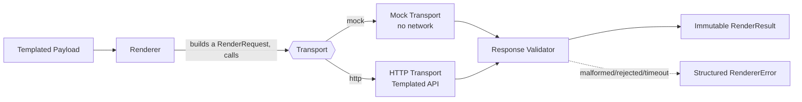

### Renderer contract

`renderTemplatedPayload(payload, options)` consumes only a validated
Templated Payload Object and returns only an immutable `RenderResult`. It
never exposes an HTTP response, a `fetch` object, an API key, or any other
transport-specific structure — `renderer-response-validator.mjs` is the one
place a raw transport response is inspected, and nothing from that
inspection survives past it unnormalized.

### Transport abstraction

A transport is any object shaped `{ name, send(request, { timeoutMs }) }` —
the renderer depends only on this shape, never on HTTP directly. There is
**no implicit default transport**: every call must explicitly pass
`options.transport`, so an automated test (or a careless script) can never
accidentally reach a real endpoint by omission. Two implementations exist
today:

- **`createMockTransport()`** (`renderer-transport-mock.mjs`) — the *only*
  transport automated tests use. Deterministic, no network, configurable
  via `options.mode` to simulate every failure case the renderer needs to
  handle (`timeout`, `transport-error`, `auth-error`, `malformed`,
  `rejected`), plus `options.failuresBeforeSuccess` for retry-success tests.
- **`createHttpTransport(config)`** (`renderer-transport-http.mjs`) — the
  real Templated integration, using Node's built-in `fetch` (no new
  dependency). Never exercised by automated tests. Endpoint
  (`POST https://api.templated.io/v1/render`), request body shape
  (`{ template, layers, format }`), and `Authorization: Bearer` header are
  **confirmed against Templated's official docs**
  ([authentication](https://templated.io/docs/authentication/),
  [create a render](https://templated.io/docs/renders/create/)). The
  `POST /render` endpoint's own example response omits a `status` field
  (`{ id, url, storage_url, width, height, format, templateId,
  templateName, createdAt, externalId }`), which an earlier pass read as
  "Templated never sends status" — that turned out to be incomplete, not
  correct: [the render object](https://templated.io/docs/renders/) docs
  state the field exists and is always uppercase (`PENDING` / `COMPLETED` /
  `FAILED`), and the one authorized live call's response confirmed it,
  carrying `status: "COMPLETED"`. See "Provider status contract" below for
  the corrective fix. `renderer-response-validator.mjs` still infers
  `status` from the presence of a `url` for the (currently only
  hypothetical) case where a response has neither — no observed Templated
  response has actually lacked the field.

A future transport (a different provider, a queue-backed one, anything)
plugs in by implementing the same two-property shape — no renderer code
changes.

### Retry behaviour

Retries are not renderer logic — `renderTemplatedPayload` reuses
`src/retry.mjs`'s `withRetry()` (the exact I004 primitive, unmodified) for
the retry loop itself. Configurable via `options.maxAttempts`, defaulting
to `TEMPLATED_RENDER_MAX_ATTEMPTS` (default `3`) when driven from the CLI's
config loader. Not every failure is retried:

- **Retried**: `TimeoutError`, `TransportError` — both plausibly transient.
- **Not retried, fails on the first attempt**: `AuthenticationError` (bad
  credentials won't become good credentials on attempt two),
  `ValidationError` (a response-shape mismatch is deterministic — the same
  malformed response recurs on every retry of the same request), and
  `RenderRejected` (Templated understood the request and rejected it — the
  same payload will be rejected again). These bypass `withRetry` by
  throwing directly out of the attempt callback, which `withRetry` doesn't
  catch — no changes to `retry.mjs` were needed to get this behavior.

Retry exhaustion raises `RetryLimitExceeded` carrying every attempt's
result in order — never a collapsed generic message. No infinite retries:
`maxAttempts` is always a specific, finite, configured number.

**`ValidationError` was retryable until a hardening pass** — see
"Live-verification safety rule" below for what happened and why that
changed.

### Timeout behaviour

Timeout duration always originates from configuration
(`TEMPLATED_REQUEST_TIMEOUT_MS`, default `15000`) or an explicit
`options.timeoutMs` override — never a number hardcoded somewhere
unreachable. The HTTP transport enforces it with `AbortController`; a
timeout maps to `TimeoutError`, a dedicated type distinct from a generic
`TransportError`.

### Response validation

Every response — mock or real — passes through
`validateTransportResponse()` before it can become a `RenderResult`:
structurally untrustworthy responses (not an object, missing/invalid `id`,
an invalid/undocumented explicit `status` when one is given) fail fast as
`ValidationError`, and are **not retried** (see "Retry behaviour"). `status`
is optional on the wire; when it's absent, status is inferred: present
`url` → `completed`, otherwise → `processing`. An explicit `status` (which
every observed Templated response, mock or live, has sent) is validated
against Templated's documented provider contract and normalized — see
"Provider status contract" below. A well-formed response that normalizes to
`status: "failed"` is a distinct case, `RenderRejected`, since the response
itself was trustworthy — Templated just declined the render.

Every `ValidationError` carries `.details` — an array of
`{ field, expected, received, message }`. `received` is a safe type/reason
descriptor (`"missing"`, `"empty string"`, `"number"`, ...), **never the
actual value**, for any field that could plausibly carry something
sensitive. The one exception is `status`: a short, non-sensitive, closed
enum string, safe to show verbatim. Nothing in this diagnostic path ever
includes the raw response body, the API key, or an authorization header.

### Provider status contract

**Corrective pass, after the live-verification incident:** the one
authorized live call connected and authenticated successfully but failed
`ValidationError` — Templated's response carried `status: "COMPLETED"`, and
the validator at the time only accepted lowercase (`pending` / `processing`
/ `completed` / `failed`). Before touching any code, the fix was verified
against Templated's official docs rather than assumed:
[the render object](https://templated.io/docs/renders/) states, verbatim:
*"The current status of the render: PENDING, COMPLETED or FAILED. Initially
the status is PENDING."* — confirming the live response was correct and the
validator was the bug. There is no documented `PROCESSING` value.

`renderer-response-validator.mjs` now validates the raw response's `status`
against exactly this documented uppercase contract (`PENDING` / `COMPLETED`
/ `FAILED`, via `PROVIDER_STATUS_MAP`) and normalizes it onto this
codebase's canonical lowercase vocabulary (`RENDER_STATUSES` —
`pending`/`processing`/`completed`/`failed` — unchanged since I006, and
reused by `finished-carousel.schema.json`'s `SlideRender.status`) before the
normalized `{ id, status, imageUrl }` shape goes anywhere near
`RenderResult`. This keeps the provider/wire representation and the
internal domain vocabulary decoupled at a single, well-known boundary:
every downstream consumer — `RenderResult`, the CLI, any future caller —
depends only on the lowercase internal vocabulary and never needs to know
Templated's casing. `processing` remains purely an internal inference value
(a response with neither an explicit status nor a `url`) — Templated
doesn't document it, and nothing on the wire is expected to send it. The
mock transport (`renderer-transport-mock.mjs`) was updated to send the same
documented uppercase values Templated does, so it continues to exercise
this normalization boundary faithfully instead of masking it.

Deliberately **not** broadened beyond the documented contract: an
undocumented casing (lowercase) or an undocumented value (e.g.
`PROCESSING`) is still rejected as `ValidationError`, not silently
accepted — this was a validator bug matching an incomplete contract, not a
signal to loosen validation.

### RenderResult

The provider-independent domain object every downstream consumer should
depend on — `renderId`, `status`, `imageUrl`, `templateId`, `slideType`,
`provider`, `requestedAt`, `completedAt`, `durationMs`. `status` reuses the
exact same enum as `finished-carousel.schema.json`'s `SlideRender.status`
(`pending` / `processing` / `completed` / `failed`) on purpose — a future
milestone assembling a Finished Carousel Object from `RenderResult`s won't
need to translate between two vocabularies. Since I006 doesn't poll,
`pending`/`processing` are legitimate non-error outcomes here, not every
`RenderResult` represents a finished image. Deep-cloned and deep-frozen —
same immutability approach as every other output in this codebase.

### Error hierarchy

Unlike earlier DC-003 error modules (flat classes, each extending `Error`
directly), this one is a genuine hierarchy — every renderer error extends
`RendererError`:

| Error | When | Retried? |
|---|---|---|
| `AuthenticationError` | credentials rejected | No |
| `TransportError` | network-level failure | Yes |
| `TimeoutError` | request exceeded the configured timeout | Yes |
| `ValidationError` | transport response has an untrustworthy shape | **No** (was Yes — see below) |
| `RenderRejected` | Templated returned a well-formed `status: "FAILED"` (normalized to `failed`) | No |
| `RetryLimitExceeded` | every retry attempt failed | — (terminal) |

### Rendering in code

```js
import { renderTemplatedPayload, createMockTransport } from "./src/index.mjs";

const result = await renderTemplatedPayload(payload, {
  transport: createMockTransport(),
  maxAttempts: 3,
  timeoutMs: 15000,
});
// result: { renderId, status, imageUrl, templateId, slideType, provider,
//           requestedAt, completedAt, durationMs } — immutable.
```

### CLI check

```bash
npm run render:mock -- tests/fixtures/templated-payload.example.json
npm run render:live -- tests/fixtures/templated-payload.example.json  # requires TEMPLATED_API_KEY
npm run render:live -- tests/fixtures/templated-payload.example.json --live-max-attempts=2  # explicit opt-in only
```

`render:mock` (the default) always uses the mock transport — safe to run
anytime, no credentials, no network. `render:live` uses the real HTTP
transport and performs an actual, credentialed API call; it fails fast
with a clear message if `TEMPLATED_API_KEY` isn't set, and is not run by
any automated test. **`--live` always defaults to exactly one attempt**,
regardless of `TEMPLATED_RENDER_MAX_ATTEMPTS` — see "Live-verification
safety rule" below. Prints render ID, status, image URL, template ID,
slide type, provider, and duration; exits `0` on success, non-zero with a
structured error (including safe field-level diagnostics for
`ValidationError`) otherwise. Does not write any file.

### Live-verification safety rule

**Incident (DC-003-I006):** the first authorized live-verification attempt
fired **three** real requests against Templated's production API instead
of the one that was approved. The CLI loaded `maxAttempts` from
`TEMPLATED_RENDER_MAX_ATTEMPTS` (the normal production retry default, `3`)
with no live-specific override, and `ValidationError` was retryable at the
time — so a response-shape mismatch (see "Transport abstraction" above)
was retried twice more automatically. Connectivity and auth both worked;
only the response shape was wrong, but the retry count was the real
failure. Reported transparently; the CEO/Strategy Office authorized a
code-only hardening pass (no further live calls) before another live
attempt would be considered. Two independent fixes landed as a result,
tested entirely without network access:

1. **`ValidationError` is no longer retried anywhere in the renderer** (see
   "Retry behaviour" and the error hierarchy table above) — a response-shape
   mismatch is deterministic, so retrying was always going to waste calls,
   live or mock.
2. **`--live` is decoupled from production retry config entirely.**
   `resolveLiveMaxAttempts()` (`renderer-config.mjs`) always returns `1`
   unless the CLI is given an explicit `--live-max-attempts=N` flag on that
   specific invocation — never picked up from an env var or config file, so
   it can't be silently inherited. `TEMPLATED_RENDER_MAX_ATTEMPTS` no longer
   has any effect on `--live` runs at all.

Both fixes are proven by tests that run entirely against the mock
transport: `renderer.test.mjs` asserts a malformed response calls the
transport exactly once even with `maxAttempts: 5` available;
`renderer-config.test.mjs` asserts `resolveLiveMaxAttempts()` defaults to
`1` and stays `1` even when `TEMPLATED_RENDER_MAX_ATTEMPTS` is set to `7`
in the same environment; `renderer-cli.test.mjs` asserts a bad
`--live-max-attempts` value fails before a transport is even constructed.

### Live verification procedure

No live Templated call happens until explicitly approved, and every
verification session ends with exactly one live attempt, never more. Steps,
in order:

1. **Architecture review** — confirm the renderer depends only on the
   transport abstraction (dependency-injected, no implicit default).
2. **Authorization** — explicit confirmation to perform exactly one live
   render.
3. **Verify the base URL and auth scheme** against Templated's official
   docs before risking the authorized call — this is what caught the
   response-shape mismatch described above and got it fixed pre-emptively.
4. **A locally configured `TEMPLATED_API_KEY`** — set in the shell
   environment or a local (gitignored) `.env`, never pasted into chat, and
   verified present (never displayed) before use.
5. Run `npm run render:live -- <path>` exactly once, against one sample
   payload — now safe by default per the safety rule above, since a second
   attempt requires a deliberate, visible `--live-max-attempts` override
   typed on that specific command.
6. Record the response characteristics, re-run the full mock test suite to
   confirm nothing regressed, and stop.
7. If the attempt reveals a problem, fix and re-verify **only** with fresh,
   explicit re-authorization — a hardening pass is not a standing license
   for another live call.

## Finished Carousel Builder (`src/finished-carousel-builder.mjs`)

**From DC-003-I007 onward, `FinishedCarousel` is this pipeline's public,
stable contract.** Downstream consumers — a future execution logger
(DC-003-I008) or n8n orchestration (DC-003-I009) — should depend on
`FinishedCarousel`, never on `RenderResult`, `TemplatedPayload`, or any
other intermediate object. Those objects still exist and still do their own
jobs; they're simply no longer meant to be depended on from *outside* the
pipeline.

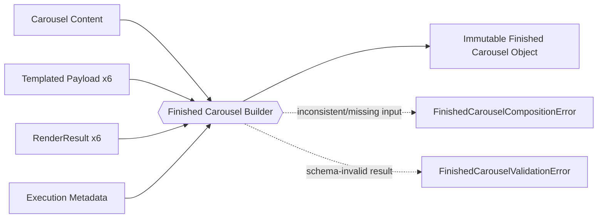

### Why this object, why now

DC-003-I001 through DC-003-I006 each added one pipeline stage but left
every stage's output as the next stage's *input* — nothing tied a carousel's
content, its six payloads, and its six renders back together into one
object a caller could reasonably hand to something else. `FinishedCarousel`
closes that gap: it's the first object in this pipeline whose shape a
downstream system can commit to without needing to know anything about
Templated, the renderer's retry policy, or the payload mapper's layer
registry — see "Provider independence" below.

### Construction rules

A `FinishedCarousel` may only be built from already-validated objects, and
the builder **fails fast** the moment any input is missing, malformed, or
mutually inconsistent with another input — it never guesses, never drops a
slide, and never silently reorders anything. It is never built from a raw
transport/provider response — `renderer-response-validator.mjs` remains the
only place in this codebase a raw response is inspected; by the time a
`RenderResult` reaches this builder, that boundary has already been
crossed.

### Required inputs

`createFinishedCarousel({ carouselContent, slideRenders, executionMetadata }, options)`
takes exactly three things:

- **`carouselContent`** — one validated Carousel Content Object (DC-003-I004).
- **`slideRenders`** — an array of exactly 6 `{ templatedPayload, renderResult }`
  pairs, in the same slide order as `carouselContent.slides`. The DC-003-I007
  brief describes "TemplatedPayload" and "RenderResult" in the singular, but
  a Finished Carousel Object always has exactly six slides
  (`finished-carousel.schema.json`: `minItems`/`maxItems` 6) — there is no
  other way to populate six `render_id`/`image_url`/... entries than one
  validated Templated Payload Object (DC-003-I005) and one `RenderResult`
  (DC-003-I006) per slide.
- **`executionMetadata`** — one validated `ExecutionMetadata` object (below).

The builder is responsible **only for composition, not transformation**:
every value in its output came directly from one of these three inputs.
The one mechanical exception is renaming `RenderResult`'s camelCase fields
(`renderId`, `imageUrl`, `requestedAt`, `completedAt`, `durationMs`) onto
this schema's snake_case field names — the same kind of renaming
DC-003-I005's Payload Mapper already does going from a Carousel Content
Object onto a Templated Payload Object. Image `width`/`height` are the one
value not sourced from either input: neither `RenderResult` (DC-003-I006
deliberately keeps it minimal) nor Templated Payload tracks dimensions, and
every DC-002 template is a fixed 1080x1350, so the builder reads that from
`config/constants.json` rather than hardcoding it a second time or inventing
a new place to store an already-known constant.

Before assembling anything, the builder cross-checks that the three inputs
actually describe the same carousel and the same slide in the same
position — e.g. `templatedPayload.carousel_content_id` must match
`carouselContent.carousel_content_id`, and `renderResult.templateId` must
match its own `templatedPayload.template_id` — catching a shuffled or
mismatched `slideRenders` array before it can ever reach schema validation.

### Execution metadata (`src/execution-metadata.mjs`)

`createExecutionMetadata({ provider, renderDurationMs, executionId?, renderedAt? })`
builds a small, separate, immutable domain object — the DC-003-I007 brief
calls for this explicitly, as its own construct, not an inline field on the
builder. `executionId` and `renderedAt` are generated automatically when
omitted (`exec_YYYYMMDD_<12 hex chars>`, matching
`execution-log.schema.json`'s own `execution_id` pattern exactly); `provider`
and `renderDurationMs` must be supplied by the caller, since they describe
what actually happened during rendering, not something this factory can
infer.

**`execution_id` is this carousel's trace identifier**, carried forward as
`finished_carousel.execution_metadata.execution_id`. DC-003-I008 (Execution
Logging) is expected to reuse this exact ID to tie its own persisted record
back to this carousel — this is why its format is locked to
`execution-log.schema.json`'s pattern now, even though I008 doesn't exist
yet.

### Provider independence

`FinishedCarousel` never exposes a provider-specific implementation detail.
Every field in a slide entry is either a schema-level identifier
(`render_id`, `template_id`), a plain value (`image_url`, `width`, `height`,
`format`), or a timestamp/duration — nothing about *how* Templated (or any
future provider) represents a render leaks through. `renderer-response-validator.mjs`
remains the one place a raw provider response is inspected; `RenderResult`
remains the one provider-facing domain object this builder is allowed to
read from, and it does not re-expose anything from `RenderResult` that
`RenderResult` itself doesn't already normalize (`status`, `imageUrl`, etc.
— see "Provider status contract" above for how `RenderResult.status` itself
already never leaks a provider's raw casing).

### Schema extension

`finished-carousel.schema.json` (written in DC-003-I001, never consumed by
code until this milestone) gained one new required property,
`execution_metadata` (`additionalProperties: false`, matching every other
object in this schema), to carry the execution metadata the DC-003-I007
brief requires. No other DC-003-T002-approved field changed — see "Schemas"
above.

### Validation

Schema validation happens **after** every composition check, via the same
DC-003-I002 validator every other stage uses
(`validator.validate("finishedCarousel", ...)`)  — never before, and never
skipped. This exists specifically so a composition-valid-but-schema-invalid
input (e.g. an `ExecutionMetadata`-shaped object whose `renderedAt` isn't
actually a valid date-time) is still caught, rather than trusting that
passing the builder's own shape checks is equivalent to passing the full
schema. No silent coercion anywhere in this path: a malformed input always
throws, it is never quietly repaired or defaulted.

| Error | When |
|---|---|
| `FinishedCarouselCompositionError` | Any required input is missing, malformed, or mutually inconsistent with another input — thrown before schema validation is even attempted |
| `FinishedCarouselValidationError` | Every composition check passed, but the assembled object still fails schema validation — carries `.errors`, the same structured shape every other DC-003 validation error uses |

### CLI check

```bash
npm run build:carousel -- tests/fixtures/carousel-content.example.json
```

Runs the entire pipeline end-to-end, offline, from one Carousel Content
Object file: DC-003-I005's mapper produces six Templated Payloads,
DC-003-I006's renderer (mock transport only — **no live API interaction**,
by design, matching the "Mock First" constraint every demonstration CLI in
this repo follows) produces six `RenderResult`s, `createExecutionMetadata()`
builds the execution metadata, and this milestone's builder composes all of
it into one `FinishedCarousel`. Prints carousel ID, overall status, slide
completion count, total duration, execution ID, provider, and a one-line
summary per slide. Exits `0` on success, non-zero with a structured error
otherwise. Does not write any file.

### Rendering in code

```js
import {
  mapCarouselToTemplatedPayload,
  renderTemplatedPayload,
  createMockTransport,
  createExecutionMetadata,
  createFinishedCarousel,
} from "./src/index.mjs";

const templatedPayloads = mapCarouselToTemplatedPayload(carouselContent);
const transport = createMockTransport(); // or createHttpTransport(config)

const slideRenders = [];
for (const templatedPayload of templatedPayloads) {
  const renderResult = await renderTemplatedPayload(templatedPayload, { transport });
  slideRenders.push({ templatedPayload, renderResult });
}

const executionMetadata = createExecutionMetadata({
  provider: transport.name,
  renderDurationMs: slideRenders.reduce((sum, { renderResult }) => sum + renderResult.durationMs, 0),
});

const finishedCarousel = createFinishedCarousel({ carouselContent, slideRenders, executionMetadata });
// finishedCarousel: { carousel_id, topic_id, carousel_content_id, generated_at,
//                     overall_status, slides[6], metadata, execution_metadata,
//                     approval } — immutable, schema-valid.
```

## Operational layer (`src/execution-ledger.mjs`)

DC-003-I008 introduces the platform's second layer. The **pipeline layer**
(everything above `FinishedCarousel`) produces outputs. The new
**operational layer** records how execution happened — independently of
what was produced. No orchestration exists yet; that's explicitly
DC-003-I009's job. This milestone only records.

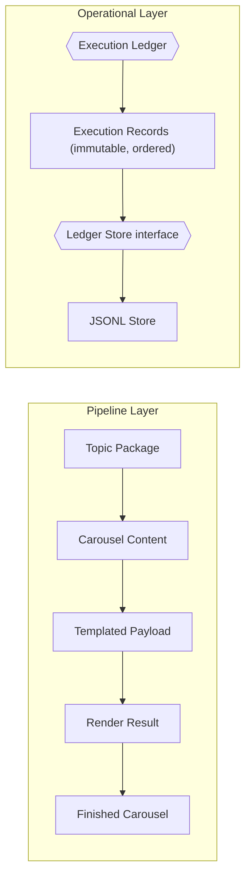

Nothing in the pipeline layer changed to add this — no renderer
modification, no `FinishedCarousel` modification, per the DC-003-I008 brief.
The two layers connect only in the sense that a future orchestrator
(DC-003-I009) is expected to call both.

### Execution Record (`src/execution-record.mjs`)

One immutable event — `createExecutionRecord(fields, { clock, idGenerator })`.
Unlike `RenderResult`/`ExecutionMetadata` (DC-003-I006/I007's own invented,
schema-less domain objects), `ExecutionRecord` has its own JSON Schema
(`execution-record.schema.json`), so its field names are snake_case,
matching the schema directly — the same convention TopicPackage/
CarouselContent/TemplatedPayload/FinishedCarousel already use, rather than
a camelCase JS convenience shape translated at some other boundary.

Required: `record_id`, `execution_id`, `sequence`, `event_type`, `status`,
`occurred_at`. `record_id`/`occurred_at` are generated automatically when
omitted; `stage`/`source`/`data`/`diagnostics` default to `null`.

**Status vocabulary is canonical and closed:** `started` / `succeeded` /
`failed` / `cancelled` — never a provider-specific string (Templated's
`PENDING`/`COMPLETED`/`FAILED`, or any future provider's own terminology,
never appears here; see "Provider status contract" above for the boundary
that already keeps this true one layer down).

**Event types**, also a closed enum: `execution.started`,
`execution.completed`, `execution.failed`, `topic.loaded`,
`content.generated`, `payload.mapped`, `render.started`,
`render.completed`, `render.failed`, `finished_carousel.created`. Adding a
new one later means extending `execution-record.schema.json`'s enum
deliberately — the same evolution pattern DC-003-I007 already established
for `finished-carousel.schema.json`.

### Identity and monotonic sequencing

Every record carries `record_id`, `execution_id`, and `sequence`. `sequence`
must increase monotonically **within one `execution_id`** — a single
record can't detect a duplicate or out-of-order sequence on its own (it has
no visibility into siblings), so that check lives in the Execution Ledger's
`appendRecord()`, the only place with access to a store's existing records:
a new record's `sequence` must be strictly greater than the highest
existing `sequence` already stored for the same `execution_id`, or
`DuplicateSequenceError` is thrown — covering exact duplicates and any
lower/out-of-order value, matching "must increase monotonically" literally,
not just "must be unique."

### Execution Ledger (`src/execution-ledger.mjs`)

`createExecutionLedger({ store })` returns
`{ appendRecord, readAll, reconstructExecution }`. **"The ledger itself is
not mutable"** is satisfied literally: the returned object carries no
mutable internal state of its own at all — every method is a pure function
of its arguments plus whatever the injected store currently holds.
Appending changes the *store* (necessarily, since persistence is external),
never this wrapper; every value handed back to a caller — one
`ExecutionRecord`, a `readAll()` snapshot, a `reconstructExecution()`
summary — is deep-frozen.

No orchestration logic lives here: the ledger records events, it does not
decide what should happen next, retry anything, or call the renderer,
generator, or mapper.

**Failure behavior:** `appendRecord()` always throws on any failure — a
malformed record, a non-monotonic sequence, or a store I/O error — for
every event type, with no silent-failure mode. The DC-003-I008 brief
distinguishes "critical" records (`execution.started`/`completed`/`failed`,
which must never silently fail) from "stage-level" records (which "may
return structured write errors"), but also explicitly defers "the exact
orchestration behaviour" to DC-003-I009. Building two different failure
modes into this milestone would mean guessing at a policy this milestone
isn't the one to set — a future orchestrator can wrap `appendRecord()` in
its own `try`/`catch` and decide, per event type, whether a given failure
is fatal to the whole execution. What DC-003-I008 guarantees is narrower
and unconditional: **nothing is ever swallowed.**

### Ledger Store abstraction (`src/execution-ledger-store.mjs`)

The domain layer knows nothing about files. A Ledger Store is any object
shaped `{ name: string, append(record): void, readAll(): object[] }` — the
same no-implicit-default, no-base-class pattern DC-003-I006's transport
abstraction already established. `assertValidLedgerStore()` is a runtime
guard `createExecutionLedger()` calls immediately, so a malformed store
fails fast with `InvalidLedgerStoreError` rather than crashing confusingly
on the first `append`/`readAll` call. A future store (SQLite, Postgres,
cloud storage, a real event store) plugs in by implementing this same
shape — no change to `execution-ledger.mjs`.

### JSONL Ledger Store (`src/jsonl-ledger-store.mjs`)

The one implementation this milestone ships: one `ExecutionRecord` per
line of a `.jsonl` file, e.g.:

```
{"record_id":"rec_001","execution_id":"exec_20260801_9f3a2e1c8b4d","sequence":1,"event_type":"execution.started", ...}
{"record_id":"rec_002","execution_id":"exec_20260801_9f3a2e1c8b4d","sequence":2,"event_type":"execution.completed", ...}
```

`append()` appends one line, creating the file if it doesn't exist yet.
`readAll()` returns `[]` for a file that doesn't exist (an empty ledger,
not an error), otherwise parses every non-blank line. A line that isn't
valid JSON throws `MalformedLedgerLineError`, naming the file and the
1-based line number — **never the line's own content**: Node's
`JSON.parse` `SyntaxError` message embeds a snippet of the offending text
itself, so this store deliberately discards that message and substitutes a
fixed, content-free reason rather than passing it through (caught by a
test that asserts the malformed text never appears in the thrown error).

### Reconstruction

`ledger.reconstructExecution(executionId)` loads every record from the
store, filters to the given `execution_id`, sorts by `sequence` ascending,
and returns a small immutable summary (`recordCount`, `firstEventAt`,
`lastEventAt`, `finalStatus`, and the ordered `records` themselves). It
explicitly does **not** trust the store's own return order — records are
always sorted here regardless of file/storage order — and it does not
interpret or judge the outcome beyond reporting the last record's own
`status`. No orchestration logic belongs here, matching the brief exactly.
Throws `ExecutionNotFoundError` for an `execution_id` with no records at
all.

### Security model

Diagnostics use an **allowlist, not a blacklist** —
`execution-record.schema.json`'s `diagnostics` object has
`additionalProperties: false` with exactly six allowed fields
(`error_category`, `error_code`, `retryable`, `attempt`, `field_path`,
`safe_message`). Anything not on that list — an API key, an `Authorization`
header, an environment variable, a raw provider response, a stack trace —
is **rejected by schema validation**, never filtered after the fact. This
is enforced at the schema level (tested directly: a `diagnostics.api_key`
or `diagnostics.raw_response` field fails validation), not merely as a
documented convention. The CLI prints whatever diagnostics a record
actually carries verbatim — no separate redaction step exists, because the
allowlist already guarantees there's nothing to redact.

### Deterministic testing

Per the brief's own example signature, `createExecutionRecord(input, { clock, idGenerator })`
— note these option names deliberately differ from the `now` convention
every earlier DC-003 factory uses (`renderer.mjs`, `finished-carousel-builder.mjs`,
etc.), since the brief specified this exact shape for I008. `clock` and
`idGenerator` propagate through `ledger.appendRecord()`'s second argument
unchanged. No test in `execution-record.test.mjs`, `execution-ledger.test.mjs`,
or `execution-ledger-cli.test.mjs` depends on the real clock or a random UUID.

### CLI (`tests/validation/ledger.mjs`, `npm run ledger`)

One CLI, four subcommands — no network, no renderer, no provider
interaction:

```bash
npm run ledger -- init <ledgerPath>
npm run ledger -- append <ledgerPath> <recordFieldsJsonPath>
npm run ledger -- read <ledgerPath> [executionId]
npm run ledger -- reconstruct <ledgerPath> <executionId>
```

`init` creates a new empty ledger file and refuses to overwrite an existing
one (`LedgerFileExistsError`) — the store itself doesn't need an explicit
"create" step (`append` creates the file lazily), `init` exists purely so
an operator can stake out an empty ledger deliberately. `append` reads
record fields from a JSON file (the same "point the CLI at a JSON file"
convention every other DC-003 CLI uses) and prints a safe summary. `read`
prints every record, optionally filtered to one `executionId`. `reconstruct`
prints the full reconstructed summary for one execution. Every subcommand
exits `0` on success, non-zero with a structured, named error otherwise.

### Rendering in code

```js
import { createJsonlLedgerStore, createExecutionLedger } from "./src/index.mjs";

const store = createJsonlLedgerStore({ filePath: "./execution.jsonl" });
const ledger = createExecutionLedger({ store });

ledger.appendRecord({
  execution_id: "exec_20260801_9f3a2e1c8b4d",
  sequence: 1,
  event_type: "execution.started",
  status: "started",
  source: "cli",
});

const execution = ledger.reconstructExecution("exec_20260801_9f3a2e1c8b4d");
// execution: { executionId, recordCount, firstEventAt, lastEventAt,
//              finalStatus, records[] } — immutable.
```

### `execution-log.schema.json` — deprecated

**There is exactly one active operational record model in this repository:
`ExecutionRecord` / the Execution Ledger, above.** `execution-log.schema.json`
is retained but formally **deprecated** (DC-003-I008.1, Schema Reconciliation)
— not part of the active architecture, not to be built against.

**Findings (DC-003-I008.1 review):**

- **Not referenced by any production code path.** Every reference to it in
  `src/` is either a schema *registration* (`schema-registry.mjs`, so it
  remains independently validatable) or a version-key presence check
  (`integrity-checks.mjs`'s `REQUIRED_SCHEMA_VERSION_KEYS`). No module
  constructs an Execution Log object, and no builder validates data against
  it. Its only other references are its own approved fixture
  (`tests/fixtures/execution-log.example.json`) and the generic "validate
  every approved fixture" test/CLI (`validator.test.mjs`, `validate.mjs`)
  that exercises it structurally, not operationally.
- **Not obviously abandoned, either.** It was written in DC-003-I001 per
  DC-003-T002 §5 as a single aggregate record per pipeline run
  (`token_usage`, `cost_estimate`, `llm_retry_count`, `n8n_execution_url`,
  etc.) — a *rolled-up summary* shape, structurally different from
  `ExecutionRecord`'s per-event design, but not necessarily in conflict
  with it: a future rolled-up projection *built from* Execution Ledger
  records is still a plausible shape for DC-003-I009 (Orchestrator) or
  DC-003-I010 (n8n Adapter) to want, once their real requirements
  (retry counting, token accounting, n8n's own execution URL format) are
  actually known — the same position `finished-carousel.schema.json` was
  in from DC-003-I001 until DC-003-I007 finally consumed it.
- **Removal risk:** none today (no consumer exists to break), but deleting
  an approved DC-003-T002 §5 object schema is a contract change, not
  housekeeping — that decision belongs to the Strategy Office explicitly
  revisiting T002, not to an unprompted deletion here.

**Decision: retain, deprecate, document — not remove.** The schema file,
its fixture, and its registry/integrity-check entries are all unchanged in
this milestone (removing any of them would be an untested behavioral
change, which DC-003-I008.1 is explicitly scoped not to make). What
changed is presentation only: this section now states plainly that it is
deprecated, so it is never mistaken for a second, competing operational
model alongside the Execution Ledger. If DC-003-I009/I010 conclude a
rolled-up execution summary is genuinely needed, that milestone should
explicitly decide whether to revive, redesign, or finally retire this
schema — DC-003-I008.1 does not pre-empt that call.

## Pipeline Orchestrator (`src/pipeline-orchestrator.mjs`)

DC-003-I009 introduces the platform's execution engine — the single
component that coordinates every existing pipeline stage. It contains no
business logic of its own: every domain decision (how to validate a Topic
Package, how to map a slide onto a template, how to render, how to
compose a Finished Carousel) still lives entirely inside the module that
already implemented it (DC-003-I003 through DC-003-I008). This milestone
only sequences those modules and records what happened.

**Fundamental Principle:** only one component may coordinate multiple
stages — the orchestrator. No stage ever calls another stage, and no stage
ever writes to the Execution Ledger directly.

```mermaid
flowchart LR
    subgraph Entry Points
    CLI2[CLI] --- FN[Future n8n] --- FA[Future API] --- FS[Future Scheduler]
    end
    Entry Points --> PO{{Pipeline Orchestrator}}
    PO --> DSP["Declarative Stage Pipeline\n(pipeline-definition.mjs)"]
    DSP --> SI["Stage Interface\nexecute(context) -> StageResult"]
    SI --> PC[(Pipeline Context)]
    PC --> EC["Existing Components\n(I003–I008, unmodified)"]
    EC --> FC3[FinishedCarousel]
    EC --> ER2[Execution Records]
    ER2 --> EL2[(Execution Ledger)]
    PO --> PR[PipelineResult]
```

All future entry points (n8n, a REST API, a scheduler) are expected to call
`createPipelineOrchestrator(...).run(...)`, never a renderer, mapper,
builder, or ledger directly — this milestone's CLI (below) is the first
of those entry points, not a special case.

### Declarative pipeline (`src/pipeline-definition.mjs`)

```js
export const DEFAULT_PIPELINE = [
  LoadTopicStage,
  GenerateCarouselStage,
  MapPayloadStage,
  RenderStage,
  BuildFinishedCarouselStage,
];
```

The orchestrator loops over this array without knowing anything about what
any individual stage does. Adding a future stage means extending this
array — `createPipelineOrchestrator({ ledger, stages })` also accepts a
custom stage list, which is exactly how this milestone's own tests exercise
stage ordering, failure handling, and context propagation without needing
a real upstream failure to happen. If a new stage needs an `event_type`
`execution-record.schema.json` doesn't already list, that's a schema
change (the same kind DC-003-I007 already made to add
`execution_metadata`), not an orchestrator change.

### Stage interface

Every stage is a plain object, duck-typed like every other abstraction in
this codebase (the transport abstraction, the Ledger Store abstraction):

```
{ name: string, execute(context, options): Promise<StageResult> }
```

`options` carries `clock`/`idGenerator` (see "Determinism" below) plus
whatever else the orchestrator's own `run()` caller passed through —
stages read only the specific options they need (e.g. `RenderStage` reads
`context.configuration.transport`; `LoadTopicStage` reads
`context.configuration.topicPackageSource`). The orchestrator never
inspects which stage produced a `StageResult`, and no stage needs to know
what any other stage does.

### StageResult

```
{ success: boolean,
  updatedContext: object | null,   // FIELDS to overlay, not a full context
  executionRecords: object[],      // partial ExecutionRecord fields
  warnings: string[],
  error: { stage, code, message, retryable } | null }
```

`updatedContext` is a set of fields to overlay onto the current
`PipelineContext`, not a full context object — a stage never needs to know
the other fields already present on the context it received.
`executionRecords` are **partial** `ExecutionRecord` field sets
(`event_type`/`status` required; `stage`/`source`/`data`/`diagnostics`
optional) — `execution_id`, `sequence`, `record_id`, and `occurred_at` are
all orchestrator/ledger-owned, never a stage's concern (see "Execution
Ledger relationship" below). `error`, when present, is always the safe
shape `toSafeStageError()` (`src/pipeline-errors.mjs`) produces — **no raw
provider error, response body, stack trace, or credential ever reaches
this field.** Every DC-003 error class already constructs a safe message
(see each module's own error file); this function only normalizes the
shape, matching the same safe-diagnostics discipline DC-003-I006's
`ValidationError.details` and DC-003-I008's diagnostics allowlist already
established.

### Pipeline Context (`src/pipeline-context.mjs`)

Fields: `executionId`, `configuration`, `topicPackage`, `carouselContent`,
`templatedPayloads`, `renderResults`, `finishedCarousel`, `metrics`,
`warnings`. **Internal only** — never persisted, never returned from
`run()` (see PipelineResult below), and never mutated in place:
`withContext(context, patch)` always returns a **new**, separately frozen
object; nothing about the context handed to a stage ever changes
underneath it. **The Execution Ledger is deliberately not one of its
fields** — the ledger is an independent operational component the
orchestrator holds separately; a stage can never reach it through the
context.

One immutability wrinkle worth documenting: `configuration` can carry a
live, non-cloneable value — a mock transport/provider object with function
properties, for a stage to use (`context.configuration.transport`,
`context.configuration.provider`). `deepFreezeClone()` (the helper every
other domain object in this codebase uses) calls `structuredClone()`
first, which throws `DataCloneError` on any function anywhere in the
value. `pipeline-context.mjs` uses the plain `deepFreeze()` helper instead
(now also exported from `immutable.mjs` for this reason) — freeze in
place, no cloning. Freezing an object with function-valued properties is
always valid in JS (the helper's own `typeof` check already skips
recursing into a function itself); every other context field
(`topicPackage`, `carouselContent`, etc.) is already independently
deep-frozen by its own factory before it ever reaches `createPipelineContext()`,
so freezing again here is idempotent, not a weaker guarantee.

### Execution Ledger relationship

Stages emit execution record *data*; **only the orchestrator ever calls
`ledger.appendRecord()`.** The orchestrator assigns `execution_id` (shared
across the whole run) and a monotonically increasing `sequence` number
that stages never need to know about, then appends each record a stage
returned — enriched with that stage's own measured `duration_ms` in
`data` ("stage timing... feeds the Execution Ledger"). This preserves the
separation the brief calls for: execution and operational recording stay
decoupled, with the orchestrator as the only bridge between them.

### PipelineResult

```
{ success: boolean,
  executionId: string,
  finishedCarousel: object | null,
  warnings: string[],
  error: { stage, code, message, retryable } | null,
  duration: number }
```

The orchestrator's **one public return value** — `PipelineContext` is
never returned. No provider-specific implementation detail appears here:
`finishedCarousel` is already provider-independent (DC-003-I007), and
`error` is always the same safe shape `StageResult.error` uses.

### Lifecycle ownership

The orchestrator — never a stage — owns the pipeline's overall lifecycle,
appending exactly the bookend events DC-003-I008 already defined:

**Success:**
```
execution.started -> [stage records...] -> execution.completed
```

**Failure:**
```
execution.started -> [stage's own records, if any] -> execution.failed
```

Only `render` has a documented `render.failed` event type in
`execution-record.schema.json` (topic/content/payload/finished-carousel
have no per-stage "failed" counterpart) — so `RenderStage` emits its own
`render.failed` in addition to the orchestrator's `execution.failed`; every
other stage's failure is captured purely by the top-level
`execution.failed` record (with `diagnostics.field_path` naming which
stage failed). This required zero schema changes — DC-003-I008's existing
event vocabulary already fit this milestone's needs exactly.

A stage that **throws** instead of returning a well-formed `StageResult`
is still caught by the orchestrator (tested directly) — "no stage may
terminate the entire pipeline directly" holds even for a misbehaving stage
implementation, not just a well-behaved one reporting its own failure.

### Lifecycle-record write failures (DC-003-I010.1)

The `execution.started` append is the one lifecycle write with nothing
earlier to catch it — every other append either happens inside the stage
loop's own guarded path, or only after the pipeline is already known to
have started successfully. **If that initial write itself fails (the
Execution Ledger's store is unavailable), `run()` still returns a
structured, failed `PipelineResult` — it never throws**, and no pipeline
stage ever executes (tested directly, with a stage that would set a flag
if it ran).

The orchestrator **deliberately does not attempt a second append**
(`execution.failed`) against a ledger that just failed to write — per the
Ledger Failure Rule, that could repeat the same failure, obscure the
original error, or recurse into more failed writes. There is no fallback
store in this milestone; the failed `PipelineResult` is returned directly,
preserving the `executionId` already allocated before the failure.

The safe error on this path is built without ever reading `error.message`:
a real store failure (e.g. `JsonlLedgerStore`'s `appendFileSync`) throws a
raw Node `fs` error whose message embeds the file path — exactly the kind
of internal storage detail the platform's safe-error discipline forbids
everywhere else (see "Error mapping" and the diagnostics allowlist).
`error.code`/`error.name` (short, safe, enum-like identifiers such as
`"ENOENT"`) are surfaced; the message itself is always the fixed string
`"Failed to record execution start in the Execution Ledger"`.

This closes the one gap the External Invocation Adapter's own defensive
`try`/`catch` around `orchestrator.run()` was already covering — the
adapter's boundary is **retained, not removed**, as a second, independent
layer of protection; layered protection doesn't get thinner just because
the layer underneath was hardened.

### Sequential execution model

Deliberately, intentionally sequential: stages run one at a time, in
declared order, always fully awaited before the next begins (tested by
proving a stage's own start/end log entries are never interleaved with
another stage's). No concurrency, no parallel rendering, no asynchronous
scheduling, no background workers — all explicitly out of scope for this
milestone.

### Determinism

`clock` and `executionIdGenerator`/`recordIdGenerator` are all injectable,
on both `createPipelineOrchestrator()`'s factory options and per-`run()`
call options — exactly the pattern DC-003-I008 already established for
`ExecutionRecord`/`ExecutionLedger`. `executionIdGenerator` defaults to
DC-003-I007/I008's own `generateExecutionId()` (reused, not duplicated) so
every `execution_id` this orchestrator produces already matches
`execution-record.schema.json`'s pattern. No test in
`pipeline-context.test.mjs`, `pipeline-stages.test.mjs`,
`pipeline-orchestrator.test.mjs`, or `pipeline-cli.test.mjs` depends on the
real clock, a random UUID, or network access.

**One clock-convention wrinkle, documented rather than papered over:** most
DC-003 modules' `now`/`clock` option returns an ISO string (`renderer.mjs`,
`finished-carousel-builder.mjs`, `carousel-generator.mjs`,
`carousel-payload-mapper.mjs`, `execution-record.mjs`'s `clock`) — this
orchestrator's own `clock` option matches that convention, and every stage
forwards it as `now: options.clock` when calling into those modules. The
one exception is DC-003-I007's `createExecutionMetadata()`, whose `now`
option expects a `Date` object; `pipeline-stages.mjs`'s
`BuildFinishedCarouselStage` adapts between the two at that one call site
(`() => new Date(clock())`) rather than this orchestrator trying to paper
over the inconsistency generically.

### CLI (`tests/validation/pipeline.mjs`, `npm run pipeline`)

```bash
npm run pipeline -- <topicPackagePath> <ledgerPath>
```

Creates a `JsonlLedgerStore` + `ExecutionLedger` at `<ledgerPath>`, builds
an orchestrator over `DEFAULT_PIPELINE`, and runs it once against the
given Topic Package file — no live provider interaction anywhere (every
stage defaults to a mock provider/transport). Prints the safe
`PipelineResult` (success, execution ID, duration, warnings, and either the
Finished Carousel's `carousel_id`/`overall_status` or the failed stage's
name/code/message), then a second block — the **execution summary** — via
`ledger.reconstructExecution(result.executionId)`: record count, first/last
event timestamps, final status, and every record in sequence order. Exits
`0` on success, non-zero (still printing both blocks) on a failed run.

### Rendering in code

```js
import { createJsonlLedgerStore, createExecutionLedger, createPipelineOrchestrator } from "./src/index.mjs";

const ledger = createExecutionLedger({ store: createJsonlLedgerStore({ filePath: "./execution.jsonl" }) });
const orchestrator = createPipelineOrchestrator({ ledger });

const result = await orchestrator.run({
  configuration: { topicPackageSource: { filePath: "./topic.json" } },
});
// result: { success, executionId, finishedCarousel, warnings, error, duration }

if (result.success) {
  const execution = ledger.reconstructExecution(result.executionId);
  // execution: { executionId, recordCount, firstEventAt, lastEventAt, finalStatus, records[] }
}
```

## External Invocation Adapter (`src/invocation-adapter.mjs`)

DC-003-I010 introduces the platform's first stable external boundary. It
translates an inbound `InvocationRequest` into a Pipeline Orchestrator
call, and the resulting `PipelineResult` back into a safe outbound
`InvocationResponse`. **It translates. It does not orchestrate, generate
content, render, or write to the Execution Ledger** — every one of those
responsibilities stays inside the Pipeline Orchestrator (DC-003-I009) and
the modules it coordinates.

```mermaid
flowchart LR
    subgraph External Consumers
    N8N[n8n] --- API2[Future REST API] --- CLI3[CLI] --- SCH[Future Scheduler]
    end
    External Consumers --> EIA{{External Invocation Adapter}}
    EIA --> IR[InvocationRequest]
    IR --> PO2{{Pipeline Orchestrator}}
    PO2 --> PR2[PipelineResult]
    PR2 --> EIA
    EIA --> IRes[InvocationResponse]
```

All future entry points — n8n, a REST API, a scheduler, batch processing,
a future GUI — are expected to call `createExternalInvocationAdapter(...).invoke(...)`,
never the orchestrator directly. This milestone's CLI (below) is the first
of those consumers, not a special case — exactly how DC-003-I009's CLI was
the first orchestrator consumer, not a bypass of it.

### InvocationRequest

Has its own JSON Schema (`invocation-request.schema.json`), so its field
names are snake_case, matching the schema directly:

```
{ request_id: string,
  topic_package_reference: { file_path: string } | { data: object },
  execution_options: object | null,
  correlation_metadata: object | null }
```

- **`request_id`** is supplied by the caller — the adapter never generates
  or overwrites it.
- **`topic_package_reference`** must supply *exactly one* of `file_path` or
  `data` (enforced by the schema's own `oneOf`, not adapter-side logic) —
  the same two source shapes the Pipeline Orchestrator's own
  `configuration.topicPackageSource` already accepts.
- **`execution_options`** is validated (must be an object or `null`) but
  deliberately minimal for DC-003-I010 — no field currently changes
  execution behavior. Reserved for future growth, the same way
  `finished-carousel.schema.json` sat with a schema-defined but unused
  `approval` block from DC-003-I001 until a future milestone needs it.
- **`correlation_metadata`** is opaque: any object, stored and echoed back
  on the response completely unchanged, never interpreted or inspected by
  the adapter.

### Request validation

`prepareInvocationRequest()` validates every inbound request against
`invocation-request.schema.json` via the same DC-003-I002 validator every
other schema-backed object uses. **Validation always completes — one way
or the other — before any pipeline work begins**: a validation failure
throws `InvocationRequestValidationError` immediately, inside `invoke()`'s
own first `try`/`catch`, and the Pipeline Orchestrator's `run()` is never
called (tested directly, with a stub orchestrator that would flag if it
were). The failure is never re-thrown to the caller — `invoke()` always
resolves to a structured, `rejected` `InvocationResponse` instead, and no
internal exception (a stack trace, an Ajv internal, a raw error object)
ever reaches it.

### Request normalization (`src/invocation-normalizer.mjs`)

A single, pure, validation-free function:
`normalizeInvocationRequest(invocationRequest)` → `{ configuration: { topicPackageSource } }`
— exactly the first argument `orchestrator.run()` expects. This is
mechanical translation only (the same kind DC-003-I005's Payload Mapper
and DC-003-I009's stages already do at their own boundaries), isolated
into its own module specifically so **no normalization logic needs to
live inside the orchestrator itself** — the orchestrator's `run()` was not
touched by this milestone.

### Adapter service

```
{ invoke(request, options): Promise<InvocationResponse> }
```

One public entry point. `createExternalInvocationAdapter({ orchestrator })`
is bound to an already-built Pipeline Orchestrator (the caller wires up
the Execution Ledger and orchestrator themselves — the adapter never
constructs either, matching "it does not write to the Execution Ledger").
`invoke()` never throws under normal operation: validation failures,
pipeline failures, and even a genuinely unexpected orchestrator-level
error (tested directly, via a stub orchestrator that throws) all resolve
to a well-formed `InvocationResponse` — the same "the orchestrator is a
safety net for a misbehaving stage" philosophy DC-003-I009 established,
applied one layer up.

### InvocationResponse

```
{ accepted: boolean,
  request_id: string | null,
  execution_id: string | null,
  status: "completed" | "failed" | "rejected",
  finished_carousel: object | null,
  warnings: string[],
  error: { code, message, retryable } | null,
  correlation_metadata: object | null }
```

`accepted` and `status` are deliberately separate fields answering
different questions: `accepted` is request-level ("was this well-formed
enough to even attempt?"), `status` is execution-level ("how did it turn
out?"). A rejected request is always `accepted: false, status: "rejected"`.
An accepted request is always `accepted: true`, with `status` resolving to
`"completed"` or `"failed"` once the (synchronous) pipeline run finishes.
This separation is deliberate groundwork for a future asynchronous
adapter — one that could return `accepted: true` immediately, before
`status` has a terminal value — not an accidental extra field;
DC-003-I010's own synchronous flow always resolves `status` before
`invoke()` returns.

`finished_carousel` is `PipelineResult.finishedCarousel`, passed through
completely unchanged — it's already this platform's public,
provider-independent contract (DC-003-I007), so no further translation
happens at this boundary. No internal implementation detail leaks through
anywhere else in this shape either.

### Correlation model

Two identifiers, always kept distinct, never substituted for one another:

- **`request_id`** — external, caller-supplied, echoed back unchanged.
- **`execution_id`** — internal, generated by the Pipeline Orchestrator
  (DC-003-I009), `null` on the response only when `accepted` is `false`
  (no execution ever started, so none was ever allocated).

If a request is so malformed that even its own `request_id` can't be
safely extracted (missing, blank, or the wrong type), the response's
`request_id` is `null` rather than fabricating or echoing back an
unusable raw value — tested directly, including the case where the caller
sent a non-string `request_id`.

### Error mapping (`src/invocation-errors.mjs`)

`toSafeInvocationError()` normalizes any error — a genuine thrown
exception, or an already-safe `{ stage, code, message, retryable }` object
like `PipelineResult.error` — into exactly `{ code, message, retryable }`.
This is a narrower allowlist than DC-003-I009's own
`toSafeStageError()`: **`stage` is deliberately dropped** — an internal
pipeline concept the external contract has no business exposing — leaving
only what the DC-003-I010 brief explicitly allows: a safe error code, a
safe message, and whether the failure is retryable. (`request_id`/
`execution_id` are already present at the top level of every
`InvocationResponse`, so they aren't duplicated inside `error` itself.)
Forbidden and never present anywhere in this path: stack traces, raw
provider responses, API keys, transport details, a raw `ValidationError`
object, or an internal module name. Every DC-003 error class already
constructs a safe message (see each module's own error file); this
function only normalizes the shape, it never needs to re-sanitize content
that's already clean.

### Synchronous execution model

Strictly synchronous — `invoke()` awaits the entire pipeline run before
resolving. No polling, no callbacks, no asynchronous processing, exactly
matching DC-003-I009's own sequential-only orchestrator underneath it. See
"InvocationResponse" above for how the `accepted`/`status` field split
already anticipates a future asynchronous adapter without this milestone
needing to build one.

### CLI (`tests/validation/invoke.mjs`, `npm run invoke`)

```bash
npm run invoke -- <invocationRequestJsonPath> <ledgerPath>
```

Builds a mock-only `JsonlLedgerStore` + `ExecutionLedger` + Pipeline
Orchestrator (identical construction to `pipeline.mjs`'s own CLI), wraps
it in an adapter, and invokes it against one raw `InvocationRequest` JSON
file — no live provider interaction anywhere. Prints whether the request
was accepted or rejected, `request_id`, `execution_id`, `status`,
warnings, and either the resulting carousel's ID/status or the safe error
code/message/retryable. Exits `0` only when `status` is `"completed"`.

### Rendering in code

```js
import {
  createJsonlLedgerStore,
  createExecutionLedger,
  createPipelineOrchestrator,
  createExternalInvocationAdapter,
} from "./src/index.mjs";

const ledger = createExecutionLedger({ store: createJsonlLedgerStore({ filePath: "./execution.jsonl" }) });
const orchestrator = createPipelineOrchestrator({ ledger });
const adapter = createExternalInvocationAdapter({ orchestrator });

const response = await adapter.invoke({
  request_id: "n8n-exec-04821",
  topic_package_reference: { file_path: "./topic.json" },
  correlation_metadata: { workflow_name: "dc-003-daily-carousel" },
});
// response: { accepted, request_id, execution_id, status, finished_carousel,
//             warnings, error, correlation_metadata } — immutable, schema-valid.
```

## n8n Adapter (`src/n8n-adapter.mjs`)

DC-003-I011 introduces the platform's first production integration: a
thin translation layer between an n8n workflow and the External
Invocation Adapter (DC-003-I010, unchanged). **It contains no platform
business logic of its own** — every real decision (request validation,
orchestration, rendering, ledger writes) stays inside the layers beneath
it. It never talks to the Pipeline Orchestrator directly; every request
flows through the Invocation Adapter, exactly as the brief requires.

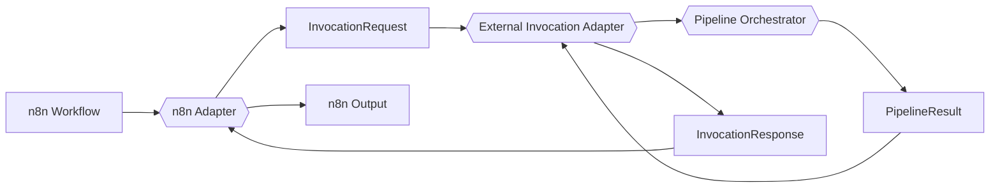

No new schemas, no new public contracts: this milestone's two mapping
functions translate between contracts that already exist
(`invocation-request.schema.json`/`invocation-response.schema.json` from
DC-003-I010) and a plain, camelCase JS object shape n8n itself is
comfortable with — deliberately not a formal schema-backed contract of its
own, since the brief lists no new schema in scope.

### Workflow input (`src/n8n-workflow-mapper.mjs`)

```
{ requestId: string,
  topicPackageFilePath?: string,
  topicPackageData?: object,
  executionOptions?: object,
  correlationMetadata?: object }
```

Flat and camelCase — n8n's own convention — so **no additional
platform-specific information is required from n8n**: a workflow author
never needs to know about `topic_package_reference`'s internal
`file_path`/`data` split, snake_case field names, or any other detail of
this platform's own schemas.

`mapWorkflowInputToInvocationRequest()` is a pure, deterministic function
that translates this shape onto an `InvocationRequest`-shaped object
(snake_case, matching `invocation-request.schema.json`). **It does no
validation of its own** — a missing `requestId`, a `topicPackageFilePath`
*and* `topicPackageData` both present, or neither present, all map through
unchanged (tested directly) — the DC-003-I011 brief's "must not duplicate
platform logic" is honored literally: `invocationAdapter.invoke()`'s own
schema validation (DC-003-I010, unchanged) is what actually rejects a
malformed mapping, exactly as it already does for any other caller.

### n8n Output (`src/n8n-response-mapper.mjs`)

```
{ success: boolean,
  executionId: string | null,
  requestId: string | null,
  status: "completed" | "failed" | "rejected",
  finishedCarousel: object | null,
  warnings: string[],
  error: { code, message, retryable } | null }
```

`mapInvocationResponseToN8nOutput()` is the mirror-image pure function.
**`success` is deliberately not the same as `InvocationResponse.accepted`**:
`accepted` only means the request was well-formed enough to attempt: a
workflow branching on "did this actually work" needs
`status === "completed"` — an accepted-but-failed pipeline run must never
read as success to a downstream n8n node (tested directly, with a response
that's `accepted: true` but `status: "failed"`). `finishedCarousel` and
`error` are passed through unchanged (only the outer key is renamed to
camelCase) — both are already safe, public shapes from lower layers
(DC-003-I007's Finished Carousel Object, DC-003-I010's error mapping), so
no further translation happens at this boundary.
`correlation_metadata` is deliberately dropped — not part of the
documented n8n output contract.

### Adapter service

```
{ invoke(workflowInput, options): Promise<N8nOutput> }
```

One public entry point, responsible only for mapping input, invoking the
Invocation Adapter, and mapping the response — nothing else.
`createN8nAdapter({ invocationAdapter })` is bound to an already-built
External Invocation Adapter (the caller wires up the ledger, orchestrator,
and invocation adapter themselves — this adapter constructs none of
them). `invoke()` never throws to the calling workflow: even a
`workflowInput` so malformed it crashes property access itself (tested
directly, with a getter that throws — `mapWorkflowInputToInvocationRequest()`
is written defensively enough that this is not expected in practice, but
the safety net exists anyway, matching the same "assume nothing" pattern
every adapter boundary in this codebase already applies to itself) still
resolves to a well-formed, safe n8n output object. Errors surfaced this
way reuse `toSafeInvocationError()` from DC-003-I010, unchanged — no new
error-mapping logic was written for this milestone.

### CLI (`tests/validation/n8n-invoke.mjs`, `npm run n8n`)

```bash
npm run n8n -- <workflowInputJsonPath> <ledgerPath>
```

Builds a mock-only `JsonlLedgerStore` + `ExecutionLedger` + Pipeline
Orchestrator + External Invocation Adapter (identical construction to
`invoke.mjs`'s own CLI), wraps it in the n8n Adapter, and invokes it
against one raw workflow-input JSON file — no live provider interaction
anywhere. Demonstrates a successful invocation, invalid input (rejected
by the Invocation Adapter's own validation, not this adapter), and safe
output formatting. Exits `0` only when `success` is `true`.

### Rendering in code

```js
import {
  createJsonlLedgerStore,
  createExecutionLedger,
  createPipelineOrchestrator,
  createExternalInvocationAdapter,
  createN8nAdapter,
} from "./src/index.mjs";

const ledger = createExecutionLedger({ store: createJsonlLedgerStore({ filePath: "./execution.jsonl" }) });
const orchestrator = createPipelineOrchestrator({ ledger });
const invocationAdapter = createExternalInvocationAdapter({ orchestrator });
const n8nAdapter = createN8nAdapter({ invocationAdapter });

const output = await n8nAdapter.invoke({
  requestId: "n8n-exec-04821",
  topicPackageFilePath: "./topic.json",
  correlationMetadata: { workflow_name: "dc-003-daily-carousel" },
});
// output: { success, executionId, requestId, status, finishedCarousel,
//           warnings, error } — plain object, deterministic, no internal
//           platform objects exposed.
```

## Production Workflow (`src/production-workflow.mjs`)

DC-003-I012 is a **demonstration milestone, not a feature-expansion one**:
it composes every layer built in DC-003-I001 through I011 into one
runnable, end-to-end production execution, proving the architecture works
as a cohesive system. **It introduces no new platform logic, no new
orchestration, and no new abstractions** — per the Strategy Office's own
framing, this is composition, not construction. No new error class was
written for this milestone either: `PipelineConfigurationError` and
`toSafeInvocationError()` (both unchanged, from earlier milestones) are
reused as-is.


### What "collecting the InvocationResponse" means here

The workflow calls **only** the n8n Adapter — never the Invocation Adapter
or Pipeline Orchestrator directly, matching the brief's own architecture
diagram exactly. The object `n8nAdapter.invoke()` itself returns (the n8n
Output shape from DC-003-I011: `{ success, executionId, requestId, status,
finishedCarousel, warnings, error }`) is what this milestone treats as
"the completed InvocationResponse" — the workflow deliberately does not
bypass the n8n Adapter to reach the raw `InvocationResponse`'s own
`accepted`/`correlation_metadata` fields, since "the n8n Adapter must not
communicate directly with the Pipeline Orchestrator" extends to every
caller above it, including this workflow.

### Workflow lifecycle

`createProductionWorkflow({ n8nAdapter })` is bound to an already-built
n8n Adapter (the caller — typically a CLI — wires up the ledger,
orchestrator, invocation adapter, and n8n adapter themselves; this module
constructs none of them, matching every other adapter/orchestrator's
dependency-injection pattern already established in this codebase).
`run(workflowInput, options)`:

1. Times its own single call to `n8nAdapter.invoke()` (the workflow's
   *own* measurement of its *own* outermost operation — not platform
   logic, the same pattern DC-003-I009 already uses for per-stage timing
   and DC-003-I010 uses for `PipelineResult.duration`).
2. Invokes the n8n Adapter exactly once.
3. Assembles the workflow's own output and summary around the result.

**Never throws** — even if `n8nAdapter.invoke()` itself throws
unexpectedly (not expected in practice, since DC-003-I011's own adapter is
already a safety net for this, but tested directly, matching the "assume
nothing" discipline every layer in this platform already applies to
itself), `run()` still resolves to a well-formed result.

### Workflow inputs

Identical to the n8n Adapter's own workflow input (DC-003-I011,
unchanged) — this milestone introduces no new input shape:

```
{ requestId: string,
  topicPackageFilePath?: string,
  topicPackageData?: object,
  executionOptions?: object,
  correlationMetadata?: object }
```

**Input validation remains entirely within the platform** — the workflow
does not re-check anything; a malformed input is rejected exactly as it
already would be by the Invocation Adapter's own schema validation, one
call away.

### Workflow outputs

`run()` returns:

```
{ invocationResponse: { success, executionId, requestId, status, finishedCarousel, warnings, error },
  finishedCarousel: object | null,
  executionId: string | null,
  requestId: string | null,
  summary: { status, executionId, requestId, durationMs, completedAt, warningCount, hasError } }
```

`finishedCarousel`/`executionId`/`requestId` are deliberately duplicated
at the top level, alongside `invocationResponse` (where the exact same
values already live nested) — the brief lists all of these as
independent output items, and this small redundancy makes each one
directly accessible to an operator or downstream consumer without needing
to parse into `invocationResponse` first. **No internal platform object**
(`PipelineContext`, a `StageResult`, a raw `ExecutionRecord`) ever appears
in this output — only what the n8n Adapter's own already-public,
already-safe contract already exposes.

`persistWorkflowOutput(outputPath, workflowResult)` writes this result to
disk as pretty-printed JSON — kept as a separate, explicit, side-effect-only
function so `run()` itself stays pure and trivially testable without
touching the filesystem (tested directly: `run()` performs no file I/O of
its own).

### Workflow summary

```
{ status: "completed" | "failed" | "rejected",
  executionId: string | null,
  requestId: string | null,
  durationMs: number,
  completedAt: string,
  warningCount: number,
  hasError: boolean }
```

Intended for workflow operators — a concise, glanceable execution report,
never a substitute for the full `invocationResponse`/`finishedCarousel`
detail alongside it.

### Error handling

Failures never throw to the caller — a rejected request, a failed
pipeline run, or even a genuinely unexpected error from the n8n Adapter
itself all resolve to a well-formed result with `summary.status` reflecting
the outcome accurately. No provider details, credentials, or internal
implementation detail leak through, because none did at any layer beneath
this one — this workflow reuses, verbatim, whatever safe error shape the
n8n Adapter already produced; it invents no new sanitization of its own
(doing so would mean duplicating platform logic, exactly what this
milestone is scoped not to do).

### CLI (`tests/validation/production-workflow.mjs`, `npm run workflow`)

```bash
npm run workflow -- <workflowInputJsonPath> <ledgerPath> <outputJsonPath>
```

Composes the full stack (`JsonlLedgerStore` → `ExecutionLedger` →
`PipelineOrchestrator` → `ExternalInvocationAdapter` → `n8nAdapter` →
`ProductionWorkflow`) — identical construction to every earlier CLI in
this codebase, just one layer higher — runs it once against a workflow
input file, persists the full result to `<outputJsonPath>`, and prints the
workflow summary. Mock-only, no production services, no network. Exits
`0` only when `summary.status` is `"completed"`.

### Rendering in code

```js
import {
  createJsonlLedgerStore,
  createExecutionLedger,
  createPipelineOrchestrator,
  createExternalInvocationAdapter,
  createN8nAdapter,
  createProductionWorkflow,
  persistWorkflowOutput,
} from "./src/index.mjs";

const ledger = createExecutionLedger({ store: createJsonlLedgerStore({ filePath: "./execution.jsonl" }) });
const orchestrator = createPipelineOrchestrator({ ledger });
const invocationAdapter = createExternalInvocationAdapter({ orchestrator });
const n8nAdapter = createN8nAdapter({ invocationAdapter });
const workflow = createProductionWorkflow({ n8nAdapter });

const result = await workflow.run({
  requestId: "n8n-exec-04821",
  topicPackageFilePath: "./topic.json",
});
persistWorkflowOutput("./workflow-output.json", result);
// result.summary: { status, executionId, requestId, durationMs,
//                    completedAt, warningCount, hasError }
```

## n8n Workflow (DC-003-I013)

DC-003-I013 is the platform's first workflow actually built and run inside
a real n8n instance — every earlier milestone up to and including I012 only
ran through this repository's own CLIs. I013 introduces no new platform
logic: it wires a real n8n workflow to invoke I012's CLI
(`tests/validation/production-workflow.mjs`) completely unmodified.

### Invocation mechanism

n8n runs in a separate Docker container (`n8n-test`) from this repository.
For an n8n workflow to invoke this codebase at all, the container needs
both a way to reach the repo's files and a node capable of running a shell
command:

- The repository is **bind-mounted read-only** into the container at
  `/data/dc003-repo` (`-v "<repo path>:/data/dc003-repo:ro"`). n8n cannot
  write to, or modify, the repository through this mount — verified
  directly (`touch` inside the mount fails with "Read-only file system").
- The workflow's **Execute Command** node runs, inside the container:
  ```
  RUN_DIR=/tmp/dc003-run-{{ $now.toFormat('yyyyLLdd-HHmmssSSS') }}
  mkdir -p "$RUN_DIR"
  cat > "$RUN_DIR/input.json" << 'INPUT_EOF'
  {{ JSON.stringify($json) }}
  INPUT_EOF
  cd /data/dc003-repo
  node tests/validation/production-workflow.mjs "$RUN_DIR/input.json" "$RUN_DIR/ledger.jsonl" "$RUN_DIR/output.json" > "$RUN_DIR/run.log" 2>&1 || true
  cat "$RUN_DIR/output.json"
  ```
  Workflow input and run artifacts (ledger, output, log) live under `/tmp`
  inside the container — never inside the read-only repo mount. No
  environment variables are required: the CLI's renderer defaults to the
  mock transport (`src/renderer-transport-mock.mjs`) unless a live
  transport is explicitly configured, which nothing in this workflow does.

### `NODES_EXCLUDE` — scoped, deliberate re-enablement of Execute Command

n8n 2.x disables the Execute Command and Local File Trigger nodes **by
default**, for security (`@n8n/config`'s `NodesConfig.exclude` defaults to
`['n8n-nodes-base.executeCommand', 'n8n-nodes-base.localFileTrigger']`,
documented as an n8n "v2 breaking change"). The `n8n-test` container is
started with:

```
NODES_EXCLUDE=["n8n-nodes-base.localFileTrigger"]
```

This is n8n's own officially documented opt-back-in mechanism (setting
`NODES_EXCLUDE` to any value at all overrides the built-in default list).
The scoping is deliberate: it re-enables **only** Execute Command, and
**keeps Local File Trigger excluded** — the workflow has no use for it, so
there is no reason to widen the re-enablement beyond what I013 actually
needs. No other node-level or instance-level security setting was changed,
and the workflow is not exposed externally — it has no webhook or public
trigger, only a manual trigger.

### What the workflow does

Four nodes, linear chain, manual trigger only — no schedule, no webhook:


1. **Start** — Manual Trigger. The workflow has no automatic trigger of
   any kind.
2. **Build Workflow Input** — Set node (raw JSON) that assembles the same
   `{ requestId, topicPackageData }` shape the n8n Adapter (DC-003-I011)
   already expects, embedding the repository's own approved example topic
   package (`tests/fixtures/topic-package.example.json`) with a
   timestamp-derived `requestId`.
3. **Run I012 Production Workflow (Mock)** — Execute Command, per the
   invocation mechanism above.
4. **Parse Workflow Result** — Set node (raw JSON,
   `JSON.parse($json.stdout)`) that turns the CLI's captured stdout back
   into the same structured `{ invocationResponse, finishedCarousel,
   executionId, requestId, summary }` object I012's `run()` itself returns.

### Verified mock-only execution result

Run manually once the workflow was complete (n8n execution ID `130`):
every node succeeded, `summary.status` was `"completed"`, and a full
6-slide Finished Carousel Object came back with `provider: "mock-transport"`
on every slide, `warningCount: 0`, `hasError: false`. No live Templated
request was made — mock rendering only, matching I012's own CLI default.

### Exported workflow (`workflows/dc003-i013-production-workflow.json`)

A structural export of the live n8n workflow (id `88i2P5SDvRly6SRs`, name
"DC-003 - Production Workflow (Mock, Manual Trigger)"), verified
node-for-node and connection-for-connection identical to the live workflow
at export time. No node in this workflow references any n8n credential —
there is nothing to redact. Re-importing this file into any n8n instance
with the same `NODES_EXCLUDE` configuration and the same repo bind mount
reproduces the workflow exactly.

## Carousel Approval Workflow (`src/carousel-approval.mjs`)

DC-003-I014 implements the `approval` block on the Finished Carousel
Object that `finished-carousel.schema.json` has carried, and
`finished-carousel-builder.mjs` has stubbed to all-defaults, since
DC-003-I007:

```json
"approval": {
  "description": "Reserved for future use — see DC-003-T002 §7."
}
```

This milestone is **pure domain logic only**, per the approved I014
brief — deliberately narrow:

- **No persistent storage.** This module operates on a Finished Carousel
  Object the caller already has in memory (or loads from a file, via the
  CLI below) — exactly like every other stage in this pipeline. There is
  no database, no carousel store, no lookup-by-ID. A caller that needs to
  find a previously generated carousel to approve later must keep track of
  it themselves; that's an explicit non-goal here, not an oversight.
- **No n8n integration.** Nothing in `src/n8n-adapter.mjs` or the
  DC-003-I013 workflow was touched. An n8n-driven approval step (a Form
  Trigger, a human-in-the-loop node) is future integration work, once this
  domain logic exists to call into.
- **No REST/API surface, no authentication.** `approvedBy` is an opaque,
  unverified string — this module trusts whatever identity string it's
  given, matching the "no auth anywhere yet" status of every other module
  in this codebase.
- **No notifications.**
- **The Execution Ledger (DC-003-I008) is deliberately untouched.**
  Approval is intentionally a separate lifecycle from pipeline execution,
  not an extension of it — no new ledger event types were added, no
  existing ledger code was modified.

### The three transitions

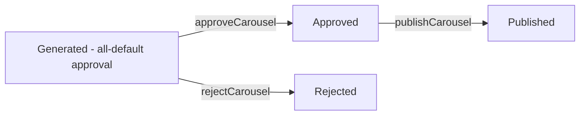

- **`approveCarousel({ finishedCarousel, approvedBy })`** — sets
  `approval.approved: true`, `approved_by`, `approved_at`. Illegal (throws
  `InvalidApprovalTransitionError`) if the carousel is already approved or
  already rejected, or if `approvedBy` is missing/blank.
- **`rejectCarousel({ finishedCarousel, reason })`** — sets
  `approval.rejected: true`, `rejection_reason`. Illegal if the carousel is
  already rejected, already approved, or already published, or if `reason`
  is missing/blank. There is no `rejected_by` field in
  `finished-carousel.schema.json`, so this function accepts no
  reviewer-identity argument — there is nowhere valid in the public
  contract to put one.
- **`publishCarousel({ finishedCarousel })`** — sets
  `approval.published: true`, `published_at`. Illegal unless the carousel
  is currently approved, or if it's rejected, or if it's already
  published. Likewise no `published_by` field exists, so no identity
  argument is accepted.

**No "reset"/"un-approve"/"un-reject" transition exists.** This was an
open question in the I014 brief and was deliberately left out of this
milestone — a wrong decision is not silently overwritten; correcting one
requires a new Finished Carousel Object from a fresh pipeline run, not a
mutation of the rejected/approved one.

### Immutability

Every transition returns a **new**, independently deep-frozen Finished
Carousel Object (`deepFreezeClone`, the same helper every other stage in
this codebase uses) — the input object is never mutated, and the returned
object rejects any attempted mutation at every level (top-level fields,
the `approval` block, `slides`, and each individual slide). Every
transition's output is re-validated against
`finished-carousel.schema.json` before being returned; a transition that
somehow produces a schema-invalid object throws
`CarouselApprovalValidationError` rather than returning something
malformed.

### CLI (`tests/validation/approve-carousel.mjs`, `npm run approve`)

```bash
npm run approve -- <finishedCarouselJsonPath> approve --by=<name> [--out=<path>]
npm run approve -- <finishedCarouselJsonPath> reject --reason=<text> [--out=<path>]
npm run approve -- <finishedCarouselJsonPath> publish [--out=<path>]
```

Applies one decision to one Finished Carousel JSON file and prints the
resulting `approval` block. Without `--out`, no file is written anywhere
— matching every other demonstration CLI in this codebase that doesn't
persist by default (`build-finished-carousel.mjs`, `render-payload.mjs`).
When `--out` is given, the updated object is written there as
pretty-printed JSON, purely as a convenience for chaining decisions (e.g.
approve, then publish the result) — this is not a persistence layer; the
caller chooses the path, and nothing about this module tracks or looks up
files on its own.

### Rendering in code

```js
import { approveCarousel, rejectCarousel, publishCarousel } from "./src/index.mjs";

const approved = approveCarousel({
  finishedCarousel,
  approvedBy: "chris@digitallyconnected.net",
});
const published = publishCarousel({ finishedCarousel: approved });
// published.approval: { approved: true, approved_by, approved_at,
//                        rejected: false, rejection_reason: null,
//                        published: true, published_at }
```

## Finished Carousel Store

DC-003-I015 is this pipeline's first persistence layer. Before this
milestone, a generated (or approved) Finished Carousel only ever existed
as whatever transient file a CLI happened to write to — `npm run
build:carousel` doesn't write anything at all, `npm run workflow`/`npm run
approve` only write where the caller explicitly points `--out`/an output
path. I015 gives Finished Carousel Objects somewhere reliable to live
between "generated" and "approved" and "published."

### Architecture


Two layers, mirroring DC-003-I008's Execution Ledger / Ledger Store split
exactly:

- **`src/finished-carousel-store.mjs`** — the domain layer. Owns every
  business rule: schema validation on both write and read, duplicate
  rejection, identifier-format safety, immutability, summary derivation.
  **Never imports `node:fs`.** It only ever calls an injected Storage
  Adapter.
- **`src/finished-carousel-store-adapter.mjs`** — the adapter contract:
  any object shaped `{ name, write(identifier, content), read(identifier),
  list(), exists(identifier) }`, plus `assertValidCarouselStoreAdapter()`
  so a malformed adapter fails immediately, not at the first `save()`.
- **`src/local-json-carousel-store-adapter.mjs`** — the one adapter this
  milestone ships: one JSON file per carousel, at
  `<storageDir>/<carousel_id>.json`. A future adapter (SQLite, cloud
  storage) plugs in by implementing the same shape — no change to
  `finished-carousel-store.mjs`.

The canonical identifier is `carousel_id`
(`finished-carousel.schema.json`'s own `^car_[A-Za-z0-9]+$` field, already
generated by `finished-carousel-builder.mjs` since DC-003-I007) — no
second identifier was invented for this milestone, per the I015 brief's
repository-evidence rule.

### Store interface

```
save(finishedCarousel)               — persist a new, validated carousel
get(identifier)                      — retrieve one, by carousel_id
list()                               — safe summaries of every stored carousel
replace({ identifier, finishedCarousel }) — update an existing stored carousel
exists(identifier)                   — true/false, no read
```

**`save()`** validates the object against `finished-carousel.schema.json`,
never mutates the caller's object, and throws `CarouselAlreadyExistsError`
if a record already exists for that `carousel_id` — it never silently
overwrites. Returns an immutable, deep-frozen copy of exactly what was
stored.

**`get()`** parses and validates the stored JSON before ever returning
it — a corrupted or schema-invalid stored file is never silently
accepted; it throws `CorruptedCarouselError` instead. Throws
`CarouselNotFoundError` for an identifier with no stored record. Returns
an immutable, deep-frozen object.

**`list()`** returns safe summaries — `{ carousel_id, execution_id,
topic_id, generated_at, overall_status, slide_count, approved, rejected,
published }` — never full platform internals (`slides`,
`execution_metadata`). Ordered deterministically by `carousel_id`
ascending, since directory-listing order isn't guaranteed across
platforms or filesystems. Validates every entry exactly as `get()` does —
a single corrupted stored file fails the whole `list()` call, naming which
identifier is corrupted, rather than silently skipping it.

**`replace()`** is how a later DC-003-I014 approval/rejection/publication
transition actually gets persisted — this store implements **no approval
logic of its own**; it only ever persists whatever `approval` block the
supplied object already carries. Legal only when: a record already exists
for the target `identifier`; the supplied object's own `carousel_id`
equals that `identifier` (otherwise `CarouselIdentifierMismatchError` —
the defensive check against replacing the wrong record); the supplied
object validates against the schema.

**`exists()`** is a plain existence check — no read, no parse, no
validation.

### Atomicity


`local-json-carousel-store-adapter.mjs`'s `write()` writes to a temporary
file in the same storage directory, reads it back to confirm the write
round-tripped intact, then `renameSync`s it into its final location. A
same-directory rename is atomic on both POSIX filesystems and Windows
NTFS — the real path either doesn't exist yet, or exists complete; there
is no window where a reader observes a partial file at the real path. A
failed round-trip check deletes the temp file and never touches the real
path, so a partial or truncated write can never replace a previously
valid stored carousel.

### Security

- **Path traversal is blocked by construction, not denylist.** Every
  identifier passed to `get()`/`exists()`/`replace()` is checked against
  the schema's own `^car_[A-Za-z0-9]+$` pattern before the domain layer
  ever calls into the adapter — no `/`, `\`, `.`, or whitespace can ever
  pass, which is what actually rules out `../../etc/passwd`-style inputs
  and absolute paths, not a list of "known-bad" substrings.
  `save()`/`replace()` inputs are additionally schema-validated, which
  independently enforces the same pattern on `carousel_id` itself.
- **No host paths, no raw Node error messages, and no stack traces ever
  reach an external-facing error message.** A raw adapter/filesystem
  failure (permissions, disk full, an interrupted verification) is caught
  and re-thrown as `CarouselPersistenceError`, naming only the carousel
  identifier — the original error is attached as `.cause` for local
  debugging only, never interpolated into `.message`.
- **Corruption is never silently accepted.** Every stored file is parsed
  and schema-validated on every read (`get()` and `list()` alike).

### Error model (`src/finished-carousel-store-errors.mjs`)

`InvalidCarouselStoreAdapterError`, `InvalidFinishedCarouselError` (schema
validation failure on `save()`/`replace()` input), `InvalidCarouselIdentifierError`
(malformed/path-traversal identifier), `CarouselAlreadyExistsError`,
`CarouselNotFoundError`, `CarouselIdentifierMismatchError`,
`CorruptedCarouselError` (a stored file fails to parse or fails schema
validation), `CarouselPersistenceError` (a genuine adapter I/O failure).

### CLI (`tests/validation/carousel-store.mjs`, `npm run store`)

```bash
npm run store -- save <finishedCarouselPath> <storeDirectory>
npm run store -- get <identifier> <storeDirectory>
npm run store -- list <storeDirectory>
npm run store -- replace <finishedCarouselPath> <storeDirectory>
```

`storeDirectory` is always an explicit argument — this CLI, and
`local-json-carousel-store-adapter.mjs` beneath it, never hardcode a
machine-specific path or read one from an environment variable. `replace`
takes a file path (like `save`) rather than a separate identifier
argument; the CLI derives the target identifier from the loaded object's
own `carousel_id`, so the two can never disagree through this CLI — the
`CarouselIdentifierMismatchError` guard exists for programmatic callers of
`finished-carousel-store.mjs` directly, where a caller could legitimately
supply a target identifier from one source and an object from another.

### Relationship to DC-003-I014

I014 and I015 compose directly: approve/reject/publish a carousel with
`npm run approve -- <path> <decision> --out=<path>`, then persist that
transition with `npm run store -- replace <path> <storeDirectory>`. I015
never calls into `carousel-approval.mjs`, and I014 never calls into this
store — the two milestones only ever meet through the Finished Carousel
Object itself, exactly as the I015 brief requires ("Do not implement
approval logic inside the store").

### Rendering in code

```js
import { createLocalJsonCarouselStoreAdapter, createFinishedCarouselStore } from "./src/index.mjs";

const adapter = createLocalJsonCarouselStoreAdapter({ storageDir: "./output/finished-carousels" });
const store = createFinishedCarouselStore({ adapter });

const stored = store.save(finishedCarousel);
const found = store.get(stored.carousel_id);
const summaries = store.list();
// summaries[0]: { carousel_id, execution_id, topic_id, generated_at,
//                 overall_status, slide_count, approved, rejected, published }
```

## Content Request Command

DC-003-I016 is the platform's first user-facing command — everything
before it was a `src/` module or a demonstration CLI aimed at a
developer, not a request shaped the way an actual operator would type
one. I016 introduces no new generation, orchestration, rendering,
approval, or persistence logic: it composes DC-003-I003's
`loadTopicPackage()`, DC-003-I012's unmodified Production Workflow, and
DC-003-I015's unmodified Finished Carousel Store into one narrow,
deterministic command.

### Architecture

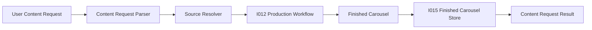

### Supported command syntax

I016 supports exactly one deterministic request shape — deliberately not
general-purpose natural-language understanding:

```
Create 6 designs based on article GS01
```

Conceptually: `{ action: "create", designCount: 6, sourceType: "article",
sourceReference: "GS01" }`. `parseContentRequestCommand()`
(`src/content-request-parser.mjs`) is case-insensitive on the command's
own words but captures the source reference verbatim (`"GS01"`, not
`"gs01"`). Any other phrasing — reordered words, a different verb, a
missing design count, a source type other than `article` — is rejected
as `AmbiguousContentRequestError` rather than guessed at. `executeContentRequest()`
also accepts an already-structured request object directly (the same
shape the parser produces), bypassing the parser entirely — useful for a
future caller that already has structured input (a form, an API) rather
than a raw string.

### The six-design constraint

`design_count = 6` is the only value `content-request.schema.json`'s own
enum allows, and `executeContentRequest()` checks it explicitly before
that schema is ever consulted, throwing the more specific
`UnsupportedDesignCountError` — matching this platform's fixed six-slide
carousel contract (`config/constants.json`'s `slide_count`) end to end.
An unsupported count is rejected outright; nothing is truncated,
duplicated, or reshaped to fit.

### Source resolution

**Superseded by DC-003-I018 — see "Content Asset Repository" below.**
Source resolution originally worked by scanning a directory of Topic
Package files for one matching `backlog_reference_id` (`resolveSource()`
in a now-deleted `src/content-request-source-resolver.mjs`, backed by a
test-only fixture directory). DC-003-I018 replaced that fixture-backed
mechanism entirely with a real, repository-owned, version-controlled
Content Asset Repository — `GS01` now resolves through
`content-assets/GS01.json`, an asset_id lookup, not a directory scan.
`UnknownSourceReferenceError`/`SourceResolutionError` are unchanged; the
command syntax, the CLI, and DC-003-I017's n8n workflow all needed zero
changes. See "Content Asset Repository" for the full detail.

### The service (`src/content-request-service.mjs`)

`executeContentRequest(request, dependencies)`:

1. Validate the request (parse if a string; six-design check;
   schema-backstop validation) — **throws immediately** on failure
   (`AmbiguousContentRequestError`, `UnsupportedDesignCountError`,
   `ContentRequestValidationError`). These are caller/input problems,
   rejected before anything downstream ever runs.
2. Resolve the source.
3. Map the request onto DC-003-I012's own workflow input shape
   (`{ requestId, topicPackageData }` — the Content Request's own
   `request_id` becomes the workflow's `requestId`, so one identifier
   flows through the whole execution end to end).
4. Invoke the Production Workflow.
5. Confirm a completed, successful result.
6. Persist the Finished Carousel via the Finished Carousel Store — only
   after a confirmed successful completion; never for a partial or failed
   one.
7. Return a safe Content Request Result.

**From step 2 onward, this function never throws** — matching DC-003-I012's
own Production Workflow "never throws" contract exactly. An unknown
source, a production failure, a persistence failure, or a duplicate
carousel all resolve to a Content Request Result with `success: false`
and a safe `error`, never an uncaught exception.

`dependencies.productionWorkflow` and `dependencies.carouselStore` are
both required, already-constructed objects (the return values of
DC-003-I012's `createProductionWorkflow()` and DC-003-I015's
`createFinishedCarouselStore()`) — this service never builds the
ledger/orchestrator/adapter stack beneath the former, or the
adapter beneath the latter, itself; the caller wires up the real thing,
exactly like every CLI in this repository already does for its own
layer. `dependencies.now`/`dependencies.idGenerator` are both injectable,
for deterministic tests — request identity (see below) never depends on
real wall-clock time or randomness in a test.

### Request identity

The Content Request's own `request_id` (`req_<random>`, generated
independently by `createContentRequest()`) is never the same value as
`executionId`, `carouselId`, or `sourceReference` — three entirely
separate identifier namespaces, generated by three entirely separate
mechanisms. (It *does* deliberately become the Production Workflow's own
`requestId` — that's the same identifier flowing through one execution,
not the "reuse" the brief prohibits.)

### Content Request Result

```
{ success: boolean,
  requestId: string,
  sourceReference: string,
  executionId: string | null,
  carouselId: string | null,
  status: "completed" | "failed" | "rejected",
  stored: boolean,
  storeReference: string | null,
  warnings: string[],
  error: { code, message } | null }
```

`success` is `true` only when production completed **and** the result
was actually stored — a caller checking one field gets the honest,
complete picture. `storeReference` is never a filesystem path — it's
`${carouselStore.name}:${carouselId}` (e.g.
`"local-json-carousel-store:car_abc123"`), built from the Storage
Adapter's own name (DC-003-I015 was extended, backward-compatibly, to
expose it) rather than any host path. Nothing internal ever appears here:
no `PipelineContext`, no raw provider response, no credential, no stack
trace, no host filesystem path — every `error` is a plain `{ code,
message }`, sourced from error shapes that were already safe at the
layer that produced them (DC-003-I010's `toSafeInvocationError()`,
DC-003-I015's own already-path-free error messages).

### Persistence behaviour

On a successful, completed production execution, `save()` (DC-003-I015,
unchanged) is called exactly once. If a record already exists for that
`carousel_id` — genuinely rare in practice, since DC-003-I007's builder
assigns a fresh random `carousel_id` on every real run, but defended
against anyway — `save()`'s own `CarouselAlreadyExistsError` is mapped to
`DuplicateStoredCarouselError`; the request reports `stored: false` and
`success: false`, but `executionId`/`carouselId`/`status` still reflect
that production genuinely completed. **A failed or rejected production
execution never reaches `save()` at all** — nothing is ever persisted for
a partial or failed carousel.

### CLI (`tests/validation/content-request.mjs`, `npm run content:request`)

```bash
npm run content:request -- "Create 6 designs based on article GS01" <storeDirectory> [contentAssetsDir] [--json]
```

`storeDirectory` is required, exactly like `npm run store`.
`contentAssetsDir` is optional, defaulting to the repository's own
`content-assets/` directory (was `topicPackagesDir`, defaulting to a test
fixture directory, before DC-003-I018 — see "Content Asset Repository"
below). The CLI builds the same
ledger→orchestrator→invocation-adapter→n8n-adapter→production-workflow
stack every other production-path CLI in this repository already builds,
using an in-memory Ledger Store scoped to that one invocation (the
Execution Ledger's durable audit trail is a separate DC-003-I008 concern
this narrow command doesn't expose or manage). No live Templated call —
mock rendering only, the same default every other CLI in this codebase
uses.

**`--json`** (added in DC-003-I017, order-independent among the CLI's
arguments): prints exactly one line — the Content Request Result as
JSON — instead of the default human-readable summary, for both a normal
result and a thrown request-validation error (unified into the same
result shape). Calls no different code path; a pure stdout-formatting
choice for a downstream parser, first needed by the DC-003-I017 n8n
workflow's own `JSON.parse($json.stdout)` step — see "n8n Content
Request Workflow (DC-003-I017)" below. The default (no `--json`) mode is
completely unchanged from DC-003-I016.

### Current limitations

- No general-purpose natural-language understanding — one command shape
  only.
- No multiple request types, batch requests, or scheduling.
- No publishing or approval UI — DC-003-I014's approve/reject/publish
  functions exist and are reachable separately, but this command doesn't
  call them.
- No REST API, no authentication, no n8n workflow changes, no article
  authoring/ingestion tooling.
- No real LLM-provider integration or live Templated rendering — mock
  only, matching every prior milestone's own default.
- No duplicate-overwrite or versioning — a genuine duplicate is rejected,
  never silently replaced.
- **No real article/source registry** — `GS01` is a fixture stand-in; see
  "Source resolution" above.

## n8n Content Request Workflow (DC-003-I017)

DC-003-I017 is the operational bridge between a simple operator command
and the complete DC-003 platform, running inside the same real n8n
instance DC-003-I013 first connected. It does not modify or replace the
I013 workflow — both exist independently side by side. The workflow does
only three things: **accept the command, invoke I016, report the
result.** No parsing, source resolution, generation, rendering, or
persistence logic is duplicated inside n8n — every one of those stays
owned by the existing platform (I003, I006, I007, I012, I015, I016).

### Architecture

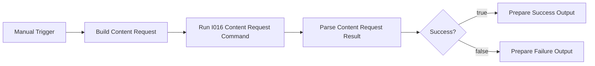

### Command input

```json
{ "command": "Create 6 designs based on article GS01" }
```

Built once, by the **Build Content Request** node, and passed unchanged
into DC-003-I016 — n8n performs no validation of its own on the command
string; that's entirely I016's job (`parseContentRequestCommand()`,
`UnsupportedDesignCountError`, etc.), reused exactly as-is.

### I016 invocation mechanism

The **Run I016 Content Request Command** node is an Execute Command node
(the same node type, and the same overall pattern, DC-003-I013 already
proved out — see "n8n Workflow (DC-003-I013)" above for why it's
available at all: `NODES_EXCLUDE=["n8n-nodes-base.localFileTrigger"]` on
the `n8n-test` container, deliberately scoped to leave Execute Command
enabled). It runs, inside the container:

```
RUN_DIR=/tmp/dc003-i017-run-{{ $now.toFormat('yyyyLLdd-HHmmssSSS') }}
mkdir -p "$RUN_DIR"
cat > "$RUN_DIR/command.txt" << 'COMMAND_EOF'
{{ $json.command }}
COMMAND_EOF
STORE_DIR=/home/node/.n8n/dc003/finished-carousels
mkdir -p "$STORE_DIR"
cd /data/dc003-repo
COMMAND_TEXT=$(cat "$RUN_DIR/command.txt")
node tests/validation/content-request.mjs "$COMMAND_TEXT" "$STORE_DIR" --json > "$RUN_DIR/output.json" 2> "$RUN_DIR/run.log" || true
cat "$RUN_DIR/output.json"
```

`/tmp/dc003-i017-run-*` is used only for the transient per-execution
command/output/log files — never for anything the platform needs to keep.
stdout and stderr are captured to separate files and only stdout is ever
`cat`'d back to n8n, so nothing on stderr (including an unexpected raw
error) can leak into the workflow's own data. `$RUN_DIR` and its contents
are not cleaned up automatically (mirroring DC-003-I013's own CLI
invocation pattern) — they're ordinary container-local `/tmp` files, not
part of any persisted store.

**`--json` — a small, additive DC-003-I016 CLI change made for this
milestone.** The CLI's existing human-readable summary mode is
unchanged and still the default; `--json` (order-independent among the
CLI's arguments) makes it print exactly one line — the Content Request
Result as JSON — for both a normal result and a thrown request-validation
error (unified into the same result shape, `success: false`, `status:
"rejected"`, `error: { code, message }`). This calls no different code
path inside `executeContentRequest()` itself — it's a stdout-formatting
choice only, so the workflow's own **Parse Content Request Result** node
can `JSON.parse($json.stdout)` reliably regardless of which failure mode
occurred, the same convention DC-003-I013 already established for I012's
own CLI.

### Persistent store location

```
/home/node/.n8n/dc003/finished-carousels/
```

Confirmed via container evidence before implementation: this path is
inside the `n8n_data` named volume (mounted read-write at
`/home/node/.n8n`, the same volume the n8n installation's own SQLite
database already lives in and has already survived every prior container
recreation), outside the read-only DC-003 repo mount at
`/data/dc003-repo`, and owned/writable by the container's own `node`
user — verified directly with a live write test before this milestone's
implementation began. It contains only DC-003-I015 Finished Carousel
Store data (one JSON file per `carousel_id`) and is never committed to
Git — it exists only inside the Docker volume, not in this repository.

### Success and failure outputs

Success (`Prepare Success Output`):

```json
{
  "success": true,
  "status": "completed",
  "requestId": "req_...",
  "sourceReference": "GS01",
  "executionId": "exec_...",
  "carouselId": "car_...",
  "stored": true,
  "storeReference": "local-json-carousel-store:car_...",
  "warnings": [],
  "message": "Six-design carousel generated and stored successfully."
}
```

Failure (`Prepare Failure Output`) — deliberately narrower, per the
approved brief:

```json
{
  "success": false,
  "status": "rejected",
  "requestId": "req_...",
  "sourceReference": "DOES_NOT_EXIST",
  "error": { "code": "UnknownSourceReferenceError", "message": "..." },
  "warnings": []
}
```

Both are built with a single `{{ {...} }}` expression referencing only
named upstream fields — never the raw stdout, never a raw Node error
object, never a host path. Nothing internal reaches either output:
`executionId`/`carouselId`/`stored`/`storeReference` are deliberately
absent from the failure shape, matching the brief's own field-by-field
whitelist rather than a general "trim what looks sensitive" pass.

### Manual execution

Open the workflow in n8n and click **Execute Workflow** (or use
`execute_workflow` via the n8n MCP tools). The workflow has no trigger
other than the Manual Trigger — no schedule, webhook, or form exists, and
none should be added; it stays inactive except when manually run.

### Mock-only status

No live Templated call is possible: the invoked CLI (`content-request.mjs`
→ `executeContentRequest()` → DC-003-I012's Production Workflow) has no
`--live` mode and needs no `TEMPLATED_API_KEY` — mock rendering is the
only path, exactly as it already was for DC-003-I013 and every CLI in
this repository.

### GS01 fixture limitation

Unchanged from DC-003-I016: `GS01` resolves only against the approved
fixture Topic Package at
`tests/fixtures/topic-packages/backlog-gs01.approved.json` — not a real
article source. **I017 proves the operational command path end to end
through a real n8n instance; it does not implement article ingestion or
replace the fixture with production content.** A real article/source
registry remains an open operational dependency (see "Content Request
Command — current limitations" above).

### Security

- Execute Command's shell script never echoes an environment variable,
  never accepts external/network input, and reads no credential — the
  invoked CLI needs none.
- `/tmp/dc003-i017-run-*` and the persistent store are both inside the
  container only — neither is ever committed to Git, and the persistent
  store is outside the read-only repo mount so nothing running inside it
  can ever modify repository source.
- stderr is captured separately from stdout and never reaches the
  workflow's own parsed data, closing off the one path a raw stack trace
  or host path could otherwise leak through.
- The workflow remains manual-trigger-only, synchronous, one request per
  execution — no schedule, webhook, form, or other autonomous trigger
  exists.

## Content Asset Repository

DC-003-I018 replaces DC-003-I016's original temporary fixture-directory
resolver with a real, repository-owned, version-controlled Content Asset
Repository. This becomes the authoritative source for every future
production request — not an article system, and not a Topic Package
registry; it deliberately stores **Content Assets**, per the approved
brief's own framing.

### Architecture


### The Content Asset concept

A Content Asset is the canonical, approved source material for
downstream production — deliberately **not** a Finished Carousel, an
Article, a Topic Package, or an LLM prompt on its own. It's the envelope
a Topic Package is embedded within, retrievable by `asset_id`.

`schemas/content-asset.schema.json` is intentionally small:

```
{ asset_id, title, summary, topic_package, status, created_at, metadata }
```

No rendered slides, approval history, persistence metadata, or provider
outputs — those all belong to later stages this repository has no
knowledge of. `topic_package` is a full Topic Package object, validated
separately against `topic-package.schema.json` (not re-specified inside
`content-asset.schema.json`, matching this codebase's existing "don't
duplicate one schema inside another" convention — see "Schemas" above).
`asset_id` is **human-assigned, not machine-generated** — unlike every
other DC-003 identifier (`topic_`/`car_`/`exec_`/`req_`/...), a Content
Asset's ID has no prefix convention (`GS01`, not `asset_GS01`), since
assets are curated by hand (or a future ingestion pipeline), not
generated at runtime by this pipeline.

### Repository layout

```
content-assets/
    GS01.json
```

Repository-owned, version-controlled, human-readable — one file per
asset, at `content-assets/<asset_id>.json`. The filename **is** the
identifier; there is no separate ID-to-file mapping, no second registry.

### Resolver (`src/content-asset-repository.mjs`, `src/content-asset-resolver.mjs`)

Two small modules, deliberately **not** a full adapter-abstraction layer
like DC-003-I008's Ledger Store or DC-003-I015's Finished Carousel
Store — the approved brief's own "repository remains simple" review
criterion, and this repository has no write path in this milestone's
scope to make an adapter abstraction worth the complexity:

- **`content-asset-repository.mjs`** — `createContentAssetRepository({
  assetsDir })` → `{ get, list, exists }`. `get(assetId)` loads by ID,
  validates the envelope against `content-asset.schema.json` **and** the
  embedded `topic_package` against `topic-package.schema.json`, verifies
  the stored `asset_id` matches the requested one, and returns an
  immutable object — or fails explicitly (never guesses) with one of five
  structured errors. `list()` returns every asset ordered deterministically
  by `asset_id`, detecting genuine cross-file ID collisions along the way
  (see "a real design correction" below). Reads `node:fs` directly — see
  the module's own header comment for why that's the right call here,
  not a contradiction of DC-003-I008/I015's own adapter pattern.
- **`content-asset-resolver.mjs`** — `resolveContentAsset({ sourceType,
  sourceReference }, { contentAssetsDir })` bridges the repository to the
  *exact* resolution contract DC-003-I016's Content Request Service
  already depended on: given a source reference, return a validated
  Topic Package. Every repository error is mapped onto DC-003-I016's own
  `UnknownSourceReferenceError`/`SourceResolutionError` — unchanged —  so
  `content-request-service.mjs` (and everything downstream, including
  DC-003-I017's n8n workflow) needed zero changes to their own error
  handling, only a renamed dependency (`contentAssetsDir`, was
  `topicPackagesDir`).

**A real design correction, found by the milestone's own tests, not
assumed correct:** an early version of `get()` enforced that a stored
asset's own `asset_id` field always matched its filename — which, on
reflection, made `DuplicateContentAssetIdError` structurally
unreachable: two files can never share a filename in one directory, so if
filename must always match content, two different files can never
declare the same `asset_id` either. Fixed by splitting the check:
`get()` (a targeted, identity-verified single lookup) still enforces the
match; `list()` (a whole-repository integrity scan) trusts each file's
own internal `asset_id` instead, so a genuine cross-file collision — the
scenario duplicate detection actually exists to catch — is now reachable
and tested.

### CLI (`tests/validation/content-asset.mjs`, `npm run content-asset`)

```bash
npm run content-asset -- get <assetId> [assetsDir]
npm run content-asset -- list [assetsDir]
npm run content-asset -- validate <assetId> [assetsDir]
```

`assetsDir` is optional on every subcommand, defaulting to the
repository's own `content-assets/` — the only CLI in this codebase whose
primary storage location needs no explicit argument at all, since (unlike
`npm run store`'s caller-chosen storage directory) there is exactly one
canonical Content Asset Repository. Pass an explicit trailing argument to
point at a different directory (used by this CLI's own tests).

### Relationship to DC-003-I016 / DC-003-I017

Both continue to work completely unchanged at the observable level. The
command `Create 6 designs based on article GS01` still resolves, still
produces exactly six mock-rendered slides, still persists through
DC-003-I015 — internally, `GS01` now resolves through the Content Asset
Repository instead of a fixture directory. Verified directly: DC-003-I017's
own n8n workflow (`00Qh0qFIzE5swDUP`) was executed again, completely
unmodified, after this milestone landed, and completed successfully
(execution `133`), resolving through the new repository with zero
workflow changes.

### Current limitation

`content-assets/GS01.json` represents the same approved fixture Topic
Package DC-003-I016 originally stood in with — **it is not a real
article/source asset.** DC-003-I018 establishes the permanent structure
future milestones (including the planned DC-004 Content Authoring
Engine) will populate with real assets; it does not itself implement
article generation, ingestion, or editing. Everything downstream should
consume Content Assets from this repository, never a temporary fixture
or a generated article, from this milestone forward.

## Real LLM Provider Integration (DC-003-I019)

Replaces the mock carousel-copy generator with one real LLM provider —
Anthropic, via its Messages API — behind the exact same provider
abstraction DC-003-I004 already established (`{ name,
generateCarousel(prompt, context): Promise<string> }`). Nothing about the
Prompt Builder, the Carousel Content Validator, the retry primitive, the
Pipeline Orchestrator, the Invocation Adapter, the n8n Adapter, the
Content Request Command, or the Content Asset Repository changed to make
this possible — confirmed during this milestone's own pre-flight
inspection (`pipeline-stages.mjs` already read
`context.configuration?.provider ?? createMockProvider()`, so no
incompatibility existed to report). **Rendering remains mock-only in
I019** — see "Relationship to I016/I017" below.

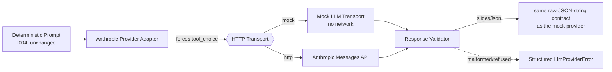

### Provider selection

Anthropic only — no OpenAI, no local model, no automatic fallback or
routing, per the approved brief. Chosen as the provider "already available
locally and easiest to verify safely through environment variables" (I019
pre-flight item 5); no live credential was found configured in this
environment at implementation time (checked for a `.env` file and for
`LLM_API_KEY`/`ANTHROPIC_API_KEY`/`OPENAI_API_KEY` in the shell — none
were set), so the mock provider remains what every automated path uses
until a credential is supplied and fresh live-verification approval is
given (see "Live Verification Gate" below).

### Configuration (`src/llm-provider-config.mjs`)

Generic `LLM_*` names, matching the repository's own established
convention — `config/env.example` already reserved `LLM_API_KEY`/
`LLM_MODEL` before this milestone existed, so I019 continues that rather
than switching to `ANTHROPIC_*`-prefixed names:

| Variable | Default | Purpose |
|---|---|---|
| `LLM_PROVIDER` | `anthropic` | Which provider this configuration describes — informational; only one provider is wired up in I019 |
| `LLM_API_KEY` | *(none)* | Anthropic API key — never committed; `config/env.example` ships it blank |
| `LLM_MODEL` | `claude-sonnet-5` | The exact model identifier, pinned through configuration, never hardcoded in the adapter |
| `LLM_API_BASE_URL` | `https://api.anthropic.com/v1` | Anthropic's API base — configurable so a stale default never requires a code change |
| `LLM_REQUEST_TIMEOUT_MS` | `15000` | Per-request timeout for the HTTP transport |
| `LLM_MAX_ATTEMPTS` | `3` | Retry ceiling for production use — see "Retry classification" below |

The adapter itself (`llm-provider-anthropic.mjs`) never reads this module
— it only ever receives `{ transport, model, temperature, maxTokens,
timeoutMs }` via explicit construction fields, and has no knowledge that
an API key or base URL exist at all. Only a CLI (or whoever constructs the
HTTP transport) reads `loadLlmProviderConfig()`.

### Transport abstraction (`src/llm-transport-mock.mjs`, `src/llm-transport-http.mjs`)

Same shape and same "no implicit default" discipline DC-003-I006
established for the renderer: `{ name, send(request, { timeoutMs }) }`,
and every caller must explicitly choose one.

- **`createMockLlmTransport()`** — the *only* transport automated tests
  use. Deterministic, no network, configurable via `options.mode` to
  simulate every failure case the adapter needs to handle (`timeout`,
  `transport-error`, `auth-error`, `rate-limit`, `malformed`, `refused`,
  `wrong-tool`), plus `options.failuresBeforeSuccess` for retry-success
  tests. Returns the same raw Anthropic Messages API response shape (a
  `tool_use` content block) the real transport would, so it exercises the
  response-validation boundary the same way.
- **`createHttpTransport(config)`** (aliased `createLlmHttpTransport` from
  `src/index.mjs`, to avoid colliding with the renderer's own
  `createHttpTransport` export) — the real Anthropic integration, using
  Node's built-in `fetch` (no new dependency, same choice DC-003-I006 made
  for Templated). Endpoint (`POST
  https://api.anthropic.com/v1/messages`), headers (`x-api-key`,
  `anthropic-version: 2023-06-01`), and the tool-use mechanism for forcing
  structured output are per Anthropic's published Messages API
  documentation. Not yet exercised against a live request — that requires
  fresh Strategy Office + CEO approval per the Live Verification Gate
  below, and is deliberately not part of this milestone's automated
  implementation.

### Structured output, not prose-embedded JSON

The request forces exactly one tool call via `tool_choice: { type: "tool",
name: "return_carousel_slides" }`, so the response's `content` contains a
`tool_use` block whose `input` is already a parsed JSON object — never
free-form text requiring a find-the-JSON-in-prose parse, per the brief's
explicit preference. `TOOL_INPUT_SCHEMA` (`llm-transport-http.mjs`) is
deliberately minimal — an array of exactly 6 `{ slide_type, content }`
objects, `content` left untyped — mirroring this codebase's own existing
simplification (`schemas/carousel-content.schema.json` also types
`content` generically). Precise per-slide-type field validation still
happens afterward, unchanged, in `carousel-content-shape.mjs` — this
schema's only job is forcing roughly-shaped JSON out of the model, not
re-implementing that validation a second time.

`validateLlmTransportResponse()` (`llm-response-validator.mjs`) is the one
normalization boundary every response — mock or real — must cross before
the domain layer ever sees it: checks the response is an object, checks
`stop_reason` isn't `"refusal"` (a content-policy decline, surfaced as
`LlmProviderRejectedError`), checks `content` is an array containing a
`tool_use` block whose `name` matches the tool that was forced, and checks
that block's `input` is a JSON object — then re-serializes it
(`JSON.stringify()`) into a raw string so `generateCarousel()`'s return
value matches `createMockProvider()`'s own contract exactly (a raw JSON
string, never a pre-parsed object). Every shape mismatch throws
`LlmMalformedResponseError` with safe, type-level diagnostics
(`field`/`expected`/`received`) — never the raw response body, never the
actual value of a mismatched field.

### Error hierarchy (`src/llm-provider-errors.mjs`)

Mirrors the renderer's error hierarchy exactly — every error extends
`LlmProviderError` and carries a `.retryable` boolean:

| Error | When | `retryable` |
|---|---|---|
| `LlmConfigurationError` | `LLM_API_KEY` missing at transport construction | `false` |
| `LlmAuthenticationError` | Anthropic rejected the API key (HTTP 401/403) | `false` |
| `LlmRateLimitError` | Anthropic reported a rate limit (HTTP 429); carries `retryAfterMs` | `true` |
| `LlmTimeoutError` | request exceeded the configured timeout | `true` |
| `LlmTransportError` | network-level failure, or HTTP 5xx/other non-ok status | `true` |
| `LlmMalformedResponseError` | transport response has an untrustworthy shape | `false` |
| `LlmProviderRejectedError` | the model declined the request (`stop_reason: "refusal"`) | `false` |

None of these classes are special-cased by name — `carousel-generator.mjs`
never imports or checks `instanceof` against any of them (see "Retry
classification" next).

### Retry classification

**A real gap this milestone had to close, not just extend:** before I019,
`carousel-generator.mjs` caught every provider exception uniformly and
retried it up to `maxAttempts` times — harmless for the mock provider
(which never throws in practice), but a real problem for a real provider:
an authentication failure or a misconfiguration would have been retried
against a live endpoint up to 3 times by default, wasting real requests on
a failure guaranteed to recur identically. The fix is a single,
provider-agnostic check in the existing retry loop:

```js
} catch (cause) {
  if (cause?.retryable === false) {
    throw cause; // non-retryable — propagate immediately
  }
  return { ok: false, stage: "provider", message: `Provider "${provider.name}" threw: ${cause.message}`, details: [] };
}
```

`cause?.retryable === false` is a generic property check, not an
`instanceof` check against any specific provider's error classes —
`carousel-generator.mjs` stays completely unaware of what provider it's
talking to, and the property itself isn't a new concept: it mirrors the
`retryable` field DC-003-I010's `InvocationResponse.error` already
established as this codebase's own vocabulary for exactly this signal. An
error with no `retryable` field at all is still treated as retryable — the
pre-I019 default behavior, unchanged.

Classification, matching the approved brief exactly:

- **Retryable**: `LlmTimeoutError`, `LlmTransportError` (transient
  transport failure or a 5xx), `LlmRateLimitError`.
- **Not retryable**: `LlmConfigurationError`, `LlmAuthenticationError`,
  `LlmMalformedResponseError`, `LlmProviderRejectedError` — a schema-invalid
  or malformed generated response is deterministic, so the same malformed
  response would recur identically on retry.

The Anthropic adapter itself makes **exactly one** transport call per
`generateCarousel()` invocation — no internal retry loop. All retry
orchestration is `carousel-generator.mjs`'s own `withRetry()` wrapper's
job, unmodified in its own retry mechanics (only its provider-error
classification was extended, as above) — a second, adapter-internal retry
loop would risk exactly the kind of attempt-count multiplication the
DC-003-I006 live-verification incident already taught this codebase to
avoid (see "Live-verification safety rule" under Templated Renderer).

### Determinism note

Real LLM output is inherently non-deterministic — identical production
inputs (the same Topic Package, the same deterministic prompt) are **not**
guaranteed to produce byte-identical carousel copy, unlike the mock
provider. I019 originally tried to minimize variance with `temperature: 0`
(the lowest practical value) plus a pinned model identifier
(`LLM_MODEL`/`fields.model`, never hardcoded); **DC-003-I019.3 removed the
`temperature: 0` half of that** after the Live Verification Gate's third
live attempt was rejected — the configured model no longer accepts a
`temperature` field at all (see "Live Verification Gate — HTTP 400 root
cause diagnosed and fixed (DC-003-I019.3)" below). Determinism now rests on
the pinned model identifier alone; real LLM output is expected to vary
run-to-run more than the original design intended, and that's an accepted
consequence of the fix, not a regression to chase. Automated tests stay
fully deterministic regardless, because they never call the real provider
at all — every test runs against `createMockLlmTransport()`, exactly like
every other milestone in this codebase runs against its own mock
transport.

### Mock-default behaviour

The mock provider (`createMockProvider()`, DC-003-I004, unchanged) remains
the default **everywhere** — the Pipeline Orchestrator, the Content
Request Command, both n8n workflows, and every CLI except one. Nothing
switches to the real provider implicitly: a caller must explicitly
construct `createAnthropicProvider({...})` and inject it via
`context.configuration.provider` (or, for the one CLI that supports it,
pass `--live`). Setting `LLM_API_KEY` in the environment, by itself, has
**no effect** on any existing command — `content-request-service.mjs` and
`pipeline-stages.mjs` never read `LLM_*` env vars at all; only an explicit
provider injection would change generation, and nothing in the I016/I017
call chain performs one (verified by a compatibility test in
`content-request-cli.test.mjs` that runs the exact command with a fake
`LLM_API_KEY` present and confirms the run succeeds identically).

### Generating a carousel with the real provider, in code

```js
import { generateCarouselFromTopicPackage, createAnthropicProvider, createLlmHttpTransport, loadLlmProviderConfig } from "./src/index.mjs";

const config = loadLlmProviderConfig(); // reads LLM_* from process.env
const transport = createLlmHttpTransport(config); // throws LlmConfigurationError if LLM_API_KEY is unset
const provider = createAnthropicProvider({ transport, model: config.model, timeoutMs: config.requestTimeoutMs });

const carousel = await generateCarouselFromTopicPackage(topicPackage, { provider, maxAttempts: config.maxAttempts });
// same shape, same validation, same retries as the mock provider path —
// only carousel.llm_model differs ("anthropic-<model>" instead of
// "mock-provider-v1").
```

### CLI (`tests/validation/generate-live-carousel.mjs`, `npm run generate:live`)

```bash
npm run generate:live                                        # mock (default), assetId GS01, safe to run anytime
npm run generate:live -- GS01 --live                         # requires LLM_API_KEY; performs one real Anthropic call
npm run generate:live -- GS01 --live --live-max-attempts=2   # explicit opt-in only
```

Full path: Content Asset (default `GS01`, via the unchanged I018
repository) → Topic Package → Carousel Content Generator (mock provider by
default, real Anthropic provider only with `--live`) → validated Carousel
Content → Payload Mapper (I005, unchanged) → Renderer — **always the mock
transport, regardless of `--live`**. There is no `--live-render` flag on
this CLI; none should ever be added to it — per the brief's own closing
instruction not to combine real LLM generation and real Templated
rendering in the same milestone. Without `--live`, this CLI makes no
network call of any kind. `--live` fails fast, before constructing
anything, if `LLM_API_KEY` isn't set. Exits `0` on success, non-zero with a
safe structured error otherwise (never the raw response body, the API key,
or a stack trace for expected failure modes). Does not write any file.

### Live-verification safety rule

Same pattern DC-003-I006 established after its own incident (see
"Live-verification safety rule" under Templated Renderer): `--live` always
defaults to exactly one attempt via `resolveLiveMaxAttempts()`
(`llm-provider-config.mjs`, aliased `resolveLlmLiveMaxAttempts` from
`src/index.mjs`), completely decoupled from `LLM_MAX_ATTEMPTS` — raising
it requires an explicit, per-invocation `--live-max-attempts=N` flag,
never an env var or config file. `npm run generate:live` deliberately does
**not** hardcode `--live` into the script itself (unlike `render:live`,
which does) — an extra layer of friction given I019's stricter Live
Verification Gate below; the flag must be typed explicitly on every
invocation.

### Live Verification Gate — first attempt made, failed with HTTP 400

Per the approved brief, a live Anthropic call could occur only once all of
the following passed:

1. All automated tests pass (confirmed — see "Testing" below).
2. Fixture validation passes (confirmed — `npm run validate`).
3. Configuration is confirmed locally without displaying secrets (checked:
   no `.env` file and no `LLM_API_KEY`/`ANTHROPIC_API_KEY`/`OPENAI_API_KEY`
   currently set in this environment).
4. The exact model, endpoint, and maximum request count are reported.
5. Strategy Office and CEO provide fresh approval.

All five passed, and the first verification was made — capped at exactly
one provider request — `npm run generate:live -- GS01 --live`, no
`--live-max-attempts` override, against `LLM_MODEL` (default
`claude-sonnet-5`) at `LLM_API_BASE_URL` (default
`https://api.anthropic.com/v1`). It made exactly one HTTP request (no
retries) and that request was rejected: **HTTP 400**. See "Live
Verification Gate incident (DC-003-I019.1)" immediately below for what
happened and what was done about it. As of this writing, no *successful*
live carousel generation has yet occurred — a second live attempt, with
the safe diagnostics this incident produced, is still pending fresh
authorization.

### Live Verification Gate incident (DC-003-I019.1)

**What happened:** the one authorized live request completed its network
round trip (no timeout, no transport-level failure) but Anthropic
responded with HTTP 400. At the time, `llm-transport-http.mjs` treated any
non-401/403/429/5xx status as a generic `LlmTransportError` and — by
design — never read the response body at all, on the theory that avoiding
the raw body was always the safer choice. That theory held for secrecy,
but it meant the *only* signal available afterward was the bare status
code: no error type, no request ID, no message. The one-request-per-gate
rule (see "Live-verification safety rule" above) meant a second live call
to re-diagnose it was correctly out of scope for that session — so the
failure was reported, unresolved, and stopped there.

**A second, independently confirmed problem the same incident surfaced:**
inspecting the classification afterward showed the generic 4xx-other
bucket was thrown as `LlmTransportError`, whose `retryable` is hardcoded
`true`. That's correct for the genuinely transient 5xx case it's also used
for, but wrong for a 4xx: a request-construction problem like HTTP 400 is
deterministic and will recur identically. Outside the live-verification
CLI's own hardcoded one-attempt cap, this meant a plain HTTP 400 would have
been retried up to `LLM_MAX_ATTEMPTS` (default 3) in ordinary production
use — the exact class of mistake (retrying a request guaranteed to fail
identically) the DC-003-I006 live-verification incident had already taught
this codebase to design against. This was a genuine, confirmed
implementation defect, not a hypothetical — found by inspecting
`carousel-generator.mjs`'s retry loop against `LlmTransportError`'s actual
`retryable: true` default, not assumed.

**DC-003-I019.1 fixes both, without making a second live call:**

- New error class `LlmClientError` (`src/llm-provider-errors.mjs`) —
  `retryable: false` — for any HTTP 4xx response other than 401/403
  (`LlmAuthenticationError`) or 429 (`LlmRateLimitError`). HTTP 400 now
  stops the retry loop after exactly one attempt, matching the "Retry
  classification" table above (which is otherwise unchanged).
- New module `src/llm-error-diagnostics.mjs` (`buildSafeDiagnostic()`,
  exported as `buildLlmSafeDiagnostic`) — see "Safe LLM Error Diagnostics"
  below for the full contract.
- `llm-transport-http.mjs`'s generic non-ok branch now reads the response
  body as **text** (never `response.json()`, so a non-JSON body never
  itself throws) and reduces it to a safe diagnostic before throwing
  `LlmClientError`. Every other branch (401/403/429/5xx/network
  failure/timeout/malformed success body) is unchanged.

No prompt, schema, model selection, provider configuration, orchestration,
rendering, or public domain contract changed — this was a corrective pass
scoped entirely to the transport's own error boundary. Verified without a
live call: 23 new regression tests (`tests/unit/llm-error-diagnostics.test.mjs`,
extended `tests/unit/llm-transport-http.test.mjs`, one end-to-end addition
to `tests/unit/carousel-generator.test.mjs` using the real HTTP transport
and Anthropic provider adapter with `global.fetch` stubbed), full suite
green (699/699), all 10 fixtures still pass.

### Relationship to I016/I017

The existing command — `Create 6 designs based on article GS01` — is
**unchanged**, and continues to use the real Content Asset Repository, the
real Content Request flow, real orchestration, the mock LLM provider by
default, and the mock renderer, exactly as it did before I019. Real LLM
use requires an explicit provider injection this call chain never
performs; I019 does not silently make either existing n8n workflow
billable. See "Mock-default behaviour" above for how this is verified.

### Out of scope (I019)

Multiple LLM providers, automatic provider fallback or routing, prompt
redesign, real Templated rendering, n8n workflow changes, article
generation, publishing, approval integration, streaming, batch generation,
caching, a model evaluation framework, and cost analytics — none of these
were touched.

## Safe LLM Error Diagnostics (DC-003-I019.1)

Added directly in response to the Live Verification Gate incident above,
to make a rejected Anthropic HTTP response diagnosable without ever
risking exposure of anything sensitive. Lives entirely in
`src/llm-error-diagnostics.mjs` (`buildSafeDiagnostic()`) and the one call
site that uses it, `llm-transport-http.mjs`'s generic non-ok branch.

**The contract — `buildSafeDiagnostic(response, bodyText)` returns exactly:**

```js
{ status, errorType, requestId, message }
```

| Field | Meaning | Can be `null`? |
|---|---|---|
| `status` | The HTTP status code | No |
| `errorType` | Anthropic's own `error.type` (e.g. `"invalid_request_error"`) | Yes — when the body isn't recognized JSON in this shape |
| `requestId` | The `request-id` response header, falling back to `anthropic-request-id` | Yes — when neither header is present |
| `message` | Anthropic's own `error.message`, sanitised and capped | Yes — same conditions as `errorType` |

**Parsing only happens when it's safe to:**
- The response body is read as **text**, never via `response.json()` — a
  non-JSON body degrades to a minimal diagnostic instead of throwing a
  parse error out of the transport.
- Text is only ever `JSON.parse()`'d when the response's own
  `content-type` header declares `application/json` — a different or
  missing content-type is treated as opaque and left unparsed entirely,
  even if it happens to look like JSON.
- A parsed body that doesn't match Anthropic's documented `{ type:
  "error", error: { type, message } }` envelope also degrades to a minimal
  diagnostic (`errorType`/`message` both `null`) — this module never
  guesses at an unfamiliar shape.
- `buildSafeDiagnostic()` never throws, by construction — every failure
  path (bad content-type, unparsable JSON, wrong shape, empty body)
  returns the minimal diagnostic rather than propagating an exception.

**What is never exposed, under any input, including deliberately
adversarial ones covered by the regression tests below:**
- The raw response body (only `error.type`/`error.message` are ever lifted
  out of it — no other field of the body is ever read).
- The API key or the `x-api-key`/`authorization` header.
- The full request payload or the prompt text.
- Tool input/output content (the carousel slide data itself).
- A stack trace.
- Anything secret-shaped even inside the provider's own message text: a
  regex redaction pass (`sk-…`, `bearer …`, or any bare 32+ character
  token-like run) replaces matches with `[REDACTED]` before the message is
  ever returned — defense in depth, in case a future response ever echoed
  something sensitive back.
- An oversized message: capped at 300 characters (plus a trailing `…`),
  so a verbose or adversarial provider message can never balloon a thrown
  error.

**Where this plugs in:** only `llm-transport-http.mjs`'s handling of a
generic 4xx (not 401/403/429) changed — it now reads the body as text,
calls `buildSafeDiagnostic()`, and throws the new `LlmClientError`
(`retryable: false`, carrying `.diagnostic`) instead of the old bare
`LlmTransportError(status)`. The 401/403/429/5xx/network-failure/timeout
branches, `llm-provider-anthropic.mjs`, `llm-response-validator.mjs`,
`carousel-generator.mjs`'s retry loop, and every other I019 module are
byte-for-byte unchanged.

**Regression coverage (23 new tests, `npm test` 699/699):**
`tests/unit/llm-error-diagnostics.test.mjs` covers the module in
isolation — a normal `invalid_request_error` body, malformed/unparsable
JSON, a non-JSON content-type, no content-type header, an unexpected JSON
shape, an empty/null body, request-ID presence/absence/fallback, message
length-capping, and secret-like redaction (both an `sk-`-prefixed and a
bare long-token form). `tests/unit/llm-transport-http.test.mjs` confirms
the transport itself: HTTP 400 now surfaces `LlmClientError` (not
`LlmTransportError`) with `retryable: false`, the full diagnostic shape
for a real Anthropic-style body, no raw-body/API-key/prompt leakage, and
exactly one `fetch()` call per rejected request. `tests/unit/carousel-generator.test.mjs`
adds one end-to-end test using the real `createHttpTransport` +
`createAnthropicProvider` (with `global.fetch` stubbed, no network) proving
a genuine HTTP 400 stops the retry loop after exactly one attempt even
with `maxAttempts: 3` — the precise scenario the incident above was
worried about.

## Live Verification Gate — HTTP 400 root cause diagnosed and fixed (DC-003-I019.3)

**DC-003-I019.2** (`6a64ca1`) added the missing diagnostic-printing branch
to `generate-live-carousel.mjs` — the CLI itself hadn't been surfacing
`LlmClientError.diagnostic` even though I019.1 had already built it. With
that fix in place, a **third** live-verification attempt (Strategy Office
approved, exactly one request, no retries) returned the full diagnostic
for the first time:

```
status:    400
errorType: invalid_request_error
requestId: req_011CdfztDfdvwo8VpgMNyyJc
message:   `temperature` is deprecated for this model.
```

**Root cause, now confirmed rather than guessed:** `llm-transport-http.mjs`
sent `temperature: 0` in every request body unconditionally (I019's
original "minimize variance" choice — see "Determinism note" above). The
configured model (`LLM_MODEL`, default `claude-sonnet-5`) rejects that
field outright. This is what caused all three live HTTP 400s — the first
two just couldn't say so, before I019.1/I019.2 existed to surface it.

**DC-003-I019.3 fix — narrowly scoped, no live call made to implement or
verify it:**

- `llm-transport-http.mjs`'s request body now includes `temperature` only
  when the caller explicitly set one (`...(request.temperature !==
  undefined ? { temperature: request.temperature } : {})`) — omitted
  entirely by default, rather than sent as `0`.
- `llm-provider-anthropic.mjs`'s `createAnthropicProvider()` no longer
  defaults `fields.temperature` to `0` (`DEFAULT_TEMPERATURE` removed) —
  `fields.temperature` is `undefined` unless a caller explicitly passes
  one. An explicit override is still honored end-to-end, for a future
  model that does accept the field.
- Every other request field (`model`, `max_tokens`, `messages`, `tools`,
  `tool_choice`) is byte-for-byte unchanged, as is every other error class,
  the retry loop, the mock transport/provider, prompts, schemas,
  orchestration, rendering, and provider selection.

**Regression coverage (7 new/changed tests, verified without a live
call):** `llm-transport-http.test.mjs` confirms the request body omits
`temperature` by default, that `model`/`max_tokens`/`messages` and the
forced `tools`/`tool_choice` structured-output shape are all still
present, that an explicit override is still honored, and that HTTP 400/5xx
error classification and retry semantics are unaffected by the change.
`llm-provider-anthropic.test.mjs`'s former "defaults" test now asserts
`temperature` is `undefined` by default (renamed to say so), plus one new
test confirming an explicit override still reaches the transport.

**Proposed one-request live verification procedure, once authorized:**
pre-flight (`npm test`, `npm run validate`, confirm config without
displaying secrets) → `npm run generate:live -- GS01 --live`, no
`--live-max-attempts` override → report `carousel_content_id`/model/slide
count/validation result on success, or the safe
status/errorType/requestId/message diagnostic on failure — same procedure
as the prior two attempts, now against a request body that no longer
carries the field that caused the rejection.

## Live Production Run (DC-003-I020, corrected in DC-003-I020.1)

The first entry point in this repository that can compose a complete,
real production run: live Anthropic generation **and** live Templated
rendering **and** persistence, in one invocation, routed through the
platform's existing production architecture.

```mermaid
flowchart LR
    A[Content Asset GS01\nI018, unchanged] --> L[I016 Content Request Service\nunchanged]
    L --> W[Production Workflow\nI012, unchanged]
    W --> N[n8n Adapter\nI011, unchanged]
    N --> IA[Invocation Adapter\nI010, unchanged]
    IA --> O[Pipeline Orchestrator\nI009, unchanged]
    O --> S1[LoadTopicStage\nunchanged]
    S1 --> S2[Live Generate Stage\nlive Anthropic provider, closure-bound]
    S2 --> S3[MapPayloadStage\nunchanged]
    S3 --> S4[Live Render Stage\nlive Templated transport, closure-bound]
    S4 --> S5[BuildFinishedCarouselStage\nunchanged]
    S5 --> Ledger[Execution Ledger\nI008, unchanged]
    S5 --> Store[I015 Finished Carousel Store\nunchanged]
    Store --> R[Production Run Result]
```

### Architectural correction (DC-003-I020.1)

I020's first implementation (`d159dc4`) directly sequenced I004
(`generateCarouselFromTopicPackage`), I005 (`mapCarouselToTemplatedPayload`),
I006 (`renderTemplatedPayload`), and I007 (`createFinishedCarousel`) itself
— bypassing the Execution Ledger, Pipeline Orchestrator, External
Invocation Adapter, n8n Adapter, Production Workflow, and I016 Content
Request Service entirely. A Strategy-Office-requested architecture review
found this correct in outcome but wrong in shape: a live production run
had **no audit trail** (no `execution.started`/`content.generated`/
`render.completed` ledger records) and didn't route through I016's own
request validation — a real regression from "compose the platform already
built."

**The precise incompatibility, confirmed by inspection, not assumption:**
`normalizeInvocationRequest()` (I010) hardcodes its returned configuration
to `{ topicPackageSource }` only, and `invocation-request.schema.json` has
`"additionalProperties": false` — an executable provider/transport object
genuinely cannot cross that boundary without a schema change, which is
"redesigning the pipeline," out of scope. But the Pipeline Orchestrator
itself has no such limitation: `pipeline-context.mjs`'s own header comment
already documents that `configuration` may carry a function-bearing
provider/transport object (`deepFreeze()`, not `deepFreezeClone()`, is used
specifically because `structuredClone()` would throw on a function) — the
incompatibility is strictly at the I010 schema boundary, not in I008/I009.

**The correction: bind the live dependency into the Pipeline
Orchestrator's own stage list, at construction time, via closure —
never through `context.configuration`, never through the
InvocationRequest.** `createPipelineOrchestrator({ ledger, stages })`
already accepts a custom `stages` array as a plain constructor argument
(`DEFAULT_PIPELINE` is just its default). `src/pipeline-stages-live.mjs`
(new) exports `createLiveGenerateCarouselStage(provider, { maxAttempts,
onGenerated })` and `createLiveRenderStage(transport, { maxAttempts,
onSlideRendered })` — structurally identical to `GenerateCarouselStage`/
`RenderStage` (`pipeline-stages.mjs`, unmodified), except the
provider/transport (and the live attempt ceiling — see below) come from a
closure bound once, here, instead of `context.configuration?.provider`/
`.transport`. `LoadTopicStage`, `MapPayloadStage`, and
`BuildFinishedCarouselStage` are reused unmodified in the same live stage
list, since none of them touch a provider or transport.

`src/production-run-service.mjs` was rewritten (the direct-sequencing
version is removed entirely, not retained as scaffolding — matching this
codebase's own "old code actually removed, not left dangling" convention
from I018) to build the real chain — `createExecutionLedger({store})` →
`createPipelineOrchestrator({ledger, stages: liveStages})` →
`createExternalInvocationAdapter({orchestrator})` →
`createN8nAdapter({invocationAdapter})` →
`createProductionWorkflow({n8nAdapter})` — all five reused unmodified —
and then calls **I016's own `executeContentRequest()` unmodified**,
passing that live-configured Production Workflow as
`dependencies.productionWorkflow`. `executeContentRequest()`'s only
requirement on that dependency is `typeof productionWorkflow.run ===
"function"` — it has no opinion on how the workflow was built, so it
accepts the live-configured one with zero code changes of its own.

**Files touched by this correction:** one new module
(`pipeline-stages-live.mjs`), one rewritten module
(`production-run-service.mjs`), the CLI (`production-run-live.mjs`,
consolidated to a single shared `maxAttempts` instead of two), and both
test files. **Zero changes** to `pipeline-orchestrator.mjs`,
`pipeline-context.mjs`, `pipeline-definition.mjs`,
`invocation-request.schema.json`, `invocation-normalizer.mjs`,
`n8n-workflow-mapper.mjs`, `n8n-adapter.mjs`, `invocation-adapter.mjs`,
`production-workflow.mjs`, `content-request-service.mjs`, or
`content-request-workflow-mapper.mjs` — confirmed by their own existing
test suites (I008–I012's ~130 tests, I016/I017's 74 tests) continuing to
pass completely unmodified, plus one direct end-to-end confirmation
(`production-run-live-cli.test.mjs` spawns the real, unmodified
`content-request.mjs` CLI and checks its result shape/behaviour is
unchanged).

**A known, deliberate trade-off of routing through the existing
architecture:** `toSafeInvocationError()` (I010, unmodified) narrows a
failed stage's error down to `{ code, message, retryable }` before it ever
reaches `content-request-service.mjs`'s own (also unmodified)
`safeErrorShape()`, which narrows it further to just `{ code, message }`
— neither carries a stage name or an `LlmClientError`'s own `.diagnostic`
(DC-003-I019.1's safe status/errorType/requestId/message) through. The
original I020 implementation's error shape (`{ stage, code, message,
retryable, slideType, diagnostic }`) was hand-rolled specifically to avoid
this narrowing; routing through I010/I016 unmodified means that richer
shape is no longer available on this service's own result. Recovering it
would require a separately-scoped, explicitly-approved change to I010's
own error allowlist — not done here, since I010 was required to stay
unchanged for this correction.

### Explicit live-mode selection

```bash
npm run production:live -- GS01 <storeDirectory>              # mock (both boundaries), safe to run anytime
npm run production:live -- GS01 <storeDirectory> --live       # LIVE — 1 Anthropic + up to 6 Templated requests
```

`storeDirectory` is always an explicit, required argument — no default,
matching every other storage-directory-taking CLI in this repository (I015's
`store`, I016's `content:request`). `--live` is required and unmistakable;
without it, `production-run-live.mjs` makes no network call of any kind —
both the provider and the render transport are the existing mock
implementations (`createMockProvider()`, `createMockTransport()`), bound
into the SAME live-stage architecture as a real run — only the actual
objects differ. There is no `--live-max-attempts` override on this CLI
(unlike I006/I019's own live CLIs) — the I020 brief disallows any retry
during the initial production run with no escape hatch, so none is
offered here.

### Credential requirements

`--live` requires **both** `LLM_API_KEY` and `TEMPLATED_API_KEY` to be set,
checked before either transport is constructed and before any request of
any kind is made. Missing either one fails fast, naming exactly which is
missing. Configuration is read via the existing, unmodified
`loadLlmProviderConfig()`/`loadRendererConfig()` — no new configuration
module was added for this milestone.

### Seven-request maximum budget

| Provider | Requests | Attempts each |
|---|---|---|
| Anthropic | 1 maximum | 1 (no retry) |
| Templated | 6 maximum (one per slide, in order: cover, content, statistic, quote, infographic, cta) | 1 (no retry) |
| **Total** | **7 maximum** | |

Both ceilings still come from the existing `resolveLlmLiveMaxAttempts()`
(I019) and `resolveLiveMaxAttempts()` (I006) safety primitives, called
with no override — the CLI takes the smaller of the two (both are always
1) and passes ONE shared `maxAttempts` into `production-run-service.mjs`,
which binds it into BOTH live stages via closure
(`pipeline-stages-live.mjs`) — not via the orchestrator's `runOptions`,
since `content-request-service.mjs` calls
`productionWorkflow.run(workflowInput)` with no options argument at all,
so there is no options-propagation path through I016 this could rely on.

### Stop-on-first-failure behaviour

- **Anthropic failure**: the live Generate stage's `execute()` throws
  before `MapPayloadStage` ever runs — the orchestrator stops the pipeline
  there (its own existing "stop on first failed stage" behaviour,
  unmodified) — zero Templated requests are made, no Finished Carousel is
  built or persisted.
- **Templated failure**: the live Render stage's render loop returns
  immediately on the first thrown error — no later slide is requested.
  `renderedSlideCount` on the result reflects only the slides that
  actually completed.
- Neither path retries automatically — see "Seven-request maximum budget"
  above.

### Partial-render implications

`BuildFinishedCarouselStage` → `createFinishedCarousel()` (I007,
unchanged) requires exactly 6 `{ templatedPayload, renderResult }` pairs —
it structurally cannot run with fewer, so a render failure makes building
a Finished Carousel impossible by construction; the orchestrator never
even reaches that stage. A render that Templated itself already started or
partially completed before the failing slide may still exist on
Templated's own side — this milestone does not query, cancel, or clean it
up (explicitly out of scope) — but it is never represented here as a
completed or stored carousel.

### Persistence rules

Persistence happens exactly where it already did for the mock path: inside
`content-request-service.mjs`'s own `executeContentRequest()` (unmodified)
— only after the Production Workflow reports a completed status with a
Finished Carousel attached. A failed/stopped generation or render, or an
`execution.failed` ledger record, never reaches that `save()` call. No
deduplication logic was added — I015's own duplicate-save contract
(`CarouselAlreadyExistsError`) is unmodified and is the only thing that
can ever reject a save.

### Safe output contract

`executeProductionRun()` never throws once its dependencies are
well-formed — every outcome resolves to a Production Run Result:

```
{ success, requestId, sourceReference, executionId, carouselContentId,
  carouselId, status, slideCount, renderedSlideCount, stored,
  storeReference, warnings, error, duration }
```

`requestId` is now I016's own Content Request `request_id` (`req_…`,
generated by `createContentRequest()`), not a separately invented
identifier — routing through I016 means the same request that got
journaled is the one this result reports, avoiding a second, disconnected
ID. `carouselContentId` and `renderedSlideCount` are observed via the
`onGenerated`/`onSlideRendered` hooks `pipeline-stages-live.mjs` exposes —
outside `content-request-service.mjs`'s own return value, so I016's
contract needed no change to support them. `error`, when present, is
`{ code, message }` — see "Architectural correction" above for why this is
narrower than the original I020 implementation's error shape, and what
that trade-off cost. Never exposed, under any failure path: an API key, an
authorization header, a raw provider response, a prompt, a raw Templated
payload, a host filesystem path, or a stack trace.

### Live-verification procedure

1. Re-run `npm test` and `npm run validate`.
2. Confirm `LLM_API_KEY` and `TEMPLATED_API_KEY` are present by name only,
   never by value.
3. Confirm `Anthropic max requests = 1`, `Templated max requests = 6`,
   `retries per external request = 0`.
4. Execute exactly once:
   ```bash
   npm run production:live -- GS01 <storeDirectory> --live
   ```
5. Make no follow-up request under any circumstances.
6. Report the full Production Run Result (or the safe `{code, message}`
   diagnostic on failure), re-run `npm test`/`npm run validate` once more,
   and stop.

### Mock-default guarantee

Mock remains the default everywhere else, unchanged by this milestone:
automated tests (this CLI's own tests only ever construct
`createMockProvider()`/`createMockTransport()`), the I013 and I017 n8n
workflows (neither references `production-run-live.mjs` or
`production-run-service.mjs` at all), and the existing Content Request CLI
(`npm run content:request`, still mock-only — I016/I017's code is
untouched, and one direct spawn test now confirms it live in
`production-run-live-cli.test.mjs`). Presence of both
`LLM_API_KEY`/`TEMPLATED_API_KEY` in the environment has no effect on any
of them; only this CLI's own explicit `--live` flag can ever trigger a
real request.

### Relationship to I008–I019

- **I008–I012 (Ledger, Orchestrator, Invocation Adapter, n8n Adapter,
  Production Workflow)**: all reused completely unmodified — a live run
  now produces the exact same lifecycle ledger a mock run always has.
- **I016/I017 (Content Request Command + its n8n workflow)**: entirely
  unaffected — `content-request-service.mjs` is invoked, not modified;
  neither n8n workflow references this milestone's code at all.
- **I018 (Content Asset Repository)**: reused unmodified, through I016's
  own resolver (`content-asset-resolver.mjs`) — this milestone no longer
  calls `createContentAssetRepository()` directly itself.
- **I019 (Real LLM Provider Integration)**: reused unmodified — the same
  `createAnthropicProvider()`/`createHttpTransport()`/
  `loadLlmProviderConfig()`/`resolveLiveMaxAttempts()` I019's own
  `generate-live-carousel.mjs` already uses, including the I019.1–I019.3
  diagnostic/temperature fixes.

### Out of scope (I020 / I020.1)

n8n workflow changes, automatic scheduling, an approval UI, publishing,
social-platform integrations, article generation, multiple LLM providers,
provider fallback, batch content requests, retries during the initial
production run, cleanup of partial Templated renders, monitoring
dashboards, a REST API, authentication changes, and recovering the
original (I020) error shape's `stage`/`slideType`/`diagnostic` fields
(would require a separately-approved I010 change) — none of these were
touched.

## Production Asset Export (DC-003-I021)

Converts an approved, completed Finished Carousel into a publishable
asset package on the **local filesystem only** — six ordered PNGs plus
`metadata.json`. No cloud upload (Google Drive, Dropbox, OneDrive, S3) is
implemented in I021; the adapter interface is deliberately
provider-independent so a future milestone can add one without touching
this milestone's own code.

### Repository investigation (performed before implementation)

- **Rendered slide URLs**: `finished-carousel.schema.json`'s own
  `slides[].image_url` (nullable string) — already public CDN links (e.g.
  Templated's `cdn.templated.media`), no authentication needed to fetch
  them.
- **Execution metadata**: already on the Finished Carousel Object —
  `execution_metadata` (`execution_id`, `rendered_at`, `provider`,
  `render_duration_ms`) and `metadata` (`total_slides`, `completed_slides`,
  `failed_slides`, `total_duration_ms`).
- **Existing exported assets**: none — a repository-wide search found no
  `Exports`/`exports` directory and no prior export code anywhere.
- **Reusable file-export abstraction**: none existed, but
  `local-json-carousel-store-adapter.mjs`'s (I015) atomic-write pattern
  (temp file in the same directory → read-back verification → rename) was
  reused as the model for this milestone's own binary atomic writes.
- **Existing remote-asset downloads**: none — `fetch()` was previously used
  only by the two credentialed HTTP transports (`llm-transport-http.mjs`,
  `renderer-transport-http.mjs`); this milestone is the first to download
  binary bytes from a URL already carried on a domain object.

**Two genuine gaps found, and how they were resolved without inventing
data:**
- The Finished Carousel Object has **no `llm_model` field** — that lived
  only on the separate, unpersisted Carousel Content Object. `llm_model` is
  **omitted entirely** from `metadata.json` (not even `null` — there is
  nothing on this object to look up).
- The Finished Carousel Object has **no `source_asset_id`/"GS01"-style
  field** — only `topic_id`. `metadata.json` uses `topic_id`, the closest
  identifier actually present, rather than inventing or cross-referencing
  the Content Asset Repository (I018) to recover the literal "GS01".

### Architecture

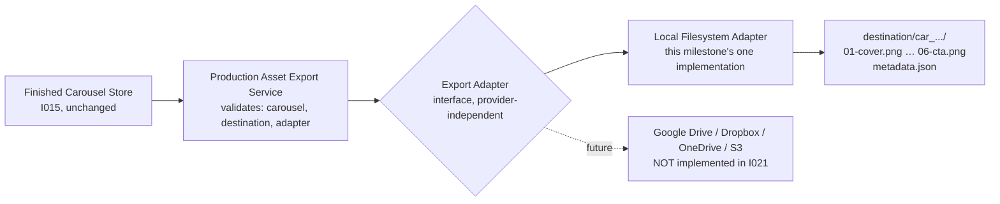

Mirrors the same "dumb, swappable adapter behind one documented shape, no
implicit default" pattern this codebase already uses three times — the
Finished Carousel Store's Storage Adapter (I015), the Renderer's Transport
(I006), and the LLM Provider's Transport (I019):

- **`src/production-asset-export-adapter.mjs`** — the interface only:
  `{ name, exportPackage(finishedCarousel, destination) }` plus
  `assertValidExportAdapter()`. No filesystem code lives here.
- **`src/local-production-asset-export-adapter.mjs`** — the one
  implementation this milestone ships: creates the destination folder,
  downloads each slide's image via `fetch()` (Node's built-in, no new
  dependency — the same choice I006/I019 already made), writes atomically,
  and writes `metadata.json` last.
- **`src/production-asset-export-service.mjs`** — validates the adapter
  shape, re-validates the Finished Carousel against
  `finished-carousel.schema.json` (defense in depth, never trusts an
  upstream caller already checked it), enforces two eligibility rules the
  schema alone can't express (`overall_status === "completed"` and
  `approval.approved === true`), validates `destination`, then delegates.

### Export structure

```
<destination>/
  <carousel_id>/
    01-cover.png
    02-content.png
    03-statistic.png
    04-quote.png
    05-infographic.png
    06-cta.png
    metadata.json
```

The per-carousel subfolder is named by `carousel_id` (e.g.
`car_9c026a104e3745c3`), not a literal Content Asset ID like "GS01" — see
"Repository investigation" above for why that identifier isn't available
on the Finished Carousel Object. Filenames are
`<slide_number zero-padded>-<slide_type>.<format>`, built from the
carousel's own `slide_number`/`slide_type`/`format` fields — slides are
sorted by `slide_number` before processing (never trusting array order
blindly), so export order is always cover → content → statistic → quote →
infographic → cta regardless of how the stored JSON happens to order its
`slides` array.

### metadata.json

```json
{
  "asset_package_id": "pkg_...",
  "carousel_id": "car_...",
  "carousel_content_id": "cc_...",
  "execution_id": "exec_...",
  "topic_id": "topic_...",
  "export_timestamp": "2026-...",
  "renderer_provider": "templated-http",
  "render_duration_ms": 22277,
  "total_duration_ms": 22277,
  "slide_count": 6,
  "export_version": "1.0"
}
```

Every field except `asset_package_id`/`export_timestamp`/`export_version`
(this export operation's own identity, generated here — analogous to how
every other builder in this codebase stamps its own ID/timestamp/version)
is copied directly from a field already present on the Finished Carousel
Object — nothing is invented. `render_duration_ms` and `total_duration_ms`
currently hold the same value in this codebase (both are ultimately
computed from the same render-timing sum — see `execution_metadata` vs
`metadata` in "Finished Carousel Builder" above) — they're still two
separate, honestly-mapped source fields, not a duplicated invention.

### Atomicity, idempotency, and "survives process restart"

Every file (each PNG and `metadata.json`) is written via the same
temp-file → read-back-verify → rename pattern I015's Local JSON Storage
Adapter already established — a same-directory rename is atomic on both
POSIX and NTFS, so a reader can never observe a partially-written file, and
a failed write never touches whatever was there before.

An export directory is considered **complete** only once its own
`metadata.json` exists and names the exact same `carousel_id` — written
**last**, only after every slide has been downloaded and written
successfully. This is the whole idempotency mechanism:

- **Re-running against an already-complete export makes zero network
  requests** — the adapter reads the persisted `metadata.json`, confirms
  the `carousel_id` matches, and returns the original `asset_package_id`
  and `export_timestamp` unchanged (verified live — a real re-export
  against an actual rendered carousel completed in ~3.8s, all Node
  startup overhead, no download).
- **A restart before completion** just safely re-attempts from scratch —
  any PNGs already written from the interrupted attempt are individually
  valid (atomic writes), just not yet accompanied by a `metadata.json`, so
  the directory correctly reads as "not complete" and gets safely
  re-processed; existing files are overwritten atomically, never
  corrupted.
- **A slide download failure stops immediately** — no later slide is
  requested, and `metadata.json` is never written, so a corrupted or
  malicious "completed" state can never exist.

### CLI

```bash
npm run export:assets -- <carouselId> <storeDirectory> <destination>
```

`storeDirectory` is a required, explicit argument — no default, no env
var — matching every other storage-directory-taking CLI in this repository
(I015's `store`, I016's `content:request`, I020's `production:live`). The
brief's own example (`npm run export:assets -- car_9c026a104e3745c3
/exports`) omits it; this CLI adds it as the required middle argument
instead of hardcoding or defaulting a store location, per the same
repository-evidence reasoning I016/I018 already applied to earlier CLIs in
this codebase.

The CLI: loads the named carousel from the I015 Finished Carousel Store
(unchanged), calls `executeProductionAssetExport()`, and prints a concise
summary (status, asset package ID, export path, slide count, files
exported, whether this run was a no-op re-export). Safe, structured errors
only on failure — never a raw filesystem path, raw HTTP response body, or
stack trace for an expected failure mode.

Downloading each slide's image is the one network activity this milestone
performs — a plain GET to an already-public CDN URL, no credentials
involved. It is not a credentialed provider call and needs no
live-verification gate the way Anthropic/Templated API calls do; automated
tests still never reach the real network (global.fetch is stubbed in every
test, matching this codebase's established convention).

### Explicitly out of scope (I021)

Google Drive, Dropbox, OneDrive, S3, cost accounting, a publishing
workflow, approval logic (I014's existing `carousel-approval.mjs` is
reused as a precondition, not reimplemented), metadata editing,
thumbnails, PDFs, Markdown exports, captions, reel scripts, and ZIP
archives — PNG export plus `metadata.json` only.

## Google Drive Publisher (DC-003-I022)

Uploads an already-completed I021 export package (six PNGs + a
`metadata.json`, on the local filesystem) to a configured Google Drive
folder. **I022 does not generate assets and does not call I021** — it only
ever publishes what a prior `npm run export:assets` run already produced.
Built as a provider-independent adapter (mirroring the Finished Carousel
Store / Renderer / LLM Provider / Production Asset Export pattern), not an
n8n Google Drive node — the n8n workflow is expected to eventually call
this module as an external process, the same way I013/I017/I020 already
call their own CLIs, never containing the publishing logic itself.

### Repository investigation (performed before implementation)

- **How I021 identifies a completed package**: the presence of a
  parseable `metadata.json` inside the export directory, naming the
  carousel's own `carousel_id` — written *last*, only after every slide
  succeeds (see "Atomicity, idempotency" under I021 above). I022 reuses
  this exact same rule to *read* a package back
  (`production-asset-publisher-service.mjs` requires `assetPackagePath`
  to exist and its own `metadata.json` to parse and carry a
  `carousel_id`), rather than inventing a second "is this package done"
  concept.
- **Existing Google Drive integration**: none found, in this repository or
  in the n8n environment's own credential store. Checked live via the n8n
  MCP `list_credentials` — two Google-related credentials exist ("Google
  Sheets account", `googleSheetsOAuth2Api`; "Google Sheets account 2",
  `googleApi`), neither confirmed to carry Drive-write scope, and neither
  is what this module reads from regardless — every external credential
  in this codebase, including this one, is a plain environment variable
  read by DC-003's own config loader, never n8n's credential vault (see
  "Configuration" below).
- **Reusable adapter pattern**: yes — `production-asset-export-adapter.mjs`
  (I021) was the direct model for `production-asset-publisher-adapter.mjs`:
  same "interface file has no implementation, `assertValid*Adapter()`
  runtime guard, one real implementation in its own file" shape.
- **Does package metadata already identify the destination folder?**
  Partially. `metadata.json`'s `carousel_id` supplies the *campaign
  subfolder name* (`<root>/<carousel_id>/`, per Strategy Office's own
  recommendation), but the Drive *root* folder is necessarily deployment
  configuration (`GOOGLE_DRIVE_ROOT_FOLDER_ID`), not something a Finished
  Carousel or its export could ever carry — a root folder is a
  destination decision, not a fact about the carousel.
- **Should the export structure be uploaded as-is or transformed?**
  As-is. The local package is already exactly what should exist in Drive —
  a flat folder of 6 PNGs + `metadata.json`; this milestone performs no
  format conversion, renaming, or re-nesting (review criterion 4).

### Architecture

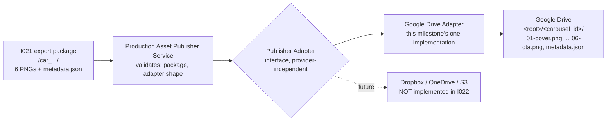

- **`src/production-asset-publisher-adapter.mjs`** — the interface only:
  `{ name, publishPackage(assetPackagePath, options) }` plus
  `assertValidPublisherAdapter()`. No Google-specific (or any
  provider-specific) code lives here.
- **`src/google-drive-publisher-adapter.mjs`** — the one implementation
  this milestone ships: OAuth2 refresh-token authentication, locates or
  creates the campaign folder, lists existing files for duplicate
  detection, uploads (or, with `--replace`, updates in place) every file
  in the package. Uses Node's built-in `fetch` — no `googleapis` SDK, no
  new dependency, the same choice I006/I019/I021 already made.
- **`src/production-asset-publisher-mock-adapter.mjs`** — the adapter the
  CLI's default (non-`--live`) mode and every automated test use; never
  touches the network or the local filesystem.
- **`src/production-asset-publisher-service.mjs`** — validates the
  adapter shape and that `assetPackagePath` is a genuinely completed I021
  package, then delegates.
- **`src/google-drive-publisher-config.mjs`** — environment-variable
  configuration, mirroring `llm-provider-config.mjs`/`renderer-config.mjs`
  exactly, including their own post-incident
  `resolveLiveMaxAttempts()` safety primitive — applied here
  *proactively*, before I022 has ever made a single live call, rather
  than waiting for its own incident the way I006 originally did.

### Configuration

```bash
GOOGLE_DRIVE_CLIENT_ID=
GOOGLE_DRIVE_CLIENT_SECRET=
GOOGLE_DRIVE_REFRESH_TOKEN=
GOOGLE_DRIVE_ROOT_FOLDER_ID=
GOOGLE_DRIVE_API_BASE_URL=https://www.googleapis.com
GOOGLE_DRIVE_TOKEN_URL=https://oauth2.googleapis.com/token
GOOGLE_DRIVE_REQUEST_TIMEOUT_MS=15000
GOOGLE_DRIVE_MAX_ATTEMPTS=3
```

No folder ID, credential, or account name is hardcoded anywhere in source
— all eight values are read from the environment by
`loadGoogleDrivePublisherConfig()`, matching `config/env.example`'s
existing pattern for `LLM_*`/`TEMPLATED_*`. `--live` fails fast if
`GOOGLE_DRIVE_CLIENT_ID`/`_CLIENT_SECRET`/`_REFRESH_TOKEN`/`_ROOT_FOLDER_ID`
are not all set, before any request of any kind is made.

### Duplicate handling

Per Strategy Office's own recommendation ("fail by default unless
`--replace` is supplied"): before uploading, the adapter lists the
campaign folder's existing files. If any of the package's own seven
filenames already exist there, it throws `DuplicatePackageError`
immediately — no upload of any kind is attempted, and nothing in Drive is
touched. With `--replace`, a matching existing file is updated **in
place** (its Drive file ID is reused; content changes, the file is never
deleted-and-recreated) — never a silent overwrite without the flag, never
an automatic "(2)" rename.

### Folder structure

```
<GOOGLE_DRIVE_ROOT_FOLDER_ID>/
  <carousel_id>/
    01-cover.png
    02-content.png
    03-statistic.png
    04-quote.png
    05-infographic.png
    06-cta.png
    metadata.json
```

Matches I021's own local structure exactly — deterministic `carousel_id`
naming, no human-readable folder names yet. Per the brief's own note: a
human-readable name (the article title) belongs to a future **Content
Lineage** enhancement, once Finished Carousel Objects legitimately carry a
source asset ID and title (see "Article title" under I021 above for why
that data isn't available today).

### CLI

```bash
npm run publish:assets -- <assetPackagePath> [--live] [--replace] [--live-max-attempts=N]
```

Mock by default (no network, no credentials needed) — loads the package
via `production-asset-publisher-service.mjs`, publishes through
`production-asset-publisher-mock-adapter.mjs`, prints a concise summary
(status, publisher, package ID, folder ID, folder URL, files uploaded).
`--live` switches to the real Google Drive adapter; `--replace` is
forwarded to whichever adapter is active. Safe, structured errors only on
failure — a `PublisherClientError`'s diagnostic (status/reason/sanitised
message, mirroring I019.1's own `LlmClientError.diagnostic`) is the most
detail ever shown; never a raw response body, an access token, a client
secret, a refresh token, or a stack trace for an expected failure mode.

### Google Drive Publisher — Live Verification Gate (not yet exercised)

**No live Google Drive request has been made as of this milestone's
delivery**, per the brief's own closing instruction. Before any `--live`
run:

1. All automated tests pass (confirmed — 795/795, see "Testing" below).
2. Fixture validation passes (confirmed — `npm run validate`).
3. `GOOGLE_DRIVE_CLIENT_ID`/`_CLIENT_SECRET`/`_REFRESH_TOKEN`/`_ROOT_FOLDER_ID`
   are confirmed present locally, by name only, never by value.
4. The exact package being published, the target root folder, and the
   attempt ceiling (always 1 per file, via `resolveLiveMaxAttempts()`) are
   reported.
5. Strategy Office provides fresh approval.

Like DC-003-I006's `renderer-transport-http.mjs` before its own first live
call, the Drive API request/response shapes in
`google-drive-publisher-adapter.mjs` are built directly from Google's
published API reference, not yet exercised against a real request — a
shape mismatch, if one exists, would only surface on that first live
attempt, exactly as happened for Templated. `PublisherClientError`'s safe
diagnostic exists specifically so that, unlike I019's own first live
attempt, a rejection would be diagnosable immediately rather than only
after a dedicated corrective milestone.

### Explicitly out of scope (I022)

Approval workflow (I014 reused as a precondition only), production
generation, rendering, metadata editing, Google Docs, Google Sheets, ZIP
archives, publishing scheduling, social-platform posting, Drive
permissions management, and cost accounting.

## Production Metrics & Cost Accounting (DC-003-I023)

The accounting and telemetry layer for production: for each completed (or
failed) production run, builds one validated, immutable Production
Metrics Record — which execution ran, how many external requests were
made, how long it took (where tracked), what it produced, and an
**estimated** cost. **This is not a dashboard**, and it never claims to
answer "what did the provider invoice us" — see the brief's own closing
instruction, quoted directly:

> It must not claim to answer: What did the provider invoice us?

### Architecture

```mermaid
flowchart LR
    A[Production Run Result\nI020, required] --> D[Production Metrics Collector\nobserves, never orchestrates]
    B[Export Result\nI021, optional] --> D
    C[Publish Result\nI022, optional] --> D
    E[Anthropic usage\nvia onUsage hook, optional] --> D
    D --> F[Cost Calculator\npure functions, no HTTP]
    F --> D
    D --> G[Production Metrics Record\nschema-validated, immutable]
    G --> H[Production Metrics Store\nlocal JSON, mirrors I015]
    H -.future.-> I[Production Dashboard\nNOT built in I023]
```

The Metrics Collector observes; it does not own generation, rendering,
exporting, or publishing, and it never calls I004/I006/I019/I021/I022
itself — it only ever reads already-completed result objects (or the
equivalent JSON files) a caller supplies. **I021 and I022 are completely
unchanged** — confirmed by diff: this milestone added no lines to either.

- **`src/production-metrics.mjs`** — the domain object factory: assembles,
  validates, and deep-freezes one record. No filesystem APIs, no
  provider-specific SDKs.
- **`src/production-cost-config.mjs`** — environment-variable pricing
  rates, mirroring `llm-provider-config.mjs`/`renderer-config.mjs`/
  `google-drive-publisher-config.mjs` exactly. Pricing is configuration,
  never hardcoded permanent truth.
- **`src/production-cost-calculator.mjs`** — pure calculation functions
  only; no HTTP, no configuration reads once a resolved config is
  supplied.
- **`src/production-metrics-collector.mjs`** — assembles one record from
  already-completed evidence; tolerates optional downstream stages that
  haven't run yet.
- **`src/production-metrics-store-adapter.mjs`** /
  **`src/local-json-production-metrics-store-adapter.mjs`** /
  **`src/production-metrics-store.mjs`** — the same Storage
  Adapter/domain-layer split I015's Finished Carousel Store already
  established, applied to a genuinely separate store for a genuinely
  separate object; I015's own files are untouched.

### Repository investigation (performed before implementation)

1. **Timing data already available**: `execution_metadata.render_duration_ms`
   / `metadata.total_duration_ms` on a Finished Carousel Object (render
   time only); `duration` on I020's own Production Run Result (total
   wall-clock time for the whole production run — generation + mapping +
   render + build combined, not broken out per stage). **I021's Export
   Result and I022's Publish Result carry no timing data of their own at
   all** — confirmed by inspecting both services directly, not assumed.
   Carousel Content Object has never tracked its own generation duration
   either. Net effect: only `durations_ms.total` is populated by default
   today; `generation`/`render`/`export`/`publish` are `null` unless a
   caller supplies them explicitly (see "Durations" below).
2. **Anthropic token usage**: returned by the real API (and already
   modeled by I019's own mock transport, `usage: { input_tokens: 100,
   output_tokens: 200 }`) but previously discarded entirely at
   `llm-response-validator.mjs`'s own normalization boundary — the exact
   "already returned but discarded at the transport boundary" case the
   brief asked to check for. See "Anthropic usage capture" below for the
   fix and why it required no public contract change.
3. **Templated usage/billing/credit data**: none — confirmed by
   inspecting `renderer-response-validator.mjs` and both renderer
   transports directly. Templated cost is always an estimate from render
   count × a configured rate.
4. **Request counts from existing records**: derivable, with one
   documented imprecision — see "Request counts" below.
5. **Reusable persistence adapter**: yes, I015's own Storage
   Adapter/domain-layer split, applied verbatim to a new store (not a
   modification of I015's own files).
6. **I008 Execution Ledger**: untouched. I023 has its own, completely
   separate store; it never appends to, reads from, or otherwise touches
   the Execution Ledger.

### Anthropic usage capture

The smallest safe, provider-isolated change, applied exactly where the
brief asked: `llm-response-validator.mjs`'s `validateLlmTransportResponse()`
now returns `{ slidesJson, usage }` instead of just `{ slidesJson }` —
`usage` is `{ inputTokens, outputTokens, totalTokens }` (normalized from
Anthropic's own `input_tokens`/`output_tokens`), or `null` when absent/
malformed. `createAnthropicProvider()` (`llm-provider-anthropic.mjs`)
gained one new, entirely optional constructor field, `onUsage: (usage) =>
void` — called once per successful `generateCarousel()`, purely
observational. **`generateCarousel()`'s own return value — a raw JSON
string — is completely unchanged**, and so is `CarouselContent`'s own
schema (`additionalProperties: false`, never touched). This is the same
"hook, don't change the return value" technique DC-003-I020.1's
`pipeline-stages-live.mjs` already established (`onGenerated`/
`onSlideRendered`) to avoid altering a public domain contract — confirmed
by re-running every existing I019 test unmodified before adding new ones;
all passed unchanged. **No incompatibility needed to be reported**, since
a way to preserve the data without touching any public contract existed.

**A known, honestly-documented integration gap**: I020's own live CLI
(`production-run-live.mjs`) does not yet wire `onUsage` through to persist
token usage into its own Production Run Result output — that CLI is not
on I023's file list, and wiring it through was judged a separate,
narrowly-scoped follow-up rather than something to fold into an
already-large milestone. Until that follow-up exists, a live run's
Anthropic cost will read `calculation_type: "unavailable"` unless you
supply token counts by hand via the metrics CLI's own
`--anthropic-input-tokens`/`--anthropic-output-tokens` flags (see "CLI"
below).

### Actual vs. estimated costs

One vocabulary, used consistently everywhere a cost is reported:

| `calculation_type` | Meaning |
|---|---|
| `estimated` | Calculated from a configured rate and real usage/count evidence — the only classification this milestone ever produces when a calculation actually happens. |
| `unavailable` | No usage/count evidence exists to calculate from (amount is always `0`, never a guessed placeholder). |
| `actual` | Reserved for a future milestone that integrates real provider billing APIs. **I023 never produces this.** |

A Templated or Google Drive cost of `0` from a genuine zero count (e.g.
generation failed before any render was attempted) is still `estimated` —
zero is real evidence, not missing evidence. Only a missing/malformed
count or missing token usage produces `unavailable`.

### Configurable pricing

```bash
ANTHROPIC_INPUT_COST_PER_MILLION_TOKENS=3.00   # EXAMPLE value, not a current price
ANTHROPIC_OUTPUT_COST_PER_MILLION_TOKENS=15.00 # EXAMPLE value, not a current price
TEMPLATED_COST_PER_RENDER=0.05                 # EXAMPLE value, not a current price
GOOGLE_DRIVE_COST_PER_UPLOAD=0
PRODUCTION_COST_CURRENCY=USD
```

Read by `loadProductionCostConfig()` — never hardcoded in source, never
read directly by `production-cost-calculator.mjs` itself (every
calculation function receives an already-resolved config object via an
explicit parameter). The values above are labelled EXAMPLES precisely
because pricing changes over time — check each provider's own current
pricing page before using this for anything resembling a real budget.

### Request counts

Derived by default from the Production Run Result, under the stated
assumption of a single-attempt live run (I020's own `maxAttempts: 1`
live-verification rule — no retries, so "N slides rendered" reliably
means "N Templated requests were made"):

- `anthropic`: `1` if `carouselContentId` is non-null (generation
  succeeded), else `0`.
- `templated`: `renderedSlideCount` (correct for both a full success and
  a partial failure — the count reflects exactly how many slides
  completed before any failure stopped the run).
- `google_drive`: the Publish Result's own `filesUploaded`, or `0` if no
  Publish Result was supplied.

**One documented imprecision**: for a failed generation, the Production
Run Result cannot distinguish "Anthropic was never called" from
"Anthropic was called and rejected the request" — both leave
`carouselContentId` null. The default conservatively reports `0` rather
than guessing. Supply `requests.anthropic` explicitly to the collector
when this distinction matters for cost accounting.

### Durations

| Field | Available today? |
|---|---|
| `total` | Yes — I020's own `duration` (whole production run, generation through build). |
| `generation` | No — not tracked in isolation anywhere in the pipeline. |
| `render` | No — Finished Carousel's own `render_duration_ms` exists but isn't reachable from a Production Run Result alone (a Production Run Result deliberately doesn't embed the whole Finished Carousel object, only its ID). |
| `export` | No — I021's own result carries no timing. |
| `publish` | No — I022's own result carries no timing. |

`null` means genuinely untracked — never a guessed or zero-filled value.
The collector accepts an optional `durationsMs` override for any caller
that has separately obtained one of these (e.g. by loading the Finished
Carousel via the unmodified I015 store and reading its own
`render_duration_ms`).

### Failed-run accounting

A failed production run still produces a record — `status: "failed"`,
`carousel_content_id`/`carousel_id` both `null` when the run never
reached that point (the schema's own `oneOf` only requires them for a
`completed` record), request counts and cost already incurred still
recorded from whatever evidence exists (e.g. 2 Templated requests and
their cost, if 2 slides rendered before a 3rd failed), and
`files_exported`/`files_published` both `0` unless export/publish
genuinely occurred. **Never a fake zero-cost success record.**

### Storage structure

```
<metricsStoreDirectory>/
  <metrics_id>.json
```

Same atomic-write strategy as I015 (temp file → read-back verify →
rename), same "storageDir is always an explicit argument, never a
default" rule, same path-traversal protection (`metrics_id` must match
`^met_[A-Za-z0-9]+$` before it's ever used to build a file path). No
`replace()`/`update()` — a Production Metrics Record is a point-in-time
snapshot, never intentionally revised in place; `save()` rejects a
duplicate `metrics_id` outright. Generated metrics files are not
committed to Git.

### CLI

```bash
npm run metrics -- record <productionResultPath> <metricsStoreDirectory> [--export=<path>] [--publish=<path>] [--anthropic-input-tokens=N] [--anthropic-output-tokens=N]
npm run metrics -- get <metricsId> <metricsStoreDirectory>
npm run metrics -- list <metricsStoreDirectory>
npm run metrics -- find-execution <executionId> <metricsStoreDirectory>
```

`record` never calls a provider — it only reads already-written JSON
files (a Production Run Result is required; `--export`/`--publish` are
optional additional evidence) and writes one metrics record. Safe,
structured errors only; never a raw filesystem path, stack trace, API
key, or provider response body.

### Precision and currency

One configured currency per record (`PRODUCTION_COST_CURRENCY`, default
`USD`). Every per-provider `amount` is rounded to 6 decimal places at the
moment it's calculated; `total` is the sum of those three already-rounded
amounts, rounded again to 6 decimals. Six decimal places (a millionth of
a currency unit) is precise enough that this introduces no practically
meaningful compounding error — deliberately not the coarser "round to
cents per line item, then sum" pattern, which would lose real precision
on sub-cent per-token LLM costs.

### Relationship to the future Production Dashboard

I023 is the data layer a future dashboard would read from — the
`production-metrics/` directory of validated JSON records, queryable via
`findByExecutionId()`/`list()`. No graphical interface, no charts, no
aggregation-over-time reporting exists yet; that's explicitly out of
scope here, per the brief's own framing: "Build the smallest honest
metrics system that future dashboards can read."

### Existing modules confirmed unchanged

Execution Ledger, Pipeline Orchestrator, Invocation Adapter, n8n Adapter,
Production Workflow, Content Request Service, Finished Carousel Store,
Production Asset Export, Google Drive Publisher, and the Approval
workflow — none received any code changes for I023. The only pre-existing
files touched are the two I019 modules for Anthropic usage capture
(additive only, see above) and the standard schema-registration
touchpoints (`schema-registry.mjs`, `config/versions.json`,
`config/constants.json`, `src/integrity-checks.mjs`,
`tests/validation/validate.mjs`, `tests/unit/validator.test.mjs`) every
new schema in this codebase already requires.

### Explicitly out of scope (I023)

A dashboard or GUI, provider billing API integration, Anthropic/Templated/
Google invoice reconciliation, monthly budgets or alerts, client billing,
profit-margin calculations, multi-currency conversion, exchange-rate
fetching, cost forecasting, cost-based workflow blocking, n8n workflow
changes, publishing automation, Content Lineage, and Google Sheets
reporting.

## Production Control Centre (DC-003-I024, extended by DC-003-I025)

DC-003-I023 named the gap itself: "no graphical interface... exists yet;
that's explicitly out of scope here." I024 is the first answer to it — not
a graphical dashboard, but a read-only terminal console: the first
genuinely operational interface for DC-003, meant for Strategy Office to
actually run day to day, answering one question — "what is my AI
workforce doing?" — without opening a single JSON file by hand.

**Updated by DC-003-I025:** I024 originally had to report "published" from
a disconnected field (see the repository-investigation findings below).
I025 closed that gap by building the Publisher Result Store (see
"Publisher Result Store (DC-003-I025)" further down) — every
`published`/`publishing` value the Control Centre now returns is sourced
from that store, never from the field I024 had to fall back on.

### Architecture

```
Finished Carousel Store (I015)
Production Metrics Store (I023)           ─┐
Publisher Result Store (I025)              ├──▶  Control Centre Service  ──▶  Terminal Control Centre (CLI)
Production Asset Export (I021, optional)  ─┘
```

`src/control-centre-service.mjs` is the only module responsible for
assembling operational information. It observes; it never owns, mutates,
or persists anything. Every value in its read model already exists
somewhere else in the repository — `getOverview()`/`getJobDetail()` never
call `save()`/`replace()`/`write()` on any store, and make no network
requests of any kind (health "configured" checks read
`loadLlmProviderConfig()`/`loadRendererConfig()`/
`loadGoogleDrivePublisherConfig()` — the same env-derived config objects
the live CLIs already use — never a `fetch()`). `schemas/control-centre.schema.json`
defines the read model's shape (`oneOf` an `overview` or a `job_detail`,
discriminated by `kind`) and is assembled in memory only; it is never
written to disk.

### Repository investigation findings (checked before writing any code, per the I024 brief)

- **Four stores/conventions exist, not four uniform query APIs.** Finished
  Carousel Store (I015) and Production Metrics Store (I023) both expose a
  real `list()`/`get()` query surface — Metrics also exposes
  `findByExecutionId()`, built in I023 for exactly this kind of join, and
  reused here unmodified rather than adding a second index. Production
  Asset Export (I021) has **no store or query API at all** — it's a
  directory-per-carousel convention on disk (`<destination>/<carousel_id>/metadata.json`)
  with no fixed default location anywhere in config; every
  `npm run export:assets` invocation supplies its own destination by hand.
  Google Drive Publisher (I022) has **no local persistence whatsoever** —
  uploads go straight to Drive; nothing is written to this repository.
- **The join key is `carousel_id`, secondarily `execution_id`.**
  `carousel_id` is the Finished Carousel Store's own key and the export
  directory name. `execution_id` (present on both the Finished Carousel's
  `execution_metadata` and the Production Metrics Record) is what
  `findByExecutionId()` joins on.
- **Not every completed production run can be reconstructed today, and
  this is a genuine, pre-existing gap, not something I024 invents around:**
  1. **Export status is only knowable when the caller supplies an
     `exportsRootDir`.** No fixed default export location exists anywhere
     in `config/env.example` or `config/constants.json` — I021 was built
     that way deliberately (see "Production Asset Export (DC-003-I021)").
     Without one, every export signal in the read model is honestly
     `"unknown"`, never a guessed `"not exported"`.
  2. **(As of I024) Google Drive publish status had no independent
     repository evidence anywhere.** The only "published" signal in the
     schema set was `finished-carousel.schema.json`'s own
     `approval.published`/`approved_at` — DC-003-I014's approval-lifecycle
     transition, a distinct, manually-triggered concept
     (`npm run approve -- publish`) that no code in this repository ever
     wired to a completed I022 Google Drive upload. **DC-003-I025 closed
     this gap** by building the Publisher Result Store — see "Publisher
     Result Store (DC-003-I025)" below — and repointing every
     `published`/`publishing` value in this service to it instead. This
     item is kept here as investigation history; it no longer describes
     current behaviour.
  3. **Anthropic vs. mock generation cannot be distinguished on a stored
     Finished Carousel** — it carries no `llm_model`/provider field for
     generation (the same gap backlog item B001 already named). Templated
     rendering **can** be distinguished reliably: `execution_metadata.provider`
     is stamped `"templated-http"` for a real render and `"mock-transport"`
     for a mock one, so Templated health's `last_success_at` only counts
     genuine renders.
- **No additional indexing was built.** Aggregate dashboard counts use
  each store's own `list()` (cheap summaries already produced by I015/
  I023). Anything needing a full record (recent activity's real
  timestamps, per-provider render health, per-job cost/duration) is only
  fetched for a bounded "recent" window (`recentJobsLimit`/
  `recentActivityLimit`, default 10/20) — never the whole store, mirroring
  I023's own `findByExecutionId()` full-scan justification. Duration
  averaging fetches every metrics record individually since `list()`
  summaries carry `total_cost` but not `durations_ms` — acceptable at this
  store's expected scale, same reasoning I023 already applied to itself.

### System Health

Seven repository-evidence-only checks (six from I024, plus Publisher
Result Store added by I025), each `ok` / `warning` / `unknown`, rolled up
into one `overall`: `healthy`, `warning`, or `attention_required`.
`attention_required` fires only when the Finished Carousel Store,
Production Metrics Store, or (as of I025) Publisher Result Store itself
is unreadable (a broken store never throws through to the CLI — it
degrades that store's own health check and every dependent section falls
back to empty, safely). `unknown` is reserved for "genuinely never
checked" (Export health with no `exportsRootDir` supplied) — it does not,
by itself, degrade `overall`.

| Check | Evidence used |
|---|---|
| Anthropic | `LLM_API_KEY` presence (config only, no network); `last_success_at` = most recent Finished Carousel `generated_at` in the recent window (any provider — see gap above) |
| Templated | `TEMPLATED_API_KEY` presence; `last_success_at` = most recent `execution_metadata.rendered_at` among recent-window carousels with `provider: "templated-http"` |
| Export | `unknown` with no `exportsRootDir`; otherwise whether the directory is readable, plus the newest export timestamp found in the recent window |
| Google Drive | Client ID/secret/refresh token/root folder ID all present; `last_success_at` — as of DC-003-I025 — is the newest Publisher Result `published_at` for `provider: "google-drive"`, scanned across the whole store (its own `list()` summaries already carry both fields), no longer a permanent `null` |
| Finished Carousel Store | `list()` succeeds |
| Production Metrics Store | `list()` succeeds |
| Publisher Result Store | `list()` succeeds (DC-003-I025) |

### Dashboard, Recent Jobs, Recent Activity, Job Detail

- **Dashboard** — completed/failed/partial/awaiting-approval/approved/
  rejected counts (from Finished Carousel Store summaries); `published`
  count — as of DC-003-I025 — is the number of distinct `carousel_id`s
  with at least one Publisher Result (one cheap `list()` scan builds a
  membership set, no per-carousel query); `exported` count is `null` (not
  zero) when no `exportsRootDir` was supplied; today's production count
  and estimated cost, all-time estimated cost, and average duration (all
  from Production Metrics Store summaries/records) — every cost/duration
  figure carries its own `records_counted` so "no metrics recorded yet" is
  never confused with a genuine zero.
- **Recent Jobs** — the most-recently-generated carousels, each showing
  `carousel_id`, `topic_id`, status, completion time, approval status,
  export status (`exported` / `not_exported` / `unknown`), a published
  flag (DC-003-I025: from the Publisher Result Store membership set, same
  as the dashboard count), estimated cost, and duration — cost/duration
  are `null` per-job when no Production Metrics Record exists for that
  execution, never a guessed zero.
- **Recent Activity** — a chronological feed built only from timestamps
  already stored: `generated_at`, `execution_metadata.rendered_at`,
  `approval.approved_at`, one `published` entry per real Publisher Result
  found via `findByCarousel()` (DC-003-I025 — a carousel published more
  than once, or to more than one provider, produces one entry each), and
  (when `exportsRootDir` is supplied) an export's own `export_timestamp`
  from its `metadata.json`. Rejection produces **no** activity entry —
  `finished-carousel.schema.json` has a `rejection_reason` but no
  `rejected_at` field, so no rejection timestamp exists anywhere to use;
  inventing one was rejected in favor of simply not emitting that event.
- **Job Detail** — one carousel's full picture in a single call, no
  further repository queries needed: the complete Finished Carousel
  Object (generation, rendering, approval, all embedded and re-validated
  against `finished-carousel.schema.json`), the matching Production
  Metrics Record if one exists (else `null`), export status, and (as of
  DC-003-I025) a `publishing` block — `{ published, publisher_results }` —
  listing every Publisher Result found for this carousel, oldest to
  newest, each embedded whole and re-validated against
  `publisher-result.schema.json`.

### CLI (primary deliverable)

```bash
npm run control-centre -- dashboard <carouselStoreDirectory> <metricsStoreDirectory> <publisherResultStoreDirectory> [exportsRootDir]
npm run control-centre -- health    <carouselStoreDirectory> <metricsStoreDirectory> <publisherResultStoreDirectory> [exportsRootDir]
npm run control-centre -- jobs      <carouselStoreDirectory> <metricsStoreDirectory> <publisherResultStoreDirectory> [exportsRootDir]
npm run control-centre -- activity  <carouselStoreDirectory> <metricsStoreDirectory> <publisherResultStoreDirectory> [exportsRootDir]
npm run control-centre -- job <carouselId> <carouselStoreDirectory> <metricsStoreDirectory> <publisherResultStoreDirectory> [exportsRootDir]
```

Plain text only — no ANSI colour codes, per the I024 brief. `[OK ]`/`[!  ]`/
`[?  ]` markers substitute for colour. **DC-003-I025 made
`publisherResultStoreDirectory` a required argument** — a deliberate
breaking change from I024's original 2-argument signature: publication
evidence is I025's whole purpose, so unlike `exportsRootDir` (which
remains optional) it is never optional. Every storage-directory argument
is required and explicit, matching every other storage-directory-taking
CLI in this repository (no default, no env var). Errors from the
underlying stores (`CarouselNotFoundError`, `InvalidCarouselIdentifierError`,
`CorruptedPublisherResultError`, etc.) print a name and message only,
never a stack trace.

### Read-only discipline

The Control Centre never generates, renders, approves, exports, publishes,
deletes, modifies, or persists anything. Verified two ways: unit tests
construct guarded store stand-ins whose `save()`/`replace()` throw if ever
called (they never are), and CLI tests run every subcommand against a
populated store directory and assert the stored files' bytes are
byte-for-byte unchanged afterward.

### Existing modules confirmed unchanged

Execution Ledger, Pipeline Orchestrator, Invocation Adapter, Production
Workflow, Finished Carousel Store, Production Metrics Store, Production
Asset Export, Google Drive Publisher, and the Approval workflow — none
received any code changes for I024. The only pre-existing files touched
are the standard schema-registration touchpoints (`schema-registry.mjs`,
`config/versions.json`, `src/integrity-checks.mjs`,
`tests/validation/validate.mjs`, `tests/unit/validator.test.mjs`) every
new schema in this codebase already requires, plus `src/index.mjs` and
`package.json` (barrel export and `npm run control-centre` script).

### Relationship to future graphical interfaces

I024 is deliberately terminal-only — explicitly out of scope: a web
browser, React/Vue/Next.js, Electron, a desktop or mobile UI, charts,
authentication, live refresh/polling/WebSockets, and any editing/
publishing/approval control surface (this remains strictly observe-only).
`control-centre-service.mjs`'s `getOverview()`/`getJobDetail()` return the
same immutable, schema-validated read model regardless of caller — a
future graphical Strategy Office dashboard is expected to call this same
service, not re-derive its own aggregation logic.

## Publisher Result Store (DC-003-I025)

Closes the architectural gap DC-003-I024's own investigation named:
successful Google Drive uploads left no local repository evidence, so the
Control Centre could not truthfully answer "has this carousel actually
been published?" — it could only surface a disconnected, manually-set
approval-lifecycle field. The Publisher Result Store is the missing
system of record: **the publisher performs work; the Publisher Result
Store records the outcome.** The publisher itself never becomes the
source of truth — this store does.

### Repository investigation (checked before writing any code, per the I025 brief)

Confirmed by reading I022's own service/adapter, I021's export service,
and I024's own Control Centre before starting:

- **No persistent publish record existed anywhere.**
  `google-drive-publisher-adapter.mjs`'s `publishPackage()` returns a
  result object and writes real bytes to Google Drive — nothing else.
  `production-asset-publisher-service.mjs` (pre-I025) passed that result
  straight back to its caller with zero persistence. No table, file, or
  field anywhere in this repository recorded that an upload had happened.
- **The Control Centre genuinely could not prove publication** — see
  DC-003-I024's own README section above, gap 2: it could only surface
  `finished-carousel.schema.json`'s `approval.published`, a distinct
  DC-003-I014 approval-lifecycle transition never wired to a real I022
  upload.
- **No existing persistence layer could be reused.** Finished Carousel
  Store (I015) and Production Metrics Store (I023) are both genuinely
  separate domain objects for genuinely separate concerns (rendered
  output; cost/telemetry) — repurposing either would have meant inventing
  fields neither schema has, which this codebase's own established
  discipline (see I014/I016's own design notes) never does. A new,
  narrowly-scoped store was the only correct answer — confirmed, not
  assumed.

### Architecture

```
Google Drive Publisher (I022)
        │  after a successful upload
        ▼
Publisher Result (src/publisher-result.mjs)
        │  save()
        ▼
Publisher Result Store (src/publisher-result-store.mjs)
        │  list() / get() / findByCarousel() / findByExecution()
        ▼
Production Control Centre (I024)  ──▶  future dashboards / publishing analytics
```

Mirrors the Finished Carousel Store (I015) / Production Metrics Store
(I023) pattern exactly: a Storage Adapter shape
(`publisher-result-store-adapter.mjs`, `assertValidPublisherResultStoreAdapter()`),
the one Local JSON Storage Adapter this milestone ships
(`local-json-publisher-result-store-adapter.mjs`, one file per
`publisher_result_id` at `<storageDir>/<publisher_result_id>.json`, same
atomic temp-file-then-rename write strategy as I015/I023), and a domain
layer (`publisher-result-store.mjs`) that never imports `node:fs` and
never overwrites — a re-publish of the same carousel produces a **second,
independent** Publisher Result (its own fresh ID), not an overwrite,
deliberately preserving a full audit trail rather than only "the latest
publish."

### Publisher Result Object

`schemas/publisher-result.schema.json` — `publisher_result_id`,
`carousel_id`, `asset_package_id`, `execution_id`, `provider`,
`destination`, `published_at`, `status` (always `"completed"` — this
object represents one successful publication only; a failed attempt never
reaches this factory), `provider_reference`, `metadata`. Deliberately
provider-neutral: Google Drive is only the first implementation.
`metadata` is the one field in this entire repository's schema set that
is NOT `additionalProperties: false` — its whole purpose is to carry
provider-specific extras (Google Drive's own `files_uploaded` count today)
without ever requiring a schema change for a future publisher.
`src/publisher-result.mjs`'s `createPublisherResult()` builds it with the
same "assemble, then validate, then deep-freeze" discipline every other
domain-object factory in this codebase already applies to itself.

### Relationship to Google Drive (DC-003-I022)

`production-asset-publisher-service.mjs`'s `executeProductionAssetPublish()`
gained one new, entirely optional dependency:
`dependencies.publisherResultStore`. When supplied, immediately after
`adapter.publishPackage()` succeeds, one Publisher Result is built (from
the export package's own `metadata.json` — `carousel_id`,
`asset_package_id`, `execution_id` — plus the adapter's own result —
`publisher`, `folderUrl` → `destination`, `folderId` → `provider_reference`,
`filesUploaded` → `metadata`) and saved. **Upload behaviour itself is
completely unchanged** — same adapter call, same arguments, same returned
result, whether or not a store is supplied. When omitted (the default),
nothing is recorded and the function behaves byte-for-byte as it did
before I025 — verified by a dedicated regression test. A failed publish
records nothing. A Publisher Result Store `save()` failure propagates as
a real error rather than being silently swallowed — the upload already
genuinely succeeded, but this service does not pretend evidence was
recorded when it wasn't.

`tests/validation/publish-production-assets.mjs` (I022's own CLI) gained
one new, optional trailing argument: `publisherResultStoreDirectory`.
Omit it to preserve the CLI's exact pre-I025 behaviour.

### Relationship to future publishers

The schema and store are already provider-neutral — `provider`,
`destination`, and `provider_reference` are all free-form strings, and
`metadata` absorbs whatever a given publisher's own result shape needs.
A future LinkedIn/Instagram/Facebook/X publisher (explicitly out of scope
for I025 itself) would populate the exact same schema through the exact
same store, with zero changes to `publisher-result.mjs`,
`publisher-result-store.mjs`, or the Control Centre's own
`published`/`publishing` logic.

### Repository-evidence philosophy

No heuristics, no provider queries, no polling Google Drive to check
whether files still exist — `published` means, and only ever means, "a
Publisher Result is stored locally for this carousel_id." If the local
record is somehow lost, the Control Centre will honestly report
`published: false`, even if the files remain on Drive — this is a
deliberate consequence of "the Publisher Result Store is the source of
truth," not a bug to route around.

### Query Functions

`src/publisher-result-store.mjs` exposes `{ name, save, get, list,
findByCarousel, findByExecution, exists }`. `findByCarousel()` is the
primary lookup the Control Centre uses (built specifically for that
purpose, per the I025 brief); `findByExecution()` mirrors I023's own
`findByExecutionId()` precedent for cross-referencing against a
Production Metrics Record's `execution_id`. Neither is a new index —
both are full scans over `list()`, the same "proportional to this
milestone's own scope" reasoning `production-metrics-store.mjs`'s own
`findByExecutionId()` already established.

### CLI (read-only)

```bash
npm run publisher-results -- list <publisherResultStoreDirectory>
npm run publisher-results -- get <publisherResultId> <publisherResultStoreDirectory>
npm run publisher-results -- carousel <carouselId> <publisherResultStoreDirectory>
npm run publisher-results -- execution <executionId> <publisherResultStoreDirectory>
```

This CLI never publishes anything — `npm run publish:assets` remains
solely responsible for publishing. It only reads back evidence a publish
already produced. Verified read-only: a dedicated test runs every
subcommand against a populated store directory and confirms zero files
are created, removed, or modified.

### Control Centre integration (DC-003-I024)

`published`/`publishing` throughout the Control Centre — the dashboard's
`published` count, each Recent Job's `published` flag, Recent Activity's
`published` entries, Job Detail's `publishing` block, and Google Drive
health's `last_success_at` — are now all sourced from the Publisher
Result Store instead of the disconnected `approval.published` field. See
"Production Control Centre (DC-003-I024, extended by DC-003-I025)" above
for the full account, including the now-required `publisherResultStoreDirectory`
CLI argument.

### Existing modules confirmed unchanged

Execution Ledger, Pipeline Orchestrator, Invocation Adapter, Production
Workflow, Finished Carousel Store, Production Metrics Store, Production
Asset Export, and the Approval workflow — none received any code changes
for I025. Google Drive upload behaviour itself (auth, retry, duplicate
handling, folder structure) is unchanged; only
`production-asset-publisher-service.mjs` gained the one new optional
dependency described above. The only pre-existing files touched are the
standard schema-registration touchpoints (`schema-registry.mjs`,
`config/versions.json`, `config/constants.json`, `src/integrity-checks.mjs`,
`tests/validation/validate.mjs`, `tests/unit/validator.test.mjs`) every
new schema in this codebase already requires, plus `src/index.mjs`,
`package.json` (barrel exports and the `npm run publisher-results`
script), `schemas/control-centre.schema.json`, and
`src/control-centre-service.mjs`/`tests/validation/control-centre.mjs`
(the I024 integration described above).

### Explicitly out of scope (I025)

LinkedIn, Instagram, Facebook, X, scheduling, analytics, publisher
retries, a publisher queue, and a publisher dashboard — all future
milestones.

## Windows Production Asset Export (DC-003-I026)

Every prior export (I021) lands inside a Docker named volume — durable,
but not something Strategy Office can open in Windows Explorer without
`docker cp` or browsing volume internals. I026 adds exactly one thing: a
second, human-facing copy of an already-approved, already-exported
package, delivered into a real Windows folder. **The Docker archive
remains the sole system of record; the Windows copy is a delivery copy,
never the other way around** — this milestone never moves or deletes the
archive, and every write to the Windows side is independently verified
byte-for-byte against it.

### Repository and Docker investigation (checked before writing any code, per the I026 brief)

- **I021's own adapter already writes correctly to any writable mounted
  directory — confirmed by reading it, not assumed.**
  `local-production-asset-export-adapter.mjs`'s `exportPackage(finishedCarousel,
  destination, runOptions)` treats `destination` as an entirely opaque
  string; it has no Docker-specific logic anywhere. **No second export
  adapter was built.** I026 calls I021's real
  `executeProductionAssetExport()` unmodified for the archive step, then
  performs a plain filesystem copy for the Windows step — see "Why a copy,
  not a second export" below.
- **`n8n-test`'s exact pre-recreation configuration was recorded first,**
  not assumed: image `n8nio/n8n:latest` (pinned to the already-cached
  local digest `882b126a8ddd…` — recreation never re-pulled, so no
  version drift), user `node`, entrypoint `tini -- /docker-entrypoint.sh`,
  no restart policy, bridge network, port `5678:5678`, the `n8n_data`
  named volume, the existing read-only `/data/dc003-repo` bind mount,
  `NODES_EXCLUDE=["n8n-nodes-base.localFileTrigger"]`, and `LLM_API_KEY`
  (value never displayed — only its non-empty length was compared
  before/after, confirming it survived recreation unchanged).
- **The approved Windows destination is not OneDrive-backed.** Checked
  directly: `C:\Users\Evans\Documents` (the brief's own suggested parent)
  is a plain local folder, separate from the `OneDrive\Documents` path
  this very repository lives under — no sync-lag or file-locking concern
  either way, since the user-approved final location
  (`E:\BUSINESS\Digital Marketing\Digitally Connected\CLAUDE\Production Assets`)
  is on a separate physical/local drive entirely, not under any OneDrive
  root at all.
- **E: drive bind-mount support was verified with a disposable container**
  before ever touching the real `n8n-test` container — confirmed
  writable, then torn down, before the actual recreation.
- **A small config module was genuinely needed** (item 7 of the
  investigation) — a thin, two-value env-driven config, not a second
  export mechanism. See "Configuration" below.

### Why a copy, not a second I021 invocation

Calling `executeProductionAssetExport()` a second time with a different
destination would trigger six fresh Templated CDN downloads for that
second destination — I021's own idempotency check only recognizes an
already-complete package at the SAME destination, not across two
different ones. The brief's own "Network-Efficiency Rule" and "Preferred
flow" are explicit about the fix: confirm the archive via I021 once, then
**copy the already-downloaded bytes** into the Windows folder. This is
the approach implemented — a completed, idempotent rerun makes zero
Templated/Anthropic/Google Drive/CDN requests of any kind, verified by a
dedicated test asserting `global.fetch` is never called.

### Architecture

```
Docker archive (I021, unmodified)
  /home/node/.n8n/dc003/exports/<carousel_id>/
        │  plain filesystem copy, byte-verified, metadata.json written last
        ▼
Windows delivery folder (bind-mounted)
  /data/production-assets/<carousel_id>/           (container-visible)
  E:\BUSINESS\...\CLAUDE\Production Assets\<carousel_id>\   (the real Windows folder)
```

`src/windows-production-export-service.mjs`'s `executeWindowsProductionExport()`
composes exactly two things: I021's real `executeProductionAssetExport()`
(archive step, completely unmodified — including its own approval/
completeness enforcement) and a new, small, genuinely-necessary
filesystem-copy step (Windows delivery). It owns no image-downloading,
metadata-construction, or validation logic of its own.

### Configuration

`src/windows-production-export-config.mjs` — two container-visible paths,
env-driven, both with sensible defaults matching this project's own
already-established container-path conventions (deliberately NOT
following the usual "no default, always explicit" rule I015/I023/I025's
own storage-directory CLIs use — the I026 brief itself asks for
convenience here: "use configured archive and Windows delivery roots
rather than requiring the user to type Docker paths every time"):

```bash
PRODUCTION_ASSET_ARCHIVE_ROOT=/home/node/.n8n/dc003/exports   # default
WINDOWS_PRODUCTION_DELIVERY_ROOT=/data/production-assets       # default
```

**The real Windows host path is never committed to source or config** —
it exists only as the `docker run -v <hostPath>:/data/production-assets`
bind mount described below, exactly as the brief requires ("the host path
belongs to Docker infrastructure configuration ... not a committed
source file").

### Folder structure

```
<Windows Production Assets folder>/<carousel_id>/
  01-cover.png
  02-content.png
  03-statistic.png
  04-quote.png
  05-infographic.png
  06-cta.png
  metadata.json
```

Folders are named by `carousel_id` only — no GS numbers, no article
titles, per the brief (both are explicitly deferred to a future Content
Lineage milestone, same as I021's own existing limitation).

### Approval requirement

Enforced entirely by I021's own `executeProductionAssetExport()` — this
service adds no approval logic of its own. `overall_status !== "completed"`
or `approval.approved !== true` throws `CarouselNotEligibleForExportError`
before either the archive or the Windows step ever runs. A rejected
carousel can never be `approved` under I014's own state machine, so this
one check already covers `approval.rejected === true` too — no separate
rejection check was written.

### Idempotency and replacement

| Destination state | Default behaviour | With `--replace` |
|---|---|---|
| Complete, byte-identical package already present | Verified no-op success, zero writes | (irrelevant — already identical) |
| Complete but DIFFERENT package present | Fails: `WindowsDeliveryConflictError` | Overwrites, then re-verifies |
| Some files present but no valid `metadata.json` (interrupted prior copy) | Fails: `WindowsDeliveryPartialPackageError` | Overwrites, then re-verifies |
| Empty or missing destination | Normal fresh copy | (irrelevant) |

`metadata.json` is written **last**, after every image has been atomically
written — the same discipline `local-production-asset-export-adapter.mjs`
(I021) already established for its own archive writes, verified here by
a dedicated test: a destination with all six images already byte-correct
but no `metadata.json` is still treated as incomplete, never as ready.

### Integrity verification

Every run — including the no-op path — ends with a byte-for-byte
`Buffer.compare()` between every archive file and its Windows
counterpart (`verifiedIdentical` in the result). A mismatch after copying
is a `WindowsDeliveryVerificationError`, a safety net that should never
fire in practice, not the expected path.

### Result contract and safe errors

```json
{
  "status": "completed",
  "carouselId": "car_...",
  "assetPackageId": "pkg_...",
  "archive": { "status": "completed", "reference": "/home/node/.n8n/dc003/exports/car_..." },
  "windowsDelivery": { "status": "completed", "reference": "/data/production-assets/car_...", "filesCopied": 7 },
  "verifiedIdentical": true
}
```

Both `reference` fields are container-visible paths only — never a raw
Windows host path, never in this structured result and never in any
thrown error message (verified by a dedicated test scanning every error
message for the test's own temp-directory path). The CLI's own
human-facing summary is the one place a Windows-meaningful location is
shown, per the brief's own allowance — it prints the container-visible
mount path plus a pointer to this README section for the real folder it
maps to.

### CLI

```bash
npm run export:windows -- <carouselId> <finishedCarouselStoreDirectory> [--replace]
```

Uses the configured archive/Windows-delivery roots — no raw Docker path
typing required. Never generates, renders, approves, or publishes
anything; it only loads an already-stored, already-approved Finished
Carousel (I015, unchanged) and delivers its already-rendered assets.

### Docker recreation

`n8n-test` was recreated once, adding exactly one new bind mount
(`<Windows Production Assets folder>:/data/production-assets`,
read-write) — every other setting preserved exactly (see "Repository and
Docker investigation" above for the full recorded baseline). Verified
after recreation: all 11 workflows and all 5 credentials intact by ID,
`Campaign Intelligence Engine v1.0` still the only active workflow and
unchanged, the read-only repo mount still rejects writes, the new mount
is writable and a container-written file is visible directly from the
Windows host filesystem, Execute Command's node file is still present,
and `NODES_EXCLUDE`/`LLM_API_KEY` are unchanged (the latter compared only
by non-empty length, never printed).

### Security considerations

No credential value, full environment dump, or raw stack trace is ever
printed by this milestone's own code or by any command used during Docker
recreation. The new bind mount exposes exactly one Windows folder — never
a wider directory — and remains entirely separate from the existing
read-only DC-003 repository mount. The Windows folder itself carries no
special permissions beyond normal NTFS defaults; it is a plain delivery
folder, not a secrets store.

### Relationship to I021

I021 (`production-asset-export-service.mjs`,
`local-production-asset-export-adapter.mjs`,
`production-asset-export-adapter.mjs`) is completely unmodified — not one
line changed. I026 only ever calls its existing public
`executeProductionAssetExport()` function.

### Relationship to future Content Lineage

Folder naming stays `carousel_id`-only, matching I021's own existing
limitation (no article title, no GS number available on a Finished
Carousel Object today — see I021's own README section). Once Content
Lineage introduces a stable, human-readable identifier, both I021's
archive and this milestone's Windows delivery folder naming can adopt it
together, without either module needing to change independently of the
other.

### Existing modules confirmed unchanged

Finished Carousel Store, Carousel Approval workflow, I021 Production
Asset Export, I022 Google Drive Publisher, I023 Production Metrics, I024
Production Control Centre, I025 Publisher Result Store, Execution Ledger,
Pipeline Orchestrator, and Production Workflow — none received any code
changes for I026. No genuine I021 incompatibility was found, so I021
itself was never touched. The only pre-existing files touched are
`config/env.example` (documents the two new, defaulted env vars) and
`src/index.mjs`/`package.json` (barrel exports and the `npm run
export:windows` script).

### Explicitly out of scope (I026)

Google Drive changes, social publishing, article titles or GS-number
folder names, Content Lineage itself, captions, Editorial Packages,
Social Media Packages, ZIP archives, thumbnails, PDFs, publishing
scheduling, cost changes, Control Centre UI changes, and n8n workflow
changes.

## Social Publisher (DC-003-I027)

Turns DC-003 from a system that *prepares* social content into one that
can *publish* it — to Instagram (as a native carousel post) and LinkedIn
(as a native multi-image post). **The Social Publisher executes approved
instructions; it does not create content, decide what to publish, alter
captions, or infer missing fields.** It publishes only what an already-
approved Social Publishing Manifest explicitly supplies.

### Repository investigation (checked before writing any code, per the I027 brief)

- **No approved platform copy exists anywhere in this repository.**
  Checked directly: `content-asset.schema.json` (title/summary/topic_package
  only), `finished-carousel.schema.json`, `production-metrics.schema.json`,
  and `publisher-result.schema.json` — none carry an Instagram caption or
  LinkedIn commentary field, and a repository-wide search for
  `caption`/`commentary` in `schemas/` and `src/` returns nothing relevant.
  **This is the exact gap the Social Publishing Manifest closes** — see
  below — rather than an automatic Cowork/Google Docs ingestion, which
  remains explicitly out of scope.
- **The six rendered images are available two ways**, confirmed, not
  assumed: `finished-carousel.schema.json`'s own `slides[].image_url`
  (Templated's public CDN, already unauthenticated — see "Templated API
  note" above) for Instagram's URL-fetch model, and the completed
  Production Asset Package (I021 archive or its I026 Windows copy — both
  byte-identical) for LinkedIn's binary-upload model.
- **`publisher-result.schema.json` (I025) needs zero changes to represent
  social outcomes.** `provider`/`destination`/`provider_reference` are
  already free-form strings and `metadata` is already the one field in
  this repository's whole schema set that isn't `additionalProperties: false`
  — built exactly for this kind of future extension. No incompatibility
  was found, so none was reported or changed.
- **The existing I022 Google Drive Publisher Adapter shape
  (`publishPackage(assetPackagePath, options)`, returning
  `folderId`/`folderUrl`/`filesUploaded`) is not reusable for social
  platforms** — confirmed by reading it, not assumed. It has no place for
  a caption/commentary, no way to express "publish to platform A vs. B,"
  and is structurally shaped around "upload one local folder," not
  "publish one post via a multi-step platform-specific flow." A narrower,
  purpose-built `social-publisher-adapter.mjs` interface was required, per
  the brief's own proposal.
- **No Meta/Instagram/Facebook/LinkedIn credential or n8n credential
  exists anywhere** — checked directly (env var names only, container and
  host, plus the n8n credential vault: still only Google Sheets ×2,
  OpenAI ×2, Anthropic, as first confirmed during I022's own
  investigation). **Both platforms additionally require application-level
  provisioning this milestone does not attempt**: Instagram needs an
  eligible professional (Business/Creator) account linked to a Facebook
  Page plus a Meta App with the `instagram_content_publish` permission;
  LinkedIn needs either member-level "Share on LinkedIn" access or
  organisation-page posting permission, both gated behind LinkedIn's own
  partner/product access process.

### Architectural principle

The approved Social Publishing Manifest is the publishing instruction.
The Finished Carousel and Production Asset Package remain the sources of
the images. The Publisher Result Store remains the source of truth that
publication occurred. Carousel approval (I014) and publishing-copy
approval (this manifest) are two separate, both-required gates — carousel
approval is never treated as approval of captions or platform copy.

### Social Publishing Manifest

`schemas/social-publishing-manifest.schema.json` represents ONLY an
already-approved manifest — `approval.approved` is a fixed `true`, unlike
the Carousel Approval workflow's own approve/reject state machine; there
is no draft/review lifecycle here. Schema-enforced, not just
service-checked: at least one destination must be enabled (`anyOf`); an
enabled Instagram destination requires a non-empty `caption`; an enabled
LinkedIn destination requires non-empty `commentary` — both via `if/then`
conditionals scoped to that destination alone. No platform credentials
and no raw image data belong here, by construction (every level is
`additionalProperties: false`). `src/social-publishing-manifest.mjs`'s
`createSocialPublishingManifest()` stores whatever caption/commentary a
caller supplies completely verbatim — never rewritten, trimmed, or
normalised beyond the schema's own structural non-empty check.

**Current limitation, documented not hidden:** approved platform copy is
supplied manually — a human copies it from wherever it was actually
approved (e.g. a reviewed Google Doc or Cowork output) into the manifest
JSON file. Automatic ingestion from either source is explicitly out of
scope for I027.

### Architecture

```
Approved Social Publishing Manifest
        +
Approved Finished Carousel (I014)          ─┐
Production Asset Package (I021/I026)        ├──▶  Social Publisher Service  ──▶  Publisher Result Store (I025)  ──▶  Control Centre (I024)
        ↓
Social Publisher Adapter (provider-neutral)
        ├── Instagram Carousel Adapter
        └── LinkedIn Multi-Image Adapter
```

### Instagram carousel workflow

`src/instagram-carousel-publisher-adapter.mjs` — built directly from
Meta's published Content Publishing API reference; **not yet exercised
against a real request**, matching every other HTTP integration in this
codebase before its own first live call (I006, I022). Uses
`finished-carousel.schema.json`'s own public `slides[].image_url` values
directly — Instagram's own container-creation call fetches the image
itself from a URL, so no local download/re-upload happens, per the
brief's own instruction. Canonical order (cover → content → statistic →
quote → infographic → cta) is enforced by sorting `slides` on
`slide_number`, never trusted from array order. Flow: 6 child
carousel-item container creations (in order) → 1 parent carousel
container → 1 `media_publish` call. **Request budget: 8 total.** No
permalink-fetch call is made (that would need one more GET per publish);
`postUrl` is `null` unless the publish response itself happens to include
one.

### LinkedIn multi-image workflow

`src/linkedin-multi-image-publisher-adapter.mjs` — built directly from
LinkedIn's published Images API + Posts API reference; also not yet
exercised live. Unlike Instagram, LinkedIn requires actual binary bytes —
this adapter reads the six approved PNGs directly from the completed
Production Asset Package (`01-cover.png` … `06-cta.png`, the exact
filenames `local-production-asset-export-adapter.mjs` already
establishes), never re-rendering or touching Templated. Flow per image:
1 `initializeUpload` + 1 binary `PUT` to the returned upload URL, ×6, then
1 `POST /rest/posts` creating the multi-image post. **Request budget: 13
total** (12 + 1). `postUrl` is derived by pure string construction from a
`urn:li:share:…`/`urn:li:ugcPost:…` post ID (LinkedIn's own documented
permalink shape) — never an extra API call.

### Member vs. organisation publishing

`LINKEDIN_AUTHOR_URN` is the one, fully explicit configuration value —
`urn:li:person:<id>` for member publishing, or `urn:li:organization:<id>`
for a page. This is never inferred or silently chosen: a malformed or
missing URN fails `LinkedInConfigurationError` before any request, and
`classifyAuthorUrn()` (exported for callers/tests) only ever returns
`"member"`, `"organization"`, or `null` — never a guess.

### Platform credential requirements

```bash
INSTAGRAM_ACCESS_TOKEN=
INSTAGRAM_USER_ID=
INSTAGRAM_API_BASE_URL=https://graph.facebook.com   # default
INSTAGRAM_API_VERSION=v21.0                          # default — verify current before live use

LINKEDIN_ACCESS_TOKEN=
LINKEDIN_AUTHOR_URN=                                 # urn:li:person:<id> or urn:li:organization:<id>, explicit, required
LINKEDIN_API_BASE_URL=https://api.linkedin.com       # default
LINKEDIN_API_VERSION=                                # LinkedIn's own dated version header — required, no guessed default
```

Neither adapter retries automatically — every request is part of an
irreversible content-publishing sequence. Both fail before any request if
required configuration is missing, and neither ever prints a credential
value.

### Mock-default guarantee

`src/instagram-mock-publisher-adapter.mjs` / `src/linkedin-mock-publisher-adapter.mjs`
are the only adapters automated tests and the CLI's own default
(non-`--live`) mode use — fully deterministic, zero network, mirroring
`production-asset-publisher-mock-adapter.mjs`'s (I022) own established
`options.mode` convention exactly.

### Duplicate-publishing protection

Before every destination's own request, the Publisher Result Store (I025,
unmodified) is checked via `findByCarousel()` for an existing successful
publication to the exact same `provider` + `destination` (the adapter's
own configured account/page identifier, available synchronously before
any request — see `social-publisher-adapter.mjs`'s own header comment for
why). A match fails that destination immediately, before any platform
request, reported as `"duplicate"` — **no `--replace` exists for this
check, by design**: social posts cannot be safely replaced or deleted
like a local file or a Drive upload. A deliberate re-publication requires
a new, separately-approved manifest.

### Partial-success semantics

Destinations publish **sequentially** (Instagram, then LinkedIn — never
in parallel), and a Publisher Result is saved **immediately** after each
individual platform success — never batched, never delayed waiting for a
later destination. Execution policy, explicitly tested (per the brief's
own instruction that any continue-past-failure behaviour must be):
**a failure on one destination does not prevent the next enabled
destination from being attempted.** Overall `status` is `"completed"`
(every enabled destination succeeded), `"partial_failure"` (some did, some
didn't), or `"failed"` (none did — this also covers an all-`"duplicate"`
rerun, since no *new* publication occurred). No rollback is ever
attempted — a genuine Instagram success stays recorded even when LinkedIn
fails in the same run.

### Publisher Result integration

Reuses I025 completely unmodified. After each successful platform
publish: `provider` is `"instagram"`/`"linkedin"`; `destination` is the
adapter's own safe account/page identifier (never a credential);
`provider_reference` is the platform post/media ID; `metadata` carries
`{ post_url, item_count }`. No second publication store was created.

### Control Centre integration

`schemas/control-centre.schema.json`'s `jobPublishing` gained one new,
additive field: `by_provider` — `{ google_drive, instagram, linkedin }`,
each `"completed"` or `"not_recorded"`, computed purely from
`publisher_results` (already fetched via `findByCarousel()`) with **no
live provider or social-platform query of any kind**. The dashboard's
general `published` count/flag keeps its existing "at least one
recorded publication" meaning; `by_provider` is what makes each platform's
own state individually visible, exactly as the brief requires.

### CLI

```bash
npm run publish:social -- <manifestPath> <finishedCarouselStoreDirectory> <publisherResultStoreDirectory> <assetPackageRoot> [--live]
```

Mock by default. `--live` requires credentials for every ENABLED
destination before making any request for ANY destination (a disabled
destination's credentials are never required), prints the exact proposed
request budget before execution, and makes zero requests for disabled
destinations. Captions/commentary are never printed in normal output —
only identifiers and status.

### Live-verification approval gates

**No live Instagram, LinkedIn, Facebook, or Meta request was made during
implementation.** Per the brief's own explicit instruction, the first
controlled verification — when separately authorised — must publish to
only ONE platform at a time, in this order: (1) Instagram, (2) LinkedIn
in a separate approval round. No retries during initial live
verification. Proposed request budgets: **Instagram 8** (6 child
containers + 1 parent container + 1 publish), **LinkedIn 13** (6 × 2
image-upload requests + 1 post creation).

### Existing modules confirmed unchanged

Production generation, Pipeline Orchestrator, Execution Ledger, Finished
Carousel Store, Carousel Approval, Production Asset Export, Windows
Production Asset Export, Google Drive Publisher adapters, Production
Metrics, Publisher Result Store, and Content Asset Repository — none
received any code changes for I027. The only pre-existing files touched
are `src/control-centre-service.mjs` / `tests/validation/control-centre.mjs`
/ `schemas/control-centre.schema.json` (the additive `by_provider`
integration described above), plus the standard schema-registration
touchpoints and `src/index.mjs`/`package.json` (barrel exports and the
`npm run publish:social` script).

### Explicitly out of scope (I027)

Automatic Cowork/Google Docs ingestion, writing or rewriting captions,
article generation, Social Media Package generation, video/Reels/Stories
publishing, Facebook, Threads, X, TikTok, scheduling, content calendars,
post deletion or editing, retries during initial verification, analytics,
social listening, comment management, engagement automation,
authentication UI, and n8n workflow changes.

## Social Analytics (DC-003-I028)

Closes the first feedback loop: *what happened after this post was
published?* Publisher Results (I025/I027) prove that publication occurred;
a **Social Analytics Snapshot** records what happened after publication.
The analytics layer only ever observes already-published posts — it never
publishes, edits, deletes, or promotes them, and never guesses which post
belongs to which carousel (every collection is anchored to a real,
persisted Publisher Result's own `provider_reference`).

**Architecture:**

```
Publisher Result Store
        ↓
Analytics Collection Service (src/social-analytics-service.mjs)
        ↓
Platform Analytics Adapter
        ├── Instagram Insights Adapter
        └── LinkedIn Post Analytics Adapter
        ↓
Normalised Social Analytics Snapshot (src/social-analytics-snapshot.mjs)
        ↓
Social Analytics Store (src/social-analytics-store.mjs)
        ↓
Production Control Centre
```

**Supported platforms:** Instagram and LinkedIn only, matching I027's own
scope exactly — `schemas/social-analytics-snapshot.schema.json`'s
`provider` field is a closed enum (`instagram` | `linkedin`), not the
free-form string `publisher-result.schema.json` uses, since this
milestone's own brief scopes it to exactly these two platforms.

**Repository investigation, confirmed before writing any code:**
`publisher-result.schema.json` needed zero changes — `provider_reference`
(the platform post/media ID or URN) and `destination` (the safe
account/author identifier) already carry everything analytics collection
needs; `metadata.post_url`/`metadata.item_count` (I027) were also already
present. Traced the exact values each I027 adapter writes: Instagram's
`provider_reference` is the published media ID from `media_publish`'s own
response; LinkedIn's is the post URN (`urn:li:share:...` or
`urn:li:ugcPost:...`) read from the `x-restli-id`/`x-linkedin-id` response
header. Both are exactly what the real Instagram Insights and LinkedIn
analytics endpoints require as their own lookup key — no second identifier
was invented, and I025/I027 were confirmed untouched.

**Snapshot / time-series model:** every successful collection produces a
brand-new, immutable Social Analytics Snapshot
(`analytics_snapshot_id`, prefix `sas_`) — the Social Analytics Store has
no `replace()`/`update()` at all, so a prior snapshot is never overwritten.
Repeated collection over time (day 1, day 3, day 7, …) is the intended
usage, not an edge case. `findByPublisherResult()`/`findByCarousel()`
return full chronological history; `latestByPublisherResult()` returns the
single most recent one (maximum `collected_at`, tied broken deterministically
by `analytics_snapshot_id`). Scheduling automatic collection is explicitly
out of scope — every collection is a manual, one-shot CLI/service call.

**Metric availability semantics:** every metric value is
`{ value, availability }`, never a bare number. `availability` is one of
`available` (a real value, which may legitimately be `0`), `unavailable`
(the provider indicated the data genuinely can't be produced right now —
Instagram's own documented behavior: *"if insights data you are requesting
does not exist or is currently unavailable, the API returns an empty data
set instead of 0"*), `not-supported` (this metric doesn't apply to this
platform/content type at all — decided client-side, before any request is
even made), or `not-returned` (requested but the provider's response simply
omitted it). Unavailable data is never represented as a numeric zero
anywhere in this schema — a legitimate zero and an unavailable metric are
structurally distinguishable at every layer, snapshot schema through CLI
output.

**Instagram Insights Adapter** (`src/instagram-insights-adapter.mjs`):
queries `GET /<media-id>/insights` (`media-id` = the published carousel's
own `provider_reference`) against Meta's Instagram Platform Insights API,
requesting `reach,likes,comments,saved,shares` — **`impressions` is
excluded** (Meta: deprecated for any media created after 2024-07-02, which
is every media this codebase could ever publish) and **`views` is
excluded** (video-only, not applicable to a static-image carousel); both
are classified `not-supported` without ever being requested. A requested
metric absent from the response's `data` array is normalized to
`unavailable`, matching Meta's own documented behavior verbatim. Permission
required: `instagram_manage_insights` (Facebook Login, matching this
codebase's existing `graph.facebook.com` base URL/flow) — a **different**
permission from I027's own `instagram_content_publish` publish-only scope;
provisioning it on the existing app/token is an operator concern this
milestone cannot detect ahead of time. Request budget for one collection:
**1 request**.

**LinkedIn Post Analytics Adapter** (`src/linkedin-post-analytics-adapter.mjs`):
uses a genuinely **different endpoint and permission tier** depending on
whether the post's author is a member or an organization — classified via
`classifyAuthorUrn()` (I027's own function, reused verbatim, never a second
classifier) against the Publisher Result's own `destination` — never
silently switched.
- **Organization posts** — LinkedIn's Organization Share Statistics API
  (`GET /rest/organizationalEntityShareStatistics`), permission
  `rw_organization_admin` (the standard, generally-available Marketing API
  tier, the same tier I027's own publishing already assumes). **1 request**
  returns everything (impressions, unique impressions, clicks, likes,
  comments, shares). LinkedIn's own docs state a share with no
  actions/impressions is simply absent from the response — this is a
  **documented, legitimate zero**, not "unavailable" (the opposite
  convention from Instagram's own "empty means unavailable" rule; each
  platform's documented behavior is honored on its own terms, never
  homogenized).
- **Member (personal-profile) posts** — LinkedIn's Member Post Analytics
  API (`GET /rest/memberCreatorPostAnalytics`), permission
  `r_member_postAnalytics` — a **distinct, partner-gated permission**
  under LinkedIn's Community Management API requiring its own separate
  application/approval process, materially different from
  `rw_organization_admin`. This path is gated behind an explicit
  `LINKEDIN_MEMBER_POST_ANALYTICS_ENABLED=true` opt-in and fails **before
  any request** if unset, naming the exact required permission. This
  endpoint accepts exactly **one metric per request** (no comma-list) —
  five separate sequential requests are required (`IMPRESSION`,
  `MEMBERS_REACHED`, `RESHARE`, `REACTION`, `COMMENT` — the five metrics
  documented as present across every LinkedIn API version this project
  could configure; newer versions add `POST_SAVE`/etc., deliberately not
  requested, so `saves` is reported `not-supported` on this path). No
  documented "empty means zero" convention exists for this endpoint (unlike
  the organization path) — an empty response is conservatively
  `unavailable`, never assumed to be zero. **Request budget: 5 requests**
  — sharply more expensive than either Instagram (1) or LinkedIn
  organization (1), and the primary reason this path needs its own
  explicit opt-in rather than firing automatically whenever a member URN
  is detected.

**Configuration:** reuses I027's own `INSTAGRAM_ACCESS_TOKEN` /
`INSTAGRAM_USER_ID` / `INSTAGRAM_API_BASE_URL` / `INSTAGRAM_API_VERSION`
and `LINKEDIN_ACCESS_TOKEN` / `LINKEDIN_API_BASE_URL` /
`LINKEDIN_API_VERSION` variable names verbatim (`src/instagram-analytics-config.mjs`
/ `src/linkedin-analytics-config.mjs` are genuinely separate config modules
from the publisher's own, per this codebase's one-module-per-concern
convention, but read the identical env var names — no duplicate credential
was invented). One genuinely new variable:
`LINKEDIN_MEMBER_POST_ANALYTICS_ENABLED` (a capability confirmation, not a
credential). Every adapter fails before any request if required
configuration is missing; no credential value is ever printed or included
in an error message.

**Mock-default guarantee:** `src/instagram-mock-insights-adapter.mjs` /
`src/linkedin-mock-post-analytics-adapter.mjs` are the only adapters
automated tests and the CLI's own default (non-`--live`) mode use — fully
deterministic, zero network, with `options.mode` covering every scenario
this milestone's own brief requires: `completed`, `zero-engagement`,
`unavailable-metrics`, `delayed`, `failure`, `malformed`.

**Social Analytics Store:** mirrors the I015/I023/I025 domain-store /
storage-adapter / local-JSON-adapter separation exactly
(`src/social-analytics-store.mjs`, `src/social-analytics-store-adapter.mjs`,
`src/local-json-social-analytics-store-adapter.mjs`) — one JSON file per
snapshot at `<storageDir>/<analytics_snapshot_id>.json`, atomic
temp-file-write-verify-rename, path-traversal blocked by the same
identifier-pattern check every other store in this codebase already uses,
duplicate identifiers rejected, corrupted records fail explicitly naming
which one. Never committed to Git — a real store only ever exists on
disk/in a Docker volume.

**Derived-metric rules:** the only cross-metric calculation this milestone
performs is `engagement.total = reactions + comments + shares + saves`,
computed by the domain object factory (`social-analytics-snapshot.mjs`)
**only** when all four inputs are `available` — any one unavailable input
makes `total` itself `unavailable`, never a silently-partial sum. No
engagement *rate* is calculated (no fixed, universally-agreed denominator
exists across these metric sets). Views/reach/impressions are never
combined with each other, and platforms are never ranked against one
another — both explicitly forbidden by this milestone's own brief, since
the underlying metrics are not measured the same way across providers.

**Control Centre integration** (`src/control-centre-service.mjs`,
`schemas/control-centre.schema.json`): additive only, mirrors
`exportsRootDir`'s own "optional, honestly null when not supplied" pattern
— `socialAnalyticsStore` is an optional Control Centre dependency (not a
new required positional/constructor field, unlike I025's own breaking
change for `publisherResultStore`), so every pre-I028 caller/test keeps
working unmodified. When supplied: Job Detail gains `social_performance`
(`{ instagram, linkedin }`, each `{ collected, latest_snapshot }`, the
whole snapshot embedded verbatim, re-validated against
`social-analytics-snapshot.schema.json`) and the dashboard gains
`social_analytics` (`{ instagram, linkedin }`, each
`{ posts_published, posts_with_analytics }`). The Control Centre reads
**only** from the Social Analytics Store — zero Instagram/LinkedIn
requests of any kind, verified by a dedicated regression test that stubs
`global.fetch` to throw if ever called. CLI: append
`--social-analytics=<dir>` to any `control-centre.mjs` subcommand.

**CLI** (`tests/validation/social-analytics.mjs`, `npm run social:analytics`):

```bash
npm run social:analytics -- collect <publisherResultId> <publisherResultStoreDirectory> <analyticsStoreDirectory> [--live]
npm run social:analytics -- get <snapshotId> <analyticsStoreDirectory>
npm run social:analytics -- publisher <publisherResultId> <analyticsStoreDirectory>
npm run social:analytics -- carousel <carouselId> <analyticsStoreDirectory>
npm run social:analytics -- latest <publisherResultId> <analyticsStoreDirectory>
```

`collect` defaults to mock, no network. `--live` requires the relevant
platform's credentials, permits exactly one collection attempt (no
automatic retry), and prints the exact request budget (1 for Instagram, 1
for LinkedIn organization, 5 for LinkedIn member) **before** making any
request. `get`/`publisher`/`carousel`/`latest` are always local,
read-only, and make no request of any kind. No CLI output ever includes a
credential, caption, commentary, raw provider response body, or
account-private data.

**Live-verification gates:** No live Instagram, Meta, or LinkedIn analytics
request was made during implementation — every adapter above was built
from current official documentation only (Meta's Instagram Platform
Insights docs; LinkedIn's Organization Share Statistics and Member Post
Analytics docs, both fetched directly from Microsoft Learn during this
milestone's own investigation, not from memory). Per this milestone's own
brief: fresh Strategy Office **and** CEO approval is required per platform
before any live collection; the relevant post must already exist through a
real, live I027 publish (which has not yet occurred for either platform —
see "Social Publisher (DC-003-I027)"); the first collection permits no
retries; and no follow-up diagnostic request may occur without fresh
approval. **Current limitation, carried forward honestly: no social
platform has yet been live-connected for either publishing (I027) or
analytics (I028) — everything described above is built, tested, and
mock-verified end-to-end, but has never made a real Meta or LinkedIn
request.**

**Explicitly out of scope** (per this milestone's own brief): live social
publishing, application credential provisioning, scheduled/automatic
collection, polling, cron or n8n workflow changes, comments/commenter
identities, sentiment analysis, social listening, competitor analytics,
paid-ad analytics, follower demographics, lead/website/CRM attribution,
cross-platform scoring, recommendations, automatic prompt optimisation,
content rewriting, charted dashboards, Google Sheets reporting, and
provider billing analytics. Those questions — *why did it happen, what
should we publish next, did it create revenue* — belong to later Content
Intelligence and attribution milestones, not this one.

## Engineering Work Management (DC-003-I029)

Formalises communication between the Strategy Office and the Delivery
Office by replacing informal markdown briefs/delivery summaries with
structured, permanent repository objects.

```
Strategy Office
       ↓
Engineering Work Order
       ↓
Engineering Work Queue
       ↓
Delivery Office
       ↓
Engineering Delivery Report
       ↓
Engineering Delivery Store
       ↓
Strategy Review Queue
       ↓
Future Bridge Layer
```

**I029 defines the engineering language only — it does not perform
communication.** No Claude integration, no ChatGPT integration, no MCP, no
n8n, no API communication, no message transport of any kind. Every store
and CLI in this section is a local JSON file store, exactly like every
other store in this codebase.

**Repository investigation, confirmed before writing any code:** no
structured milestone brief or delivery report object existed anywhere in
this repository prior to this milestone — `Project Brief.md` at the repo
root is an empty placeholder, and every one of I001–I028's own briefs and
delivery summaries existed only as chat messages and (informally) this
project's own README prose/Implementation-status rows. This confirms the
brief's own premise directly. Also confirmed:
`publisher-results.mjs`'s (I025) own CLI has **no `create` subcommand** —
Publisher Results are recorded by the act of publishing itself, never
typed by hand — the direct precedent for why **Engineering Delivery Report
has no `report create` CLI subcommand either** (see "CLI" below): a
delivery report is evidence of completed work, recorded by whoever
performs the delivery via the domain layer directly, not authored as an
intent the way a Work Order is.

**Engineering Work Order** (`schemas/engineering-work-order.schema.json`,
`wo_` prefix) represents one approved engineering task — `milestone`,
`title`, `objective`, `repository_commit`, `constraints`,
`review_criteria` (every milestone brief in this project's history has
had a numbered review checklist; this makes it a structured, queryable
list), `created_at`, `approved_at`, `status`, `priority`, `dependencies`,
`notes`.

**Engineering Delivery Report**
(`schemas/engineering-delivery-report.schema.json`, `dr_` prefix)
represents one completed engineering task — `work_order_id`, `milestone`,
`status` (reuses `finished-carousel.schema.json`'s own
`completed`/`partial`/`failed` vocabulary, not a new one), `commit`,
`push_status`, `working_tree`, `tests`/`fixtures` count summaries,
`files_created`/`files_modified`, `repository_findings`, `compatibility`,
`live_requests`, `follow_up_required`, `delivery_timestamp`, `notes`.
Captures engineering **evidence** only — there is no field for
conversational text, a transcript, or a prompt.

### Status model

Six values, matching the schema exactly: `draft`, `ready`, `in_progress`,
`completed`, `approved`, `archived`. **This milestone invents no workflow
transitions** — unlike I014's own `carousel-approval.mjs`
(approve/reject/publish functions), there is no
`approveWorkOrder()`/`startWorkOrder()`/`completeWorkOrder()` anywhere in
this codebase. The domain factory (`createEngineeringWorkOrder()`) itself
accepts any of the six values — the schema must support a future
milestone (the Bridge Layer) creating a Work Order directly with a status
beyond draft/ready — but **the CLI's own `work create` subcommand
restricts itself to `draft`/`ready` only**, per the brief's own explicit
instruction. `approved_at` is schema-required (non-null) for every status
except `draft`, and the Strategy Office's own approval is never automated
— typing `ready` into the CLI *is* that decision, made by a human running
it.

Neither store has a `replace()`/`update()` — a Work Order or Delivery
Report, once saved, is never mutated. The **read service**
(`engineering-work-management-service.mjs`) derives a human-readable
`derived_state` purely from repository evidence, never a stored mutation:
- No Delivery Report exists yet for a Work Order → the label is the Work
  Order's own `status`, verbatim (Draft/Ready/In Progress/Completed/
  Approved/Archived). An unrecognized status value degrades to
  **"Future Extension"** rather than throwing.
- At least one Delivery Report exists and the Work Order's own status is
  not yet `approved`/`archived` → **"Awaiting Review"** — the one
  genuinely composite label this service computes.
- At least one Delivery Report exists and the Work Order's own status IS
  `approved`/`archived` → the Strategy Office's own recorded decision
  wins, passed through verbatim.

### Store architecture

Mirrors the I015/I023/I025/I028 domain-store / storage-adapter /
local-JSON-adapter separation exactly, twice
(`engineering-work-order-store.mjs` + 2 adapter files;
`engineering-delivery-report-store.mjs` + 2 adapter files) — one JSON file
per record, atomic temp-file-write-verify-rename, path-traversal blocked
by the same identifier-pattern regex every other store in this codebase
uses, duplicate identifiers rejected, corrupted records fail explicitly.
`findByWorkOrder()` on the Delivery Report Store is the one addition
beyond I015/I023's own shape, needed to join a Work Order to its reports.
Both stores order `list()` chronologically. Never committed to Git.

### CLI (`tests/validation/engineering.mjs`, `npm run engineering`)

```bash
npm run engineering -- work list <workOrderStoreDirectory>
npm run engineering -- work get <workOrderId> <workOrderStoreDirectory>
npm run engineering -- work create <milestone> <draft|ready> <workOrderStoreDirectory> \
    --title=<t> --objective=<o> --review-criteria=<c1|c2|...> \
    [--priority=low|medium|high] [--constraints=<c1|c2|...>] \
    [--commit=<hash>] [--depends-on=<wo_a,wo_b>] [--notes=<n>] [--approved-at=<iso>]
npm run engineering -- report list <deliveryReportStoreDirectory>
npm run engineering -- report get <deliveryReportId> <deliveryReportStoreDirectory>
npm run engineering -- status <workOrderStoreDirectory> <deliveryReportStoreDirectory>
```

No networking anywhere in this file. `work create` is the only writer;
every other subcommand is read-only (see "Repository investigation" above
for why `report create` doesn't exist).

### Control Centre integration

Additive/optional, mirroring I028's own `socialAnalyticsStore` pattern —
`engineeringWorkOrderStore`/`engineeringDeliveryReportStore` are supplied
as a matched pair (both or neither; supplying only one is a rejected
wiring bug, not a partial configuration) and the overview's new
`engineering` field is `null` when they're absent, never a guessed value.
When supplied, the Control Centre delegates entirely to
`createEngineeringWorkManagementService()` — one source of truth for what
"Engineering status" means, not a second implementation — surfacing
current milestone, last completed milestone, outstanding work orders,
awaiting-review count, repository status (the **latest Delivery Report's
own** `commit`/`push_status`/`working_tree` — never a live `git` call;
this milestone has no filesystem/network access of its own beyond its
stores), and the latest Delivery Report embedded whole. Read-only: the
Control Centre never calls either store's own `save()`. CLI: append
`--engineering-work-orders=<dir> --engineering-delivery-reports=<dir>` to
the `dashboard` subcommand.

### Future Bridge Layer

I029 deliberately stops at the repository boundary. A future milestone
(explicitly out of scope here) would build the actual transport that lets
a real Strategy Office system and a real Delivery Office system exchange
these objects — Claude integration, ChatGPT integration, MCP, n8n, GitHub
Actions, webhooks, polling, scheduling, notifications, automatic
approvals, automatic milestone creation, repository mutation by the
bridge, conversation history, prompt storage, and LLM requests are all
explicitly out of scope for I029 itself. This milestone only prepares the
structured objects that transport will one day carry.

## Bridge Transport (DC-003-I029.1)

I029 defined the engineering language (Engineering Work Order, Engineering
Delivery Report). I029.1 moves those objects between locations. **Transport
is intentionally dumb** — it makes no engineering decisions, generates no
prompts, interprets no intent, and talks to no LLM. Deliberately kept lean
(14 new files) — a clean extension point, not a new business capability.

```
Engineering Work Order Store
       ↓
Bridge Transport
       ↓
Outgoing Queue
       ↓
( future transport )
       ↓
Incoming Queue
       ↓
Engineering Delivery Report Store
```

**Repository investigation, confirmed before writing any code:** no
transport abstraction existed anywhere in this repository — every
"Adapter" built so far either persists a domain object (Storage Adapters:
I015/I023/I025/I028/I029) or publishes to an external platform (Publisher
Adapters: I022/I027). Nothing moves a repository-owned object *between two
locations* the way this milestone needs to. I029's own Work Order/Delivery
Report Stores, CLI, and Control Centre integration are reused completely
unmodified — this milestone adds one new store and one new Control Centre
section alongside them, nothing more.

**Bridge Transport Record** (`schemas/bridge-transport-record.schema.json`,
`bt_` prefix) — one immutable record per transport event: `object_type`,
`object_id`, `direction`, `transport_type`, `status`, `transported_at`,
`source`, `destination`, `checksum`, `notes`. `direction` is **derived**
from `object_type`, never accepted as caller input — an Engineering Work
Order only ever travels `outgoing`, an Engineering Delivery Report only
ever travels `incoming`, matching the architecture diagram above exactly
(a real constraint, not an invented one). `transport_type` is deliberately
free-form, not a closed enum (mirrors `publisher-result.schema.json`'s own
free-form `provider`) — only `"mock"` is ever produced by this milestone,
so a future real provider needs no schema change. `checksum` (SHA-256 hex)
is computed by the **service**, not the transport adapter, from the object
already in hand — this means a checksum is always available for a
transport record regardless of whether the adapter call itself succeeds,
so a genuine transport *failure* can still be recorded as real history
(a `rejected` record), never silently dropped. The one true exception: an
import payload that fails to even parse has no real `object_id` to record
against, so no Bridge Transport Record is created for that case (mirrors
DC-003-I028's own "malformed input persists nothing" discipline) — the
caller just sees the error.

**Queue model:** `pending` | `delivered` | `rejected`. `pending` is
reserved for a future *asynchronous* transport provider — the mock
transport is synchronous, so it never leaves anything genuinely pending;
`pending_exports`/`pending_imports` are honestly always 0 today, not
faked. No retry behaviour and no scheduling were invented, per the brief.

**Store:** `bridge-transport-store.mjs` + 2 adapter files, mirroring
I015/I023/I025/I028/I029's own domain-store/storage-adapter/local-JSON
separation exactly — `save`/`get`/`list`/`findByObject`/`exists`, atomic
writes, no `replace()` (a transport event, once recorded — even a
rejected one — is permanent history, never revised).

**Mock Transport Adapter** (`bridge-transport-mock-adapter.mjs`) — the
only adapter this milestone ships and the only one tests/the CLI use.
`sendWorkOrder()` genuinely writes the Work Order's JSON to a real local
destination directory (the closest honest thing to an "Outgoing Queue"
without a real remote endpoint); `receiveDeliveryReport()` genuinely reads
and parses a local file. `options.mode` (`success` default | `failure` |
`duplicate` | `corrupted`) lets tests exercise the service's own
history-recording behaviour deterministically. No formal contract-checker
file exists for this adapter shape (unlike the Storage Adapter above) —
deliberately lean; the two-method shape is documented directly in
`bridge-transport-service.mjs` and is the intended swap-in point for a
real future provider (ChatGPT/Claude/MCP/n8n/API) without touching the
service itself.

**Service** (`bridge-transport-service.mjs`): `exportWorkOrder()` (reads
the Work Order — read-only, never mutates I029's own store — checks
Bridge Transport history for a prior successful export before ever
calling the adapter, then records `delivered` or `rejected`),
`importDeliveryReport()` (reads + schema-validates the payload, checks the
real Engineering Delivery Report Store for a duplicate, then saves it for
real and records the transport), `getQueue()`, `getHistory()`.

**CLI** (`tests/validation/bridge.mjs`, `npm run bridge`):

```bash
npm run bridge -- export <workOrderId> <workOrderStoreDirectory> <transportStoreDirectory> <destinationDir>
npm run bridge -- import <deliveryReportPath> <deliveryReportStoreDirectory> <transportStoreDirectory>
npm run bridge -- queue <transportStoreDirectory>
npm run bridge -- history <transportStoreDirectory>
```

Mock only — there is no `--live` flag, since no real transport provider
exists yet to switch to. No networking anywhere in this file.

**Control Centre integration:** additive/optional, mirroring I028/I029's
own precedent exactly — `bridgeTransportStore` (standalone, not paired
with anything) adds a `bridge` field to the overview
(`pending_exports`, `pending_imports`, `history_count`, `last_transport`
embedded as the full record, `healthy`), `null` when not supplied. CLI:
append `--bridge=<dir>` to the `dashboard` subcommand. Read-only — the
Control Centre never calls the store's own `save()`.

**Future transport providers:** this milestone deliberately stops one
step before real ChatGPT, Claude, MCP, n8n, or API integration. Those
systems should be able to plug in by implementing the same
`sendWorkOrder()`/`receiveDeliveryReport()` two-method shape and being
passed into `exportWorkOrder()`/`importDeliveryReport()` in place of the
mock adapter — no redesign of the schema, store, service, CLI, or Control
Centre section required. **This milestone intentionally performs no
networking of any kind.**

**Explicitly out of scope** (per this milestone's own brief): ChatGPT,
Claude, MCP, n8n, GitHub, webhooks, scheduling, polling, automatic
approvals, automatic engineering, prompt generation, and repository
mutation beyond the one legitimate write import performs (persisting an
already-valid, already-approved-elsewhere Delivery Report into its own
permanent I029 store).

## Automated Delivery Office (DC-003-I029.2)

I029.1 built a transport with nothing yet to carry through it in an
automated way. I029.2 is the first real Bridge Transport provider: it
takes one approved Engineering Work Order, runs Claude Code
programmatically against this repository, and records one structured
Engineering Delivery Report — **Delivery Office execution only**.
Strategy Office review is not automated by this milestone, and this
runner can never approve its own work.

```
Engineering Work Order Store
        ↓
Automated Delivery Office Service
        ↓  (eligibility → lock → runner → independent git evidence)
Delivery Office Runner Adapter (mock by default / Claude Code CLI when --live-runner)
        ↓
DC-003 Repository
        ↓
Engineering Delivery Report  →  Bridge Transport (I029.1, unmodified)  →  Engineering Delivery Report Store
```

### Feasibility investigation (required before any code, per this
milestone's own brief)

- **Mechanism: Claude Code CLI subprocess, not the Agent SDK.** `claude
  --help` (confirmed against a real, working, non-interactive invocation —
  `npx --yes @anthropic-ai/claude-code --version` returned `2.1.222`)
  already exposes every control point this milestone needs, officially
  documented: `-p`/`--output-format json`/`--json-schema` for reliable
  structured output; `--allowedTools`/`--disallowedTools`/
  `--permission-mode`/`--max-budget-usd` for scope and budget; `--bare`/
  `--strict-mcp-config`/`--setting-sources project` for isolation. Pulling
  in the Agent SDK would have been this project's first non-`ajv`
  dependency for no capability the CLI doesn't already provide.
- **No `--timeout` flag exists on the CLI.** Timeout/interruption is
  enforced by this milestone's own code — a manual `setTimeout` +
  SIGTERM-then-SIGKILL sequence in `claude-code-delivery-runner-adapter.mjs`
  — mirroring this project's own `resolveLiveMaxAttempts()` one-shot-safety
  pattern (I006/I019) rather than trusting the CLI to self-limit.
  `executionPolicy.commandTimeoutMs` exists for a future per-command
  ceiling but is not currently wired into any CLI flag — no such flag was
  found; documented here rather than faked.
- **Headless mode loads this user's personal CLAUDE.md/settings/MCP
  servers/skills by default** — a real feasibility finding, not assumed.
  Every invocation this milestone makes passes `--bare --strict-mcp-config
  --setting-sources project` specifically to opt OUT of that default,
  keeping authority scoped to exactly what the Execution Policy configures
  rather than this operator's full personal environment.
- **Authentication is host-managed OAuth in this environment, not a bare
  `ANTHROPIC_API_KEY`** (confirmed via `CLAUDE_CODE_SDK_HAS_OAUTH_REFRESH`/
  `CLAUDE_CODE_SDK_HAS_HOST_AUTH_REFRESH` env vars in the investigating
  session). Whether a freshly-spawned subprocess can inherit that session
  or needs its own `ANTHROPIC_API_KEY`/`apiKeyHelper` (via `--bare`) is
  **genuinely unverified** — resolving it requires a real invocation, which
  this milestone's own brief prohibits during implementation. This is
  exactly what the Initial Real-Runner Verification Gate below exists to
  determine, once, under separate authorisation.
- **Execution environment: the Windows host, not `n8n-test`.** Node.js
  (`v24.18.1`) and an npx-resolvable Claude Code CLI are confirmed working
  on the host; `n8n-test` was not touched or tested for this — doing so
  would need its own new credential, exactly the kind of expansion this
  milestone's brief says to stop and report on rather than build. No new
  container, service, or credential was needed anywhere in this milestone.
- **No new schema was needed.** The Structured Runner Result (below) maps
  directly onto the existing `engineering-delivery-report.schema.json`
  (I029); Bridge Transport (I029.1) is reused completely unmodified.

### Execution Policy (`src/execution-policy.mjs`)

`createExecutionPolicy({ repositoryPath, permittedBranch, ... })` —
conservative by default: `allowCommits`/`allowPush`/`allowDocker` all
`false`, `prohibitLiveExternalCalls`/`prohibitInfrastructureChanges` both
`true`, `maxCostUsd: 2`. Disallowed tools are **computed, not just
caller-supplied** — `Bash(docker*)`/`Bash(git push*)`/`Bash(git commit*)`/
`WebFetch`/`WebSearch` are always denied unless their governing flag is
explicitly turned on. `repositoryPath`/`permittedBranch` are always
explicit arguments, matching this codebase's own "storeDirectory is
always explicit" convention.

**Repository-evidence finding, worth recording:**
`engineering-work-order.schema.json` has no structured field for a Work
Order to *request* narrower execution authority — only a free-text
`constraints` array. The brief's own "a Work Order may narrow
permissions further, it may never broaden the configured maximum
authority" is honoured by `resolveEffectivePolicy()` as a currently
honest no-op: `constraints` are surfaced verbatim into the Claude
instruction for Claude itself to read and respect, never mechanically
parsed into policy flags — inventing a parsing contract the schema
doesn't define would be new scope. A future milestone that wants real
per-Work-Order narrowing needs a real schema field to parse.

### Work Order Eligibility

Checked, in order, **before** the lock is acquired or the runner is ever
invoked — an ineligible Work Order never reaches Claude Code:

1. `status` is `"ready"` (schema-valid load already guarantees this field
   exists and `approved_at` is set for any non-draft status).
2. The repository's real current commit matches the Work Order's own
   `repository_commit`, unless the caller explicitly passes
   `allowNewerStartingCommit: true`.
3. The repository is on the configured `permittedBranch` **before**
   execution (§10 Git Safety's own "before execution" requirement,
   checked here rather than only after the fact).
4. The working tree is clean **before** execution.
5. Every `wo_...` in `dependencies` has at least one Delivery Report with
   status `"completed"`.
6. No existing Delivery Report for this Work Order already has status
   `"completed"` (`DuplicateDeliveryError`).
7. The Execution Lock (below) is not already held for this Work Order
   (`ExecutionLockAlreadyHeldError`).

"No previous transport record proves it is currently in progress" (the
brief's own §4 wording) is satisfied by the Execution Lock alone — no new
Bridge Transport record type was invented for this; the lock **is** the
one and only "currently in progress" signal this milestone needs
(I029.1's own record schema was never touched, per the brief's own "stop
and report before altering its schema" instruction).

### Execution Lock (`src/delivery-execution-lock.mjs`)

The first lock-like component in this codebase — deliberately NOT routed
through the schema/Storage-Adapter machinery every domain object here
uses (a lock is ephemeral concurrency-control plumbing, never authored by
the Strategy Office, never a permanent record), mirroring
`content-asset-repository.mjs`'s own (I018) precedent for departing from
the standard pattern when justified. One small JSON file per locked Work
Order, atomic acquisition (temp-file + read-back-verify + rename, the
same discipline every `local-json-*-adapter.mjs` already applies).
`acquire()`/`release()` are exported by `work_order_id` pattern
(path-traversal-safe, same regex every other store's `checkIdentifier()`
uses). A stale lock (older than `staleAfterMs`, default 1 hour) is only
ever superseded by a real, subsequent `acquire()` — never silently
cleared by a read — and the new lock record's own
`superseded_stale_lock` field names the previous lock's token/timestamp,
so the override is always traceable. `release()` requires the exact
`lockToken` `acquire()` returned; it refuses (never silently no-ops) to
remove a lock it does not own or one that was never held.

### Delivery Runner Adapter contract

`src/delivery-office-runner-adapter.mjs` — `{ name,
executeWorkOrder({ workOrder, repository, executionPolicy }) }`, mirroring
every other Adapter contract-checker in this codebase (shape check, not a
base class). `assertValidRunnerResult()` enforces the Structured Runner
Result shape on **every** adapter's return value — mock or real — so
`automated-delivery-office-service.mjs` never has to trust an adapter
blindly (this is what makes the mock's own `"malformed"` mode meaningful:
the mock returns a bad shape on purpose, and this function is what must
catch it).

**Structured Runner Result** (extends the brief's own illustrative
example with `verification.testsSummary`/`fixturesSummary` — real
`{passed, failed, total}` counts, needed to populate
`engineering-delivery-report.schema.json`'s own `tests`/`fixtures`
fields without this service re-running the whole Docker test suite
itself on every execution):

```json
{
  "status": "completed | failed | timeout | interrupted",
  "workOrderId": "wo_...",
  "startedAt": "...", "completedAt": "...",
  "exitCode": 0, "sessionReference": "... | null",
  "repository": { "startingCommit": "...", "endingCommit": "...", "branch": "main", "workingTree": "clean | dirty" },
  "verification": { "testsPassed": true, "fixturesPassed": true, "testsSummary": {"passed":0,"failed":0,"total":0}, "fixturesSummary": {"passed":0,"failed":0,"total":0} },
  "deliveryEvidence": { "commit": "... | null", "pushStatus": "pushed | not_pushed | not_applicable", "summary": "bounded, ≤500 chars" }
}
```

Never stored or returned: API keys, full stdout/stderr, hidden
reasoning, complete command output, raw prompts, environment dumps,
credentials, stack traces.

### Mock Delivery Office Runner Adapter

`src/delivery-office-mock-runner-adapter.mjs` — the **only** runner
adapter any automated test or the CLI's default mode ever uses. No
subprocess, no timers, fully deterministic (`options.mode` selects the
exact scenario instantly, never actually waiting/hanging) — mirrors
`bridge-transport-mock-adapter.mjs`'s own `options.mode` pattern.
Scenarios: `success` (default) | `failed` | `timeout` | `interrupted` |
`adapter-error` (throws) | `malformed` (returns a bad shape on purpose) |
`dirty-repository` | `tests-failed` | `fixtures-failed`.
`"duplicate Work Order"`/`"lock conflict"` (from the brief's own §12
list) are eligibility/lock-layer concerns that never reach a runner
adapter at all — covered at the service layer instead.

### Claude Code Delivery Runner Adapter (real, never used by an automated test)

`src/claude-code-delivery-runner-adapter.mjs` — `buildDeliveryInstruction()`
translates a Work Order's own fields (milestone, title, objective,
constraints, dependencies, review criteria, expected starting commit,
authority/safety rules, required self-report format) into the Claude
instruction — nothing else; never conversation history, never a stored
new permanent domain object (the Work Order remains the canonical
intent). `buildClaudeArgs()` builds the full `claude` argv (an array,
never a shell string — `spawn()` never uses `shell: true`, so no
argument, including free-text instruction content, is ever
shell-interpreted). `--json-schema` constrains Claude's own **self-report**
(`completed`, `testsSummary`, `fixturesSummary`, `committed`, `commit`,
`pushed`, a ≤500-char `summary`) — `parseClaudeSelfReport()` extracts it
defensively (tries the documented/most-likely `--output-format json`
envelope shapes; throws `MalformedRunnerResultError` rather than
silently inventing a "completed" result if none match — **the exact
envelope shape has not been observed against a real invocation**, since
none is authorised during this milestone's implementation; confirming it
for real is exactly what the verification gate below is for).

`src/delivery-office-runner-config.mjs` — `loadDeliveryOfficeRunnerConfig()`
defaults to `npx --yes @anthropic-ai/claude-code` (confirmed working from
a non-interactive shell during the investigation), or a caller-supplied
`CLAUDE_CODE_COMMAND` pointing straight at an already-installed binary.
`describeAuthenticationAvailability()` reports the auth mechanism **by
name only, never a value** — `ANTHROPIC_API_KEY` if set, otherwise
"OAuth (host-managed) — unverified for a headless subprocess."

**Independent git evidence** (`src/repository-git-evidence.mjs`, shared
by both this adapter and the service below): `readGitState()`,
`readUpstreamCommit()` (null, never throws, when no upstream is
configured), `computeChangedFiles()` (`git diff --name-status` between
two real commits — `A` → created, `M`/`R` → modified, `D` not
represented, since the schema has no `files_deleted` field). This
adapter fills its own `repository.*` fields from a REAL git check
immediately after the subprocess exits — never from Claude's own
self-report.

### Automated Delivery Office Service (`src/automated-delivery-office-service.mjs`)

The only module that executes one approved Work Order end to end. **Never
approves a Delivery Report** — every status it can produce
(`completed`/`partial`/`failed`) is delivery *evidence*, not a Strategy
Office decision; a completed runner process is not automatically an
approved implementation.

**Independent verification, not blind trust in the runner's own
self-report** — this is the central design decision of this service.
After the runner adapter returns (or throws), the service re-reads real
git state itself and uses **that**, never the runner's own self-reported
`repository.*`, to decide the Delivery Report's own
`commit`/`push_status`/`working_tree`/`files_created`/`files_modified`.
A `"completed"` verdict requires ALL of: the runner's own self-report
says success and tests/fixtures passed, the working tree is
independently clean, the repository ended on the intended branch, a real
new commit actually exists, and — only when the policy allows pushing —
the push actually landed on the remote tracking branch. Any mismatch
downgrades to `"partial"` (real committed progress, just not fully
corroborated) or `"failed"` (no progress captured in git history at
all). Re-running the whole Docker test suite from inside this service on
every execution was considered and rejected — it would make every unit
test in this milestone itself require Docker and duplicate rather than
verify what the runner's own subprocess already ran; test/fixture
evidence is taken from the runner's own (already schema-validated)
self-report instead.

**Bridge Transport integration reuses I029.1 completely unmodified — this
service never calls `deliveryReportStore.save()` directly.** The
constructed Delivery Report is written to an explicit
`deliveryReportDropDir` (mirroring Bridge Transport's own `destinationDir`
"outgoing queue drop" convention) and then persisted the *only* way any
Delivery Report ever reaches the store in this codebase:
`importDeliveryReport()` from `bridge-transport-service.mjs`, unchanged —
which both saves it and records the Bridge Transport history in one call.
This applies to every outcome, not just success — a failed execution
still produces a real Delivery Report the Strategy Office can see.

The Execution Lock is always released via `finally` — a normal exception
anywhere in this flow (including a store validation bug) is the "handled
failure" case the brief's own §5 describes; only a genuine process-level
crash could leave a lock orphaned, an inherent limitation of any
lock-file mechanism.

### CLI (`tests/validation/delivery-office-runner.mjs`, `npm run delivery-office`)

```bash
npm run delivery-office -- inspect --repo=<repositoryPath> [--branch=<name>]
npm run delivery-office -- execute <workOrderId> <workOrderStoreDirectory> <deliveryReportStoreDirectory> <bridgeTransportStoreDirectory> --repo=<repositoryPath> --lock=<lockDirectory> --drop=<deliveryReportDropDir> [--branch=<name>] [--live-runner] [--allow-newer-commit] [--allow-push] [--allow-commits] [--allow-docker] [--max-cost-usd=<n>]
npm run delivery-office -- status <workOrderId> <workOrderStoreDirectory> <deliveryReportStoreDirectory> --lock=<lockDirectory>
```

**Default is always the mock runner — real execution requires the
unmistakable `--live-runner` flag**, invokes exactly one Work Order, no
automatic retry, no second Work Order, no Strategy Office approval of any
kind. `inspect` reports the selected mechanism, repository/branch,
resolved Execution Policy, and credential availability **by name only** —
never a live check, never a value.

### Control Centre integration (additive/optional, read-only)

Paired with the SAME Engineering store pair `engineeringSummary` already
requires (null when that pair isn't supplied) plus an independent,
optional `deliveryOfficeLockDir` for lock visibility (`--delivery-office-lock=<dir>`
on the `dashboard` subcommand — mirrors `exportsRootDir`'s own "checked,
not zero" discipline: omitted means `lock_status.checked: false`, never a
guessed zero). Reports `queued_work_orders`, `running_work_order`,
`last_delivery_report`, `awaiting_review`, `failed_executions`,
`lock_status`, `runner_availability` (a structural env-presence signal
only). **No Claude Code invocation of any kind occurs from the Control
Centre.**

### Initial Real-Runner Verification Gate

**No real Claude Code execution occurred during this milestone's
implementation, and none is authorised by this README.** Before any live
Work Order is ever executed, per the brief: confirm the full suite still
passes; confirm the exact runner mechanism/version; confirm
authentication availability by name only; confirm the exact repository
permission scope and allowed tools; confirm no production-provider
credential is forwarded unnecessarily; create one harmless test Work
Order on a disposable branch or isolated fixture repository; report the
expected cost/duration; obtain fresh Strategy Office and CEO approval;
execute exactly once, no retry, never against production `main` for the
first attempt.

### Explicitly out of scope (per this milestone's own brief)

Direct integration with any external conversation/chat surface, Strategy
Office automation, automatic review or approval, automatic correction
Work Orders, multiple simultaneous Work Orders, scheduling, polling,
webhooks, n8n workflow creation, GitHub Actions, visible Claude Desktop
UI automation, browser automation, production deployment, live content
generation/rendering/publishing, automatic rollback, self-approval,
roadmap decisions.

## Automated Strategy Review (DC-003-I029.3)

I029.2 automated the Delivery Office side (Work Order → Claude Code →
Delivery Report). I029.3 automates the **first** Strategy Office review
stage: it takes one completed Engineering Delivery Report, independently
re-verifies the repository evidence behind it, and returns one
evidence-based **Engineering Strategy Review** — `approved`,
`correction_required`, `ceo_decision_required`, or `rejected`. **This
reviews evidence, it does not run the organisation**: it cannot merge or
deploy code, cannot make a live production call, cannot alter the
roadmap, and cannot approve its own work.

```
Engineering Work Order + Engineering Delivery Report
        ↓
Strategy Review Evidence Collector (independent git/branch/tree/push/test/fixture re-verification)
        ↓
Strategy Review Agent Adapter (mock by default / OpenAI Responses API when --live-review)
        ↓
Deterministic Authority Gates (pre- AND post-invocation — the model can only be overridden toward more caution, never less)
        ↓
Engineering Strategy Review  →  Bridge Transport (I029.1, additively extended)  →  Engineering Strategy Review Store
```

### Core principle: evidence over prose

The Strategy Review Agent reviews evidence; **it does not trust the
Delivery Report's own claims, and it does not trust Claude's prose
alone.** `strategy-review-evidence-collector.mjs` re-derives branch,
commit, working-tree cleanliness, upstream/push state, and changed-file
scope directly from `git` at review time (reusing
`repository-git-evidence.mjs` unmodified, extended with `isAncestorCommit()`
for history-rewrite detection and `readGitState()`'s own new
untracked/conflicted-file parsing) — the repository can have moved since
the delivery was recorded, so nothing about its *current* state is ever
taken on the Delivery Report's word. Test/fixture evidence is the one
deliberate exception: re-running the full suite on every review is
expensive, so it is **policy-gated** (`rerunTests`/`rerunFixtures`,
default `false`) rather than automatic — when not rerun, the Delivery
Report's own counts are used, but every such evidence entry is labelled
`source: "delivery-report"` (never `"independent-verification"`), so the
trust level is never silently upgraded.

### Deterministic Authority Gates — the model cannot override these

`strategy-review-authority-gates.mjs` enforces this milestone's own
mandatory CEO-escalation conditions in code the OpenAI model never sees,
influences, or can weaken. Two passes over the **same** evidence-based
checks:

- **Pre-review** (`evaluatePreReviewGates`) — run *before* the adapter is
  ever invoked. An unambiguous escalation case (unverifiable repository,
  unresolved merge conflict, a possible non-fast-forward history rewrite,
  a credential-shaped file touched, an infrastructure or
  architecture-sensitive file changed, a recorded live external-provider
  request, the wrong branch, too many changed files) skips the adapter
  call entirely — the review is escalated deterministically and no OpenAI
  request is spent on a case that was never going to be approved anyway.
- **Post-review** (`applyPostReviewGates`) — run *after* the adapter
  returns a validated proposal. Re-checks the same conditions (defense in
  depth) and additionally catches a proposal/evidence mismatch — most
  importantly, **an "approved" proposal is always overridden to
  `ceo_decision_required` if the (independently known) test or fixture
  evidence shows a failure** — a failure can never be waived, regardless
  of what the model writes in its own summary. Gates can only make the
  outcome *more* cautious: a model that already proposed `rejected` is
  never downgraded to `ceo_decision_required` just because a gate also
  tripped, and a model already respecting `policy.allowRoutineApproval=false`
  by proposing `ceo_decision_required` itself is left alone.

### Delivery Status Authority Gate (DC-003-I029.3.1) — corrects a real defect found by the DC-003-I029.4 smoke test

**The defect.** The gates above checked test/fixture *counters*, but never
the Delivery Report's own overall `status` field. The DC-003-I029.4
end-to-end smoke test (chaining I029.2 and I029.3 for the first time)
produced a real case where this mattered: a mock delivery self-reported
"tests passed," but I029.2's own independent git re-verification correctly
found no real commit had landed and downgraded the Delivery Report to
`status: "failed"`. Nothing forced escalation on that fact alone — the
(always-approves-by-default) mock reviewer's "approved" proposal passed
every existing gate untouched and became the final decision. **A failed
delivery could be routinely approved.** Confirmed live via
`npm run operations-bridge -- run`, not just unit tests, before the fix.

**The rule.** A Delivery Report's own overall status (`completed` /
`partial` / `failed`) is now authoritative, independent evidence that
passing test/fixture counters can never override:

- **`completed`** — unaffected. Approval remains eligible exactly as
  before, subject to every other existing gate.
- **`failed`** — can never resolve to `approved`. With no other mandatory
  reason present, this is now, by itself, deterministically sufficient to
  require **`correction_required`** (the brief's own default) — the
  adapter is skipped entirely, saving a request on an outcome that could
  never legitimately be "approved." Escalates to `ceo_decision_required`
  instead only when an existing mandatory reason is also present (repo
  unverifiable, conflicts, history rewrite, credential/infrastructure/
  architecture files, live requests, wrong branch, changed-file count), or
  when `policy.allowCorrectionSpecifications` is `false`.
- **`partial`** — can never resolve to `approved`, but is deliberately
  **not** pre-gated the way `failed` is: whether the remaining work is
  safely correctable within the Work Order or needs CEO-level scope/
  roadmap judgement is exactly the kind of call this deterministic layer
  cannot make from status alone. The adapter is still invoked; its
  proposal is floored at `correction_required` afterwards (or
  `ceo_decision_required` if an existing mandatory reason also applies, or
  policy forbids a correction) — but a model proposing something *more*
  cautious on its own initiative (`ceo_decision_required`/`rejected`) is
  respected, never softened.

**No new policy field was added.** There is still no
`allowPartialApproval`-style toggle — per this correction's own brief,
none was invented; a non-`completed` status structurally cannot resolve to
`approved` regardless of policy.

**Where it lives:** `strategy-review-authority-gates.mjs`'s new
`evaluateDeliveryStatusReasons()` is a SECOND, independent, lower-ranked
floor (`correction_required`, rank 1) alongside the existing mandatory-
reason floor (`ceo_decision_required`, rank 2) — whichever is higher-ranked
wins, so an existing CEO-escalation reason is never weakened by this
addition. `evaluatePreReviewGates()` applies it (for `failed` only, per
above); `applyPostReviewGates()` applies it for whatever reaches the
adapter (`partial`, or in principle `failed` — defense in depth, since a
future caller could invoke this pure function directly even though the
full service flow always pre-gates `failed`).

`automated-strategy-review-service.mjs` needed one structural
accommodation: `createEngineeringStrategyReview()` requires at least one
`fail`/`insufficient_evidence` criterion for any `correction_required`
decision, but a gate-forced correction (pre- or post-review) has no real
per-criterion assessment to reuse — the model's own proposal, if any,
assumed a decision this gate just overrode (typically all-`pass`,
since it proposed "approved"). Both forced paths now build unassessed
criteria (`buildUnassessedCriteria()`, already used for the pre-existing
`ceo_decision_required` forced path) and a synthesized correction spec
(`synthesizeCorrection()`, new, mirrors the pre-existing
`synthesizeCeoEscalation()`) rather than reinterpreting the model's own
now-invalidated pass/fail judgements.

### Engineering Strategy Review Schema

`schemas/engineering-strategy-review.schema.json` (`esr_` prefix) — one
immutable review of one Delivery Report against one Work Order.
`criteria[]` must have exactly one entry per Work Order `review_criteria`
entry, in the same order — enforced twice: the domain factory
(`src/engineering-strategy-review.mjs`) cross-checks every criterion's
own text and position against the Work Order's own array verbatim (a
criterion can never be invented, reworded, or reordered), and the
adapter-boundary validator (`strategy-review-agent-adapter.mjs`'s own
`assertValidReviewProposal()`) independently confirms every index 1..N is
covered exactly once before the factory ever sees the proposal. Decision/
evidence consistency is enforced in code, not just structurally by the
schema: `approved` is impossible while any criterion result is
`fail`/`insufficient_evidence`; `correction_required` requires at least
one such criterion and a correction specification referencing only those
indices; `ceo_decision_required` requires a non-empty escalation reason;
`rejected` requires `correction` to be `null`. Every evidence
summary/risk/reason is bounded (`maxLength`); no raw diff, transcript,
prompt, environment dump, or provider response body has a field to live
in.

### Engineering Strategy Review Store

`engineering-strategy-review-store-adapter.mjs` + local-JSON adapter +
`engineering-strategy-review-store.mjs` — byte-for-byte mirrors the
I015/I023/I025/I028/I029 domain-store/storage-adapter pattern:
`save`/`get`/`list`/`exists`, plus `findByWorkOrder()`/
`findByDeliveryReport()`/`latestByWorkOrder()`. No `replace()` — a review
is a point-in-time, immutable verdict. **`save()` refuses a second review
for the same Delivery Report** (`DuplicateDeliveryReportReviewError`) — no
versioning exists yet, per this milestone's own brief. Atomic writes,
path-traversal-safe identifiers, corruption fails explicitly — same
discipline as every other store in this codebase.

### Strategy Review Lock

`src/strategy-review-lock.mjs` — a smallest dedicated lock keyed on
`delivery_report_id` (`dr_...`), **not** a parameterised reuse of I029.2's
own `delivery-execution-lock.mjs`: that file hardcodes both its
identifier pattern and its error message text to Work Orders, and
Strategy Office's own review of this milestone explicitly scoped I029.2
changes away entirely. This is therefore a deliberate, near-identical
duplicate — same atomic-acquisition discipline (temp-file +
read-back-verify + rename), same non-silent stale-lock/release rules —
with zero risk of altering I029.2's own tested behaviour.

### Strategy Review Agent Adapter

`src/strategy-review-agent-adapter.mjs` — provider-neutral `{ name,
reviewDelivery({ workOrder, deliveryReport, evidence, policy }) }`
contract, mirroring `delivery-office-runner-adapter.mjs`'s own precedent.
`assertValidReviewProposal()` enforces the normalised **Review Proposal**
shape on every adapter's return value — mock or real — so the service
never has to trust an adapter blindly. A criterion's own *text* is never
proposed by the adapter, only its index/result/evidence/reason; the
service re-attaches the real text from the Work Order itself, making it
structurally impossible for an adapter to invent or reword a criterion.

**Mock adapter** (`strategy-review-mock-adapter.mjs`) — the only adapter
any automated test or the CLI's default mode ever uses. Deterministic
`options.mode`: `approved` (default) | `correction-required` |
`ceo-escalation` | `rejected` | `malformed` | `missing-criterion` |
`duplicate-criterion` | `unsupported-decision` | `unsafe-approval`
(proposes approval regardless of the real evidence handed to it —
proving the *service's own gates*, not the adapter, are what catch it) |
`timeout` | `provider-failure`.

**OpenAI adapter** (`openai-strategy-review-adapter.mjs`, real, never used
by an automated test) — calls OpenAI's Responses API directly via Node's
built-in `fetch`, no SDK dependency (mirrors `llm-transport-http.mjs`'s
own "raw fetch, one HTTP call" discipline exactly). Mechanism confirmed
against OpenAI's own current documentation during this milestone's
feasibility investigation (fetched live, doc-only, no API key used):
`POST /v1/responses`, structured output via `text.format = {type:
"json_schema", name, schema, strict: true}` (the older `response_format`
key is deprecated for this endpoint), `max_output_tokens`, **no `tools`
field at all** — tools omitted entirely means no tool execution is
possible. The response's structured JSON lands at
`output[].content[].text` (parsed as JSON); usage at
`usage.input_tokens`/`output_tokens`/`total_tokens`. **This has not been
confirmed against a real live call** — the Initial Live Review
Verification Gate below is what confirms it for real, once, under
separate authorisation. Classifies authentication (401/403), rate-limit
(429), server (5xx), and client (other 4xx, via a bounded
`strategy-review-error-diagnostics.mjs` diagnostic — status/errorType/
code/requestId/message only, redacted, never the raw body/headers/API
key) failures distinctly, mirroring `llm-error-diagnostics.mjs`'s own
(I019.1) precedent.

### Review Policy

`src/strategy-review-policy.mjs` — conservative by default:
`rerunTests`/`rerunFixtures` both `false`, `allowDeliveryBranchDifferFromMain`
`false`, `allowRoutineApproval`/`allowCorrectionSpecifications`/
`allowAutomaticRejection` all `true` (a caller can turn any of them off
to force everything through CEO review). **`maxOpenAiRequests` is a
hardcoded constant (`1`), not a configurable field** — mirrors I029.2's
own `resolveLiveMaxAttempts()`/one-shot-ceiling discipline exactly; a
caller who wants more requests must change the code, not the config.

**Repository-evidence finding, worth recording:** `engineering-work-order
.schema.json` has no structured field for a Work Order to *request*
narrower review authority — same gap I029.2 already documented for
execution authority. Not invented here either.

### OpenAI Configuration

`src/strategy-review-config.mjs` reads `OPENAI_API_KEY`,
`STRATEGY_REVIEW_MODEL`, `OPENAI_API_BASE_URL`,
`STRATEGY_REVIEW_TIMEOUT_MS`, `STRATEGY_REVIEW_MAX_OUTPUT_TOKENS`,
`STRATEGY_REVIEW_MAX_INPUT_CHARS`, `STRATEGY_REVIEW_MAX_ATTEMPTS` — a
genuinely new credential family (confirmed via repository investigation:
`LLM_API_KEY` is already Anthropic-specific, committed to
`LLM_PROVIDER=anthropic` naming, not reusable). `STRATEGY_REVIEW_MAX_ATTEMPTS`
is read for reporting only — it can never actually raise how many live
OpenAI requests one review makes; see Review Policy above.
`describeAuthenticationAvailability()` reports the mechanism **by name
only, never a value**.

### Strategy Review Evidence Collector

`src/strategy-review-evidence-collector.mjs` — see "Core principle"
above. Also detects: untracked files, unresolved merge-conflict markers
(`git status --porcelain`'s own `UU`/`AA`/`DD`/etc. codes), a possible
non-fast-forward history rewrite (`isAncestorCommit()` — the Work Order's
own starting commit must still be a real ancestor of the current commit),
and credential-shaped/infrastructure/architecture-sensitive touched files
via bounded filename-pattern matching (documented as heuristic, not
exhaustive, in the module's own header comment). File lists are bounded
to 200 entries (`filesCreatedTruncated`/etc. flags say so honestly rather
than silently dropping entries).

### Automated Strategy Review Service

`src/automated-strategy-review-service.mjs` — the only module that
reviews one Delivery Report end to end. Eligibility (checked before the
lock or the adapter): the Delivery Report must reference the given Work
Order, the Work Order must not already be `approved`/`archived`, and no
Strategy Review may already exist for that Delivery Report. **Never
approves or mutates the original Work Order** — every decision this
service can produce is a recommendation, not a Strategy Office action
taken. An adapter that throws (timeout, provider failure, malformed
output) still produces a real, persisted review — escalated to
`ceo_decision_required` with the failure reason recorded — never silently
dropped, mirroring I029.2's own `runnerFailure` handling.

**Bridge Transport integration reuses I029.1's own generic
`createBridgeTransportRecord()` + `transportStore.save()` directly — not
`bridge-transport-service.mjs`'s own `exportWorkOrder()`/
`importDeliveryReport()`, both of which are hardcoded to their own
specific object types.** Per Strategy Office's own explicit scoping of
this milestone's I029.1 changes to `bridge-transport-record.schema.json`
and `bridge-transport-record.mjs` only, `bridge-transport-service.mjs`
itself was never touched. The constructed review is written to an
explicit `reviewExportDir` (mirroring Bridge Transport's own
`destinationDir` "outgoing queue drop" convention) and recorded as one
real, queryable **outgoing** transport event (`direction: "outgoing"` —
a Strategy Review flows *from* the Strategy Office toward the Delivery
Office or the CEO escalation path, the opposite of a Delivery Report's
own `incoming` direction, per Strategy Office's own explicit correction
during this milestone's approval).

The Strategy Review Lock is always released via `finally` — the same
"only a genuine process-level crash could leave a lock orphaned" limitation
I029.2 already documented for its own lock.

### Bridge Transport compatibility (I029.1, additively extended)

`bridge-transport-record.schema.json`'s `object_type` enum gained one
new value, `engineering_strategy_review` (`esr_` pattern, `direction:
"outgoing"`), and `bridge-transport-record.mjs`'s own `OBJECT_TYPES` map
gained the matching entry — **the only two files changed**, exactly as
Strategy Office approved. Every existing `engineering_work_order`/
`engineering_delivery_report` record, field, and behaviour is
byte-for-byte unchanged (see `bridge-transport-record.test.mjs`'s own
explicit regression test).

### Engineering Work Management integration (additive)

`engineering-work-management-service.mjs` gained an **optional**
`strategyReviewStore` field. When supplied, "Awaiting Review" is refined
into "Approved by Strategy Review" / "Correction Required" / "CEO
Decision Required" / "Rejected" using the most recent review's own
`decision`; `getStatus()` gains `approved_by_review`/
`correction_required`/`ceo_decision_required`/`rejected_by_review`
(`null` when the store isn't supplied — never a guessed zero) and
`latest_strategy_review`. When omitted, every pre-I029.3 behaviour —
including "Awaiting Review" itself — is completely unchanged; this is why
no pre-existing caller needed modification.

### Control Centre integration (additive, read-only)

`strategy_review` is **standalone**, not paired with the Engineering
store pair the way `delivery_office` is — decision counts need only the
Strategy Review Store itself; `reviews_awaiting_execution` is computed
*additionally* when the Engineering pair is *also* supplied (delegates to
Engineering Work Management's own derived-state count — one source of
truth). An independent, optional `strategyReviewLockDir`
(`--strategy-review-lock=<dir>` on the CLI's `dashboard` subcommand)
reports `review_currently_locked`, mirroring `exportsRootDir`'s own
"checked, not zero" discipline. **No OpenAI invocation of any kind occurs
from the Control Centre.**

### CLI (`tests/validation/strategy-review-agent.mjs`, `npm run strategy-review`)

```bash
npm run strategy-review -- inspect [--repo=<repositoryPath>] [--branch=<name>]
npm run strategy-review -- review <workOrderId> <deliveryReportId> <workOrderStoreDirectory> <deliveryReportStoreDirectory> <strategyReviewStoreDirectory> <bridgeTransportStoreDirectory> <repositoryPath> --lock=<lockDirectory> --export=<reviewExportDir> [--branch=<name>] [--live-review] [--rerun-tests] [--rerun-fixtures] [--allow-delivery-branch-differ]
npm run strategy-review -- get <strategyReviewId> <strategyReviewStoreDirectory>
npm run strategy-review -- work <workOrderId> <strategyReviewStoreDirectory>
npm run strategy-review -- status <deliveryReportId> <strategyReviewStoreDirectory> --lock=<lockDirectory>
```

**Default is always the mock adapter — real review requires the
unmistakable `--live-review` flag**, reviews exactly one Delivery Report,
no automatic retry, no second review, no repository mutation, no
automatic correction Work Order. `inspect` reports the selected
mechanism/model, the fixed one-request ceiling, the resolved Review
Policy, and credential availability **by name only** — never a live
check, never a value.

### Initial Live Review Verification Gate

**No live OpenAI request occurred during this milestone's implementation,
and none is authorised by this README.** Before any live review of an
active Delivery Report, per the brief: confirm the full suite still
passes; confirm the exact adapter/model; confirm API-key availability by
name only; confirm the exact evidence sent and every size limit; confirm
no raw codebase/credentials/transcripts are included; confirm the request
maximum is exactly one; confirm no tools are enabled; confirm the timeout
and output-token cap; use a harmless historical fixture Work Order and
Delivery Report, never an active production milestone; bound the expected
API cost; obtain fresh Strategy Office and CEO approval; execute exactly
once; do not automatically act on the result; compare it manually against
a real Strategy Office review; stop.

### Explicitly out of scope (per this milestone's own brief)

Direct injection into any external conversation/chat surface, consumer
ChatGPT automation, automatic creation or execution of correction Work
Orders, automatic merge or deployment, automatic roadmap updates,
automatic CEO approval, n8n workflows, webhooks, background OpenAI
execution, polling, scheduling, multiple concurrent reviews, reviewing
multiple Delivery Reports in one call, repository mutation, Claude
invocation, live content generation/rendering/publishing, credential
provisioning, production deployment, automated rollback, self-modifying
review rules.

### Limitations, stated plainly

- **Correction Work Orders are not created automatically.** A
  `correction_required` decision includes a bounded correction
  specification; nothing in this milestone turns that into a new
  Engineering Work Order or executes it. That remains a future milestone.
- **No direct connection to any consumer ChatGPT conversation exists.**
  This service is invoked locally (CLI or a future caller within this
  repository) — it has no channel to, and no awareness of, any external
  chat surface.
- **The full Work Order → Delivery → Review loop is not yet automatic.**
  ~~Each stage (I029.2's runner, I029.3's reviewer) is invoked
  independently; nothing here chains one into the next.~~ Closed by
  DC-003-I029.4 — see "End-to-End Operations Bridge (DC-003-I029.4)" below.
  Struck through rather than deleted so this section still reads as an
  accurate snapshot of what I029.3 alone could and could not do.

## End-to-End Operations Bridge (DC-003-I029.4)

I029.4 is the final bridge milestone — pure orchestration, per its own
brief: it chains I029.2 (Automated Delivery Office) and I029.3 (Automated
Strategy Review) into one command, introducing no new eligibility, lock,
git, or review logic of its own.

```
Engineering Work Order
  -> Delivery Office Runner (I029.2, unmodified)
  -> Engineering Delivery Report
  -> Strategy Review (I029.3, unmodified)
  -> Strategy Review decision
  -> returned to the caller
```

### Repository investigation (required before any code, per this milestone's own brief)

Confirmed directly from I029.2's and I029.3's own service files (not
assumed): `automated-delivery-office-service.mjs`'s own
`executeApprovedWorkOrder({ workOrderId })` already returns
`{ deliveryReportId, status, commit, transportRecordId }`, and
`automated-strategy-review-service.mjs`'s own `reviewDelivery({
workOrderId, deliveryReportId })` already accepts exactly that
`deliveryReportId` as input and returns `{ strategyReviewId, decision,
transportRecordId }`. The two service contracts already lined up
perfectly for direct chaining — no adapter/translation layer was needed
between them, and no existing file needed to change to make this possible.

### Architecture: composition only

`src/automated-operations-bridge-service.mjs` — `createOperationsBridgeService({
deliveryOfficeService, strategyReviewService })` takes two
**already-constructed** service instances (not their individual stores,
adapters, locks, or policies) and returns `{ runOperationsBridge }`.
`runOperationsBridge({ workOrderId, allowNewerStartingCommit })` calls
`deliveryOfficeService.executeApprovedWorkOrder(...)`, then
`strategyReviewService.reviewDelivery({ workOrderId, deliveryReportId })`
with the delivery's own freshly-produced `deliveryReportId`, and returns a
combined result. Neither stage's own errors (`WorkOrderNotEligibleError`,
`DuplicateDeliveryError`, `ExecutionLockAlreadyHeldError`,
`DeliveryReportNotEligibleForReviewError`, etc.) are caught, wrapped, or
reinterpreted — they propagate exactly as they would from either
standalone CLI. `tests/validation/operations-bridge.mjs` constructs
`createAutomatedDeliveryOfficeService(...)` and
`createAutomatedStrategyReviewService(...)` **the exact same way their own
standalone CLIs already do** (same store/lock/policy/adapter wiring, same
`--live-runner`/`--live-review` gates, each independent), then hands both
finished services to the orchestrator. `getOperationsBridgeStatus(...)` is
a separate, plain read-only function over the four already-existing
stores and two locks directly — deliberately NOT a method requiring a
fully-wired service (which needs a runner/reviewer/policy only `run()`
needs) — mirroring both standalone CLIs' own `status` subcommand precedent
of reading directly rather than constructing a service just to read.

**Review always runs, even after a failed or partial delivery** — this is
deliberate, not an oversight: evaluating a bad delivery's own evidence is
Strategy Review's whole purpose (a `ceo_decision_required`/
`correction_required` decision is the intended outcome for a bad
delivery, never a skipped review).

### Delivery/Review lock independence (investigated, not assumed)

`delivery-execution-lock.mjs` (I029.2) is keyed on `work_order_id`
(`wo_...`, file extension `.lock.json`); `strategy-review-lock.mjs`
(I029.3) is keyed on `delivery_report_id` (`dr_...`, file extension
`.review-lock.json`) — two structurally distinct mechanisms (confirmed by
direct comparison, not assumed identical) that cannot collide even if
pointed at the same directory. This orchestrator still requires two
explicit lock directories (`--delivery-lock=`/`--review-lock=`), matching
this project's established "no default, always explicit" storage-directory
convention — sharing one directory was confirmed safe but not made the
default, since every other milestone's own explicit-directory precedent
was preserved instead of quietly special-cased here.

### Control Centre integration: no code change needed (a genuine finding)

Investigated directly, not assumed: the Production Control Centre (I024,
extended by I029/I029.1/I029.2/I029.3) is a **read-only query layer** that
re-reads the Work Order/Delivery Report/Strategy Review/Bridge Transport
stores live on every invocation — it has no "record this event" entry
point for a caller to push into. Verified with a real end-to-end smoke
test (see below): after one `operations-bridge run`, the exact same `npm
run control-centre -- dashboard --engineering-work-orders=...
--engineering-delivery-reports=... --bridge=... --strategy-review=...`
command already reflected the new Delivery Report and Strategy Review
correctly (`Failed Executions: 1`, `Approved: 1`, `Latest Review:
esr_...`), with zero new Control Centre code. This satisfies the brief's
own "Update Control Centre" step in its desired end state without any
`src/control-centre-service.mjs` change — the deliberate absence of a
diff there is the finding, not an oversight.

### CLI (`tests/validation/operations-bridge.mjs`, `npm run operations-bridge`)

```
node tests/validation/operations-bridge.mjs inspect --repo=<repositoryPath> [--branch=<name>]
node tests/validation/operations-bridge.mjs run <workOrderId> <workOrderStoreDirectory> <deliveryReportStoreDirectory> <strategyReviewStoreDirectory> <bridgeTransportStoreDirectory> <repositoryPath>
    --delivery-lock=<lockDirectory> --review-lock=<lockDirectory> --drop=<deliveryReportDropDir> --export=<reviewExportDir>
    [--branch=<name>] [--live-runner] [--live-review] [--allow-newer-commit]
    [--allow-push] [--allow-commits] [--allow-docker] [--max-cost-usd=<n>]
    [--rerun-tests] [--rerun-fixtures] [--allow-delivery-branch-differ] [--json]
node tests/validation/operations-bridge.mjs status <workOrderId> <workOrderStoreDirectory> <deliveryReportStoreDirectory> <strategyReviewStoreDirectory>
    --delivery-lock=<lockDirectory> --review-lock=<lockDirectory>
```

Default is ALWAYS both mock adapters — real Claude Code execution and real
OpenAI review each require their own unmistakable flag (`--live-runner`,
`--live-review`), completely independently, exactly like the two
standalone CLIs. Passing only `--live-runner` runs a real delivery
reviewed by the mock reviewer; passing only `--live-review` runs a mock
delivery reviewed by the real OpenAI adapter — either combination is
valid, matching each stage's own existing independent gate.

### Machine-Readable Output Mode (DC-003-I029.4.1)

Found during the DC-005 OC-001 architecture planning exercise: the CLI
above emitted human-readable text only, with no `--json` flag — unlike
`content-request.mjs` (I017), which added exactly this for the same
reason (an n8n workflow consuming its output). An external orchestrator
would otherwise have had to regex-scrape lines like
`decision:                   correction_required`, which this project has
never done anywhere else. `run` now accepts `--json`, mirroring I017's own
precedent exactly:

- **Omitted (default):** output is unchanged from before this milestone,
  line for line — every pre-existing label, value, and line order is
  identical. This milestone only ever *appends* new optional lines after
  the original seven (`summary`/`risks`/`correction required`/`ceo
  decision required`, each printed only when the corresponding field is
  non-null) — see "Backward compatibility" below for how this was verified.
- **Supplied:** no human-readable text is emitted at all — not the
  `Automated Operations Bridge — Run` banner, not the adapter-selection
  lines, nothing — only one line of `JSON.stringify(...)` on stdout,
  suitable for direct `JSON.parse()`. A thrown eligibility/lock error
  (`WorkOrderNotEligibleError`, `DuplicateDeliveryError`,
  `ExecutionLockAlreadyHeldError`, etc.) is reported the same way:
  `{"success":false,"error":{"code":"...","message":"..."}}` on stdout,
  never a stack trace, mirroring `content-request.mjs`'s own unified
  success/failure JSON shape.
- **A genuine usage error** (missing required positional args/flags) is
  never JSON-wrapped, `--json` or not — it is a caller mistake, not an
  execution outcome, and is reported to stderr exactly as it always has
  been (`Usage: ...`), matching every other CLI in this project.

### Rich Orchestration Result (DC-003-I029.4.1)

Also found during the same planning exercise: `runOperationsBridge()`'s
own pre-I029.4.1 return value carried only identifiers and status
values (`workOrderId`, `deliveryReportId`, `deliveryStatus`,
`deliveryCommit`, `strategyReviewId`, `decision`, and two transport
record IDs) — nothing a CEO notification could actually use. Building one
would have needed a second CLI call (`strategy-review-agent.mjs get
<reviewId> ...`) just to read the review's own summary. The single-call
philosophy this milestone's own brief asks for meant closing that gap
instead:

```json
{
  "success": true,
  "workOrderId": "wo_39c197e0d96148c2",
  "workOrderTitle": "Smoke test JSON mode",
  "deliveryReportId": "dr_2adb75a903274224",
  "deliveryStatus": "failed",
  "deliveryCommit": null,
  "deliveryTimestamp": "2026-08-06T01:16:53.160Z",
  "strategyReviewId": "esr_ee8169b9da744639",
  "decision": "correction_required",
  "reviewedAt": "2026-08-06T01:16:53.494Z",
  "summary": "Review resolved before the reviewer was invoked: Delivery Report status is \"failed\", not \"completed\" — only a completed delivery is eligible for routine approval.",
  "risks": ["Delivery Report status is \"failed\", not \"completed\" — only a completed delivery is eligible for routine approval."],
  "correction": {
    "failed_criteria": [1],
    "required_outcome": "Complete the original Engineering Work Order and produce a Delivery Report with status \"completed\".",
    "prohibited_scope_expansion": "Remain within the original Engineering Work Order — no scope expansion.",
    "verification_required": "All mandatory review criteria pass. Repository evidence is independently verified. Delivery Report status is \"completed\". Delivery Report status is \"failed\", not \"completed\" — only a completed delivery is eligible for routine approval."
  },
  "ceoEscalation": null,
  "transportRecordIds": { "delivery": "bt_ae6c46ce1b5a4bab", "review": "bt_eeaeb46113bc4395" }
}
```

(Real output, from this milestone's own live smoke test against a
throwaway git repository — not fabricated.) `correction`/`ceoEscalation`
are `null` when the decision doesn't carry one — `approved` and
`rejected` both leave both null; `correction_required` populates
`correction` only; `ceo_decision_required` populates `ceoEscalation` only.

**Where every field comes from — no second store, no new persistence.**
`automated-operations-bridge-service.mjs`'s `runOperationsBridge()` calls
`deliveryOfficeService.getExecutionStatus(workOrderId)` and
`strategyReviewService.getReviewStatus(deliveryReportId)` — **both
already-public, read-only methods that existed since I029.4 itself**,
originally built only for the CLI's own `status` subcommand — after the
two write calls (`executeApprovedWorkOrder`/`reviewDelivery`) complete,
and reads `workOrderTitle`/`deliveryTimestamp`/`summary`/`risks`/
`correction`/`ceoEscalation`/`reviewedAt` off the records those calls
already independently persisted. **Zero lines of I029.2's or I029.3's own
business logic were touched to make this possible** — this milestone's
own scope fence ("Do not change Delivery Office behavior... Do not
change Strategy Review behavior") is satisfied structurally, not just by
intent: `automated-delivery-office-service.mjs` and
`automated-strategy-review-service.mjs` are byte-for-byte unchanged (see
"Verification" below).

**One structural accommodation the enrichment required, worth recording
honestly rather than glossing over:** when a Delivery Status Authority
Gate (I029.3.1) override forces `correction_required` down from a
model's own `"approved"` proposal, the model's own per-criterion
assessment (typically all-`pass`) can't be reused —
`createEngineeringStrategyReview()` requires at least one
`fail`/`insufficient_evidence` criterion for `correction_required`. This
was already true before I029.4.1 (the gate logic itself is unchanged);
I029.4.1 only surfaces the resulting `correction` object that was already
being computed and persisted — see I029.3.1's own README section for the
`buildUnassessedCriteria()`/`synthesizeCorrection()` mechanism.

**Nothing was invented.** Every field in the example above is a direct
read of an already-persisted value — `workOrderTitle` from the Work
Order's own `title`; `summary`/`risks`/`correction`/`ceoEscalation`/
`reviewedAt` from the Strategy Review's own already-validated fields;
`deliveryTimestamp` from the Delivery Report's own `delivery_timestamp`.
No field was computed, guessed, or derived beyond a straight passthrough
(the one exception is the CLI-layer `success: true`/`false` wrapper,
which is presentational — see "Machine-Readable Output Mode" above — not
part of the service's own return value).

### Backward compatibility (DC-003-I029.4.1)

Verified, not assumed: the same 8 pre-existing `run`-without-`--json`
tests from I029.4's own CLI test file (adapter-selection banner text,
line order, exact labels) still pass completely unmodified after this
milestone — the only lines this milestone ever adds to human-readable
output are new, optional, and appended after the original seven. The
`--live-runner`/`--live-review` gate wiring, the `status`/`inspect`
subcommands, and every other flag are untouched.

### A genuine architectural gap found by this milestone's own end-to-end smoke test — RESOLVED by DC-003-I029.3.1

Chaining I029.2 and I029.3 together for the first time (they were
previously only ever exercised independently) surfaced a real,
pre-existing gap in I029.3's own Deterministic Authority Gates. At the
time this milestone (I029.4) was delivered, it was reported here rather
than silently designed around, since I029.4 itself may not "introduce new
review logic." **A dedicated corrective milestone, DC-003-I029.3.1
(Delivery Status Authority Gate), has since closed this gap** — see
"Delivery Status Authority Gate (DC-003-I029.3.1)" under "Automated
Strategy Review (DC-003-I029.3)" above for the fix itself. The original
finding is preserved below as the historical record of what this
milestone's own smoke test discovered.

`strategy-review-evidence-collector.mjs` already collected
`evidence.deliveryReportStatus` (the Delivery Report's own `"completed"` /
`"partial"` / `"failed"` status), but
`strategy-review-authority-gates.mjs`'s `evaluateMandatoryEscalationReasons()`
never read it — the mandatory-escalation checklist covered branch,
repository verifiability, merge conflicts, history rewrites,
credential/infrastructure/architecture files, live-request evidence, and
changed-file count, but not the Delivery Report's own overall status, and
`evaluateEvidenceMismatchReasons()`'s post-review check only compared an
"approved" proposal against `evidence.tests.status`/`evidence.fixtures.status`
being `"failed"` — not against `deliveryReportStatus` being `"failed"` or
`"partial"`.

**Concretely reproduced** during this milestone's own manual smoke test: a
mock delivery (default "success" mode, self-reporting `testsPassed: true`)
against a real git repository where no actual commit landed. I029.2's own
independent git re-verification correctly downgraded the Delivery Report
to `status: "failed"` (exactly as designed) — but because the
Delivery Report's own `tests`/`fixtures` counts (trusted from the
self-report, since `--rerun-tests`/`--rerun-fixtures` were not passed)
still showed "passed," the mock reviewer's default "approved" proposal
passed every existing gate untouched and became the final decision. **This
exact scenario was re-run after the I029.3.1 fix landed** (same command,
fresh throwaway repository) and now correctly produces
`delivery_status: failed` / `decision: correction_required` — never
`approved`.

### Verification

`npm test` 1636/1636 (was 1611, +25: 12 new
(`automated-operations-bridge-service.test.mjs`) + 13 new
(`operations-bridge-cli.test.mjs`)), `npm run validate` 19/19 fixtures (no
new schema — this milestone is pure orchestration, nothing new to
validate). **Live-verified end-to-end
against a real, throwaway git repository** (not the DC-003 repository
itself): seeded a real `ready`/approved Work Order via `npm run
engineering -- work create` against a real initial commit, ran `npm run
operations-bridge -- run` with both stages mocked, confirmed one real
Delivery Report + one real Strategy Review + two real Bridge Transport
records were produced, confirmed `status` reported them correctly, and
confirmed `npm run control-centre -- dashboard` reflected everything with
zero Control Centre code changes (see above). No live Claude Code or
OpenAI invocation occurred — both mock-default guarantees hold; the
`--live-runner`/`--live-review` flag-selection wiring is unit-tested
without a real subprocess or network call, exactly mirroring I029.2's and
I029.3's own CLI test precedent. Diff scope: 2 new source files
(`automated-operations-bridge-service.mjs`, `operations-bridge-errors.mjs`)
+ 1 new CLI + 2 new test files + 4 minimally modified (README,
`package.json`, `src/index.mjs`, this section's own I029.3 limitations
bullet) — I029.2/I029.3/every prior module confirmed byte-for-byte
untouched.

### Verification (DC-003-I029.4.1)

`npm test` 1667/1667 (was 1657, +10: 3 added to
`automated-operations-bridge-service.test.mjs` + 4 added to
`operations-bridge-cli.test.mjs` + 3 added to
`operations-bridge-delivery-status-regression.test.mjs`, extended to
cover `rejected` and a model-proposed `correction_required` end to end
through real I029.2+I029.3+I029.4 services, alongside the two scenarios
it already covered), `npm run validate` 19/19 fixtures (no new schema).
**Docker Desktop was unreachable for this milestone's own verification
pass** — the full suite was instead run directly via the host's own
Node.js (v24.18.1, confirmed available and already used for every manual
smoke test in this project's I029.x history) — 1651/1667 passed that way,
with the 16 failures confirmed pre-existing, host-Windows-path/subprocess
environment artifacts in six OLD test files from I021/I022/I024/I026
(`control-centre-cli.test.mjs`, `export-production-assets*.test.mjs`,
`windows-production-export-service.test.mjs`, `publish-production-assets-cli.test.mjs`,
`generate-live-carousel-cli.test.mjs`) — none of which this milestone
touched; every one of this milestone's own three test files (27 tests
total) passed cleanly on the first run. **Live-verified end-to-end**
against a fresh throwaway git repository: `npm run operations-bridge --
run ... --json` produced exactly one line of valid, complete JSON (byte
count and line count both confirmed) — the example in "Rich Orchestration
Result" above is that real output, not a hand-written illustration.
Diff scope: 2 modified source files (`automated-operations-bridge-service.mjs`,
`tests/validation/operations-bridge.mjs`) + 3 modified test files + README
— I029.2's and I029.3's own source files confirmed byte-for-byte
untouched; no schema, store, lock, or Control Centre file touched.

### Explicitly out of scope (per this milestone's own brief)

Rewriting the Delivery Office or Strategy Review, duplicating Bridge
Transport or Engineering Work Management, new review/git logic, fixing
the authority-gate gap documented above, automatic correction-Work-Order
creation, scheduling/polling/background execution, multiple concurrent
orchestrated runs, any Control Centre code change (confirmed unnecessary,
see above).

## Content Ingestion Engine (DC-003-I030)

**The canonical entry point into the Content Factory.** Ingests one
approved long-form article from a supported source (Google Docs only, for
this milestone), validates it, and transforms it into a single, immutable
**Ingested Content** record every downstream milestone will consume:

```
Approved Google Document
  -> Content Source Adapter        (google-docs-source-adapter.mjs, or the mock)
  -> Validation                     (title/body/length/metadata/fingerprint)
  -> Duplicate check                 (Ingested Content Store)
  -> Ingested Content                (ingested-content.mjs)
  -> Ingested Content Store          (persisted, local JSON)
```

Nothing else. No editorial/social package generation, no rewriting or
summarising, no OpenAI/Claude/prompt/image calls, no Templated rendering,
no publishing, no modification of the source article — see "Out of
scope" below.

### Naming — "Ingested Content", not "Content Request"

The brief that opened this milestone proposed "Content Request" as this
object's name. Investigation found that name is **already taken** by a
completely unrelated DC-003-I016 concept — `content-request.mjs`'s own
`createContentRequest()`, `content-request.schema.json`'s `contentRequest`
schema ID, `ContentRequestValidationError`, and the `npm run
content:request` CLI all already exist, and mean something entirely
different: a lightweight command ("generate 6 designs from GS01") that
resolves an existing, hand-curated **Content Asset** (DC-003-I018 — an
approved envelope wrapping a **Topic Package**, a marketing brief with
audience/funnel-stage/CTA/brand-voice fields, never raw article text).
Reusing "Content Request" for this milestone's genuinely different,
upstream object — the raw retrieved article itself, before any human
curation into a Topic Package — would have created real ambiguity: two
unrelated `createContentRequest()`-shaped factories, two unrelated
`ContentRequest*` schemas/errors, in the same codebase.

Flagged to the Strategy Office before any code was written (see the
brief's own "Claude should determine the final schema during
investigation" and "Claude may refine [CLI subcommands] after
investigation" — this went a step further than schema/CLI naming, so it
was raised as an explicit decision rather than assumed). Confirmed
answer: **do not touch I016's existing "Content Request" at all** (an
established, tested, shipped concept — renaming it would be pure risk for
no benefit); this milestone's object is named **"Ingested Content"**
throughout — `ingested-content.mjs`, `ingested-content.schema.json`
(`ingestedContent` schema ID), `Ingested*` error classes, `npm run
content-ingestion` CLI. Zero I016/I017/I018 files were touched by this
milestone.

### Investigation (required before implementation, per this milestone's own brief)

- **Best Google Docs retrieval method:** the Google Drive API v3's own
  `files.export` endpoint with `mimeType=text/plain`, not the Docs API
  v1's structured paragraph/run JSON. This milestone needs only the plain
  article body — no formatting, images, or tables — so the simpler Drive
  export endpoint is sufficient and avoids parsing the Docs API's own,
  considerably more complex, structured document JSON.
- **Authentication mechanism:** a Google Cloud **Service Account**, via
  the standard JWT Bearer OAuth2 flow
  (`google-service-account-auth.mjs`) — fully non-interactive: the
  operator provisions the service account once, shares the target
  document with its own email address (view access), and every
  subsequent authentication is a signed JWT exchange with no browser
  consent screen and no stored user session. Deliberately **not** the
  interactive OAuth2 user-consent flow — this codebase's own binding
  constraint (see DC-005-OC-001's README) is that no agent ever performs
  a browser login or enters a credential into any field; a service
  account is the only Google auth mechanism compatible with that
  constraint. Configured via `GOOGLE_SERVICE_ACCOUNT_JSON` — the full
  downloaded key file's own JSON content, verbatim, as a single
  environment variable value, not a file path — matching this codebase's
  existing "env var-driven config, never an assumed filesystem location"
  convention (`LLM_API_KEY`, `OPENAI_API_KEY`, `CLAUDE_CODE_COMMAND`).
- **Google Docs metadata available:** a single `files.get` call with an
  explicit `fields` mask (`name,createdTime,modifiedTime,owners,
  headRevisionId,webViewLink`) returns everything this milestone needs —
  no separate Drive Revisions API call required.
- **Stable document identifier — Document ID, not URL:** a Google Docs
  share URL (`https://docs.google.com/document/d/<ID>/edit?usp=sharing`)
  can carry a title slug, query parameters, or a tab fragment that all
  change without the underlying document changing; the Drive file **ID**
  embedded in that URL does not. `extractGoogleDocId()`
  (`google-docs-source-adapter.mjs`) accepts either a bare ID or a full
  share URL and always normalises to the bare ID before an Ingested
  Content record is created — `source_reference` is always this stable
  ID, never a URL.
- **Revision/version information available:** `files.get`'s own
  `headRevisionId` field uniquely identifies the document's current
  revision at fetch time. Recorded in `metadata.source_revision_id` for
  reference, but **not** used as the duplicate-detection signal — see
  fingerprint strategy below, which is stronger and needs no extra API
  call.
- **Fingerprint/checksum strategy — two distinct hashes, two distinct
  purposes:** `source_fingerprint` is a SHA-256 digest of
  `full_article_text` alone, computed by `content-ingestion-service.mjs`
  (never by the adapter) — it exists to detect whether the **source**
  changed since a prior ingestion (see "Duplicate protection" below).
  `checksum` is a SHA-256 digest of the record's own other fields,
  computed internally by `createIngestedContent()` — self-integrity/
  tamper-evidence for the record itself, the same purpose (though a
  different mechanics) as `bridge-transport-record.schema.json`'s own
  `checksum` field. Conflating the two would make it impossible to tell
  "the source changed" apart from "this record was corrupted."
- **Existing reusable patterns / whether anything could be reused instead
  of duplicated:** extensively reused rather than duplicated — the
  Storage Adapter + Store two-layer pattern (`engineering-work-order-
  store.mjs`), the provider-neutral Adapter contract-checker pattern
  (`delivery-office-runner-adapter.mjs`), the mock-first/`options.mode`
  adapter convention (`delivery-office-mock-runner-adapter.mjs`), the
  native-`fetch`-only HTTP transport convention with no client SDK
  (`llm-transport-http.mjs`, `renderer-transport-http.mjs`), the
  env-var-only config-loader convention with a structural-only
  `configured` signal (`delivery-office-runner-config.mjs`), the
  "assemble, then validate, then deep-freeze" domain-object factory
  discipline (`engineering-work-order.mjs`), and the optional/additive
  Control Centre section pattern (`strategy_review`/`bridge`). Nothing in
  I016/I017/I018 (Content Request/Content Asset/Topic Package) was
  reusable for the actual ingestion mechanics — all three represent
  later, human-curated pipeline stages with no raw-article-retrieval
  concern of their own.

### Architecture

- **JSON Schema** — `schemas/ingested-content.schema.json` (`ingestedContent`
  in the registry). Thirteen required fields:
  `ingested_content_id`/`source_type`/`source_reference`/
  `source_fingerprint`/`title`/`status`/`approval_state`/
  `full_article_text`/`word_count`/`metadata`/`created_at`/`updated_at`/
  `checksum` — meeting or exceeding the brief's own minimum field list.
  `status` is a single-value enum (`"ingested"`) deliberately left open
  for a later milestone's own downstream lifecycle stages; `approval_state`
  (`pending`/`approved`/`rejected`) always starts `"pending"` — I030 has
  no approve/reject action of its own, anticipating one for a later
  milestone, per the brief's own "Approval State" field requirement.
- **Domain Object** — `src/ingested-content.mjs`, `createIngestedContent()`.
  Assemble, validate, deep-freeze — computes `word_count` and `checksum`
  internally; accepts `source_fingerprint` as an input (computed one
  layer up, in the service, since it needs to be compared against prior
  records before a new one is built).
- **Factory / Store / Store Service** — `src/ingested-content-store-adapter.mjs`
  (contract), `src/local-json-ingested-content-store-adapter.mjs` (one
  file per record, atomic write-verify-rename), `src/ingested-content-
  store.mjs` (domain rules: duplicate-ID rejection, existence checks,
  schema validation on read and write, chronological `list()`, plus
  `findBySourceReference()` — used only by the ingestion service's own
  duplicate check, see below).
- **Content Source Adapter abstraction** — `src/content-source-adapter.mjs`:
  `{ name: string, fetch({ sourceReference }): Promise<{ title, body,
  metadata, sourceIdentifier }> }`, plus `assertValidContentSourceAdapter()`
  and `assertValidContentSourceFetchResult()` (mirrors
  `delivery-office-runner-adapter.mjs`'s own contract-checker pattern
  exactly). `content-ingestion-service.mjs` depends on **only** this
  shape — adding a future Claude Cowork/Markdown/Git/WordPress/Notion
  adapter never requires changing the service.
- **Google Docs Adapter** — `src/google-docs-source-adapter.mjs` (the real
  implementation), `src/google-docs-config.mjs` (env-var config loader),
  `src/google-service-account-auth.mjs` (generic Google service-account
  JWT Bearer auth, reusable by any future Google integration, not
  Docs/Drive-specific).
- **Mock Content Source Adapter** — `src/content-source-mock-adapter.mjs`.
  The **only** adapter automated tests and the CLI's default mode use —
  no network dependency, `options.mode` selects `not-found`/
  `authentication-error`/`rate-limit`/`transport-error`/default-success,
  `options.fixtures` injects per-`sourceReference` content, and a
  built-in default fixture (239 words) makes the CLI's `create`
  subcommand work zero-config for a genuine smoke test.
- **Content Ingestion Service** — `src/content-ingestion-service.mjs`,
  `ingestContent()`. Composition only, exactly like
  `content-request-service.mjs` (I016) at its own boundary — never calls
  an LLM, never rewrites/summarises, never touches anything downstream of
  ingestion.
- **CLI** — `tests/validation/content-ingestion.mjs`, `npm run
  content-ingestion`. Four subcommands (refined from the brief's own
  candidate list, each genuinely distinct rather than overlapping):
  `create` (ingest and persist), `inspect <id>` (full record detail),
  `list` (all summary lines), `status` (aggregate counts/breakdowns —
  mirrors `engineering.mjs`'s own aggregate `status` subcommand, distinct
  from per-record `inspect`).
- **README documentation** — this section.

### Validation (rejects invalid content before a record is created)

- Source exists / source readable — the adapter's own typed error
  (`ContentSourceNotFoundError`, `ContentSourceAuthenticationError`,
  `ContentSourceRateLimitError`, `ContentSourceTransportError`,
  `ContentSourceConfigurationError`) propagates as-is; no generic
  "ingestion failed" swallowing.
- Title present / body present — `assertValidContentSourceFetchResult()`,
  immediately after every adapter call.
- Minimum article length — `DEFAULT_MIN_WORD_COUNT = 200` words
  (`content-ingestion-service.mjs`), a round, documented threshold
  distinguishing a genuine long-form article from a stub/placeholder
  document; overridable per call (`--min-words` on the CLI).
- Metadata successfully collected — `metadata` must be an object or
  `null` (never `undefined`), enforced by the same fetch-result assertion
  above.
- Fingerprint generated — `source_fingerprint`, computed by the service
  from the (whitespace-normalised) retrieved body.
- Checksum generated — computed internally by `createIngestedContent()`;
  schema validation is the final backstop.

### Duplicate protection

Re-ingesting the same `source_reference` with an **unchanged**
`source_fingerprint` throws `DuplicateIngestionError` (no new record
created) — the store's `findBySourceReference()` is checked before a new
record is built. A **changed** fingerprint (the source genuinely changed
since the last ingestion) is a legitimate new ingestion, not a duplicate —
mirrors this codebase's own established "a failed delivery is meant to be
retried, only a genuinely completed one blocks a repeat" philosophy
(`DuplicateDeliveryError`, DC-003-I029.2).

### Live mode

Mock mode is the default everywhere, exactly like every other external
integration in this codebase (Anthropic, Templated, Google Drive
publishing, Claude Code, OpenAI review) — pass `--live` to the CLI's
`create` subcommand to use the real Google Docs adapter instead, which
requires `GOOGLE_SERVICE_ACCOUNT_JSON` to be configured. **No live Google
Docs request has been made** — building and structurally verifying the
live adapter (JWT construction against a real RSA keypair, HTTP
error-status mapping, Document-ID/URL normalisation, metadata field
mapping — all covered by `google-docs-source-adapter.test.mjs` /
`google-service-account-auth.test.mjs` against a mocked `fetch`) is in
scope for this milestone; actually exercising it against a real Google
Doc is not, mirroring this codebase's own established "mock now,
live-verification-gate later, separately authorised" convention
(DC-003-I029.2's Claude Code Runner, DC-003-I019's Anthropic transport).

### Control Centre

**Investigated and added** — consistent with the existing architecture:
a new, optional, standalone `fields.ingestedContentStore` dependency
(mirrors `bridgeTransportStore`'s own "standalone, not paired with
anything else" precedent), surfaced as a new, additive `content_ingestion`
overview field (`null` when the store isn't supplied — never guessed).
**Deliberately a lean summary, not a full-record embed** — unlike
`engineeringSummary`'s own full `latest_delivery_report` `$ref` embed,
`content_ingestion.latest_ingestion` includes only
`ingested_content_id`/`source_type`/`title`/`approval_state`/
`word_count`/`created_at`, never `full_article_text`. Delivery Reports
are naturally small and bounded; an ingested article's body is not — a
full embed here would risk bloating the read model in a way no other
Control Centre section does. CLI: `--content-ingestion=<dir>` on the
`dashboard` command (`tests/validation/control-centre.mjs`), matching
every other optional section's own named-flag convention.

### Out of scope (per this milestone's own brief)

Editorial Package generation, Social Package generation, article
rewriting or summarisation, OpenAI/Claude calls, prompt generation, image
generation, Templated rendering, publishing, modification of source
articles. No additional Content Source Adapter beyond Google Docs — the
generic adapter interface is built to support one later (Claude Cowork,
Markdown, Git, WordPress, Notion) without changing
`content-ingestion-service.mjs`, but none beyond Google Docs is
implemented now.

### Verification performed

- Full unit test suite: **72 new tests** across 10 new test files
  (`ingested-content.test.mjs`, `ingested-content-store.test.mjs`,
  `content-source-adapter.test.mjs`, `content-source-mock-adapter.test.mjs`,
  `content-ingestion-service.test.mjs`, `content-ingestion-cli.test.mjs`,
  `google-service-account-auth.test.mjs` — including a genuine RSA
  keypair-signed JWT, verified against its own matching public key,
  `google-docs-source-adapter.test.mjs`, `google-docs-config.test.mjs`,
  `control-centre-content-ingestion.test.mjs`) — **1739/1739 passed** in
  Docker (`node:22`), zero regressions across the full pre-existing suite.
- Fixture validation: `ingested-content.example.json` added, **20/20
  fixtures pass** (`npm run validate`), including `control-centre.example.json`
  updated with the new required `content_ingestion: null` key.
- Manual smoke test (Docker, mock mode): `create` with the zero-config
  default fixture, `create` with `--title`/`--body` overrides, `inspect`,
  `list`, `status`, a genuine duplicate rejection
  (`DuplicateIngestionError`), a genuine too-short rejection
  (`ArticleTooShortError`), and Control Centre's `dashboard
  --content-ingestion=<dir>` correctly reflecting a populated store and
  degrading to "unknown" when the flag is omitted — all verified against
  real CLI invocations, not just unit tests.
- A pre-existing, host-only Windows/Git-Bash quirk in
  `control-centre-cli.test.mjs` (an unrelated file, last touched in
  I029.3, zero diff from this milestone) crashes the whole `node --test`
  process when run on this host directly — confirmed **not** a regression
  (same crash reproduces on `main` before any I030 change) and confirmed
  **not present at all** inside Docker, where the full 1739-test suite
  passes cleanly. Canonical verification for this milestone was therefore
  performed in Docker, per this project's own established practice for
  this exact class of host-only issue.

## Editorial Package Generator (DC-003-I031)

**The canonical strategic representation of one approved article.**
Consumes exactly one immutable **Ingested Content** record (DC-003-I030)
and transforms it, via AI-assisted editorial analysis, into a single
**Editorial Package**:

```
Ingested Content (I030)
  -> Editorial Package Prompt Builder
  -> Editorial Analysis Provider     (editorial-analysis-mock-provider.mjs, or Anthropic)
  -> Editorial Analysis Result validation
  -> Editorial Package                (immutable)
  -> Editorial Package Store          (persisted, local JSON)
```

Depends on **only** the Ingested Content object handed to it by ID — the
explicit architectural boundary set by the Strategy Office before this
milestone's own brief was even issued: never reads a source article,
never touches a Content Source Adapter (Google Docs or otherwise), and
contains no source-specific logic of its own. See "Input" below for how
that boundary is enforced structurally, not just by convention.

### Input

`generateEditorialPackage(ingestedContentId, dependencies)` accepts
exactly one argument identifying the source: an `ic_...` identifier,
resolved via `dependencies.ingestedContentStore` (DC-003-I030's own
`createIngestedContentStore()`). Nothing else — no source-type parameter,
no adapter selection, no fallback path that could reach a Content Source
Adapter. `editorial-package-generator.mjs` imports nothing from
`content-source-adapter.mjs`, `content-source-mock-adapter.mjs`,
`google-docs-source-adapter.mjs`, or `content-ingestion-service.mjs` —
confirmed by inspection, not merely asserted.

### Naming — no collision this time, confirmed by investigation

Unlike I030 ("Content Request" already meant something else), a
pre-implementation search of `src/`, `schemas/`, and `tests/` for
"editorial" found nothing — "Editorial Package" was genuinely free to use
exactly as the brief proposed. Worth checking every time regardless: this
codebase now has enough milestones (I001–I030) that a superficially
plausible name can already be taken by something unrelated, as I030
itself found the hard way — grepping first is now a standing habit, not a
one-off reaction.

### Investigation (required before implementation, per this milestone's own brief)

- **Existing Editorial Package concepts already present within DC-003:**
  none. The closest superficially-similar concepts — `content-request.mjs`
  (I016, an unrelated command object) and `content-asset.mjs`/
  `topic-package.mjs` (I018/T002, a hand-curated marketing brief with
  `audience`/`core_message`/`cta`/`keywords` fields) — sit on the
  opposite side of the pipeline: both are *inputs* a human curates before
  production, never something *derived* from an article via AI analysis.
  No overlap, no reuse opportunity for the schema itself.
- **Opportunities to reuse existing schemas or patterns:** substantial,
  at the *infrastructure* layer rather than the schema layer. DC-003-I004/
  I019 already solved "call an AI provider with a deterministic prompt,
  get structured JSON back, retry safely, classify failures" for carousel
  copy generation — and four of its five supporting files turned out to
  be **already fully provider/domain-agnostic**, with zero
  carousel-specific content, and are reused here **completely unmodified**:
  `retry.mjs` (generic retry primitive), `llm-provider-errors.mjs`
  (`LlmAuthenticationError`/`LlmRateLimitError`/etc. — no carousel
  reference anywhere in the file), `llm-provider-config.mjs`
  (`LLM_API_KEY`/`LLM_MODEL`/`resolveLiveMaxAttempts()` — provider-level
  config, not carousel-level), and `llm-error-diagnostics.mjs`
  (`buildSafeDiagnostic()` — Anthropic-response-shape-generic). Even
  `llm-response-validator.mjs`'s own `validateLlmTransportResponse()` is
  reused directly — it already accepts an arbitrary `toolName` parameter
  and its logic has no carousel-specific content; only its return field's
  *name* (`slidesJson`) is carousel-flavoured, so it's destructured and
  renamed locally in `editorial-analysis-anthropic-provider.mjs` rather
  than duplicated under a new name. **Only what is genuinely
  editorial-package-shaped was written as new, parallel files** — the
  tool schema/name in the HTTP transport, the provider's own method name
  and prompt, and the mock provider's own content — deliberately *not*
  by parameterising `llm-transport-http.mjs`/`llm-provider-anthropic.mjs`
  themselves, since this codebase's own established discipline (I029.1's
  own explicit reasoning for not touching I029's Work Order/Delivery
  Report Stores) is to leave an already-shipped, tested milestone's files
  untouched rather than risk it for a later milestone's convenience.
- **Best structure for storing extracted editorial intelligence:** a flat
  JSON Schema (`editorial-package.schema.json`) mirroring
  `ingested-content.schema.json`'s own factory discipline exactly
  (assemble, validate, self-compute a tamper-evidence checksum,
  deep-freeze) — no nested sub-objects, since every field the brief asked
  for is naturally a string or a flat string array.
- **Whether any current modules should be extended rather than
  duplicated:** yes — see "reuse" above; `retry.mjs`/
  `llm-provider-errors.mjs`/`llm-provider-config.mjs`/
  `llm-error-diagnostics.mjs`/`llm-response-validator.mjs` are used
  as-is, zero duplication, zero modification.
- **Whether Editorial Package should support future versioning:**
  handled the same way I004/I019 already established for AI-generated
  content, not by adding a mutable version counter (Topic Package's own
  `version` field, which doesn't fit an *immutable* record — see
  ingested-content.schema.json's own identical reasoning). Every record
  carries `llm_model`/`prompt_version`/`schema_version` provenance
  metadata, mirroring `carousel_content`'s own `llm_model`/
  `prompt_version`/`schema_version` fields exactly. A future prompt
  improvement produces a **new** Editorial Package (a fresh
  `ingested_content_id` still has no package yet) rather than mutating an
  existing one — consistent with "immutable after creation" throughout
  this codebase.
- **Appropriate storage pattern:** the established Storage Adapter + Store
  two-layer pattern, byte-for-byte mirroring
  `ingested-content-store.mjs`/`local-json-ingested-content-store-adapter.mjs`
  — one JSON file per record, atomic write-verify-rename.
- **Control Centre integration:** investigated and added — see "Control
  Centre" below.

### Editorial Package

`schemas/editorial-package.schema.json` (`editorialPackage` in the
registry). Twenty-three required fields — the brief's own sixteen
editorial-intelligence fields (`primary_headline`/`supporting_headline`/
`executive_summary`/`core_message`/`primary_audience`/`primary_problem`/
`desired_outcome`/`key_insights`/`pull_quotes`/`call_to_action`/
`keywords`/`seo_title`/`seo_description`/`suggested_hashtags`/
`editorial_themes`/`content_categories`), plus `editorial_package_id`/
`ingested_content_id`/`status`/`generated_at`/`llm_model`/
`prompt_version`/`schema_version`/`checksum`. `status` is a single-value
enum (`"generated"`) deliberately left open for a later milestone's own
downstream lifecycle stages, mirroring `ingested_content.status`'s own
identical rationale. `generated_at` (not `created_at`/`updated_at`) —
this is an AI-*generation* event, so it mirrors `carousel_content`'s/
`finished_carousel`'s own naming for exactly that kind of artifact,
deliberately distinct from Ingested Content's own `created_at`/
`updated_at` pair (a *retrieval* event).

### Architecture

- **JSON Schema** — `schemas/editorial-package.schema.json`, described above.
- **Domain Object** — `src/editorial-package.mjs`, `createEditorialPackage()`.
  Assemble, validate, deep-freeze — computes its own `checksum`
  internally, mirroring `ingested-content.mjs`'s own exact discipline
  (not `bridge-transport-record.mjs`'s "checksum of an external object"
  pattern — this checksum is self-integrity for the record itself).
- **Store / Store Service** — `src/editorial-package-store-adapter.mjs`
  (contract), `src/local-json-editorial-package-store-adapter.mjs` (one
  file per record, atomic write-verify-rename), `src/editorial-package-
  store.mjs` (domain rules, plus `findByIngestedContentId()` — used only
  by the generator's own duplicate check).
- **AI Adapter abstraction** — `src/editorial-analysis-provider.mjs`:
  `{ name: string, analyzeContent(prompt, context): Promise<string> }` —
  deliberately mirrors DC-003-I004/I019's own Provider interface
  (`generateCarousel(prompt, context)`) rather than DC-003-I030's Content
  Source Adapter shape, since this is the same *class* of thing I004/
  I019 already solved, not a new class of adapter. Also exports
  `assertValidEditorialAnalysisResult()` — a defense-in-depth shape check
  on the provider's own parsed JSON output, run before
  `createEditorialPackage()` is ever called.
- **Mock adapter** — `src/editorial-analysis-mock-provider.mjs`. The
  **only** provider automated tests and the CLI's default mode use — no
  network dependency, deterministic (the same Ingested Content always
  produces the exact same output). Every field is either a genuine
  substring of the real article (`pullQuotes`, `keyInsights`, `keywords`
  via simple word-frequency) or an honestly generic derived statement
  marked `[mock]` — never a fabricated fact, mirroring
  `carousel-mock-provider.mjs`'s own "mark anything illustrative as
  illustrative" discipline exactly.
- **Real adapter** — `src/editorial-analysis-anthropic-provider.mjs` +
  `src/editorial-analysis-transport-http.mjs` (the only genuinely new
  HTTP-level file — its own `TOOL_NAME`/tool schema, everything else
  reused, see "Investigation" above). Never used by automated tests or
  the CLI's default mode.
- **Prompt Builder** — `src/editorial-package-prompt-builder.mjs`,
  `buildEditorialPackagePrompt()`. Mirrors `carousel-prompt-builder.mjs`
  exactly — a pure function of an Ingested Content record, deterministic,
  never calls an LLM.
- **Generator Service** — `src/editorial-package-generator.mjs`,
  `generateEditorialPackage()`. Mirrors
  `generateCarouselFromTopicPackage()`'s own orchestration shape exactly,
  including its retry-with-non-retryable-bypass logic.
- **CLI** — `tests/validation/editorial-package.mjs`, `npm run
  editorial-package`. Four subcommands, mirroring `content-ingestion.mjs`'s
  own precedent: `create` (generate and persist), `inspect <id>` (full
  record detail), `list` (all summary lines), `status` (aggregate — total,
  latest package, latest status, matching the brief's own explicit
  Control Centre field list). `--live` selects the real Anthropic
  provider (requires `LLM_API_KEY`); `--live-max-attempts=N` overrides
  the safe one-attempt default, mirroring `generate-live-carousel.mjs`'s
  own Live Verification Gate safety rule exactly.

### Validation (rejects generation before a record is created)

- **Ingested Content missing** — `ingestedContentStore.get()` throws
  DC-003-I030's own `IngestedContentNotFoundError`, reused unmodified,
  propagated as-is.
- **Content invalid** — the Ingested Content Store's own `get()` already
  re-validates stored content against its schema on every read
  (`CorruptedIngestedContentError` if it doesn't); no separate check
  needed here.
- **Duplicate Editorial Package already exists** — `DuplicateEditorialPackageError`,
  checked via `editorialPackageStore.findByIngestedContentId()` before
  any prompt is built or provider called. At most one Editorial Package
  may exist per Ingested Content record — a genuinely changed article
  produces a **new** `ingested_content_id` (I030's own duplicate rule),
  which naturally avoids ever needing to overwrite or version an existing
  Editorial Package.
- **Required editorial fields cannot be generated** —
  `EditorialPackageGenerationFailedError`, thrown after `retry.mjs`
  exhausts every attempt (malformed JSON, or a result failing
  `assertValidEditorialAnalysisResult()`'s shape check) — carries a
  per-attempt failure summary, mirroring `CarouselGenerationFailedError`'s
  own richer error message exactly (not just a bare attempt count). A
  non-retryable provider error (`retryable: false` — authentication,
  configuration, malformed transport response) propagates immediately,
  bypassing retry entirely, mirroring `generateCarouselFromTopicPackage()`'s
  own identical reasoning.

### Live mode

Mock mode is the default everywhere, exactly like every other external
integration in this codebase — pass `--live` to the CLI's `create`
subcommand to use the real Anthropic-backed provider instead. **No live
Anthropic request has been made for editorial analysis** — building and
structurally verifying the real provider (HTTP request construction,
error-status mapping, tool-schema round-trip — all covered by
`editorial-analysis-anthropic-provider.test.mjs` against a mocked
`fetch`) is in scope for this milestone; actually exercising it live is
not, per this milestone's own "follow existing live-AI approval
conventions before any real provider verification" instruction, mirroring
DC-003-I029.2/I019's own established "mock now, live-verification-gate
later, separately authorised" convention.

### Control Centre

**Investigated and added** — consistent with the existing architecture,
exactly mirroring `content_ingestion`'s own precedent from I030: a new,
optional, standalone `fields.editorialPackageStore` dependency, surfaced
as a new, additive `editorial_package` overview field (`null` when the
store isn't supplied). Displays exactly the three fields the brief asked
for — `total_editorial_packages`, `latest_package` (a lean summary:
`editorial_package_id`/`ingested_content_id`/`primary_headline`/`status`/
`generated_at`, never the full editorial fields like
`executive_summary`/`key_insights`), and `latest_status`. CLI:
`--editorial-package=<dir>` on the `dashboard` command
(`tests/validation/control-centre.mjs`), matching every other optional
section's own named-flag convention.

### Out of scope (per this milestone's own brief)

LinkedIn post generation, Instagram caption generation, carousel copy
generation, image rendering, asset publishing, production asset export.
No I032+ concern of any kind — this milestone stops at a persisted
Editorial Package.

### Verification performed

- Full unit test suite: **95 new tests** across 9 new test files
  (`editorial-package.test.mjs`, `editorial-package-store.test.mjs`,
  `editorial-analysis-provider.test.mjs`,
  `editorial-analysis-mock-provider.test.mjs`,
  `editorial-package-prompt-builder.test.mjs`,
  `editorial-package-generator.test.mjs`,
  `editorial-analysis-anthropic-provider.test.mjs` — covering the HTTP
  transport and real provider together via a mocked `fetch`, mirroring
  `google-docs-source-adapter.test.mjs`'s own precedent,
  `editorial-package-cli.test.mjs`, `control-centre-editorial-package.test.mjs`).
- Fixture validation: `editorial-package.example.json` added, **21/21
  fixtures pass** (`npm run validate`), including
  `control-centre.example.json` updated with the new required
  `editorial_package: null` key.
- Manual smoke test (mock mode): seeded a real Ingested Content record via
  the I030 CLI, generated an Editorial Package from it end to end via
  `npm run editorial-package -- create`, `inspect`, `list`, `status`, a
  genuine duplicate rejection, and Control Centre's `dashboard
  --editorial-package=<dir>` correctly reflecting a populated store and
  degrading to "unknown" when the flag is omitted.
- **A real, latent bug found and fixed in this milestone's own new test
  helpers (not present in any shipped source file):** `withTempDir(fn)`
  in three new test files used `try { return fn(dir) } finally { rmSync(dir,
  ...) }` without `await`-ing the async `fn(dir)` — a classic
  async/`finally` mistake where cleanup fires as soon as the promise is
  *returned*, not once it *settles*, deleting the temp directory mid-test.
  It manifested exactly once, in a duplicate-generation test whose second
  assertion depended on a file written before the test's own first
  `await`. The identical pattern already exists, unfixed, in I030's own
  test helpers — it has never manifested there (the same 72 tests pass
  consistently, including in this milestone's own full-suite Docker run),
  and per explicit instruction I030 is approved and not to be modified
  further, so it was deliberately left alone; fixed only in this
  milestone's own three affected files
  (`editorial-package-store.test.mjs`, `editorial-package-generator.test.mjs`,
  `control-centre-editorial-package.test.mjs`) by adding `async`/`await`.

## Running tests

Two independent commands, both using Node's built-in `node:test` runner —
no test framework dependency was added, and none was needed in DC-003-I003
through DC-003-I006 either:

```bash
npm test       # unit tests: tests/unit/*.test.mjs
npm run validate  # CLI summary: all 14 approved fixtures against their schemas
npm run check:topic -- <path>  # CLI check of one Topic Package file
npm run generate:mock -- <path>  # CLI mock-generate a carousel from one Topic Package file
npm run generate:live -- [assetId] [--live]  # CLI generate a carousel from a Content Asset; mock by default, real Anthropic only with --live
npm run map:payload -- <path>  # CLI map one Carousel Content file into six Templated Payloads
npm run render:mock -- <path>  # CLI mock-render one Templated Payload file
npm run build:carousel -- <path>  # CLI build one Finished Carousel end-to-end, offline
npm run ledger -- <subcommand> ...  # CLI: init/append/read/reconstruct an Execution Ledger
npm run pipeline -- <topicPackagePath> <ledgerPath>  # CLI: run the full orchestrated pipeline
npm run invoke -- <invocationRequestPath> <ledgerPath>  # CLI: run one request through the External Invocation Adapter
npm run n8n -- <workflowInputPath> <ledgerPath>  # CLI: run one n8n-style workflow input through the n8n Adapter
npm run workflow -- <workflowInputPath> <ledgerPath> <outputPath>  # CLI: run and persist one full production workflow
npm run control-centre -- dashboard|health|jobs|activity <carouselStoreDirectory> <metricsStoreDirectory> <publisherResultStoreDirectory> [exportsRootDir]  # CLI: read-only operational console (DC-003-I024, extended by DC-003-I025)
npm run control-centre -- job <carouselId> <carouselStoreDirectory> <metricsStoreDirectory> <publisherResultStoreDirectory> [exportsRootDir]
npm run publisher-results -- list|get|carousel|execution ...  # CLI: read-only lookups against the Publisher Result Store (DC-003-I025)
npm run export:windows -- <carouselId> <finishedCarouselStoreDirectory> [--replace]  # CLI: deliver an approved carousel to the Docker archive + Windows folder (DC-003-I026)
npm run publish:social -- <manifestPath> <finishedCarouselStoreDirectory> <publisherResultStoreDirectory> <assetPackageRoot> [--live]  # CLI: publish an approved carousel to Instagram/LinkedIn (DC-003-I027)
```

`npm test` covers everything from DC-003-I002 through DC-003-I005
(config/schema loading, fixture validation, integrity checks, Topic Package
loading and readiness, prompt building, mock generation, retry behavior,
Mapping Registry validation, payload mapping, all five mapper error
classes) plus, from DC-003-I006: a successful render producing a
well-formed immutable `RenderResult` that exposes only its documented
fields; timeout handling; retry exhaustion calling the transport exactly
`maxAttempts` times, no more and no fewer; retry succeeding after transient
transport failures and stopping immediately once it does; a malformed
response failing after **exactly one** transport call, never retried; a
well-formed rejected render (`RenderRejected`) and an authentication
failure both also failing on the *first* attempt; a consolidated regression
check that only `TimeoutError`/`TransportError` still retry while every
other failure mode stops at one attempt; `timeoutMs` being passed through
to the transport rather than hardcoded; `RenderResult` construction
(success, immutability, missing-field/invalid-status guards); status
inference for a response shape with no explicit status; Templated's
documented uppercase provider status contract (`PENDING`/`COMPLETED`/
`FAILED`) being validated and normalized onto the internal lowercase
vocabulary, including a regression test reproducing the exact response
shape that failed validation during the live-verification incident, and
confirming lowercase/undocumented values (e.g. a bare `PROCESSING`) are
still rejected, not silently accepted; safe diagnostic detail
(field/expected/received, never raw values) on every `ValidationError`;
`resolveLiveMaxAttempts()` defaulting to `1` and staying
decoupled from `TEMPLATED_RENDER_MAX_ATTEMPTS` even when that's set to a
higher value in the same environment; a bad `--live-max-attempts` value
failing before any transport is constructed; the mock transport's every
configurable mode; and CLI exit codes for success and every failure
mode — always via the mock transport, never live. From DC-003-I007:
`createExecutionMetadata()` (successful construction, immutability, ID/
timestamp auto-generation and uniqueness, and a `TypeError` for every
missing/malformed field, including an out-of-pattern `executionId` and a
non-date-time `renderedAt`); the Finished Carousel Builder's successful
construction against a full, real (mock-rendered) six-slide pipeline;
`FinishedCarouselCompositionError` for a missing dependency, fewer than 6
`slideRenders`, an invalid `CarouselContent`, a malformed `TemplatedPayload`
or `RenderResult`, and a mismatched/reordered `slideRenders` entry;
`FinishedCarouselValidationError` for a composition-valid-but-schema-invalid
input (proving the builder's own checks are deliberately not a full schema
re-implementation); deep immutability of the assembled object, including
nested `slides[]`/`metadata`/`execution_metadata`; that no `RenderResult`/
`TemplatedPayload` field name leaks into the output; and CLI exit codes for
success and every failure mode — always via the mock transport, `build:carousel`
has no `--live` flag at all. From DC-003-I008: `createExecutionRecord()`
(successful construction with every field explicit; auto-generated
`record_id`/`occurred_at` via injected `clock`/`idGenerator`; every
documented `event_type` and `status` accepted; a `TypeError`-style
`ExecutionRecordValidationError` for a missing/malformed field, an
unregistered `event_type`, a provider-specific (non-canonical) `status`,
and — proving the diagnostics allowlist — a rejected `api_key` or
`raw_response` field); the JSONL Ledger Store (round-trip append/readAll,
file-order preservation, lazy file creation, an empty array for a
not-yet-created file, and `MalformedLedgerLineError` for a bad line that
never leaks the line's own content); the Execution Ledger (`InvalidLedgerStoreError`
for a malformed store; monotonic-sequence enforcement rejecting both exact
duplicates and out-of-order-lower sequences, scoped per `execution_id`;
deep-frozen `readAll()`/`reconstructExecution()` results; grouping and
sequence-ordering independent of underlying storage order; `ExecutionNotFoundError`
for an unknown execution; and deterministic `clock`/`idGenerator`
propagation); and CLI exit codes for `init`/`append`/`read`/`reconstruct`
success and failure — no network, no renderer, no `TEMPLATED_API_KEY`
dependency at all. From DC-003-I009: `PipelineContext` (defaults,
immutability including a regression test that a function-bearing
`configuration` doesn't throw, and `withContext()` returning a new object
that preserves untouched fields); every stage in isolation (success and
every documented failure mode, including `RenderStage`'s
`render.started`+`render.failed` pair and `BuildFinishedCarouselStage`'s
`execution_id` wiring into the resulting `FinishedCarousel.execution_metadata`);
the orchestrator end-to-end (a full successful run's `PipelineResult`
shape, `execution.started`/`execution.completed` bookending every
success, strictly increasing sequence numbers, `duration_ms` on every
stage record, stage ordering proven strictly sequential via interleaving
detection, custom stage-list registration, context propagation between
stages, warning accumulation, a stage failure halting later stages and
appending `execution.failed` instead of a nonexistent per-stage event
type, a throwing stage still being caught safely, `PipelineConfigurationError`
for a bad ledger or empty stage list, and byte-identical output across two
separate runs given the same injected clock/ID generators); and CLI exit
codes for success and failure, including that a failed run's ledger still
records `execution.failed` correctly. From DC-003-I010: `prepareInvocationRequest()`
(every field explicit, defaults, immutability, and
`InvocationRequestValidationError` for a missing field, an unknown
top-level field, and — proving the `oneOf` constraint — a
`topic_package_reference` with both `file_path` and `data`, or neither);
`normalizeInvocationRequest()`'s exact output shape;
`createInvocationResponse()` (defaults, immutability, and
`InvocationResponseValidationError` for an invalid `status`, a malformed
`execution_id`, and an `error` object carrying a field outside its
allowlist, e.g. a smuggled `stack`); the adapter end-to-end (a valid
request producing a real `FinishedCarousel`; an invalid request rejected
*without the orchestrator ever being called*, verified with a stub
orchestrator that would flag it; `request_id` echoed as `null` rather than
a fabricated or raw-but-invalid value; `request_id`/`execution_id` staying
distinct on a successful response; `correlation_metadata` echoed unchanged
on both accepted and rejected responses; a real pipeline failure — a
missing Topic Package file — mapped to a safe error with no `stage` field
and no internal detail; an orchestrator that throws still caught safely;
warnings and a stage failure both carried through response mapping
correctly; `PipelineConfigurationError` for a missing orchestrator; and
identical `execution_id`s across two separate runs given the same
injected clock/ID generator); and CLI exit codes for acceptance,
rejection, and a real pipeline failure — no network, no live provider
interaction anywhere. From DC-003-I011: `mapWorkflowInputToInvocationRequest()`
(every field explicit, defaults, determinism, and proof that it never
throws for garbage input — `null`, `undefined`, or a primitive — and never
validates on its own behalf, including that a missing `requestId` and a
`topicPackageFilePath`+`topicPackageData` collision both pass through
unrejected); `mapInvocationResponseToN8nOutput()` (field selection,
determinism, and — the one non-trivial mapping decision — that
`accepted: true, status: "failed"` still maps to `success: false`); the
n8n Adapter end-to-end (a valid workflow input producing a real
`FinishedCarousel`; only the seven documented output fields ever present;
invalid input rejected via the Invocation Adapter's own validation, not a
duplicate check in this adapter; a workflow input with a throwing getter
still caught safely; `PipelineConfigurationError` for a missing Invocation
Adapter; a real pipeline failure mapped correctly; `requestId`/`executionId`
staying distinct end-to-end; and identical `executionId`s across two
separate runs given the same injected clock/ID generator); and CLI exit
codes for success, invalid input, and a real pipeline failure — no
network, no live provider interaction anywhere. From DC-003-I012: a
complete successful run producing the documented result shape with a real,
6-slide `FinishedCarousel`; the workflow summary containing exactly its
seven documented fields, correct for both a successful and a failed run;
a rejected (invalid input) and a real pipeline-failure invocation both
reported safely; an n8n Adapter that throws unexpectedly still caught by
the workflow (`requestId` still preserved on that fallback path);
`PipelineConfigurationError` for a missing n8n Adapter; identical
`executionId`/`completedAt` across two runs given the same injected
clock/ID generator; `persistWorkflowOutput()` writing valid, complete JSON
to disk; `run()` itself performing no file I/O of its own; and CLI exit
codes for a complete run, a workflow failure, and rejected input — no
network, no production services anywhere. From DC-003-I019: `loadLlmProviderConfig()` defaults and env-var overrides;
`resolveLiveMaxAttempts()` defaulting to `1` and staying decoupled from
`LLM_MAX_ATTEMPTS`; `validateLlmTransportResponse()`'s full normalization
boundary (a well-formed `tool_use` response, a non-object response, a
`stop_reason: "refusal"` decline, a missing/non-array `content`, a
missing or wrong-named `tool_use` block, a non-object `input`), including
that none of its diagnostics ever leak the raw response or a mismatched
field's actual value; every configurable mode of the mock LLM transport;
the Anthropic provider adapter's construction preconditions, successful
structured-response generation, exact request construction (model,
temperature, maxTokens, prompt, toolName, timeoutMs all passed through,
never hardcoded), exactly-one-call-per-invocation (no internal retry),
every failure mode routed through the mock transport with its expected
error type and `.retryable` classification, and that thrown errors never
mention the prompt text; the HTTP transport's request construction
(headers, body, `tool_choice`, base-URL trailing-slash handling) and
status-code mapping (401/403/429/5xx/other-non-ok/network-failure/
timeout/invalid-JSON-body), all verified with a stubbed `global.fetch` —
no test in this file makes a real HTTP request; the new retry-classification
behavior in `carousel-generator.mjs` (`retryable: false` propagates
immediately and stops the retry loop at one attempt; `retryable: true` and
"no field at all" both still retry to exhaustion exactly as before);
`generate-live-carousel.mjs`'s mock-default path (including that a present
`LLM_API_KEY` alone never switches generation off the mock provider) and
its `--live` gate (missing `LLM_API_KEY` and a bad `--live-max-attempts`
both fail before any transport is constructed or any live attempt is
announced); and a dedicated I016/I017 compatibility test confirming
`Create 6 designs based on article GS01` succeeds identically with a fake
`LLM_API_KEY` present in the environment. Tests that need a
"broken" file, a failing provider, or a failing transport use a `node:fs`
temporary directory, an in-memory `structuredClone()`/object literal, a
small stub defined inline in the test file, the mock transport's
configurable failure modes, or one of the dedicated fixtures under
`tests/fixtures/carousel-content/` — **no test ever writes to or modifies a
file under `config/`, `schemas/`, or an existing approved fixture, and no
test ever sets `--live`, reaches the network, or calls a real LLM
provider.**

## Expected error behavior

| Situation | What happens |
|---|---|
| A config or schema file is missing | `ConfigFileNotFoundError`, naming the exact path |
| A config or schema file has malformed JSON | `ConfigParseError`, naming the path and the underlying JSON parser error |
| Data fails schema validation | `{ valid: false, errors: [...] }` — never thrown, never a bare boolean, never a generic message |
| An unregistered schema identifier is requested | `UnknownSchemaError`, thrown immediately, listing the valid identifiers |
| A configuration integrity relationship is violated | `{ ok: false, issues: [...] }` from `runIntegrityChecks` — every issue found, not just the first |
| A Topic Package file doesn't exist | `TopicPackageNotFoundError`, naming the resolved path |
| A Topic Package path is a directory, or otherwise unreadable | `TopicPackageUnreadableError`, naming the path and the underlying cause |
| A Topic Package file has malformed JSON | `TopicPackageParseError`, naming the path and the underlying JSON parser error |
| A Topic Package fails schema validation | `TopicPackageValidationError`, with `.errors` (`{ path, keyword, message, params }[]`) — every failure reported, not just the first |
| A Topic Package is schema-valid but not ready (unapproved, incompatible version, blank content, inconsistent timestamps, etc.) | `TopicPackageReadinessError`, with `.issues` (`{ check, message }[]`) — every issue reported, not just the first |
| The Topic Package has no usable content to build a prompt from | `PromptBuilderError`, thrown immediately, no provider call, no retry |
| A single generation attempt fails (parse / schema / content-shape / the provider itself throwing) | `{ ok: false, stage, message, details }` from `validateGeneratedCarousel` — never thrown directly, collected by the retry loop |
| Every retry attempt fails | `CarouselGenerationFailedError`, with `.attempts` (every stage's result, in order) and `.maxAttempts` |
| A slide's `slide_type` doesn't resolve to a registered template | `UnknownTemplateError`, naming the slide_type |
| A required layer can't be populated | `MissingLayerError`, naming the slide_type, layer, and (when known) the blank/absent source content field |
| The same layer would be assigned twice | `DuplicateLayerMappingError`, naming the slide_type and, when applicable, the layer |
| An array/object-shaped content field doesn't match its fan-out contract | `UnsupportedContentError`, naming the slide_type, field, and reason |
| The assembled Templated Payload fails schema validation | `TemplatedPayloadValidationError`, with `.errors` — every failure reported, not just the first |
| No transport was given to the renderer | `RendererError`, thrown immediately |
| Credentials are rejected | `AuthenticationError`, thrown immediately, never retried |
| A request exceeds the configured timeout | `TimeoutError`, retried |
| A network-level failure occurs | `TransportError`, retried |
| A transport response has an untrustworthy shape | `ValidationError`, with `.details`, thrown immediately, **never retried** (hardened post-incident — see "Live-verification safety rule") |
| Templated returns a well-formed `status: "FAILED"` | `RenderRejected`, thrown immediately, never retried |
| Every render retry attempt fails | `RetryLimitExceeded`, with `.attempts` (every attempt's error, in order) and `.maxAttempts` |
| A Finished Carousel input is missing, malformed, or inconsistent with another input | `FinishedCarouselCompositionError`, thrown immediately, before schema validation is attempted |
| The assembled Finished Carousel fails schema validation despite passing every composition check | `FinishedCarouselValidationError`, with `.errors` — every failure reported, not just the first |
| An Execution Record fails schema validation (missing field, unregistered `event_type`, non-canonical `status`, or a diagnostics field outside the allowlist) | `ExecutionRecordValidationError`, with `.errors` — every failure reported, not just the first |
| A record's `sequence` is not strictly greater than the highest existing sequence for the same `execution_id` | `DuplicateSequenceError`, thrown immediately by the Execution Ledger, before the store is written to |
| A Ledger Store doesn't implement `{ name, append(), readAll() }` | `InvalidLedgerStoreError`, thrown immediately by `createExecutionLedger()` |
| A line in a `.jsonl` ledger file isn't valid JSON | `MalformedLedgerLineError`, naming the file and 1-based line number — never the line's own content |
| `reconstructExecution()` is called for an `execution_id` with no records at all | `ExecutionNotFoundError` |
| The ledger CLI's `init` subcommand targets a file that already exists | `LedgerFileExistsError` — never silently overwritten |
| The orchestrator is given an invalid `ExecutionLedger` or an empty stage list | `PipelineConfigurationError`, thrown immediately at `createPipelineOrchestrator()` — a caller bug, not a failed run |
| Any stage fails (a malformed input, a thrown error, an underlying module's own error) | Never a raw error — a safe `{ stage, code, message, retryable }` on `StageResult.error`/`PipelineResult.error`, and an `execution.failed` record with matching diagnostics |
| An InvocationRequest fails schema validation (missing `request_id`, a `topic_package_reference` with both/neither of `file_path`/`data`, an unknown field) | Never invokes the orchestrator — a rejected `InvocationResponse` (`accepted: false, status: "rejected"`), never a thrown exception |
| Any failure occurs after an InvocationRequest is accepted (a pipeline failure, or a genuine adapter/orchestrator-level error) | Never a raw error — a safe `{ code, message, retryable }` on `InvocationResponse.error` (narrower than `PipelineResult.error` — `stage` is deliberately dropped) |
| The adapter is given an invalid Pipeline Orchestrator | `PipelineConfigurationError`, thrown immediately at `createExternalInvocationAdapter()` — a caller bug, not a failed invocation |
| n8n workflow input is invalid (missing/ambiguous topic package reference, missing `requestId`, etc.) | Never a duplicate check in the n8n Adapter — the same rejected n8n output (`success: false, status: "rejected"`) the Invocation Adapter's own validation already produces |
| The n8n Adapter is given an invalid External Invocation Adapter | `PipelineConfigurationError`, thrown immediately at `createN8nAdapter()` — a caller bug, not a failed invocation |
| The Production Workflow is given an invalid n8n Adapter | `PipelineConfigurationError`, thrown immediately at `createProductionWorkflow()` — a caller bug, not a failed run |
| The n8n Adapter throws unexpectedly during a workflow run | Never a raw error — caught by the workflow itself and mapped via the reused `toSafeInvocationError()`, same `{ code, message, retryable }` shape |

## Dependencies

Still just two, both added in DC-003-I002, both maintained and widely used —
**DC-003-I003 through DC-003-I018 all added no new dependencies, and
DC-003-I019 adds none either:**

- **`ajv`** (2020-12 dialect) — the JSON Schema validator itself. Explicitly
  requested by this task over the I001 hand-rolled subset validator.
- **`ajv-formats`** — registers `format` keywords (`date-time`, `email`) that
  the nine schemas already declare; without it those formats are silently
  unchecked. Required for Ajv's strict mode to accept the schemas as-is.

No test framework was added — `node:test` and `node:assert/strict` (both
built into Node.js 18+) cover every test in every task so far. No CLI
(`check-topic-package.mjs`, `generate-mock-carousel.mjs`, `map-payload.mjs`,
`render-payload.mjs`) needed a CLI framework — `process.argv[2]` and a
`try`/`catch` on structured errors was enough every time. The Carousel
Content Generator needed no HTTP client or LLM SDK — I004 explicitly
forbids calling a real provider. The Carousel Payload Mapper needed no
Templated SDK — I005 explicitly forbids calling Templated;
`node:crypto`'s built-in `randomUUID()` was enough for payload IDs. The
Templated Renderer's HTTP transport needed no HTTP client library either —
Node's built-in global `fetch` (Node 18+) plus `AbortController` for
timeouts was enough. The Finished Carousel Builder needed nothing beyond
what DC-003-I005 already established — the same `node:crypto` `randomUUID()`
for `carousel_id`/`execution_id` generation. The Execution Ledger needed no
database driver or event-store client — the JSONL Ledger Store is Node's
built-in `node:fs` (`readFileSync`/`appendFileSync`/`existsSync`), the same
kind of dependency-free file I/O `topic-package-loader.mjs` (DC-003-I003)
already established. The Pipeline Orchestrator needed nothing at all
beyond what DC-003-I003 through DC-003-I008 already built — it has no
dependencies of its own, only reusing every existing module's own public
function. The External Invocation Adapter needed nothing new either — it
depends only on the DC-003-I002 validator (for its own two schemas) and
the DC-003-I009 orchestrator it's handed. The n8n Adapter needed nothing
at all — no n8n SDK, no HTTP client, not even a new error class: it's two
pure mapping functions plus the External Invocation Adapter it's handed.
The Production Workflow needed nothing either — `node:fs` `writeFileSync()`
for output persistence (the same dependency-free file I/O every other CLI
in this codebase already uses) and the n8n Adapter it's handed; no new
error class, no new schema, no new abstraction. The real LLM Provider
Integration needed no Anthropic SDK either — Node's built-in global
`fetch` (Node 18+) plus `AbortController` for timeouts was enough, the
exact same choice DC-003-I006 made for the Templated HTTP transport;
`node:crypto` wasn't needed here at all (no new IDs are minted by this
milestone). The Content Ingestion Engine needed no Google API client
library (`googleapis` or similar) either — the same native-`fetch`-only
convention, plus `node:crypto`'s built-in `createSign("RSA-SHA256")` for
the service-account JWT Bearer flow's own signing step (no JWT library
needed).

## Implementation status

| Area | Status |
|---|---|
| Repository structure | Done (DC-003-I001) |
| Configuration (env, templates, constants, versions) | Done (DC-003-I001) |
| Template registry | Done (DC-003-I001) — all six templates, verified live |
| JSON schemas | Done (DC-003-I001) — all five objects |
| Configuration loader | Done (DC-003-I002) — `src/config-loader.mjs` |
| Schema registry | Done (DC-003-I002) — `src/schema-registry.mjs` |
| Validation runtime | Done (DC-003-I002) — `src/validator.mjs`, Ajv 2020-12 |
| Configuration integrity checks | Done (DC-003-I002) — `src/integrity-checks.mjs` |
| Topic Package loader | Done (DC-003-I003) — `src/topic-package-loader.mjs`, file + in-memory entry points |
| Topic Package readiness checks | Done (DC-003-I003) — `src/topic-package-readiness.mjs` |
| Topic Package CLI check | Done (DC-003-I003) — `npm run check:topic` |
| Prompt Builder | Done (DC-003-I004) — `src/carousel-prompt-builder.mjs`, deterministic |
| Provider abstraction + mock provider | Done (DC-003-I004) — `src/carousel-mock-provider.mjs`; no real LLM wired up |
| Carousel Content validation (parse/schema/content-shape) | Done (DC-003-I004) — `src/carousel-content-validator.mjs` |
| Retry strategy | Done (DC-003-I004) — `src/retry.mjs`, generic and reusable |
| Carousel Content Generator orchestrator | Done (DC-003-I004) — `src/carousel-generator.mjs` |
| Carousel generation CLI check | Done (DC-003-I004) — `npm run generate:mock` |
| Carousel Payload Mapping Registry | Done (DC-003-I005) — `src/carousel-payload-mapping.mjs`, self-validating |
| Carousel Payload Mapper | Done (DC-003-I005) — `src/carousel-payload-mapper.mjs`, all six templates supported |
| Payload mapping CLI check | Done (DC-003-I005) — `npm run map:payload` |
| Renderer service | Done (DC-003-I006) — `src/renderer.mjs` |
| Transport abstraction + mock transport | Done (DC-003-I006) — `src/renderer-transport-mock.mjs`; the only transport tests use |
| HTTP transport | Done (DC-003-I006) — `src/renderer-transport-http.mjs`; endpoint/auth/response shape all confirmed against a successful live render (see "Live verification procedure") |
| Retry / timeout / response validation / RenderResult | Done (DC-003-I006), hardened post-incident — see "Live-verification safety rule" and "Provider status contract" |
| Render CLI check | Done (DC-003-I006) — `npm run render:mock` / `npm run render:live` (now single-attempt by default) |
| Live Templated rendering | **Done.** One authorized live render completed successfully: exactly one request, response validation succeeded, `RenderResult` returned with a real rendered image URL. (An earlier attempt failed `ValidationError` on `status` casing; root cause was diagnosed against Templated's official docs and fixed in a code-only corrective pass with no live calls — see "Provider status contract" — before this successful re-verification.) |
| Finished Carousel Builder | Done (DC-003-I007) — `src/finished-carousel-builder.mjs`; see "Finished Carousel Builder" |
| Execution Metadata | Done (DC-003-I007) — `src/execution-metadata.mjs`; immutable, generates its own `execution_id`/`rendered_at` when not supplied |
| Finished Carousel schema extension | Done (DC-003-I007) — `execution_metadata` added to `finished-carousel.schema.json`; approved fixture updated to match |
| Finished Carousel CLI check | Done (DC-003-I007) — `npm run build:carousel`, fully offline (mock transport only) |
| Execution Record domain model + schema | Done (DC-003-I008) — `src/execution-record.mjs`, `execution-record.schema.json`; snake_case, matches its own schema directly |
| Ledger Store abstraction | Done (DC-003-I008) — `src/execution-ledger-store.mjs`, `assertValidLedgerStore()` |
| JSONL Ledger Store | Done (DC-003-I008) — `src/jsonl-ledger-store.mjs` |
| Execution Ledger (append, read, reconstruct) | Done (DC-003-I008) — `src/execution-ledger.mjs`; see "Operational layer" |
| Execution Ledger CLI check | Done (DC-003-I008) — `npm run ledger`, init/append/read/reconstruct subcommands, no network |
| Pipeline Context | Done (DC-003-I009) — `src/pipeline-context.mjs`; internal only, never returned publicly |
| Stage interface + five declarative stages | Done (DC-003-I009) — `src/pipeline-stages.mjs` (Load Topic, Generate Carousel, Map Payload, Render, Build Finished Carousel) |
| Declarative pipeline | Done (DC-003-I009) — `src/pipeline-definition.mjs`, `DEFAULT_PIPELINE` |
| Pipeline Orchestrator (sequential execution engine) | Done (DC-003-I009) — `src/pipeline-orchestrator.mjs`; see "Pipeline Orchestrator" |
| Pipeline Orchestrator CLI check | Done (DC-003-I009) — `npm run pipeline`, no live provider interaction |
| InvocationRequest/InvocationResponse domain models + schemas | Done (DC-003-I010) — `src/invocation-request.mjs`, `src/invocation-response.mjs`; snake_case, match their own schemas directly |
| Request normalizer | Done (DC-003-I010) — `src/invocation-normalizer.mjs`; isolated from the orchestrator, per the brief |
| External Invocation Adapter | Done (DC-003-I010) — `src/invocation-adapter.mjs`; see "External Invocation Adapter" |
| Safe error mapper (external boundary) | Done (DC-003-I010) — `src/invocation-errors.mjs`'s `toSafeInvocationError()`, narrower than the orchestrator's own `toSafeStageError()` |
| External Invocation Adapter CLI check | Done (DC-003-I010) — `npm run invoke`, no network, no live provider interaction |
| Orchestrator lifecycle-write hardening | Done (DC-003-I010.1) — initial `execution.started` append failure returns a failed `PipelineResult` instead of throwing; see "Lifecycle-record write failures" |
| n8n workflow input mapping | Done (DC-003-I011) — `src/n8n-workflow-mapper.mjs`; deterministic, does no validation of its own |
| n8n Adapter | Done (DC-003-I011) — `src/n8n-adapter.mjs`; see "n8n Adapter" |
| n8n output mapping | Done (DC-003-I011) — `src/n8n-response-mapper.mjs`; `success` derived from `status === "completed"`, not `accepted` |
| n8n Adapter CLI check | Done (DC-003-I011) — `npm run n8n`, no network, no live provider interaction |
| Production Workflow (full end-to-end composition) | Done (DC-003-I012) — `src/production-workflow.mjs`; see "Production Workflow" |
| Workflow output persistence | Done (DC-003-I012) — `persistWorkflowOutput()`, pretty-printed JSON to disk |
| Workflow summary generation | Done (DC-003-I012) — status/executionId/requestId/duration/completedAt/warningCount/hasError |
| Production Workflow CLI check | Done (DC-003-I012) — `npm run workflow`, no network, no production services |
| n8n Workflow (real n8n instance, manual trigger, Execute Command) | Done (DC-003-I013) — `workflows/dc003-i013-production-workflow.json`; see "n8n Workflow (DC-003-I013)"; verified mock-only execution, `summary.status: "completed"` |
| Carousel Approval Workflow (approve/reject/publish state machine) | Done (DC-003-I014) — `src/carousel-approval.mjs`; see "Carousel Approval Workflow"; pure domain logic, no persistence, no n8n/API/auth, Execution Ledger untouched |
| Approval CLI check | Done (DC-003-I014) — `npm run approve`, no network, no ledger writes |
| Finished Carousel Store (save/get/list/replace, local JSON) | Done (DC-003-I015) — `src/finished-carousel-store.mjs` + `src/local-json-carousel-store-adapter.mjs`; see "Finished Carousel Store"; domain layer never imports `node:fs`, atomic writes, path-traversal-safe, no approval logic, Execution Ledger untouched |
| Storage Adapter abstraction | Done (DC-003-I015) — `src/finished-carousel-store-adapter.mjs`, `assertValidCarouselStoreAdapter()`; mirrors DC-003-I008's Ledger Store abstraction exactly |
| Carousel Store CLI check | Done (DC-003-I015) — `npm run store`, no network, no ledger writes |
| Content Request parser, domain object, workflow mapper | Done (DC-003-I016) — `src/content-request-parser.mjs`, `src/content-request.mjs`, `src/content-request-workflow-mapper.mjs`; see "Content Request Command" |
| Content Request Service (compose I012 + I015 into one command) | Done (DC-003-I016) — `src/content-request-service.mjs`; never throws from source resolution onward, matching I012's own contract; no persistence on a failed/partial execution |
| Content Request CLI check | Done (DC-003-I016) — `npm run content:request`, no network, no live rendering; `--json` mode added (DC-003-I017); default resolution directory repointed to `content-assets/` (DC-003-I018) |
| n8n Content Request Workflow (real n8n instance, invokes I016 unchanged) | Done (DC-003-I017) — `workflows/dc003-i017-content-request-workflow.json`; see "n8n Content Request Workflow (DC-003-I017)"; verified success path (execution 131, `car_7b97c6df70a84b61`) and controlled failure path (execution 132, unknown source), no carousel persisted for the failed run |
| Content Asset Repository (get/list, schema-validated, immutable) | Done (DC-003-I018) — `src/content-asset-repository.mjs`; see "Content Asset Repository"; replaces I016's original fixture-directory resolver, no adapter abstraction (repository is read-only, no write path in scope) |
| Content Asset Resolver (bridges repository to I016's unchanged error contract) | Done (DC-003-I018) — `src/content-asset-resolver.mjs`; `UnknownSourceReferenceError`/`SourceResolutionError` unchanged from I016 |
| Content Asset CLI check | Done (DC-003-I018) — `npm run content-asset -- get\|list\|validate`, no network |
| I016/I017 backward compatibility after the resolver swap | Done (DC-003-I018) — verified live: the unmodified I017 n8n workflow (execution 133) and the I016 CLI both resolve `GS01` correctly through the new repository with zero changes to either |
| Real LLM provider (Anthropic) | Done (DC-003-I019), HTTP 400 root cause diagnosed and fixed (DC-003-I019.1–I019.3) — `src/llm-provider-anthropic.mjs`, behind the unmodified DC-003-I004 provider abstraction; see "Live Verification Gate — HTTP 400 root cause diagnosed and fixed (DC-003-I019.3)"; mock remains the default everywhere; **four live attempts made — first two undiagnosable (fixed by I019.1/I019.2), third fully diagnosed the `temperature` field defect, fourth (post-I019.3) succeeded — genuine live Anthropic generation confirmed working end-to-end** |
| Live Production Run (real generation + real rendering + persistence, one entry point) | Done (DC-003-I020), architecturally corrected (DC-003-I020.1) — `src/production-run-service.mjs` + `src/pipeline-stages-live.mjs`, CLI `npm run production:live`; see "Live Production Run (DC-003-I020, corrected in DC-003-I020.1)"; routes through the real Execution Ledger/Pipeline Orchestrator/Invocation Adapter/n8n Adapter/Production Workflow (I008–I012, all unmodified) and I016's own Content Request Service (unmodified), with the live Anthropic provider/Templated transport bound via closure into two new live-stage factories rather than through the JSON InvocationRequest; mock remains the default without `--live`; **not yet exercised live — pending fresh Strategy Office + CEO approval, capped at 1 Anthropic + 6 Templated requests** |
| LLM transport abstraction + mock transport | Done (DC-003-I019) — `src/llm-transport-mock.mjs`; the only transport tests use |
| LLM HTTP transport (Anthropic Messages API) | Done (DC-003-I019), error-boundary hardened (DC-003-I019.1) — `src/llm-transport-http.mjs`; endpoint/headers/tool-use structured-output mechanism confirmed against Anthropic's published docs; exercised live once (HTTP 400, now diagnosable — see below) |
| LLM response validation + structured-output normalization | Done (DC-003-I019) — `src/llm-response-validator.mjs`; forced tool-use, never prose-embedded JSON |
| LLM provider error hierarchy + retry classification | Done (DC-003-I019), extended (DC-003-I019.1) — `src/llm-provider-errors.mjs`; closed a real pre-existing gap in `carousel-generator.mjs`'s retry loop (every provider error was retried uniformly before this); I019.1 closed a second gap found via the same mechanism — generic 4xx (e.g. HTTP 400) was retryable by default until `LlmClientError` was introduced |
| Safe LLM error diagnostics (HTTP 400/4xx) | Done (DC-003-I019.1) — `src/llm-error-diagnostics.mjs`; see "Safe LLM Error Diagnostics (DC-003-I019.1)"; status/errorType/requestId/sanitised-message only, never the raw body/API key/prompt/tool content/stack trace |
| Real-provider generation CLI check | Done (DC-003-I019) — `npm run generate:live` (mock by default) / `-- --live` (requires `LLM_API_KEY`, single-attempt by default); rendering stays mock-only always, no `--live-render` flag exists |
| Production Asset Export (local PNG + metadata.json export, provider-independent adapter) | Done (DC-003-I021) — `src/production-asset-export-service.mjs`, `src/local-production-asset-export-adapter.mjs`, `src/production-asset-export-adapter.mjs`, CLI `npm run export:assets`; see "Production Asset Export (DC-003-I021)"; live-verified against a real rendered carousel (real PNG downloads, real idempotent re-export); Google Drive/Dropbox/OneDrive/S3 explicitly not implemented |
| Google Drive Publisher (uploads an I021 package to Drive, provider-independent adapter) | Done (DC-003-I022), extended (DC-003-I025) — `src/production-asset-publisher-service.mjs`, `src/google-drive-publisher-adapter.mjs`, `src/production-asset-publisher-adapter.mjs`, `src/production-asset-publisher-mock-adapter.mjs`, `src/google-drive-publisher-config.mjs`, CLI `npm run publish:assets`; see "Google Drive Publisher (DC-003-I022)" and "Publisher Result Store (DC-003-I025)"; I021 unchanged, upload behaviour itself unchanged by I025; mock remains the default without `--live`; **not yet exercised live — pending fresh Strategy Office approval**; Dropbox/OneDrive/S3 explicitly not implemented |
| Production Metrics & Cost Accounting (telemetry + estimated cost per production run) | Done (DC-003-I023) — `src/production-metrics.mjs`, `src/production-metrics-collector.mjs`, `src/production-cost-calculator.mjs`, `src/production-cost-config.mjs`, `src/production-metrics-store.mjs` + adapter files, CLI `npm run metrics`; see "Production Metrics & Cost Accounting (DC-003-I023)"; I021/I022 unchanged; Anthropic usage now preserved via `onUsage` hook (I019 additive change, no public contract altered); live-verified against the real I020 production run's own historical data; no dashboard, no real provider billing integration |
| Production Control Centre (read-only operational console: system health, dashboard, recent jobs, recent activity, job detail) | Done (DC-003-I024), extended (DC-003-I025) — `src/control-centre-service.mjs`, `schemas/control-centre.schema.json`, CLI `npm run control-centre`; see "Production Control Centre (DC-003-I024, extended by DC-003-I025)"; I015/I021/I023 all unchanged; no persistence, no workflow logic, no new business rules, no network requests; terminal-only, no GUI; as of I025, `published`/`publishing` are sourced from the Publisher Result Store, not the disconnected approval-lifecycle field I024 originally fell back on |
| Publisher Result Store (authoritative local record of every successful publish, provider-neutral) | Done (DC-003-I025) — `src/publisher-result.mjs`, `src/publisher-result-store.mjs` + adapter files, CLI `npm run publisher-results`; see "Publisher Result Store (DC-003-I025)"; I015/I021/I022/I023 core logic unchanged (I022's service gained one optional dependency only); no live Google Drive upload made; LinkedIn/Instagram/Facebook/X/scheduling/analytics/retries/queue/dashboard explicitly not implemented |
| Windows Production Asset Export (second, human-facing delivery copy of an approved I021 archive package into a Windows-visible folder) | Done (DC-003-I026) — `src/windows-production-export-service.mjs`, `src/windows-production-export-config.mjs`, CLI `npm run export:windows`; see "Windows Production Asset Export (DC-003-I026)"; I021 completely unmodified (its real `executeProductionAssetExport()` called directly for the archive step); Windows delivery is a plain, byte-verified filesystem copy, never a second CDN download; `n8n-test` recreated with one new writable bind mount, all prior config/workflows/credentials confirmed intact; live-verified locally against the real `car_9c026a104e3745c3` package, zero external API calls |
| Social Publisher (publishes an approved carousel to Instagram carousel + LinkedIn multi-image posts, per an approved Social Publishing Manifest) | Done (DC-003-I027) — `src/social-publisher-service.mjs`, `src/social-publishing-manifest.mjs`, `src/instagram-carousel-publisher-adapter.mjs`, `src/linkedin-multi-image-publisher-adapter.mjs` + mock adapters/configs, CLI `npm run publish:social`; see "Social Publisher (DC-003-I027)"; new `schemas/social-publishing-manifest.schema.json` closes the confirmed "no approved platform copy exists anywhere" gap; `publisher-result.schema.json` (I025) needed zero changes; I021/I022/I025/I014 all unchanged; mock remains the default without `--live`; duplicate-publish prevention and sequential per-destination publishing with immediate Publisher Result recording (never batched); Control Centre's `jobPublishing` gained an additive `by_provider` breakdown; **no live Instagram/LinkedIn/Facebook/Meta request made — proposed budgets Instagram 8, LinkedIn 13, each requiring its own separate future approval** |
| Social Analytics (post-publication performance snapshots for Instagram + LinkedIn, sourced only from Publisher Results, immutable time-series) | Done (DC-003-I028) — `src/social-analytics-snapshot.mjs`, `src/social-analytics-store.mjs` + adapter files, `src/instagram-insights-adapter.mjs`, `src/linkedin-post-analytics-adapter.mjs` + mock adapters/configs, CLI `npm run social:analytics`; see "Social Analytics (DC-003-I028)"; new `schemas/social-analytics-snapshot.schema.json`; `publisher-result.schema.json` (I025) and every I008–I012/I014/I015/I021/I022/I025/I026/I027 module unchanged; Control Centre's `socialAnalyticsStore` dependency is additive/optional (never a breaking required field, unlike I025's own precedent); mock remains the default without `--live`; **no live Instagram/LinkedIn/Meta analytics request made — proposed budgets Instagram 1, LinkedIn organization 1, LinkedIn member 5, each requiring its own separate future approval; no platform has been live-connected yet for either publishing or analytics** |
| Engineering Work Management (structured Strategy Office <-> Delivery Office objects: Work Order, Delivery Report, read-only join service, Control Centre section) | Done (DC-003-I029) — `src/engineering-work-order.mjs`, `src/engineering-work-order-store.mjs` + adapter files, `src/engineering-delivery-report.mjs`, `src/engineering-delivery-report-store.mjs` + adapter files, `src/engineering-work-management-service.mjs`, CLI `npm run engineering`; see "Engineering Work Management (DC-003-I029)"; new `schemas/engineering-work-order.schema.json` and `schemas/engineering-delivery-report.schema.json`; no Claude/ChatGPT/MCP/n8n/API/message-transport integration of any kind — defines the engineering language only; Control Centre's paired `engineeringWorkOrderStore`/`engineeringDeliveryReportStore` dependency is additive/optional, mirroring I028's own `socialAnalyticsStore` precedent; no workflow-transition functions exist (`work create` only ever produces `draft`/`ready`); every prior module (I008–I028) confirmed untouched |
| Bridge Transport (moves Engineering Work Orders out / Engineering Delivery Reports in, mock-only clean extension point) | Done (DC-003-I029.1) — `src/bridge-transport-record.mjs`, `src/bridge-transport-store.mjs` + adapter files, `src/bridge-transport-mock-adapter.mjs`, `src/bridge-transport-service.mjs`, CLI `npm run bridge`; see "Bridge Transport (DC-003-I029.1)"; new `schemas/bridge-transport-record.schema.json`; no Claude/ChatGPT/MCP/n8n/API/networking of any kind — transport only, no engineering decisions, no prompt generation; `direction` is derived from `object_type`, never caller-supplied; Control Centre's `bridgeTransportStore` dependency is additive/optional, mirroring I028/I029's own precedent; kept deliberately lean (14 new files) — every I029 module (Work Order/Delivery Report Stores, CLI, Control Centre) reused completely unmodified |
| Automated Delivery Office (first real Bridge Transport provider — executes one approved Work Order through a replaceable Runner Adapter, mock by default, records one Delivery Report) | Done (DC-003-I029.2) — `src/execution-policy.mjs`, `src/delivery-execution-lock.mjs`, `src/delivery-office-runner-adapter.mjs`, `src/delivery-office-mock-runner-adapter.mjs`, `src/claude-code-delivery-runner-adapter.mjs`, `src/delivery-office-runner-config.mjs`, `src/repository-git-evidence.mjs`, `src/automated-delivery-office-service.mjs`, CLI `npm run delivery-office`; see "Automated Delivery Office (DC-003-I029.2)"; no new schema — reuses I029's Work Order/Delivery Report and I029.1's Bridge Transport completely unmodified; no automated test invokes Claude or the network; default is always mock, real execution gated behind explicit `--live-runner`; independent git re-verification, never blind trust in the runner's own self-report, decides the final Delivery Report status; Control Centre's `deliveryOfficeLockDir` is additive/optional; **no real Claude Code execution occurred — pending the Initial Real-Runner Verification Gate and fresh Strategy Office + CEO approval** |
| Automated Strategy Review (first automated Strategy Office review stage — reviews one Delivery Report's independently-verified evidence against its Work Order, mock by default, records one Engineering Strategy Review) | Done (DC-003-I029.3) — `src/engineering-strategy-review.mjs`, `src/engineering-strategy-review-store.mjs` + adapter files, `src/strategy-review-evidence-collector.mjs`, `src/strategy-review-authority-gates.mjs`, `src/strategy-review-policy.mjs`, `src/strategy-review-agent-adapter.mjs`, `src/strategy-review-mock-adapter.mjs`, `src/openai-strategy-review-adapter.mjs`, `src/strategy-review-instruction.mjs`, `src/strategy-review-config.mjs`, `src/strategy-review-error-diagnostics.mjs`, `src/strategy-review-lock.mjs`, `src/automated-strategy-review-service.mjs`, CLI `npm run strategy-review`; see "Automated Strategy Review (DC-003-I029.3)"; new `schemas/engineering-strategy-review.schema.json`; `bridge-transport-record.schema.json`/`.mjs` additively extended with `engineering_strategy_review` (`direction: "outgoing"`) — the only two I029.1 files touched, per Strategy Office's own explicit scope; deterministic authority gates (pre- and post-invocation) mean the OpenAI model can only make an outcome more cautious, never override toward approval; a failed test/fixture always blocks approval regardless of what the model proposes; no automated test invokes OpenAI or the network; default is always mock, real review gated behind explicit `--live-review`, fixed one-request ceiling; Engineering Work Management and Control Centre integrations both additive/optional; **no live OpenAI request occurred — pending the Initial Live Review Verification Gate and fresh Strategy Office + CEO approval**; does not yet create/execute correction Work Orders; **Delivery Status Authority Gate added and live-verified (DC-003-I029.3.1)** — a Delivery Report whose own overall status is `failed`/`partial` can no longer resolve to `approved`, closing a real defect the DC-003-I029.4 end-to-end smoke test found (self-reported-passing test/fixture counters could previously override an independently-verified failed delivery); see "Delivery Status Authority Gate (DC-003-I029.3.1)" |
| End-to-End Operations Bridge (orchestrates I029.2 + I029.3 into one call: Work Order -> Delivery Office Runner -> Delivery Report -> Strategy Review -> decision) | Done (DC-003-I029.4) — `src/automated-operations-bridge-service.mjs`, `src/operations-bridge-errors.mjs`, CLI `npm run operations-bridge`; see "End-to-End Operations Bridge (DC-003-I029.4)"; no new schema, no new lock, no new eligibility/git/review logic — pure composition of two already-constructed I029.2/I029.3 services; `getOperationsBridgeStatus()` is a separate plain read over existing stores/locks, mirroring both standalone CLIs' own `status` precedent; Control Centre needed zero code changes (confirmed live, a genuine finding, not an oversight); **live end-to-end smoke test against a real throwaway git repository surfaced a genuine, pre-existing I029.3 authority-gate gap** (a "failed" Delivery Report's own status is not itself a mandatory escalation condition) — documented, not fixed, per this milestone's own "no new review logic" scope; no live Claude Code or OpenAI request occurred; **machine-readable `--json` mode and a single-call enriched result added (DC-003-I029.4.1)** — closes the two integration gaps the DC-005 OC-001 architecture investigation found (console-text-only output; a thin result requiring a second CLI call for a CEO notification), both fixed via already-public `getExecutionStatus()`/`getReviewStatus()` reads with zero I029.2/I029.3 changes; see "Machine-Readable Output Mode (DC-003-I029.4.1)" |
| Content Ingestion Engine (canonical entry point into the Content Factory: retrieves one approved long-form article from a supported source, validates it, produces one immutable Ingested Content record) | Done (DC-003-I030) — `src/ingested-content.mjs`, `src/ingested-content-store.mjs` + adapter files, `src/content-source-adapter.mjs`, `src/content-source-mock-adapter.mjs`, `src/google-docs-source-adapter.mjs`, `src/google-docs-config.mjs`, `src/google-service-account-auth.mjs`, `src/content-ingestion-service.mjs`, CLI `npm run content-ingestion`; see "Content Ingestion Engine (DC-003-I030)"; new `schemas/ingested-content.schema.json`; named "Ingested Content", not "Content Request" as the brief originally proposed — that name is already taken by I016's unrelated command object, confirmed with the Strategy Office before implementation, zero I016/I017/I018 files touched; supports exactly one source (Google Docs) — the generic Content Source Adapter interface anticipates Claude Cowork/Markdown/Git/WordPress/Notion without requiring service changes, none implemented yet; Control Centre's `ingestedContentStore` dependency is additive/optional, mirroring `bridgeTransportStore`'s own standalone precedent, and deliberately surfaces only a lean summary (never the full article text); mock remains the default without `--live`; **no live Google Docs request has been made** — pending a future, separately-authorised Live Verification Gate, mirroring I029.2/I019's own precedent |
| Editorial Package Generator (canonical strategic representation of one approved article: AI-assisted editorial analysis of an Ingested Content record into structured editorial intelligence) | Done (DC-003-I031) — `src/editorial-package.mjs`, `src/editorial-package-store.mjs` + adapter files, `src/editorial-analysis-provider.mjs`, `src/editorial-analysis-mock-provider.mjs`, `src/editorial-analysis-anthropic-provider.mjs`, `src/editorial-analysis-transport-http.mjs`, `src/editorial-package-prompt-builder.mjs`, `src/editorial-package-generator.mjs`, CLI `npm run editorial-package`; see "Editorial Package Generator (DC-003-I031)"; new `schemas/editorial-package.schema.json`; consumes ONLY an I030 Ingested Content record by ID — confirmed by inspection that no Content Source Adapter of any kind is imported; reuses `retry.mjs`/`llm-provider-errors.mjs`/`llm-provider-config.mjs`/`llm-error-diagnostics.mjs`/`llm-response-validator.mjs` from I004/I019 completely unmodified (all five already provider-agnostic), writing only genuinely editorial-package-shaped new files rather than touching those already-shipped ones; at most one Editorial Package per Ingested Content record (`DuplicateEditorialPackageError`); Control Centre's `editorialPackageStore` dependency is additive/optional, mirroring `ingestedContentStore`'s own precedent; mock remains the default without `--live`; **no live Anthropic request has been made for editorial analysis** — pending a future, separately-authorised Live Verification Gate, mirroring I029.2/I019/I030's own precedent |
| Unit test suite | Done — 1834 tests, `npm test` (20 from I002, 29 from I003, 51 from I004, 27 from I005, 61 from I006, 34 from I007, 44 from I008, 40 from I009, 43 from I010, 7 from I010.1, 33 from I011, 18 from I012, 36 from I014, 53 from I015, 67 from I016, 7 from I017's `--json` flag addition, 32 from I018, 74 from I019, 23 from I019.1, 1 from I019.2, 7 from I019.3, 22 from I020.1 (replacing I020's original 21 — rewritten to assert on the real Execution Ledger/Pipeline Orchestrator instead of direct-call outcomes, plus one new I016 CLI compatibility check), 28 from I021, 38 from I022, 96 from I023 (including 9 new usage-capture tests added to I019's own test files), 32 from I024 (21 service + 10 CLI + 1 new fixture-validation subtest), 74 from I025 — 9 new (`local-json-publisher-result-store-adapter.test.mjs`) + 19 new (`publisher-result.test.mjs`) + 19 new (`publisher-result-store.test.mjs`) + 10 new (`publisher-results-cli.test.mjs`) + 5 added to `production-asset-publisher-service.test.mjs` + 3 added to `publish-production-assets-cli.test.mjs` + 7 added to `control-centre-service.test.mjs` (rewritten throughout for the new required `publisherResultStore` dependency) + 1 added to `control-centre-cli.test.mjs` + 1 new fixture-validation subtest, 27 from I026 — 3 new (`windows-production-export-config.test.mjs`) + 16 new (`windows-production-export-service.test.mjs`) + 8 new (`export-production-assets-windows-cli.test.mjs`), 83 from I027 — 16 new (`social-publishing-manifest.test.mjs`) + 3 new (`social-publisher-adapter.test.mjs`) + 6 new (`instagram-publisher-config.test.mjs`) + 7 new (`linkedin-publisher-config.test.mjs`) + 4 new (`instagram-mock-publisher-adapter.test.mjs`) + 4 new (`linkedin-mock-publisher-adapter.test.mjs`) + 8 new (`instagram-carousel-publisher-adapter.test.mjs`) + 7 new (`linkedin-multi-image-publisher-adapter.test.mjs`) + 16 new (`social-publisher-service.test.mjs`) + 9 new (`publish-social-assets-cli.test.mjs`) + 3 added to `control-centre-service.test.mjs` (`by_provider` coverage) + 1 new fixture-validation subtest, 94 from I028 — 14 new (`social-analytics-snapshot.test.mjs`) + 6 new (`local-json-social-analytics-store-adapter.test.mjs`) + 10 new (`social-analytics-store.test.mjs`) + 9 new (`instagram-insights-adapter.test.mjs`) + 6 new (`instagram-mock-insights-adapter.test.mjs`) + 13 new (`linkedin-post-analytics-adapter.test.mjs`) + 5 new (`linkedin-mock-post-analytics-adapter.test.mjs`) + 8 new (`social-analytics-service.test.mjs`) + 13 new (`social-analytics-cli.test.mjs`) + 7 added to `control-centre-service.test.mjs` + 2 added to `control-centre-cli.test.mjs` + 1 new fixture-validation subtest, 81 from I029 — 13 new (`engineering-work-order.test.mjs`) + 10 new (`engineering-delivery-report.test.mjs`) + 5 new (`local-json-engineering-work-order-store-adapter.test.mjs`) + 5 new (`local-json-engineering-delivery-report-store-adapter.test.mjs`) + 8 new (`engineering-work-order-store.test.mjs`) + 8 new (`engineering-delivery-report-store.test.mjs`) + 9 new (`engineering-work-management-service.test.mjs`) + 14 new (`engineering-cli.test.mjs`) + 5 added to `control-centre-service.test.mjs` + 2 added to `control-centre-cli.test.mjs` + 2 new fixture-validation subtests, 47 from I029.1 — 8 new (`bridge-transport-record.test.mjs`) + 12 new (`bridge-transport-store.test.mjs`, covering the local-json adapter too, no separate adapter test file) + 10 new (`bridge-transport-service.test.mjs`) + 9 new (`bridge-transport-cli.test.mjs`) + 5 added to `control-centre-service.test.mjs` + 2 added to `control-centre-cli.test.mjs` + 1 new fixture-validation subtest, 111 from I029.2 — 10 new (`execution-policy.test.mjs`) + 10 new (`delivery-execution-lock.test.mjs`) + 9 new (`delivery-office-runner-adapter.test.mjs`) + 12 new (`delivery-office-mock-runner-adapter.test.mjs`) + 18 new (`claude-code-delivery-runner-adapter.test.mjs`, every one against an injected fake `spawnFn`/`runGit`, never a real subprocess) + 9 new (`repository-git-evidence.test.mjs`) + 25 new (`automated-delivery-office-service.test.mjs`, one `test()` call site parameterised over 5 runner-failure modes) + 11 new (`delivery-office-runner-cli.test.mjs`, git-free by design — see its own header comment) + 5 added to `control-centre-service.test.mjs` + 2 added to `control-centre-cli.test.mjs` + 1 new fixture-validation subtest, 170 from I029.3 — 16 new (`engineering-strategy-review.test.mjs`) + 11 new (`engineering-strategy-review-store.test.mjs`) + 6 new (`strategy-review-policy.test.mjs`) + 21 new (`strategy-review-authority-gates.test.mjs`) + 14 new (`strategy-review-agent-adapter.test.mjs`) + 12 new (`strategy-review-mock-adapter.test.mjs`) + 9 new (`strategy-review-lock.test.mjs`) + 11 new (`strategy-review-evidence-collector.test.mjs`) + 13 new (`openai-strategy-review-adapter.test.mjs`, every one against an injected fake `fetchFn`, never a real network call) + 5 new (`strategy-review-error-diagnostics.test.mjs`) + 16 new (`automated-strategy-review-service.test.mjs`) + 13 new (`strategy-review-agent-cli.test.mjs`, git-free by design, mirroring `delivery-office-runner-cli.test.mjs`'s own precedent) + 6 added to `repository-git-evidence.test.mjs` (`isAncestorCommit()`, untracked/conflicted-file parsing) + 3 added to `bridge-transport-record.test.mjs` (the `engineering_strategy_review` regression check) + 5 added to `engineering-work-management-service.test.mjs` + 6 added to `control-centre-service.test.mjs` + 2 added to `control-centre-cli.test.mjs` + 1 new fixture-validation subtest, 25 from I029.4 — 12 new (`automated-operations-bridge-service.test.mjs`, pure composition against injected fake delivery/review services) + 13 new (`operations-bridge-cli.test.mjs`, git-free by design, mirroring `delivery-office-runner-cli.test.mjs`'s and `strategy-review-agent-cli.test.mjs`'s own precedent) — no existing test file needed changes, 21 from I029.3.1 — 13 added to `strategy-review-authority-gates.test.mjs` (the Delivery Status Authority Gate's own pure-function coverage) + 6 added to `automated-strategy-review-service.test.mjs` (the same rule exercised through the real service, mock adapter, and real store persistence) + 2 new (`operations-bridge-delivery-status-regression.test.mjs`, the exact I029.4 smoke-test scenario reproduced and fixed end-to-end with real I029.2+I029.3+I029.4 services and a fake `runGit`) — one existing test fixture helper (`cleanEvidence()` in `strategy-review-authority-gates.test.mjs`) updated to default `deliveryReportStatus: "completed"` so every pre-existing test keeps exercising exactly what it exercised before), 10 from I029.4.1 — 3 added to `automated-operations-bridge-service.test.mjs` (the single-call enrichment, sourced from fake `getExecutionStatus()`/`getReviewStatus()`) + 4 added to `operations-bridge-cli.test.mjs` (`--json` mode: banner suppression, the unified failure shape, backward-compatible plain-text mode) + 3 added to `operations-bridge-delivery-status-regression.test.mjs` (`rejected` and a model-proposed `correction_required`, both through real I029.2+I029.3+I029.4 services, extending its existing failed/completed coverage) — no existing test file's own assertions were weakened or removed, only extended), 72 from I030 — 11 new (`ingested-content.test.mjs`) + 7 new (`ingested-content-store.test.mjs`) + 4 new (`content-source-adapter.test.mjs`) + 6 new (`content-source-mock-adapter.test.mjs`) + 10 new (`content-ingestion-service.test.mjs`) + 10 new (`content-ingestion-cli.test.mjs`) + 6 new (`google-service-account-auth.test.mjs`, a real RSA-keypair-signed JWT verified against its own matching public key) + 9 new (`google-docs-source-adapter.test.mjs`) + 5 new (`google-docs-config.test.mjs`) + 4 new (`control-centre-content-ingestion.test.mjs`) — no existing test file's own assertions were weakened, removed, or even touched, only `control-centre.example.json` gained the new required `content_ingestion: null` key, 95 from I031 — 29 new (`editorial-package.test.mjs`, parameterised loops over every required string/array field) + 7 new (`editorial-package-store.test.mjs`) + 15 new (`editorial-analysis-provider.test.mjs`, parameterised loops over every required Editorial Analysis Result field) + 7 new (`editorial-analysis-mock-provider.test.mjs`) + 6 new (`editorial-package-prompt-builder.test.mjs`) + 10 new (`editorial-package-generator.test.mjs`) + 8 new (`editorial-analysis-anthropic-provider.test.mjs`, covering the HTTP transport and real provider together via a mocked `fetch`) + 9 new (`editorial-package-cli.test.mjs`) + 4 new (`control-centre-editorial-package.test.mjs`) — no existing test file's own assertions were weakened, removed, or even touched, only `control-centre.example.json` gained the new required `editorial_package: null` key; DC-003-I013 and DC-003-I017 added no new repository unit tests of their own (both are n8n-side workflows, not `src/` modules) |
| Render polling / batch rendering / queueing | Not started — explicitly out of scope for I006 |
| Parallel/concurrent stage execution | Not started — explicitly out of scope for I009; sequential only |
| Approval reset / un-approve / un-reject transition | Not started — explicitly out of scope for I014 (an open question in its brief, deliberately left unresolved); a wrong decision requires a new Finished Carousel Object from a fresh pipeline run |
| n8n-driven approval step (Form Trigger, human-in-the-loop node) | Not started — DC-003-I014 built the domain logic an n8n approval step would call into, but no such n8n integration exists yet |
| Database/cloud storage adapter for the Finished Carousel Store | Not started — explicitly out of scope for I015; the Storage Adapter abstraction supports one without changing `finished-carousel-store.mjs`, but none beyond the local JSON adapter has been built |
| Concurrent multi-process locking on the Finished Carousel Store | Not started — explicitly out of scope for I015; atomic single-file writes are implemented, cross-process coordination is not |
| Version history / retention policy for stored Finished Carousels | Not started — explicitly out of scope for I015; `replace()` overwrites in place, no prior version is retained |
| General-purpose natural-language understanding for content requests | Not started — explicitly out of scope for I016; one deterministic command shape only |
| Multiple Content Request types / batch requests / scheduling | Not started — explicitly out of scope for I016 |
| Publishing or approval UI reachable via the Content Request command | Not started — explicitly out of scope for I016; DC-003-I014's approve/reject/publish functions exist but this command doesn't call them |
| Real article/source content in the Content Asset Repository | Not started — the repository itself is real and permanent (DC-003-I018), but its one asset, `content-assets/GS01.json`, still represents the same DC-003-I016 approved fixture, not a real article/source |
| Article generation or editing tooling | Not started — explicitly out of scope for I018 and I030 alike; article **ingestion** (retrieval + validation only, Google Docs source, no editing/generation) is now done — see "Content Ingestion Engine (DC-003-I030)" |
| REST API / scheduler / GUI entry points | Not started — DC-003-I010 established the External Invocation Adapter as the required entry point for all of them, once they exist |
| Authentication (on any adapter, workflow, or future entry point) | Not started — explicitly out of scope for I010, I011, I012, I014, I015, I016, I017, and I018 |
| Asynchronous execution | Not started — DC-003-I010/I011/I012 are strictly synchronous; the `accepted`/`status` field split on `InvocationResponse` anticipates this without implementing it |
| Error handling / retries (pipeline-level, beyond generation and rendering) | Not started — no retry-policy changes since DC-003-I009 |

Nothing above "Unit test suite" should require restructuring this
foundation — it should only add to it.
