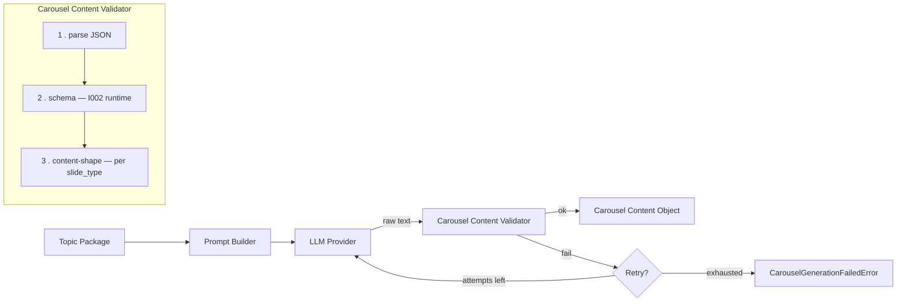
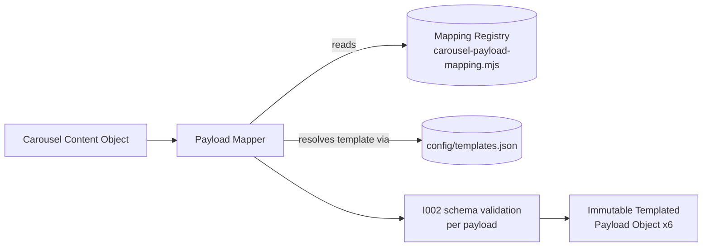

# DC-003 — Automated Content Generation

Project foundation for the AI content factory: one approved topic in, a six-slide
Templated carousel out. This directory currently contains the foundation
established by DC-003-I001 (configuration, template registry, JSON schemas),
the configuration-loading and validation runtime added in DC-003-I002, the
Topic Package Loader added in DC-003-I003, the Carousel Content Generator
added in DC-003-I004 (mock LLM provider only — I004 explicitly does not
call a real one), and the Carousel Payload Mapper added in DC-003-I005.
Templated rendering and n8n workflow logic do not exist yet — I005
explicitly does not call Templated.

Lives at `Active Projects/DC-003 - Automated Content Generation/` inside the
`digitally-connected` repository.

## Authoritative documents

This repository implements the following approved specifications. They are
the source of truth for *why* things are shaped the way they are — this
README describes what's actually in the repo, not the reasoning behind it.

- **DC-003-T001 — AI Content Factory Architecture** (approved) — system
  components, data flow, API interaction sequence, error handling.
- **DC-003-T002 — Data & Metadata Specification** (approved) — the five core
  objects (Topic Package, Carousel Content Object, Templated Payload Object,
  Finished Carousel Object, Execution Log), versioning strategy, naming
  conventions, storage strategy.

## Repository structure

```
DC-003 - Automated Content Generation/
├── config/
│   ├── env.example              # required environment variables, no secrets
│   ├── templates.json            # template registry — IDs, names, layer definitions
│   ├── constants.json             # shared enums and fixed values
│   └── versions.json               # schema/design-system/prompt version identifiers
├── schemas/
│   ├── topic-package.schema.json
│   ├── carousel-content.schema.json
│   ├── templated-payload.schema.json
│   ├── finished-carousel.schema.json
│   └── execution-log.schema.json
├── src/                            # reusable runtime — see below
│   ├── index.mjs                    # public entry point — import from here
│   ├── config-loader.mjs             # DC-003-I002
│   ├── schema-registry.mjs           # DC-003-I002
│   ├── validator.mjs                 # DC-003-I002
│   ├── integrity-checks.mjs          # DC-003-I002
│   ├── read-json-file.mjs            # DC-003-I002 — shared "read + parse JSON" helper
│   ├── paths.mjs                     # DC-003-I002 — project-root resolution
│   ├── errors.mjs                    # DC-003-I002 — ConfigFileNotFoundError, etc.
│   ├── topic-package-loader.mjs      # DC-003-I003 — see "Topic Package Loader"
│   ├── topic-package-readiness.mjs   # DC-003-I003 — operational readiness rules
│   ├── topic-package-errors.mjs      # DC-003-I003 — Topic Package-specific errors
│   ├── immutable.mjs                 # DC-003-I004 — shared deep-clone-then-freeze helper
│   ├── carousel-slide-spec.mjs       # DC-003-I004 — per-slide-type content shape, single source of truth
│   ├── carousel-prompt-builder.mjs   # DC-003-I004 — see "Carousel Content Generator"
│   ├── carousel-mock-provider.mjs    # DC-003-I004 — deterministic mock LLM provider
│   ├── carousel-content-shape.mjs    # DC-003-I004 — per-slide-type content checks
│   ├── carousel-content-validator.mjs# DC-003-I004 — parse + schema + shape, staged
│   ├── retry.mjs                     # DC-003-I004 — generic retry primitive
│   ├── carousel-generator.mjs        # DC-003-I004 — orchestrator
│   ├── carousel-generator-errors.mjs # DC-003-I004 — PromptBuilderError, CarouselGenerationFailedError
│   ├── carousel-payload-mapping.mjs  # DC-003-I005 — Mapping Registry, single source of truth
│   ├── carousel-payload-mapper.mjs   # DC-003-I005 — see "Carousel Payload Mapper"
│   └── carousel-payload-errors.mjs   # DC-003-I005 — mapper-specific errors
├── tests/
│   ├── fixtures/                    # one realistic example JSON per schema (approved)
│   │   ├── invalid/                  # deliberately-broken JSON, test-only, never "approved"
│   │   ├── topic-packages/           # DC-003-I003 — readiness/failure-mode fixtures, test-only
│   │   └── carousel-content/         # DC-003-I005 — mapper failure-mode fixtures, test-only
│   ├── unit/                        # node:test suite, see "Running tests"
│   └── validation/
│       ├── validate.mjs              # thin CLI wrapper around src/validator.mjs
│       ├── check-topic-package.mjs   # DC-003-I003 — thin CLI wrapper around the loader
│       ├── generate-mock-carousel.mjs# DC-003-I004 — thin CLI wrapper around the generator
│       └── map-payload.mjs           # DC-003-I005 — thin CLI wrapper around the mapper
├── package.json
├── package-lock.json
├── .gitignore
├── Project Brief.md
└── README.md
```

`prompts/` and `workflows/` are created empty (via `.gitkeep`) because the
architecture in DC-003-T001 names them as the homes for the LLM prompt and
the exported n8n workflow — both explicitly out of scope for every task so far.

## Configuration

Four files, one concern each:

| File | Concern | Contains secrets? |
|---|---|---|
| `config/env.example` | LLM and Templated credentials, runtime settings | No — copy to `.env` and fill in real values; `.env` is gitignored |
| `config/templates.json` | The template registry — see below | No |
| `config/constants.json` | Shared enums and fixed values (slide types, statuses, ID prefixes) used by both schemas and future code | No |
| `config/versions.json` | Current schema/design-system/prompt version identifiers, per DC-003-T002 §6 | No |

### Deviation from DC-003-T001, with reason

DC-003-T001 originally proposed the six Templated template IDs as environment
variables. Implementing the template registry (DC-003-T002 deliverable 3)
made it clear they belong in version-controlled `config/templates.json`
instead: template IDs are not secrets, and keeping them in git means a
template swap is a reviewable diff rather than an untracked deployment
change — and it lets `template_version` travel with `template_id` in one
place, matching the versioning strategy in DC-003-T002 §6. `env.example`
notes this explicitly so the discrepancy with T001 isn't silently invisible.

### Open item from DC-003-T002, now resolved

DC-003-T002 §3 flagged the Infographic template's `step_1..4_icon` layers as
unconfirmed. Re-checked against the live template during this task: they are
static `shape` layers, not `image_url` layers. `config/templates.json`
reflects this — no LLM or mapper ever needs to supply icon content.

## Template registry

`config/templates.json` is the single source of truth for the six DC-002
templates: `template_id`, display `name`, slide position, background,
dimensions, render format, a manually-maintained `template_version` label,
and — per slide — every layer split into `variable` (written by a future
Payload Mapper from a Carousel Content Object) and `fixed` (brand-owned,
never touched). This is the DC-002 "template IDs + variable mappings" asset
carried forward as reviewable config, exactly as DC-003-T001 §7 intended.

## Schemas

Five [JSON Schema](https://json-schema.org/) (2020-12) documents in
`schemas/`, one per object defined in DC-003-T002. Each schema is standards-
compliant so a full validator (e.g. Ajv) can consume it unchanged later. Two
simplifications were made deliberately, to avoid the complexity DC-003-T002's
constraints explicitly warned against:

- **Carousel Content Object** — each slide's `content` field is typed as a
  generic object rather than a `slide_type`-conditional schema (`cover` needs
  different fields than `infographic`). The per-type field list is documented
  in DC-003-T002 §2 and mirrored in `config/templates.json`'s `variable`
  layer lists; enforcing it as JSON Schema `if`/`then` logic is deferred to
  when the Payload Mapper is actually built.
- **Templated Payload Object** — `layers` is typed as a generic object rather
  than enumerating every possible layer key, since the valid key set is
  per-template config, not a schema concern.

## Configuration loader (`src/config-loader.mjs`)

Loads `config/templates.json`, `config/constants.json`, and
`config/versions.json` and returns them as one structured object:

```js
import { loadConfig } from "./src/index.mjs";

const { templates, constants, versions } = loadConfig();
```

Individual loaders (`loadTemplatesConfig`, `loadConstants`, `loadVersions`)
are also exported for callers that only need one file. Behavior:

- **Path resolution** is always relative to the project root (resolved from
  `import.meta.url`, never the process's current working directory), so the
  loader works the same regardless of where it's invoked from.
- **Fails fast**: a missing file throws `ConfigFileNotFoundError`; malformed
  JSON throws `ConfigParseError` with the file path and the underlying parse
  error. Nothing is ever silently defaulted or partially loaded.
- **Never touches `config/env.example`.** That file documents which
  environment variables a deployment needs — it is not a source of runtime
  values. `config-loader.mjs` has no code path that reads it, by design (see
  "Configuration vs. credentials" below).
- Every loader accepts an optional `{ rootDir }` so tests can point it at an
  isolated temporary directory instead of real project config — this is how
  the missing-file and malformed-JSON tests work without touching production
  config files.

## Schema registry (`src/schema-registry.mjs`)

Loads the five approved schemas and exposes them behind stable, camelCase
identifiers rather than filesystem paths:

```js
import { loadSchemaRegistry } from "./src/index.mjs";

const schemas = loadSchemaRegistry();
schemas.topicPackage;      // schemas/topic-package.schema.json, parsed
schemas.carouselContent;   // schemas/carousel-content.schema.json, parsed
schemas.templatedPayload;
schemas.finishedCarousel;
schemas.executionLog;
```

Same fail-fast behavior as the config loader (`ConfigFileNotFoundError` /
`ConfigParseError`), same `{ rootDir }` override for tests.

## Validation runtime (`src/validator.mjs`)

The single source of truth for validating any object against any registered
schema. Built on [Ajv](https://ajv.js.org/) (2020-12 dialect, via
`ajv/dist/2020.js`) plus `ajv-formats` — see "Dependencies" below for why
these two.

```js
import { createValidator } from "./src/index.mjs";

const validator = createValidator();
const result = validator.validate("topicPackage", someObject);
// { valid: true, errors: [] }
// or
// { valid: false, errors: [{ path, keyword, message, params }, ...] }
```

- **Valid data** → `{ valid: true, errors: [] }`.
- **Invalid data** → `{ valid: false, errors: [...] }`, one entry per failed
  rule, each with the JSON Pointer `path` to the offending field (`(root)` if
  the whole object), the failed `keyword` (`required`, `enum`, `type`, ...),
  and a specific, readable `message` — never a bare "validation failed".
- **Unknown schema identifier** → throws `UnknownSchemaError` immediately,
  rather than returning `{ valid: false }`. Passing a schema ID that doesn't
  exist is a caller bug, not a data problem, so it fails loudly and
  immediately instead of being reported alongside real validation errors.

## Existing validator (`tests/validation/validate.mjs`)

The DC-003-I001 validator was a small hand-rolled, dependency-free JSON
Schema subset checker. DC-003-I002 replaced its internals: it is now a thin
CLI wrapper that imports `createValidator()` from `src/validator.mjs` and
prints a PASS/FAIL line per fixture. It has no validation logic of its own —
`src/validator.mjs` is the single source of truth, per this task's
instruction to avoid maintaining two independent implementations.

```bash
npm run validate
```

## Configuration integrity checks (`src/integrity-checks.mjs`)

`runIntegrityChecks(config)` takes an already-loaded config object (from
`loadConfig()`) and checks the *relationships* JSON Schema alone can't
express — structural validity is the schema registry's job, this is
semantic. It collects every issue rather than stopping at the first one:

- all six slide types (`cover`, `content`, `statistic`, `quote`,
  `infographic`, `cta`) exist in the template registry, and are cross-checked
  against `config/constants.json`'s `slide_types` list
- every template has a unique `template_id`
- every template has a valid, non-empty internal key
- every template has all required metadata fields present
- `config/versions.json` has every version identifier DC-003-T002 §6 expects
  (`project_version`, `design_system_version`, `template_registry_version`,
  `schema_versions.*`, and the `prompt_version` key — which may be `null`
  until a prompt exists, but must be present)
- every non-nullable version value is a non-empty string
- no field whose name looks like a credential (`api_key`, `secret`,
  `password`, `token`, `credential`) has a non-empty value anywhere in
  `config/templates.json`, `config/constants.json`, or `config/versions.json`
- the Infographic template's `step_1..4_icon` layers are still listed as
  `fixed` shape layers, not `variable` — guarding against the DC-003-T002
  open item regressing

```js
import { loadConfig, runIntegrityChecks } from "./src/index.mjs";

const report = runIntegrityChecks(loadConfig());
// { ok: true, issues: [] }  or  { ok: false, issues: [{ check, message }, ...] }
```

## Configuration vs. credentials

Two categories, never mixed:

- **Configuration** — `config/templates.json`, `config/constants.json`,
  `config/versions.json`. Not secret. Version-controlled. Loaded by
  `src/config-loader.mjs`.
- **Credentials** — an LLM API key, the Templated API key. Never
  version-controlled. `config/env.example` documents *which* environment
  variables a deployment needs; it holds no real values and is not read by
  any code in this repository. Real values belong in a local `.env`
  (gitignored) or the deployment platform's secret store — neither of which
  this task creates or touches. `runIntegrityChecks` actively scans
  configuration for anything that looks like a stray credential.

## Topic Package Loader (`src/topic-package-loader.mjs`)

A **Topic Package** is one approved content topic — the object defined by
`schemas/topic-package.schema.json` and DC-003-T002 §1 (working title,
audience, primary goal, core message, supporting points, CTA, brand voice,
approval status, and version/traceability metadata). It's what a future LLM
content generator will read to produce carousel copy — the loader's job is
to make sure a Topic Package is actually safe to hand to that generator
before any of that happens.

### Schema validity vs. operational readiness

Two separate, sequential gates — a Topic Package must pass both:

1. **Schema validity** (via the I002 validator runtime — not reimplemented
   here) — is every field present and correctly typed? A `working_title` of
   `"   "` is schema-valid: `minLength: 1` counts whitespace as characters.
2. **Operational readiness** (`src/topic-package-readiness.mjs`, runs only
   after schema validity passes) — is the *content* actually usable, and is
   the package internally consistent and cleared for use? A whitespace-only
   `working_title` fails here, even though it passed schema validation.

### Approval checks

The Topic Package schema has a `status` field (`draft` / `approved` /
`in_production` / `completed` / `archived`) but — deliberately, per
DC-003-T002 §7 — no separate approval-metadata block; that metadata lives on
the *Finished Carousel Object* instead, because approval there applies to a
rendered output, not a topic draft. Confirmed with the Strategy Office
during DC-003-I003 rather than inventing new Topic Package fields. So:
**`status === "approved"` is the sole approval signal.** Anything else
(`draft`, `in_production`, `completed`, `archived`) fails the
`approval-state` readiness check.

### Version checks

The Topic Package's only version field is `schema_version` (there is no
`prompt_version` on this object — that belongs to the Carousel Content
Object and Execution Log, generated later). Readiness compares it against
`config/versions.json`'s `schema_versions.topic_package` value. A mismatch
is reported as a `schema-version-compatible` issue and the package is
rejected — **never silently upgraded or coerced.**

### Other readiness checks

- **Usable content** — `topic_id`, `working_title`, `audience`,
  `primary_goal`, `core_message`, `cta`, `brand_voice`, `owner`, and every
  entry in `supporting_points` must be non-blank after trimming.
- **Internal consistency** — `updated_date` must not be earlier than
  `created_date`; `related_topic_ids` must not list the package's own
  `topic_id` or contain duplicates.

All readiness issues are collected and reported together (not just the
first one found), each as `{ check, message }`.

### Immutability

The returned Topic Package is **deep-cloned via `structuredClone()`, then
deep-frozen via a recursive `Object.freeze()`** — never the original parsed
object. The input passed to `prepareTopicPackage()` / read from disk by
`loadTopicPackage()` is never mutated. Mutation attempts against the
returned object throw `TypeError` in strict-mode/ESM callers (which this
codebase's `.mjs` files always are) and are silent no-ops in non-strict
contexts — in both cases the value never actually changes.

### Loading a Topic Package in code

```js
import { loadTopicPackage, prepareTopicPackage } from "./src/index.mjs";

// From a file — relative paths resolve against process.cwd(), pass an
// absolute path when the caller must not depend on it.
const topic = loadTopicPackage("tests/fixtures/topic-packages/approved.valid.json");

// From an already-parsed object (e.g. future n8n/API/database ingestion) —
// same validation, same readiness checks, same immutable return, no
// file-specific errors involved.
const sameTopic = prepareTopicPackage(rawObjectFromSomewhereElse);
```

Both throw structured errors on failure — `TopicPackageNotFoundError`,
`TopicPackageUnreadableError`, `TopicPackageParseError`,
`TopicPackageValidationError` (with `.errors`, the same
`{ path, keyword, message, params }` shape the I002 validator returns), or
`TopicPackageReadinessError` (with `.issues`, `{ check, message }`).

### CLI check

```bash
npm run check:topic -- tests/fixtures/topic-packages/approved.valid.json
```

Prints safe summary metadata (topic ID, working title, status, schema
version, version, readiness) and exits `0` for a ready package; prints
structured errors to stderr and exits non-zero otherwise — no raw stack
trace for the five expected/known failure modes, only for a genuinely
unexpected error. Uses the same loader as production code; no independent
validation logic.

## Carousel Content Generator (`src/carousel-generator.mjs`)

Turns a ready Topic Package into a Carousel Content Object — the structured
copy for all six slides — without touching Templated, an LLM API, or the
filesystem. Four isolated responsibilities, one orchestrator:



Each box is its own module — `carousel-prompt-builder.mjs`,
`carousel-mock-provider.mjs` (the only provider implementation today),
`carousel-content-validator.mjs`, `retry.mjs` — and `carousel-generator.mjs`
only sequences them. None of the others know the retry loop exists; the
validator doesn't know what a "provider" is; the provider doesn't know how
validation works.

### Prompt Builder

`buildCarouselPrompt(topicPackage)` is a pure function: the same Topic
Package always produces the exact same prompt string. It never calls
anything — no LLM, no network. The prompt includes topic, audience,
objective, key message, supporting points, CTA, desired tone, fixed writing
constraints, the exact six-slide sequence (field names read from
`carousel-slide-spec.mjs` — the same source the shape checker reads from,
so what's asked for and what's accepted can never drift apart), brand
rules, and an explicit "return JSON only" instruction. Field content is
whitespace-collapsed before embedding (so a multi-line field can't break
the prompt's `## Section` structure) but otherwise passed through verbatim
— quotes, punctuation, unicode all included as-is; this is plain text handed
to an LLM, not a value being embedded in JSON we control. Throws
`PromptBuilderError` if a field the prompt needs is blank — defense in
depth, independent of whatever validated the Topic Package upstream.

### Provider abstraction

A provider is any object shaped `{ name: string, generateCarousel(prompt, context): Promise<string> }`
— it returns raw text (mimicking a real completion API), never a pre-parsed
object, so swapping in a real provider later changes nothing downstream;
the validator's `JSON.parse` step is exactly where a real LLM's occasional
malformed output would surface too. `context.topicPackage` is passed
alongside the prompt so the mock provider can generate content grounded in
the real topic — a real provider is free to ignore it, since everything it
needs is already in the prompt text.

### Mock provider (`src/carousel-mock-provider.mjs`)

The only provider implemented in DC-003-I004 — deterministic, no network,
no randomness. Every slide is populated from the Topic Package's own
fields (`working_title`, `core_message`, `audience`, `supporting_points`,
`cta`), so output is recognizably about the actual topic rather than
generic filler. The statistic and quote slides are explicitly labeled as
illustrative/mock in their own copy (`"Placeholder statistic generated by
the mock provider — not a verified figure."`) rather than presenting an
invented number or a fabricated testimonial as real. No `hashtags` field
is generated: it's not part of any of the six slide types in
`config/templates.json` / DC-003-T002 §2, and adding one would be
inventing contract surface the rest of the pipeline doesn't expect.

### Validation flow

Three gates, run in order by `validateGeneratedCarousel()`, any of which
can fail independently:

1. **Parse** — is the provider's raw text valid JSON containing a `slides`
   array at all?
2. **Schema** — does the assembled object (provider's slides + pipeline
   metadata) conform to `schemas/carousel-content.schema.json`, via the
   unmodified I002 validator runtime? Catches wrong slide count, wrong
   `slide_type` values, wrong top-level shape.
3. **Content-shape** — does each slide's `content` actually have the fields
   its `slide_type` needs, non-blank, correct array lengths, in the
   canonical slide order? (`carousel-content-shape.mjs`, reading from the
   same `carousel-slide-spec.mjs` the Prompt Builder uses.)

Every stage returns a structured `{ ok: false, stage, message, details }`
result rather than throwing — `retry.mjs` collects these per attempt.

### Retry behavior

`withRetry()` is a generic, carousel-agnostic primitive (reusable by later
rendering-stage retries per DC-003-T001 §6): configurable `maxAttempts`
(default 3), stops the instant an attempt succeeds — never wastes a call
once a good result is in hand — and never silently gives up. If every
attempt fails, `generateCarouselFromTopicPackage` throws
`CarouselGenerationFailedError` carrying the full `attempts` array (every
stage, every message, in order), never a collapsed generic message.
Building the prompt happens once, *outside* the retry loop — if the Topic
Package itself has no usable content, retrying with the same input would
never help, so that fails immediately via `PromptBuilderError` instead.

### Generating a carousel in code

```js
import { loadTopicPackage, generateCarouselFromTopicPackage } from "./src/index.mjs";

const topic = loadTopicPackage("tests/fixtures/topic-packages/approved.valid.json");
const carousel = await generateCarouselFromTopicPackage(topic);
// carousel: { carousel_content_id, topic_id, generated_at, llm_model,
//             prompt_version, schema_version, slides: [ 6 slides ] }
// — deep-cloned and deep-frozen, same immutability approach as the Topic
//   Package Loader (see "Immutability" above).

// A different provider — same call shape, same validation, same retries:
const carousel2 = await generateCarouselFromTopicPackage(topic, {
  provider: myRealLlmProvider,
  maxAttempts: 5,
});
```

### CLI check

```bash
npm run generate:mock -- tests/fixtures/topic-packages/approved.valid.json
```

Loads the Topic Package (via the I003 loader — so an unapproved or invalid
package is rejected before generation is even attempted), generates a
carousel with the mock provider, and prints a readable summary: topic,
generated title, slide count, generation version (`prompt_version` +
`schema_version`), and provider name. Exits `0` on success; on failure,
prints structured errors (no raw stack trace for expected failure modes)
and exits non-zero. Does not render slides. Does not write any file — the
carousel exists only in memory for the life of the process.

## Carousel Payload Mapper (`src/carousel-payload-mapper.mjs`)

Translation only — turns a Carousel Content Object into six Templated
Payload Objects, one per slide. Never calls Templated, never renders, never
touches the network.



### Mapping Registry (`src/carousel-payload-mapping.mjs`)

The single source of truth for how a Carousel Content field becomes a
Templated layer. No layer name is hardcoded anywhere else in the mapper —
everything reads from this table. Three transform kinds:

| Kind | Example | Behavior |
|---|---|---|
| `direct` | `headline_text` → `headline_text` | value copied as-is |
| `array-fanout` | `list_items[0..3]` → `list_item_1..4_text` | each array entry becomes one indexed layer |
| `object-array-fanout` | `steps[i].title`/`.description` → `step_{i+1}_title`/`_description` | each array-of-objects entry becomes a pair of indexed layers |

For four of the six slide types (`cover`, `statistic`, `quote`, `cta`) the
Carousel Content field names and the Templated layer names are already
identical — that's inherited from how DC-003-T002 §2's field names were
originally chosen to mirror `config/templates.json`'s layer names, not a
mapping this registry invents. The two genuinely transformative mappings
are `content`'s `list_items` and `infographic`'s `steps`, both fan-outs.

`validateMappingRegistry(templatesConfig)` cross-checks this table against
the live template registry and returns `{ ok, issues }`: every
`templateKey` must exist in `config/templates.json`, no two mapping entries
for the same slide type may target the same layer ("mappings unique" / "no
duplicate layer names"), and every layer name the registry could ever
produce must be a real `variable` layer on that template ("mapping
references only templates defined in `templates.json`"). This runs in the
test suite against the real registry on every test run — if the mapping
table and `config/templates.json` ever drift apart, a test fails
immediately rather than the drift surfacing as a runtime mapping bug.

### Template resolution

`config/templates.json` is the only source of template IDs — the mapper
never hardcodes one. For each slide, `slide_type` resolves to a
`templateKey` (via the Mapping Registry) which resolves to a `template_id`,
`template_version`, `format`, `slide_number`, and the template's `variable`
layer list (via `loadTemplatesConfig()`, the I002 config loader). All six
approved carousel templates are supported — there's no partial coverage.

### Layer validation

After a slide's layers are computed, two checks run before that slide's
payload is even assembled:

- **Every required editable layer is populated** — every non-optional
  `variable` layer on the template must appear in the computed `layers`
  object (`list_item_4_text` is the one layer marked `optional` in
  `config/templates.json`, and is correctly skipped when there's no 4th
  supporting point).
- **No unknown layer names** — every layer the mapping produces must be a
  real `variable` layer on that template; a layer name that doesn't match
  is rejected, never silently written.

Duplicate assignment is guarded at two levels: within one slide's own
mapping (a registry-authoring bug — unreachable through the real registry,
covered by `validateMappingRegistry`'s static check instead of a runtime
fixture, since a correct registry can't trigger it), and across the whole
carousel (two slides sharing the same `slide_type` — genuinely reachable
from a malformed input, see `duplicate-layer.json` below).

### Payload validation

The finished payload for each slide is validated against
`schemas/templated-payload.schema.json` via the unmodified I002 validator
runtime — not reimplemented here. This catches things layer validation
above can't: a malformed `carousel_content_id` copied through from the
input, for instance (see `invalid-payload.json` — every layer maps
correctly, but the final schema check still rejects it).

### Mapping errors

Five distinct, structured error classes — never a generic message:

| Error | When |
|---|---|
| `UnknownTemplateError` | `slide_type` doesn't resolve to any registered template |
| `MissingLayerError` | a required layer's source content field is blank, absent, or the layer itself never got assigned |
| `DuplicateLayerMappingError` | the same layer would be assigned twice — within one slide's mapping, or by two slides sharing a `slide_type` |
| `UnsupportedContentError` | an array/object-shaped field doesn't match its fan-out contract (wrong length, blank sub-field), or the mapper produces a layer name the template doesn't define |
| `TemplatedPayloadValidationError` | the assembled payload fails schema validation — carries `.errors`, the same structured shape the I002 validator returns |

### Mapping a carousel in code

```js
import { mapCarouselToTemplatedPayload } from "./src/index.mjs";

const payloads = mapCarouselToTemplatedPayload(carouselContent);
// payloads: 6 Templated Payload Objects, in slide order — deep-frozen,
// same immutability approach as every other output in this codebase.
```

### CLI check

```bash
npm run map:payload -- tests/fixtures/carousel-content/valid.json
```

Prints one block per slide — template name, template ID, editable layer
count, mapped layer count, payload validation result — and exits `0`. On
failure, prints the specific structured error (no raw stack trace for the
five expected failure modes) and exits non-zero. Does not render. Does not
write any file.

## Running tests

Two independent commands, both using Node's built-in `node:test` runner —
no test framework dependency was added, and none was needed in DC-003-I003,
DC-003-I004, or DC-003-I005 either:

```bash
npm test       # unit tests: tests/unit/*.test.mjs
npm run validate  # CLI summary: all 5 approved fixtures against their schemas
npm run check:topic -- <path>  # CLI check of one Topic Package file
npm run generate:mock -- <path>  # CLI mock-generate a carousel from one Topic Package file
npm run map:payload -- <path>  # CLI map one Carousel Content file into six Templated Payloads
```

`npm test` covers everything from DC-003-I002 through DC-003-I004
(config/schema loading, fixture validation, integrity checks, Topic Package
loading and readiness, prompt building, mock generation, retry behavior)
plus, from DC-003-I005: the Mapping Registry loading and validating cleanly
against the real template registry, no duplicate layer targets within any
slide type's mapping, valid content mapping to six correctly-ordered
payloads with every required layer populated, template IDs resolved (never
hardcoded) from `config/templates.json`, deterministic output given the
same clock/ID-generator injection, immutable return, the `list_items` and
`steps` fan-outs producing the exact expected indexed layers, and all five
mapper error classes — unknown template, missing layer, duplicate mapping
(both the carousel-level and, via a corrupted-registry check, the
registry-level form), unsupported content shape, and final payload schema
validation failure — each triggered through its own dedicated fixture, plus
CLI exit codes for both success and every failure mode. Tests that need a
"broken" file or a failing provider use a `node:fs` temporary directory, an
in-memory `structuredClone()`/object literal, a small stub provider defined
inline in the test file, or one of the dedicated fixtures under
`tests/fixtures/carousel-content/` — **no test ever writes to or modifies a
file under `config/`, `schemas/`, or an existing approved fixture.**

## Expected error behavior

| Situation | What happens |
|---|---|
| A config or schema file is missing | `ConfigFileNotFoundError`, naming the exact path |
| A config or schema file has malformed JSON | `ConfigParseError`, naming the path and the underlying JSON parser error |
| Data fails schema validation | `{ valid: false, errors: [...] }` — never thrown, never a bare boolean, never a generic message |
| An unregistered schema identifier is requested | `UnknownSchemaError`, thrown immediately, listing the valid identifiers |
| A configuration integrity relationship is violated | `{ ok: false, issues: [...] }` from `runIntegrityChecks` — every issue found, not just the first |
| A Topic Package file doesn't exist | `TopicPackageNotFoundError`, naming the resolved path |
| A Topic Package path is a directory, or otherwise unreadable | `TopicPackageUnreadableError`, naming the path and the underlying cause |
| A Topic Package file has malformed JSON | `TopicPackageParseError`, naming the path and the underlying JSON parser error |
| A Topic Package fails schema validation | `TopicPackageValidationError`, with `.errors` (`{ path, keyword, message, params }[]`) — every failure reported, not just the first |
| A Topic Package is schema-valid but not ready (unapproved, incompatible version, blank content, inconsistent timestamps, etc.) | `TopicPackageReadinessError`, with `.issues` (`{ check, message }[]`) — every issue reported, not just the first |
| The Topic Package has no usable content to build a prompt from | `PromptBuilderError`, thrown immediately, no provider call, no retry |
| A single generation attempt fails (parse / schema / content-shape / the provider itself throwing) | `{ ok: false, stage, message, details }` from `validateGeneratedCarousel` — never thrown directly, collected by the retry loop |
| Every retry attempt fails | `CarouselGenerationFailedError`, with `.attempts` (every stage's result, in order) and `.maxAttempts` |
| A slide's `slide_type` doesn't resolve to a registered template | `UnknownTemplateError`, naming the slide_type |
| A required layer can't be populated | `MissingLayerError`, naming the slide_type, layer, and (when known) the blank/absent source content field |
| The same layer would be assigned twice | `DuplicateLayerMappingError`, naming the slide_type and, when applicable, the layer |
| An array/object-shaped content field doesn't match its fan-out contract | `UnsupportedContentError`, naming the slide_type, field, and reason |
| The assembled Templated Payload fails schema validation | `TemplatedPayloadValidationError`, with `.errors` — every failure reported, not just the first |

## Dependencies

Still just two, both added in DC-003-I002, both maintained and widely used —
**DC-003-I003, DC-003-I004, and DC-003-I005 all added no new dependencies:**

- **`ajv`** (2020-12 dialect) — the JSON Schema validator itself. Explicitly
  requested by this task over the I001 hand-rolled subset validator.
- **`ajv-formats`** — registers `format` keywords (`date-time`, `email`) that
  the five schemas already declare; without it those formats are silently
  unchecked. Required for Ajv's strict mode to accept the schemas as-is.

No test framework was added — `node:test` and `node:assert/strict` (both
built into Node.js 18+) cover every test in every task so far. No CLI
(`check-topic-package.mjs`, `generate-mock-carousel.mjs`, `map-payload.mjs`)
needed a CLI framework — `process.argv[2]` and a `try`/`catch` on structured
errors was enough every time. The Carousel Content Generator needed no HTTP
client or LLM SDK — I004 explicitly forbids calling a real provider. The
Carousel Payload Mapper needed no Templated SDK — I005 explicitly forbids
calling Templated; `node:crypto`'s built-in `randomUUID()` was enough for
payload IDs.

## Implementation status

| Area | Status |
|---|---|
| Repository structure | Done (DC-003-I001) |
| Configuration (env, templates, constants, versions) | Done (DC-003-I001) |
| Template registry | Done (DC-003-I001) — all six templates, verified live |
| JSON schemas | Done (DC-003-I001) — all five objects |
| Configuration loader | Done (DC-003-I002) — `src/config-loader.mjs` |
| Schema registry | Done (DC-003-I002) — `src/schema-registry.mjs` |
| Validation runtime | Done (DC-003-I002) — `src/validator.mjs`, Ajv 2020-12 |
| Configuration integrity checks | Done (DC-003-I002) — `src/integrity-checks.mjs` |
| Topic Package loader | Done (DC-003-I003) — `src/topic-package-loader.mjs`, file + in-memory entry points |
| Topic Package readiness checks | Done (DC-003-I003) — `src/topic-package-readiness.mjs` |
| Topic Package CLI check | Done (DC-003-I003) — `npm run check:topic` |
| Prompt Builder | Done (DC-003-I004) — `src/carousel-prompt-builder.mjs`, deterministic |
| Provider abstraction + mock provider | Done (DC-003-I004) — `src/carousel-mock-provider.mjs`; no real LLM wired up |
| Carousel Content validation (parse/schema/content-shape) | Done (DC-003-I004) — `src/carousel-content-validator.mjs` |
| Retry strategy | Done (DC-003-I004) — `src/retry.mjs`, generic and reusable |
| Carousel Content Generator orchestrator | Done (DC-003-I004) — `src/carousel-generator.mjs` |
| Carousel generation CLI check | Done (DC-003-I004) — `npm run generate:mock` |
| Carousel Payload Mapping Registry | Done (DC-003-I005) — `src/carousel-payload-mapping.mjs`, self-validating |
| Carousel Payload Mapper | Done (DC-003-I005) — `src/carousel-payload-mapper.mjs`, all six templates supported |
| Payload mapping CLI check | Done (DC-003-I005) — `npm run map:payload` |
| Unit test suite | Done — 127 tests, `npm test` (20 from I002, 29 from I003, 51 from I004, 27 added in I005) |
| Real LLM provider (OpenAI/Anthropic/local) | Not started — mock only |
| Templated rendering calls | Not started |
| n8n workflow | Not started |
| Error handling / retries (pipeline-level, beyond generation) | Not started |
| Approval workflow | Not started (fields reserved on Finished Carousel Object only, per DC-003-T002 §7) |

Nothing above "Unit test suite" should require restructuring this
foundation — it should only add to it.
